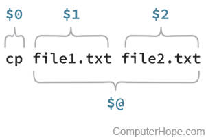

## Learning Objectives:

* Distinguish between variables and positional parameters
* Recognize variables and positional parameters in code written by someone else
* Implement positional parameters and variables in a bash script
* Integrate for loops and variables

### What is a variable again?

As a reminder from the previous lesson, a **variable** is a character string to which we assign a value. The value assigned could be a number, text, filename, device, or any other type of data. It is easy to identify a variable in any bash script as they will always have the $ in front of them. Here is our very cleverly named variable: `$Variable`

## Positional parameters are a special kind of variable

“A **positional parameter** is an argument specified on the command line, used to launch the current process in a shell. Positional parameter values are stored in a special set of variables maintained by the shell.” ([Source](https://www.computerhope.com/jargon/p/positional-parameter.htm))

So rather than a variable that is identified inside the bash script, a positional parameter is given when you run your script. This makes it more flexible as it can be changed without modifying the script itself.  

<p align="center">

</p>

Here we can see that our command is the first positional parameter (`$0`) and that each of the strings afterwards are additional positional parameters (here `$1` and `$2`). Generally when we refer to positional parameters we ignore `$0` and start with `$1`.

It is crucial to note that different positional parameters are separated by whitespace and can be strings of any length. This means that:

```bash
$ sh myscript.sh OneTwoThree
```
has only given one positional parameter `$1=OneTwoThree`

and

```bash
$ sh myscript.sh O N E
```
has given three positional parameters `$1=O` `$2=N` `$3=E`

You can code your script to take as many positional parameters as you like but for any parameters greater than 9 you need to use curly brackets. So positional parameter 9 is `$9` but positional parameter 10 is `${10}`. We will come back to curly brackets later.

Finally, the variable `$@` contains the value of all positional parameters except `$0`.

## A simple example

Let's make a script ourselves to see positional parameters in action.

From your command line type `nano compliment.sh`

Now copy and paste the following into your file

```bash
#!/bin/bash

echo  $1 'is amazing at' $2
```
then exit nano, saving your script.

You may have already guessed that our script takes two different positional parameters. The first one is your first name and the second is something you are good at. Here is an example:

```bash
sh compliment.sh OliviaC acting
```

This will print 

```bash
OliviaC is amazing at acting
```
You may have already guessed that we am talking about award winning actress [Olivia Coleman](https://en.wikipedia.org/wiki/Olivia_Colman) here. But if we typed

```bash
sh compliment.sh Olivia Coleman acting
```
we would get

```bash
Olivia is amazing at Coleman
```
Technically we have just given three positional parameters `$1=Olivia` `$2=Colman` `$3=acting`
However, since our script does not contain `$3` this is ignored. 

In order to give Olivia her full due we would need to type

```bash
sh compliment.sh "Olivia Coleman" acting
```

The quotes tell bash that "Olivia Coleman" is a single string, `$1`. Both double quotes (") and single quotes (') will work. Olivia has enough accolades though, so go ahead and run the script with your name (just first or both first and last) and something you are good at!

## Naming variables

Our previous script was so short that it was easy to remember that `$1` represents a name and `$2` represents a skill. However, most scripts are much longer and may contain more positional parameters. To make it easier on yourself it is often a good idea to name your positional parameters. Here is the same script we just used but with named variables.

```bash
#!/bin/bash

name=$1
skill=$2

echo  $name 'is amazing at' $skill
```

Just like when we assigned values to variables in the last lesson, it is critical that there is no space in our assignment statements, `name = $1` would not work.

We will talk more about naming variables later, but note that defining variables within the script can make the script **less** flexible. If we want to change our sentence, we now need to edit our script directly rather than launching the same script but with different positional parameters.


## A useful example

Now that we understand the basics of variables and positional parameters how can we make them work for us? We can use them in a shell script!

Lets say that we want to adapt the script we wrote in the last lesson to look for our bad read sequence in any file, and not just all the files in a whole directory. How might we do that?

Here is that same script, but we have changed it by removing the `for` loop and adding a line to read in a positional parameter. We've also added '.param' to the output file to make it easier to distinguish output from this script from the previous script. Finally, we've also added a couple of comments to note the script **usage**, including what the script takes in, and what the script puts out, as well as an **example** of how to run the script. It is best practice to include these types of comments. They make your life easier down the road if you ever come back to your scripts after a long time away.

```bash
#!/bin/bash 

## USAGE: User provides path to file that needs to checked for bad reads. 
##  Script will output a file in the same directory
## EXAMPLE: generate_bad_reads_summary_param.sh filename

# read positional parameter
filename=$1

# create a prefix for all output files
base=`basename $filename .subset.fq`

# tell us what file we're working on
echo $filename

# grab all the bad read records
grep -B1 -A2 NNNNNNNNNN $filename > ${base}.param.fastq

# grab the number of bad reads and write it to a summary file
grep -cH NNNNNNNNNN $filename > ${base}.param.count.summary
```

After you have made the edits to your script, save it as a new script called `generate_bad_reads_summary_param.sh`. If you have been editing the script from the previous lesson, you can do this by typing `Ctrl+O` and then providing the new file name. Alternatively, you can open a new nano session and copy and paste the code from above.

Let's test it out with a file!

```bash
sh generate_bad_reads_summary_param.sh Irrel_kd_1.subset.fq
```

To see the output, you can use `ls`. You should see the two output files with .param. in the names.

***

**Exercise**

Say we are interested in searching for other sequences in our fastq files besides NNNNNNNNNN, and want to create output files that reflect those sequence names. But we don't want to have to edit the script every time we have a new sequence to look for. How might we edit `generate_bad_reads_summary_param.sh` using positional parameters so we can feed it any sequence we want?

1. Add a line to capture `sequence` as a 2nd positional parameter

<details>
        <summary><i>Click here for answer</i></summary>
        
        sequence=$2
</details>

2. Change what we are searching for in the `grep` statements

<details>
        <summary><i>Click here for answer</i></summary>
         
        grep -B1 -A2 $sequence $filename > ${base}.param.fastq
        grep -cH $sequence $filename > ${base}.param.count.summary
</details>

3. Change the ouptput file names to include the sequence being searched

<details>
        <summary><i>Click here for answer</i></summary>
         
        grep -B1 -A2 $sequence $filename > ${base}.${sequence}.fastq
        grep -cH $sequence $filename > ${base}.${sequence}.count.summary
</details>

4. Update the `USAGE` and `EXAMPLE` to reflect the changes you made
 <details>
        <summary><i>Click here for answer</i></summary>
         
        ## USAGE: User provides path to file that needs to checked for user-provided sequence. 
        
        ##  Script will output a file in the same directory
        
        ## EXAMPLE: generate_bad_reads_summary_param.sh filename sequence
 </details>


<details>
        <summary><i>Click here for final script</i></summary>
          
        #!/bin/bash 

        ## USAGE: User provides path to file that needs to checked for bad reads. 
        ##  Script will output a file in the same directory
        ## EXAMPLE: generate_bad_reads_summary_param.sh filename

        # read positional parameter
        filename=$1

        # create a prefix for all output files
        base=`basename $filename .subset.fq`

        # tell us what file we're working on
        echo $filename

        # grab all the bad read records
        grep -B1 -A2 NNNNNNNNNN $filename > ${base}.param.fastq

        # grab the number of bad reads and write it to a summary file
        grep -cH NNNNNNNNNN $filename > ${base}.param.count.summary

</details>

***

By using this script we can easily run this command for any sample we have. we mentioned above that we have 10 sequences, and it's not too hard for me to run the command 10 times. But sometimes we might have so many sequences that even running this command manually for all of these will be time consuming. In this case we can turn to one of the most powerful ways to use positional parameters and other variables, by combining them with **for loops**. More on for loops [HERE](https://github.com/hbctraining/Intro-to-shell-flipped/blob/master/lessons/06_loops_and_automation.md).

## Variables in for loops

We are going to continue with example script above. Let's say that we want to run this script for 10 different sequences. First, we'll put all of those sequences in a text file.

From your command line type `nano sequences.txt`. Copy and paste the following

```bash
GGGGGGGGGGGGG
GCGCGCGTCGATA
ATAT
CATCATCAT
GGTTATTGG
CCCCCCCCCCCC
GCGCGCGC
GAGAGA
TATA
AAAAAAAAAAA
```

Then exit nano, saving your script. Each of these sequences will be stored in a variable in our script, one at a time. But how will we iterate through them? To do so, we will use a variation on a for loop.

If you recall, previously we learned that a for loop is formatted like this:

```bash
for (variable_name) in (list)
do
(command1 $variable_name)
.
.
done
```

Let's open up a new script. From your command line type `generate_sequence_summary_loop.sh`. Copy and paste the following

```bash
#!/bin/bash

for ((i=1; i<=10; i=i+1))
        do 

sample=$(awk -v  awkvar="${i}" 'NR==awkvar' samples.txt)

echo java  -jar picard.jar AddOrReplaceReadGroups  \
I=${sample}.dedupped.bam  O=${sample}.final.bam RGID=${sample}  \
RGLB=${sample} RGPL=illumina   RGPU=unit1  RGSM=${sample}

done
```

then exit nano, saving your script. Now that you are back on the command line type `chmod u+x picard_loop.sh` to make the file executable for yourself. 

Before we run this, let's go through it line by line.


`for ((i=1; i<=10; i=i+1))`

This tells bash how our loop is working. We want to start at 1 (`i=1`) and end at 10 (`i<=10`) and each time we complete our loop the value `i` should increase by 1 (`i=i+1`).  Simple math tells us that means the loop will run 10 times. But we could make it run 100 times by changing `i<=10` to `i<=100`. `i` is our counter variable to track how many loops we have run. You will often see this called `i` or `j` but you can actually call it whatever you want. For example, here we are using it to track which line of samples.txt we are reading so it may be more intuitive to write it like this `for ((line=1; line<=10; line=line+1))`. `i` and `j` are used because they are shorter to write.

`do` 

This means that whatever follows is what we want bash to do for each value of `i` (here 1,2,3,4,5,6,7,8,9,and 10).

`sample=$(awk -v  awkvar="${i}" 'NR==awkvar' samples.txt)`

This line creates a variable called `$sample` and assigns its value to line `i` of samples.txt. We won't go into the details of how this awk command is working but you can learn more about using awk [HERE](https://github.com/hbctraining/Training-modules/blob/f168114cce7ab9d35eddbf888b94f5a2fda0318a/Intermediate_shell/lessons/advanced_lessons.md). You may also notice that we have assigned the value of `$sample` differently here using parentheses () instead of single ' or double " quotes. The syntax for assigning variables changes depending on what you are assigning. See **Syntax for assigning variables** below.

If we look at samples.txt we can see that when `i=1` then `$sample` will be M1. What will `$sample` be when `i=5`?


The next line should look familiar

```bash
echo java  -jar picard.jar AddOrReplaceReadGroups  \
I=${sample}.dedupped.bam  O=${sample}.final.bam RGID=${sample} \
RGLB=${sample} RGPL=illumina   RGPU=unit1  RGSM=${sample}
```

This is exactly the same as what we used above except `$1` is now `$sample`. We are assigning the value of `$sample` within our script instead of giving it externally as a positional parameter.

finally we end our script with 

```bash
done
```

Here we are simply telling bash that this is the end of the commands that we need it to do for each value of `i`.

Now let's run our script


```bash
sh picard_loop.sh
```

Is the output what you expected?

## Syntax for assigning variables

Depending on what you are assigning as a variable, the syntax for doing so differs.

`variable=$(command)` for output of a command. 

        example: `variable=$(wc -l file.txt)` will assign the number of lines in the file file.text to `$variable`

`variable=‘a string’` or `”a string”` for a string with spaces.

        example `variable="Olivia Coleman"` as seen above.

`variable=number` for a number or a string without spaces.

        example: `variable=12` will assign the number 12 to `$variable`

`variable=$1` for positional parameter 1.

        example: `variable=$9` will assign positional parameter 9 to `$variable` and `variable=${10}` will assign positional parameter 10 to `$variable` 

