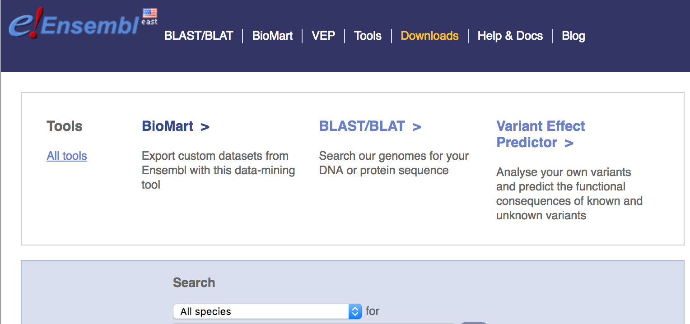
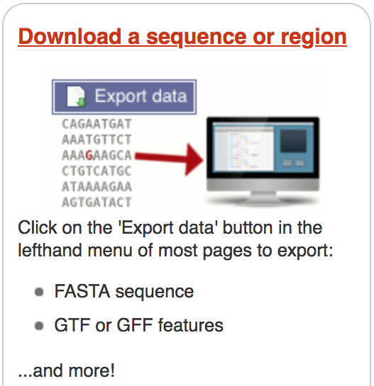
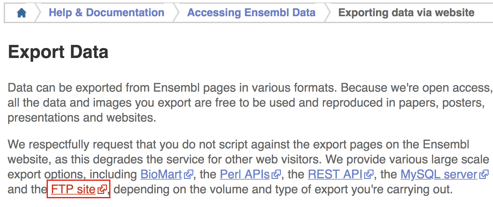
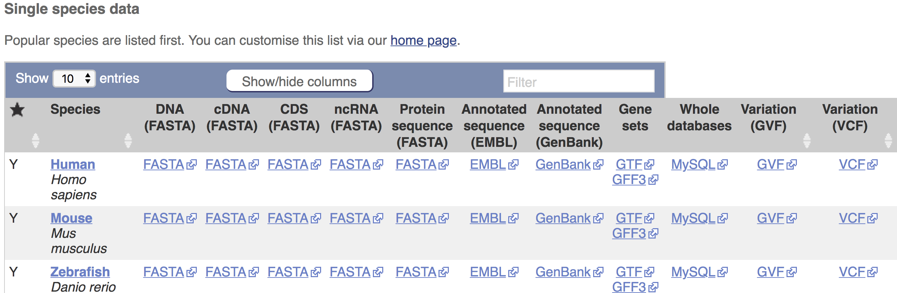

# Reference Data

During an NGS experiment, the sequences in the raw FASTQ files, or "sequence reads", need to be mapped or aligned to the reference genome to determine from where these sequences originated. Therefore, we need a reference genome (in FASTA format) in which to align our sequences.

In addition, many NGS methods require knowing where known genes or exons are located on the genome in order to quantify the number of reads aligning to different genome features, such as exons, introns, transcription start sites, etc. These analyses require reference data containing specific information about genomic coordinates of various
genomic “features”, such as gene annotation files (in GTF, GFF, etc. formats). 

To download reference data, there are a few different sources available:

- **General biological databases:** Ensembl, NCBI, and UCSC
- **Organism-specific biological databases:** Flybase, Wormbase, etc. (often updated more frequently, so may be more comprehensive)
- **Reference data collections:** Illumina's iGenomes, one location to access genome reference data from **Ensembl, UCSC and NCBI**
- **Local access:** shared databases on FAS Odyssey cluster or HMS O2 cluster with access to genome reference data from **Ensembl, UCSC and NCBI**

## General biological databases

Biological databases for gene expression data store genome assemblies and provide annotations regarding where the genes, transcripts, and other genomic features. 

Genome assemblies give us the **nucleotide sequence of the reference genome**. Although the Human Genome Project was "completed" in 2003, small gaps in the sequence remained (estimated 1% of gene-containing portions). As technology improves and more genomes are sequenced, these gaps are filled, mistakes are corrected and alternate alleles are provided. Therefore, every several years a new genome build is released that contains these improvements. The most current **genome build** is GRCh38/hg38 for the human, released in 2013 and maintained by the Genome Reference Consortium (GRC). Usually the biological databases will include this version as soon as it is stably released, as well as access to archived versions.

Genome databases incorporate these genomes and generate the gene annotations with the following similarities/differences:

- Ensembl, NCBI, and UCSC all use the **same genome assemblies** provided by the GRC
	- GRCh38 = hg38; GRCh37 = hg19
	- Patches or minor revisions of the genome (don't change genome coordinates) provided by the GRC, are **updated by the genome databases at different intervals**; therefore, the genome reference sequence for the same genome version can vary slightly between databases

- Each biological database **independently determines the gene annotations**; therefore, gene annotations between these databases can differ, even though the genome assembly is more or less the same. Naming conventions are also different (chr1=1)

- **Always use the same biological database for all reference data!**

### Ensembl

[*Ensembl*](http://useast.ensembl.org/index.html) provides a website that acts as a **single point of access to annotated genomes** for vertebrate species. For all other organisms there are additional Ensembl databases available through [Ensembl Genomes](http://ensemblgenomes.org/); however, they do not include viruses (NCBI does).

- Genome assemblies are updated every two years (to include patches), or less often depending on the species
- Gene annotations are created or updated using a variety of sources (ENA, UniProtKB, NCBI RefSeq, RFAM, miRBase, and tRNAscan-SE databases)
- Automatic annotation is performed for all species using identified proteins and transcripts
- Manual curation by the HAVANA group is performed for human, mouse, zebrafish, and rat species, providing better confidence of transcript annotations
- Directly imports annotations from FlyBase, WormBase and SGD

#### Using Ensembl


- **Searching Ensembl**:  Look for a gene, location, variant and more using the search box on the homepage or the box that is provided in the top right corner of any Ensembl page.

	- a gene name (for example, BRCA2) - best to use the official gene symbols ([HGNC](http://www.genenames.org))
	- a UniProt accession number (for example, P51587)
	- a disease name (for example, coronary heart disease)
	- a variation (for example, rs1223)
	- a location - a genomic region (for example, rat X:100000..200000)
	- a PDB ID or a Gene Ontology (GO) term

	Most search results will take you to the appropriate Ensembl view through a results page. If you search using a location you will be directed straight to the location tab (this tab provides a view of a region of a genome). These pages will allow you to **download information/sequences for specific genes/transcripts/exons/variants**.

- **Browse a Genome**: Choose your species of interest in this section. The drop down menu under 'All genomes' allows you to select from the full list. The *Ensembl Pre!* site contains new genomes (either new species to Ensembl, or updates in the reference assembly) that do not yet have an Ensembl gene set.  BLAST/BLAT is available for organisms in all Ensembl sites, including Pre!

- **Help**: There is a wealth of help and documentation in Ensembl if you are new to the browser. Video tutorials are provided and printable pdfs with exercises. Custom data may be uploaded to Ensembl or displayed directly by attaching a file by URL. 

- **News**: To **find out what genome build and release** you are working with, have a look at the news section of the homepage. If the current release is not the one you need, access **archive sites** to access previous versions, or releases, of Ensembl using the link on the lower right side.
 
While we are not going to explore the Ensembl database in this workshop, we have [materials available](https://hbctraining.github.io/In-depth-NGS-Data-Analysis-Course/sessionIII/lessons/10_Ensembl_biomart.html) if you wish to explore on your own.

When using Ensembl, note that it uses the following format for naming biological components:
	
- **ENSG###########:**	Ensembl Gene ID
- **ENST###########:**	Ensembl Transcript ID
- **ENSP###########:**	Ensembl Peptide ID
- **ENSE###########:**	Ensembl Exon ID
	
For non-human species a suffix is added:

- **ENSMUSG###:** MUS (Mus musculus) for mouse 
- **ENSDARG###:** DAR (Danio rerio) for zebrafish
	
#### Finding and accessing reference data on Ensembl

The interface for downloading reference data from Ensembl is straight-forward. On the home page, you can click on `Downloads`.



Then click on the section to `Download a sequence or region`.



In the 'Export Data' window, click on the link for the `FTP site`.



Finally, right-click on the link to the reference genome (DNA FASTA), reference transcriptome (cDNA FASTA), gene annotation file (Gene sets, GTF or GFF), or other required reference data to download. Copy the link address.



Now, on an HPC environment (O2 or Odyssey) use would use the `wget` command to download the reference data:

```bash
## DO NOT RUN
wget ftp://ftp.ensembl.org/pub/release-92/fasta/homo_sapiens/dna/
```

This would take a really long time for large genomes, so instead, you would probably want to submit a batch job using a script similar to the one below:

```bash
```

>**NOTE:** If you desired to download an archived version of the genome, then on the Ensembl home page for the organism of interest, you would click on the `View in archive site` link in the lower right-hand corner of the page. Then you would navigate as described above.

# iGenomes

## Finding and accessing reference data on iGenomes
- shared_databases

# Flybase

## Finding and accessing reference data on Flybase
