# Accessing public data

All types of bioinformatics analyses require access to public data, regardless of whether we are analyzing our own data or the data output from someone else's experiment. Reference data is available online as well as the experimental data from many published (and unpublished) studies. To access this data generally requires the basic knowledge of the **command line** and an understanding about the **associated tools and databases**.

To find and download next-generation sequencing data and associated reference data, we will explore several different repositories. For **accessing experimental data**, we will explore the [Gene Expression Omnibus](https://www.ncbi.nlm.nih.gov/geo/) and the [Sequence Read Archive](https://www.ncbi.nlm.nih.gov/sra). For finding reference data, we will navigate the [Ensembl database](http://useast.ensembl.org/index.html), [iGenomes](https://support.illumina.com/sequencing/sequencing_software/igenome.html) and [Flybase](http://flybase.org). We will focus on these repositories even though other databases are also useful for exploring and downloading experimental and reference data, including [UCSC Table Browser](https://genome.ucsc.edu/cgi-bin/hgTables) and the [NCBI Genome](https://www.ncbi.nlm.nih.gov/genome/), and we encourage you to explore these more on your own.

# Gene Expression Omnibus

To find public experimental sequencing data, the NCBI's Gene Expression Omnibus (GEO) website is a useful place to search. The requirement for many grants is that experimental data be uploaded to GEO and the sequence read archive (SRA); therefore, there are quite a few datasets on GEO available to search. The interface for finding data on GEO is relatively user-friendly and easily searchable.

## Finding and accessing data on GEO

### Searching GEO

To search GEO for particular types of data is relatively straight forward. Once on the [GEO website](https://www.ncbi.nlm.nih.gov/geo/) there are multiple different options for searching datasets. 

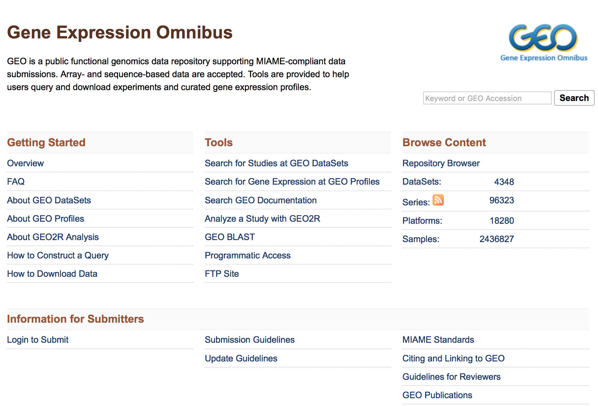

The most straight-forward method can be found by clicking on 'Datasets' under the 'Browse Content' column. 

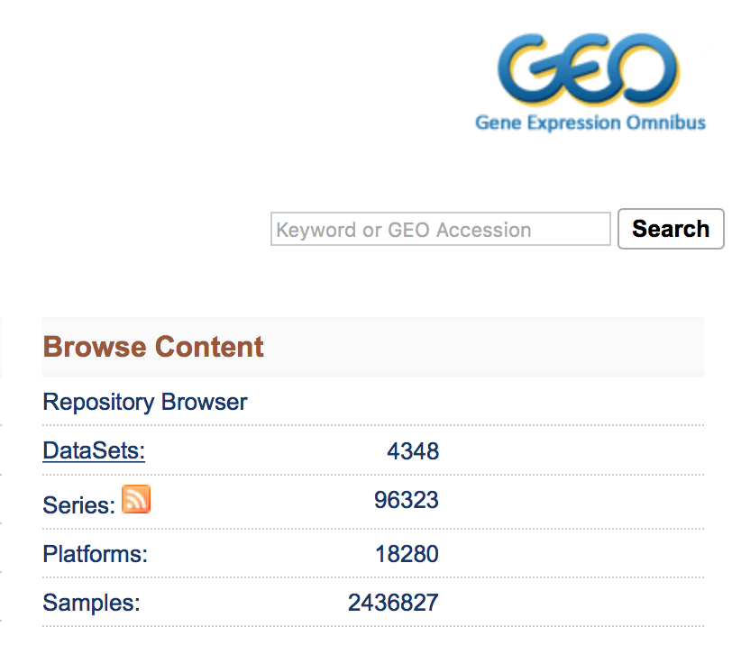

The 'Datasets' link will open the GEO Dataset Browser; click on 'Advanced Search'.

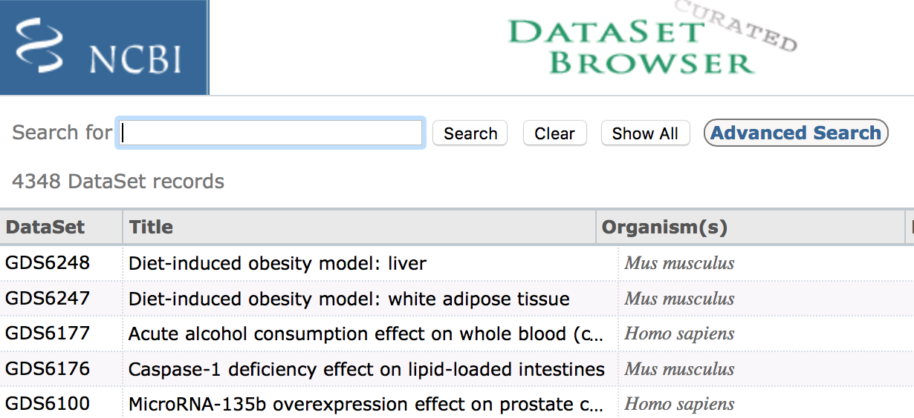

All results will appear in a new window with clickable filters on the left-hand side. You can choose the filters, such as 'Organism' (human, mouse), 'Study type' (Expression profiling by high throughput sequencing), 'Publication dates' (1 year), etc. to filter the data for the desired attributes.

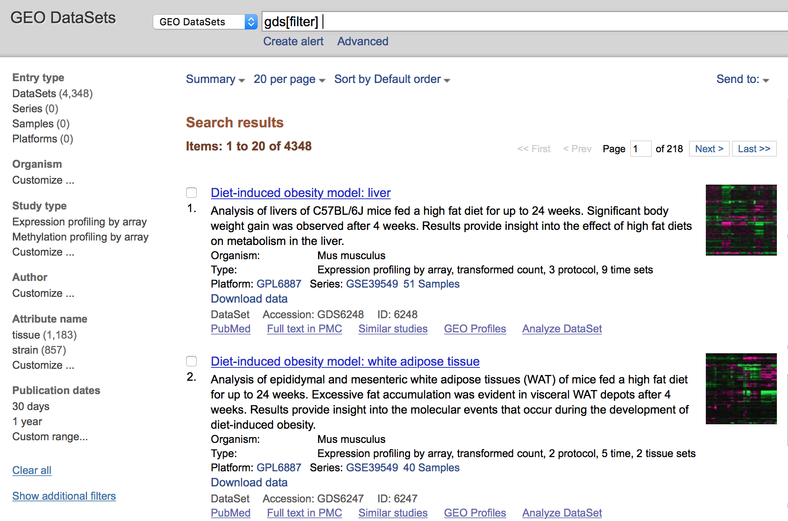

### Finding GEO data for a particular publication

To find data from a published paper on GEO, the paper will often provide the GEO accession number. For example, let's find the data associated with the paper, "MOV10 and FRMP regulate AGO2 association with microRNA recognition elements". First, we can navigate to the [article](http://tinyurl.com/mov10-paper).

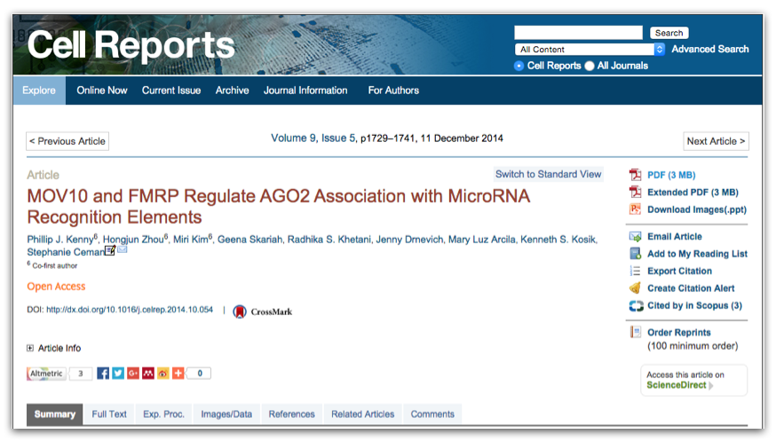

Then, we can search for the term **"GEO"**; different papers have different requirements for where this information is located. In this article, it is available in a separate section entitled "Accession Numbers".

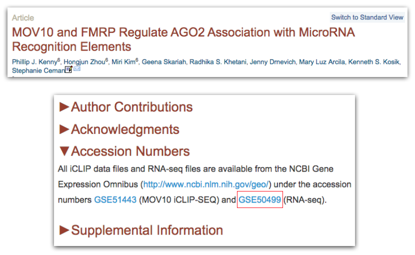

By clicking on the GEO accession number for the experiment of interest, the GEO page for this experiment will open.

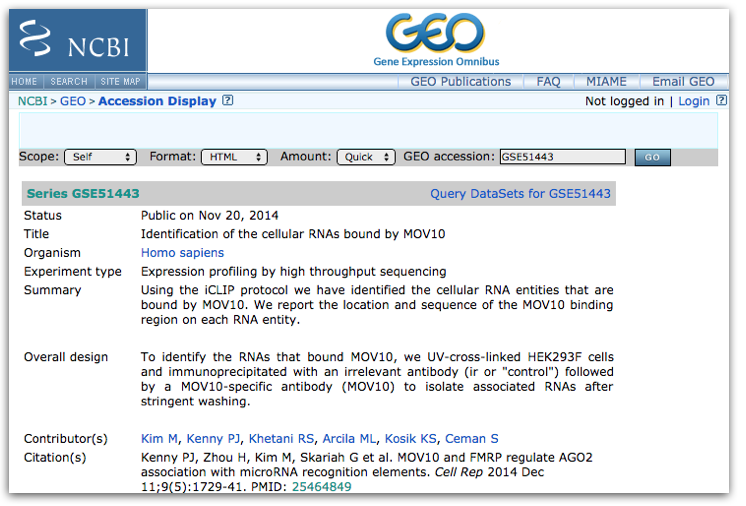

The GEO page contains information about the experiment, including:
	
- an experimental summary
- literature citation
- contact information
- links to the sample GEO pages
- link to the SRA project containing the raw FASTQ files
- metadata (matrix file)
- supplementary data
	
If we were interested in downloading the raw counts matrix (`GSE50499_GEO_Ceman_counts.txt.gz`), which gives the number of reads/sequences aligning to each gene, then we could scroll down to supplementary data at the bottom of the page. 

We could download this file by clicking on the `ftp` link. In addition to the counts matrix file, we would probably also want the metadata for the file to know which sample belongs to which conditions by clicking on the "Series Matrix File(s)" link.

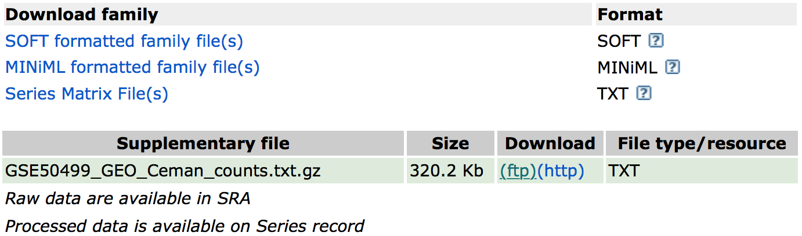

Now that we have these files, if we wanted to perform differential expression analysis, we could bring them into R to perform some data wrangling and analysis.

## Using the command line to download from GEO

While navigating the GEO website is a perfectly fine way to download data from GEO, oftentimes you may want to download multiple files at the same time or download large files that you don't want to store on your personal computer. Generally, the best way to do this is by using a high-performance computing cluster, such as FAS Odyssey or HMS O2.

### Downloading on a cluster

We will demo downloading data to a high-performance computing cluster using the Odyssey cluster.  

To access the Odyssey cluster we need to use the secure shell (`ssh`) command using the 'Terminal' program for Macs or 'GitBash' for Windows. In the console from these programs, type:

```bash
ssh USERNAME@login.rc.fas.harvard.edu
```

Odyssey will then ask for the associated password and verification code (2-factor authentication). For more information on 2-factor authentication, please see the [Odyssey resources](https://www.rc.fas.harvard.edu/resources/odyssey-quickstart-guide/).

Now we are logged onto a 'login' computer, but to perform any work we should transfer to a 'compute' computer by running the `srun` command.

```bash
srun -p test --pty --mem 1G -t 0-08:00 /bin/bash
```

This will transfer us onto a 'compute' computer, where we can do our work. 

>**NOTE:** Downloading data to the HMS O2 cluster uses the same commands as Odyssey; the only difference is the `ssh` command to log onto the cluster and the command to transfer to a 'compute' computer. 
>
> To log onto O2 run:
>	
>	```bash
>	# Logging onto the O2 cluster
>	ssh USERNAME@o2.hms.harvard.edu
>	```
>
> You will be asked for a password, then logged onto a 'login' computer. To transfer to a compute computer, run the following:
>
>	```bash
>	# Transferring to a compute computer on the O2 cluster
>	srun -p interactive --pty --mem 1G -t 0-08:00 /bin/bash
>	```
>
> Now on a 'compute' computer, all other commands should be the same.


Now, we can download our data to an appropriate directory. Good data management practices will ensure we have an organized project directory for our analysis. We can create and change directories to the folder to which we plan to download the data.

```bash
mkdir -p mov10_rnaseq_project/data/counts

cd mov10_rnaseq_project/data/counts
```

Now that we are ready on the cluster, we can find the link to transfer the data using GEO's FTP site. To access the FTP site, return to the [GEO home page](https://www.ncbi.nlm.nih.gov/geo/) and under the "Tools" header, click on "FTP site".

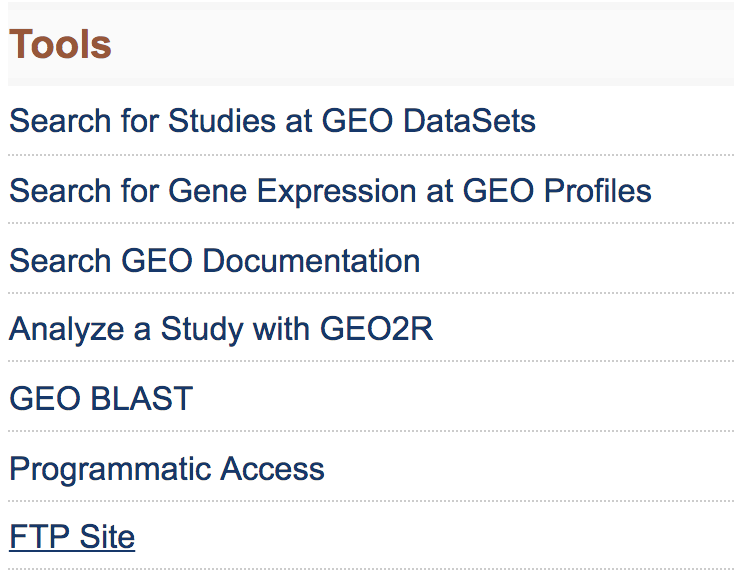

This will take you to the directory to access all GEO data.

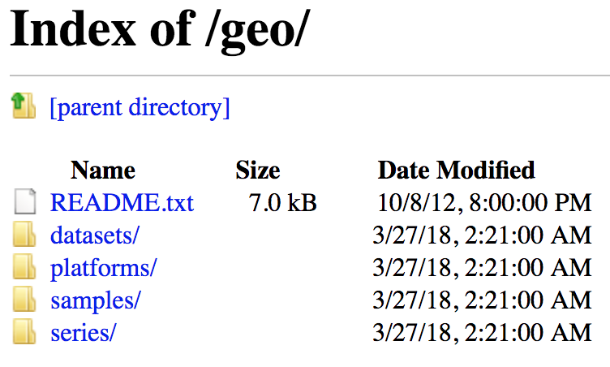

To download the data associated with the paper, "MOV10 and FMRP Regulate AGO2 Association with MicroRNA Recognition Elements", use the GEO ID given in the paper, `GSE50499`.

First we navigate the FTP site to the `series/` folder, then find the `GSE50nnn/` directory and enter the `GSE50499/` folder. The data files available are in the `suppl/` directory. If we choose to download all associated data, we can download the entire `suppl/` directory using the `wget` command and copying the link to the `suppl/` directory by right-clicking. 

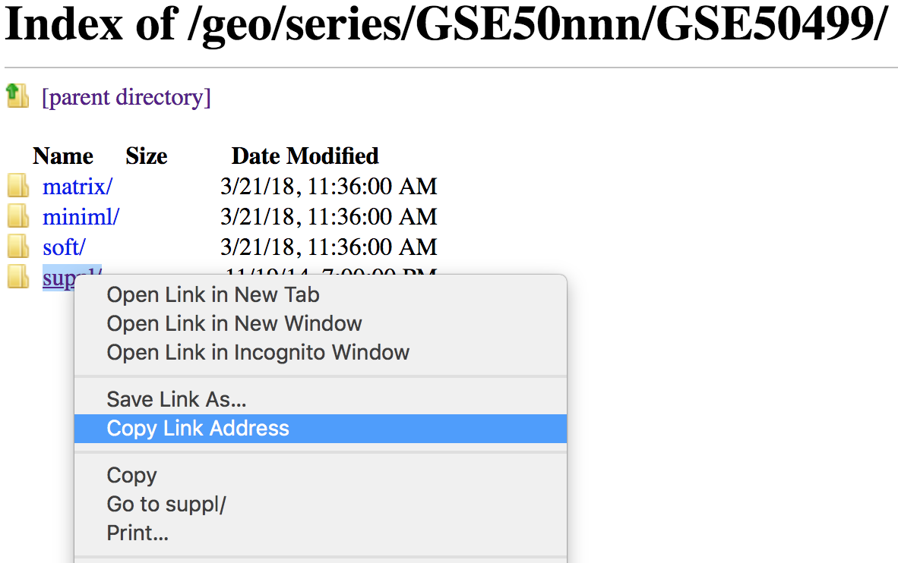

Using the `wget` command to copy this directory requires a few options. Since we are copying a directory, the `-r/--recursive` option is required. Also, the `-np/--no-parent` option is used to avoid the `wget`'s  default copying of any parent directories.

```bash
wget --recursive --no-parent ftp://ftp.ncbi.nlm.nih.gov/geo/series/GSE50nnn/GSE50499/suppl/
```

If you would prefer not to download the automatically generated `index.html` file, then another useful flag would be `-R`/`--reject`.

```bash
wget -r -np -R "index.html*" ftp://ftp.ncbi.nlm.nih.gov/geo/series/GSE50nnn/GSE50499/suppl/
```

***

**Exercises**

1. What command would we use to download all data for the [study](https://www.ncbi.nlm.nih.gov/geo/query/acc.cgi?acc=GSE111889): 

	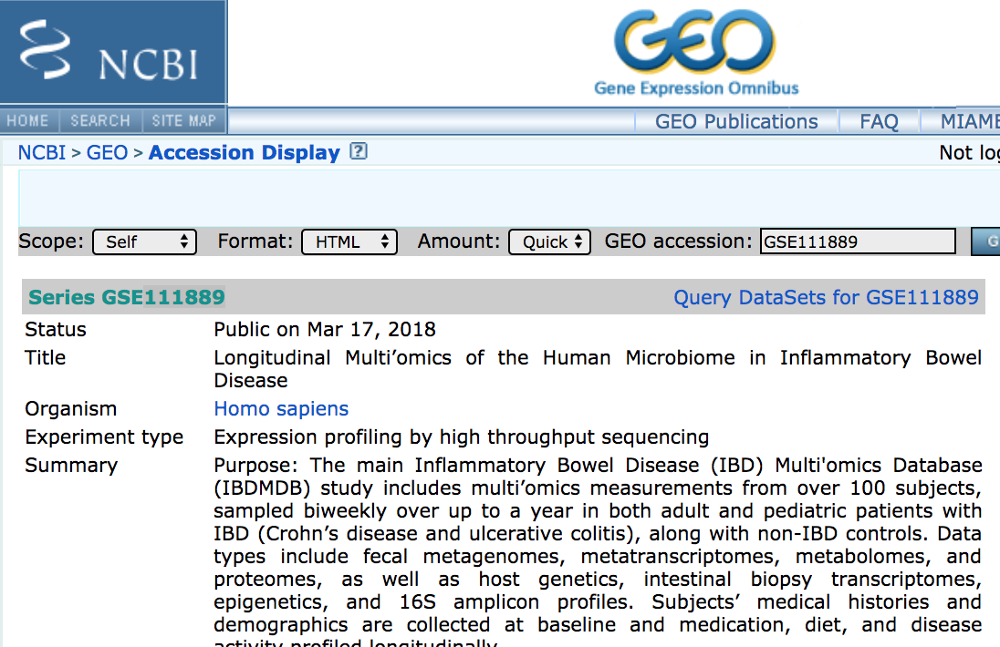
	
	>
	>_**NOTE:** If you wanted to unpack the `.tar` file and decompress the `.gz` files, you could use the following commands:_
	>
	>```bash
	>tar -xvf GSE111889_RAW.tar 
	>
	>for all in *.gz; do gunzip $all; done
	>```


2. How would you download the associated metadata?


***

### Downloading on a local computer

If we are downloading a small file(s) to use on our personal computer, then it makes sense to directly download to our computer. Unfortunately, `wget` is not automatically available using the Mac Terminal or using GitBash on Windows. However, the `curl` command is available to transfer data from (or to) a server. 

To see how this works, we can visualize partyparrot by using `curl` to connect to the server displaying the dancing parrot:

```bash
curl parrot.live
```

We can also download individual files using `curl` by connecting to the FTP:

```bash
curl -O ftp://ftp.ncbi.nlm.nih.gov/geo/series/GSE50nnn/GSE50499/suppl/GSE50499_GEO_Ceman_counts.txt.gz
```

Unfortunately, we cannot download folders with `curl`. However, for MacOS, the [Homebrew package manager](https://brew.sh/) is a wonderful way to install programs/commands that may not be installed on your operating system, such as `wget`.

Also, it's worth noting that we don't need to navigate the FTP site to find individual files to download, since the link on the GEO site should list a link to the file. By right-clicking on the `ftp` link on GEO, you can copy the 'ftp address' to use with the `wget` or `curl` command.

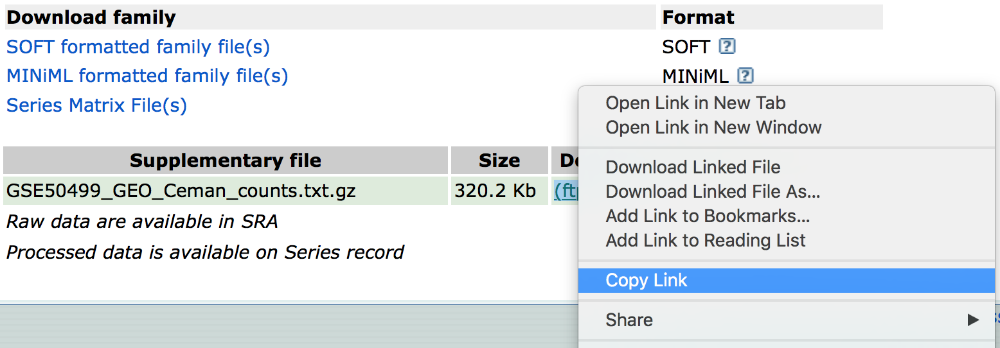

# Sequence Read Archive

```bash
# Start a new interactive session in Orchestra 

# Load the sratoolkit module
module load sratoolkit/2.8.1

#Download the dataset of interest
$ prefetch -v SRR390728

# convert the .sra file to fastq format
$ fastq-dump -h
$ fastq-dump <options> <SRR390728.sra>
```

## Finding and accessing data on the SRA

# Reference Data

During an NGS experiment, the sequences in the raw FASTQ files, or sequence reads, need to be mapped or aligned to the reference genome to determine from where these sequences originated. Therefore, we need a reference genome (in FASTA format) in which to align our sequences. In addition, many NGS methods require knowing where known genes or exons are located on the genome in order to quantify the number of reads aligning to different genome features, such as exons, introns, transcription start sites, etc. These analyses require reference data containing specific information about genomic coordinates of various
genomic “features”, such as gene annotation files (in GTF, GFF, etc. formats). 

To download reference data, there are a few different sources available:

- **General biological databases:** Ensembl, NCBI, UCSC, EMBL-EBI, DDBJ, etc.
- **Organism-specific biological databases:** Flybase, Wormbase, etc. (often updated more frequently, so may be more comprehensive)
- **Reference data collections:** Illumina's iGenomes
- **Local access:** shared databases on FAS Odyssey cluster or HMS O2 cluster

## General biological databases: Ensembl

#### Overview
[*Ensembl*](http://useast.ensembl.org/index.html) provides a website that acts as a **single point of access to annotated genomes** for vertebrate species. 

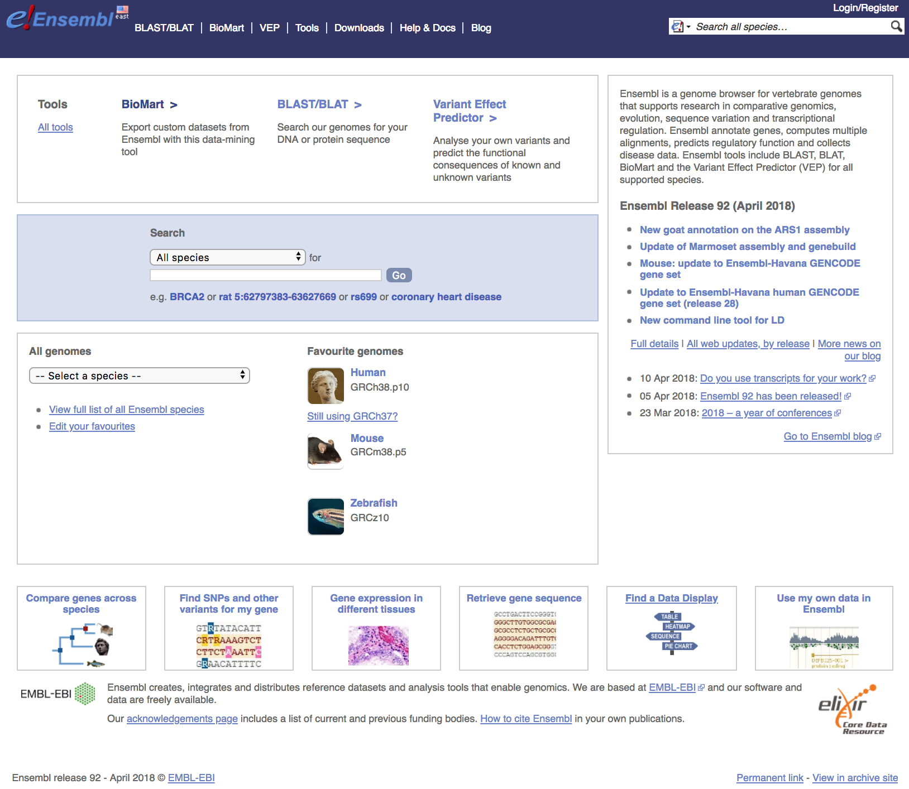

- **Searching Ensembl**:  Look for a gene, location, variant and more using the search box on the homepage or the box that is provided in the top right corner of any Ensembl page.

	- a gene name (for example, BRCA2) - best to use the official gene symbols ([HGNC](http://www.genenames.org))
	- a UniProt accession number (for example, P51587)
	- a disease name (for example, coronary heart disease)
	- a variation (for example, rs1223)
	- a location - a genomic region (for example, rat X:100000..200000)
	- a PDB ID or a Gene Ontology (GO) term

	Most search results will take you to the appropriate Ensembl view through a results page. If you search using a location you will be directed straight to the location tab (this tab provides a view of a region of a genome). These pages will allow you to **download information/sequences for specific genes/transcripts/exons/variants**.

- **Browse a Genome**: Choose your species of interest in this section. The drop down menu under 'All genomes' allows you to select from the full list. The *Ensembl Pre!* site contains new genomes (either new species to Ensembl, or updates in the reference assembly) that do not yet have an Ensembl gene set.  BLAST/BLAT is available for organisms in all Ensembl sites, including Pre!

- **Help**: There is a wealth of help and documentation in Ensembl if you are new to the browser. Video tutorials are provided and printable pdfs with exercises. Custom data may be uploaded to Ensembl or displayed directly by attaching a file by URL. 

- **News**: To find out what genome build and release you are working with, have a look at the news section of the homepage. If the current release is not the one you need, access archive sites to access previous versions, or releases, of Ensembl using the link on the lower right side.
 
While we are not going to explore the Ensembl database in this workshop, we have [materials available](https://hbctraining.github.io/In-depth-NGS-Data-Analysis-Course/sessionIII/lessons/10_Ensembl_biomart.html) if you wish to explore on your own.

When using Ensembl, note that it uses the following format for naming biological components:
	
- ENSG###########	Ensembl Gene ID
- ENST###########	Ensembl Transcript ID
- ENSP###########	Ensembl Peptide ID
- ENSE###########	Ensembl Exon ID
	
For non-human species a suffix is added:

- MUS (Mus musculus) for mouse ENSMUSG###
- DAR (Danio rerio) for zebrafish: ENSDARG###
	
## Finding and accessing reference data on Ensembl

# iGenomes

## Finding and accessing reference data on iGenomes
- shared_databases

# Flybase

## Finding and accessing reference data on Flybase
