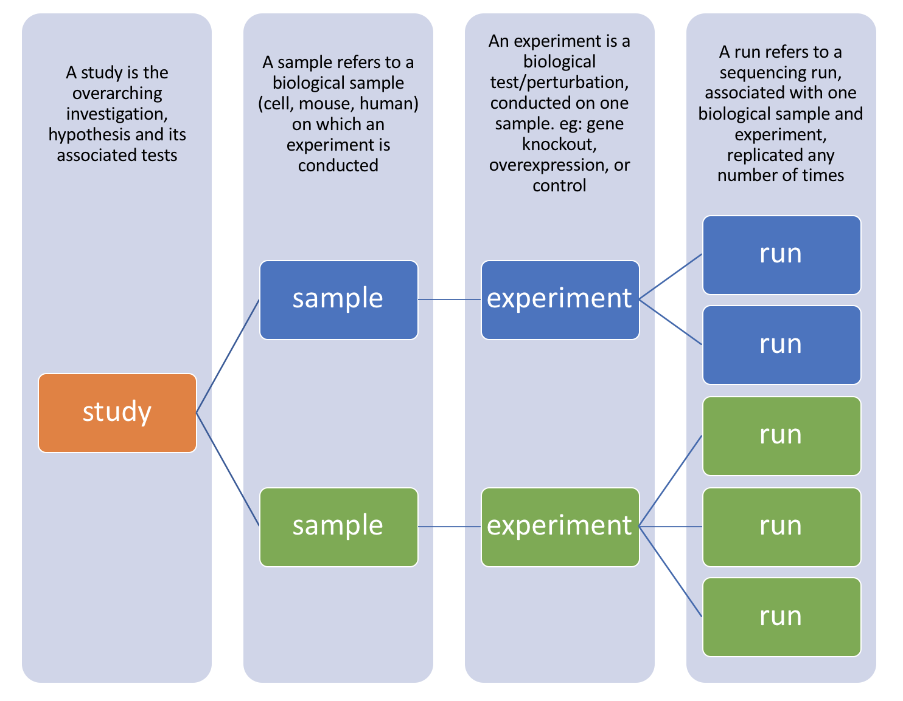
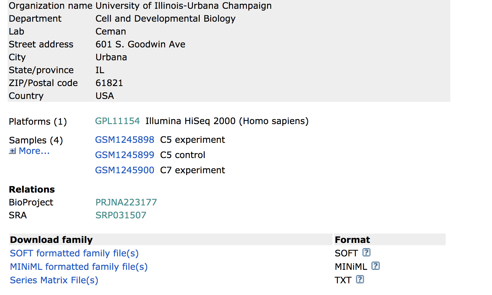
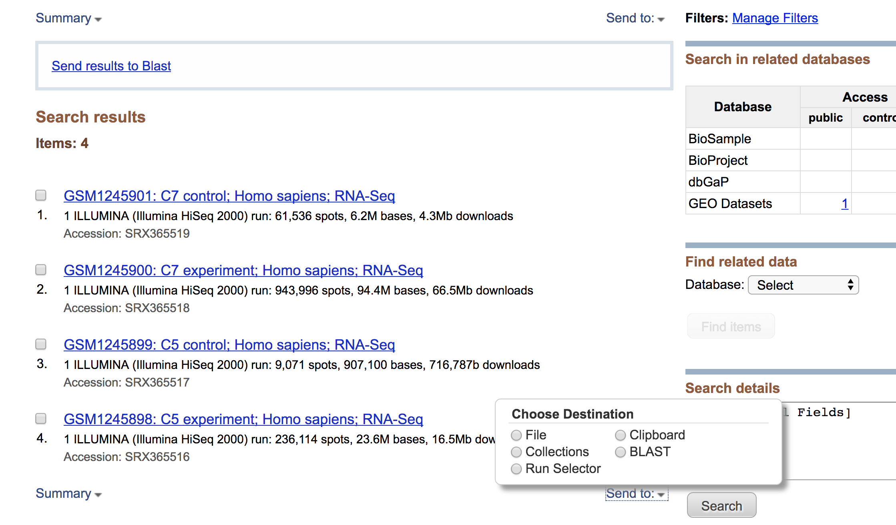
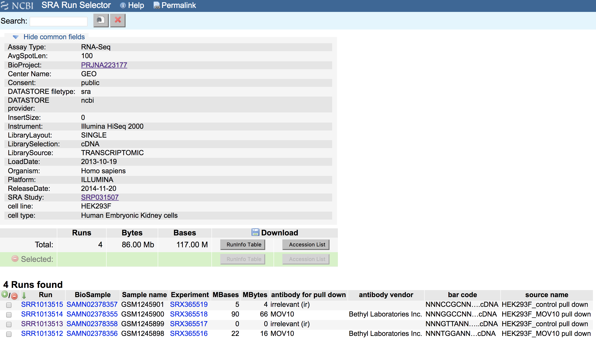
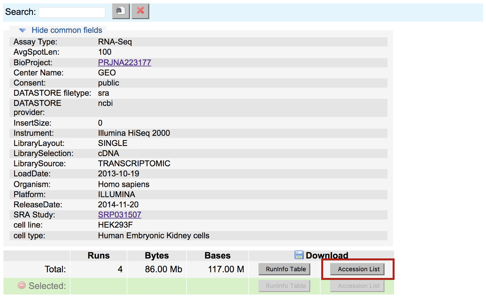

# Downloading data from SRA

The Sequence Read Archive (SRA) is an archive for high throughput sequencing data, publically accessible, for the purpose of enhancing reproducibility in the scientific community.

There are four hierarchical levels of SRA entities and their accessions:  
1) **STUDY** with accessions in the form of SRP, ERP, or DRP  
2) **SAMPLE** with accessions in the form of SRS, ERS, or DRS  
3) **EXPERIMENT** with accessions in the form of SRX, ERX, or DRX  
4) **RUN** with accessions in the form of SRR, ERR, or DRR

The minimum publishable unit in the SRA, is an EXPERIMENT (SRX)



But most commonly, we find data we are interested in starting from a publication (or study) in GEO. Using the GEO study accession number as previously shown, we can **navigate to the summary page for the study.** 


Towards the bottom of the page you will find a link for **"SRA"** under the heading **"Relations"**.



Clicking on this link takes you to a page that lists all the biological samples for the study - each with a link to their specific runs and files. If we were only interested in one sample, we could follow the relevant link and find its runs. But generally we want the files for all samples and their replicates, and to find this in one comprehensive list, we use the **run selector**. Navigate to the bottom of the page and click **"send to"** and click the radio button for **"run relector"**, and then press **"go"**.



# Run selector
You'll notice that the run selector has aggregated all the information for the study samples, including a table of metadata at the top, giving information on: LibraryLayout (whether the reads were sequenced using single or paired end sequencing), Platform (which sequencing technology was used) and other useful information that should be noted for downstream analysis.



Below this there is also a summary line detailing the total number of runs in the study, and the option to download the RunInfoTable or Accession List, in text format. The RunInfoTable is a very useful text summary of all metadata for all runs in the study, and the Accession List is a list of all the SRR accession numbers for the study.

Also on this page is a listing of each run and the corresponding sample it came from, as well as its associated metadata. This table is useful in that each row is "clickable", which allows you to select a subset of runs that you may be interested in. You'll notice that clicking a subset of runs spawns a new download option - a RunInfoTable & Accession List that is only relevant to your chosen subset.



**Download the Accession list** for the data you are interested in to your desktop (everything included by default). **Copy it to the server** using the following command:

```bash
$ scp /path/on/your/computer/to/list_of_SRRs.txt yourusername@hms.harvard.edu:/n/scratch2/yourusername/
```

>**NOTE: Storage considerations:**
>When downloading large datasets to the server, note that the maximum storage limit in your home directory is 100GB. This can be a problem when downloading tens or hundreds of fastq files. The scratch space on is a location with much greater storage (12TB limit), and a better place to run large downloads.
During download, in addition to writing the fastq files, SRA-toolkit writes additional cache files, which are automatically directed to your home directory by default, even if you are working elsewhere. Because of this, we may need to write a short configuration file to tell SRA-toolkit to write its cache files to the scratch space, instead of our home, to avoid running out of storage.
>
>```bash
>#navigate to your scratch space (replace 'username' with your username)
>cd /n/scratch2/username
>
>#make a directory for ncbi configuration settings
>mkdir -p ~/.ncbi
>#write configuration file with a line that redirects the cache
>echo '/repository/user/main/public/root = "/n/scratch2/username/sra-cache"' > ~/.ncbi/user-settings.mkfg
>```

Now we have what we need to run a fastq-dump for all of the SRRs we want

# Parallelizing the SRR download

Given one single SRR, it is possible to convert that directly to a fastq file on the server, using SRA toolkit

```bash
$ module load sratoolkit/2.8.1
$ fastq-dump <SRR>
```

But, doing this individually for many SRR's could be painful. Unfortunately the SRA-toolkit doesn't have its own methods for downloading multiple SRR files at once in parallel, so we've written a script (or two) to do this for you. The first script contains the command to do a fastq dump on a given SRR number, where the SRR variable is given using a positional parameter. You can learn more about positional parameters here: >>link

```bash
$ vim inner_script.sh
```

```bash
#!/bin/bash
#SBATCH -t 0-10:00       # Runtime
#SBATCH -p short            # Partition (queue)
#SBATCH -J your_job_name             # Job name
#SBATCH -o run.o             # Standard out
#SBATCH -e run.e             # Standard error
#SBATCH --cpus-per-task=1    # CPUs per task
#SBATCH --mem-per-cpu=8G     # Memory needed per core
#SBATCH --mail-type=NONE      # Mail when the job ends

#for single end reads only
fastq-dump $1

#for paired end reads only
fastq-dump --split-3  $1
```
>**NOTE: Paired End Data: **
Unlike the standard format for paired end data, where we normally find two fastq files labelled as sample1_001.fastq and sample1_002.fastq, SRR files can be very misleading in that even paired end reads are found in one single file, with sequence pairs concatenated alongside each other. Because of this format, paired files need to be split down the middle at the download step. SRA toolkit has an option for this called "--split-files". By using this, one single SRR file will download as SRRxxx_1.fastq and >SRRxxx_2.fastq.
>
>Furthermore, there is a helpful improvement on this function called "--split-3" which splits your SRR into 3 files: one for read 1, one for read 2, and one for any orphan reads (ie: reads that aren't present in both files). This is important for downstream analysis, as some aligners require your paired reads to be in sync (ie: present in each file at the same line number) and orphan reads can throw this order off.

The second script loops through our list of SRRs, and calls the first script from within the loop, passing it the next SRR in the list.

```bash
$ vim sra_fqdump.sh
```
```bash
#!/bin/bash
#SBATCH -t 0-10:00       # Runtime
#SBATCH -p short            # Partition (queue)
#SBATCH -J your_job_name             # Job name
#SBATCH -o run.o             # Standard out
#SBATCH -e run.e             # Standard error
#SBATCH --cpus-per-task=1    # CPUs per task
#SBATCH --mem-per-cpu=8G     # Memory needed per core
#SBATCH --mail-type=NONE      # Mail when the job ends

module load sratoolkit/2.8.1

#while there are lines in the list of SRRs file
while read p
do
#call the bash script that does the fastq dump, passing it the SRR number next in file
sbatch inner_script.sh $p
done <list_of_SRRs.txt
```
In this way (by calling a script within a script) we will start a new job for each SRR download, and download all the files at once in parallel -- much quicker than if we had to wait for each one to run sequentially. To **run the main script:**

```bash
$ sbatch sra_fqdump.sh
```

>**NOTE: SRRs from Multiple Studies:**
>Sometimes, in a publication, the relevant samples under study are given as sample numbers (GSM numbers), not SRRs, and sometimes belong to different GEO datasets (eg: different parts of a series, or separate studies for case and control experiments/data). If this is the case, download the RunInfoTables for each of the relevant studies as shown, selecting only the relevant GSMs/SRRs in the table before download, and copy them into one file. The starting point for the parallel fastq dump is a list of SRRs - so it does not matter if they came from different studies.
