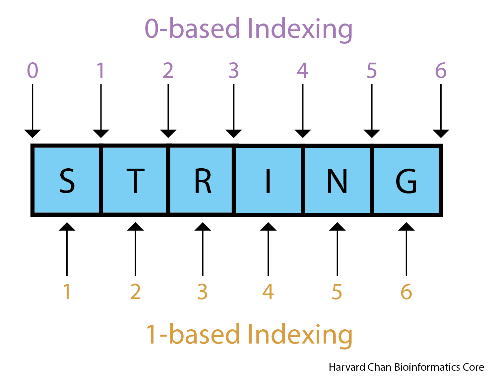
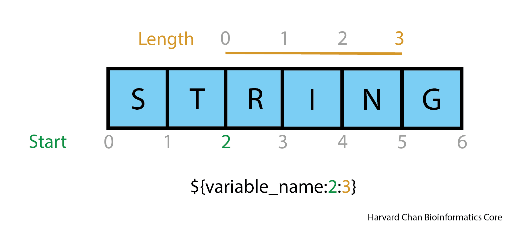
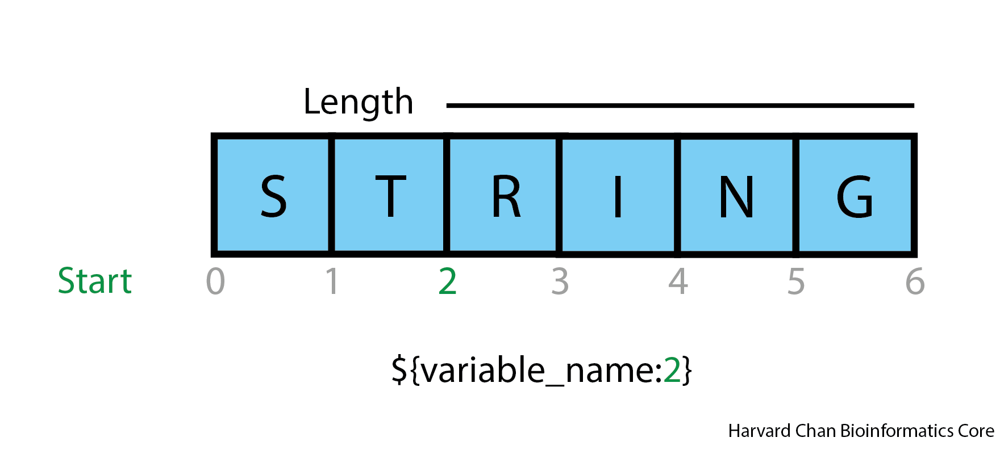
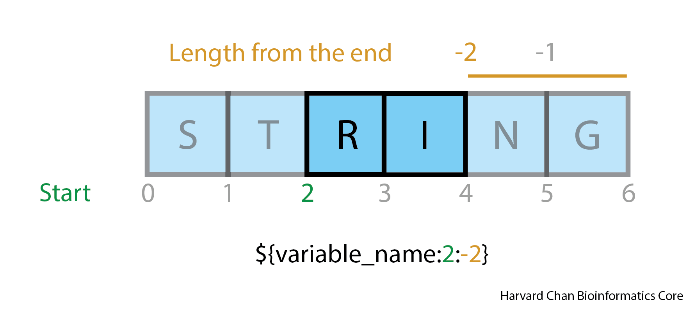
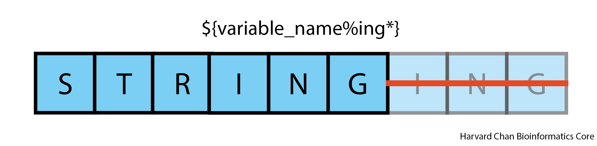

# String Manipulation

While the syntax differs, one feature that is common is most programming languages is the process of string manipulation. Before we can introduce string manipulation, we first need to introduce strings!

## Learning Objectives

In this lesson, you will:
- Describe a string
- Differentiate between 0-based and 1-based indexing
- Manipulate strings in `bash`

## Strings

A string is a term for any sequence of characters. Some examples of strings are:

```
Happy_birthday
this_module_is_a_blast.txt
/path/to/my/favorite/photo.jeg
```

Strings have whitespace (spaces or tabs) separating them from anything else. 

> **NOTE:** While generally discouraged, strings can also have spaces in them along with other special characters. Special characters are characters that have special meaning in a language. For example, `>` is a character used for redirection or `$` is a character used with variables. You can use them if you must by "escaping" them. Escaping a special character requires putting a `\` infront of the special character, which tell bash to interpret this next character literally, not as a special character. Naturally, `\` is also a special character. Because different software tools interpret special characters differently, it is generally advised just to stay away from them in strings unless it is necessary (which sometimes it is). Many of these special characters are symbols, so general, just be leary of using non-alphanumerical characters in your strings.

## String manipulation

### Indexing

Before we can explore string manipulation, we need to have some background on indexing.There are two major forms of indexing:

- 0-based indexing counts in between the characters and starts at 0 before the first character 
- 1-based indexing counts each character and start at 1 at the first character

<p align="center">

</p>

One advantage of 0-based indexing is that figuring out distances a bit easier. If you want to know the distance from `R` to `N` in the example above, you just need to do to 5 - 2 and you get the length of that string is 3. In 1-based indexing, you need to add 1 after you do the substraction. So in the case of `R` to `N`, it would be 5 - 3 + 1 = 3. **Many of the built-in `bash` commands use 0-based indexing**, but other programs not in this module may run on 1-based indexing, so you should be aware of how strings are indexed when analyzing them.

### Subsetting strings

The first lesson in manipulating strings is simply subsetting a string. Here, we are trying to take our string and only extract a portion of that string. First let's set a string, like our name, equal to a variable, in this case `name`:

```
name=Will
```

As we've seen before, we could print this `name` variable like:

```
echo $name
# OR
echo ${name}
```

> **NOTE:** Generally speaking, it's not a bad idea to always start putting your bash variables in `{}`. It's not necessary in some cases, like if the bash variable is followed by a space or other specific characters like `.` or `/`. However, it can save you a headache when debugging and using if you use them when they aren't necessary, `bash` will still interpret the variable just fine. 

Now, if we want to subset the string saved to a variable. We need to need to use the following syntax:

```
# DON'T RUN
${variable_name:start:length}
```

<p align="center">

</p>

In this case, our variable name is `name`, where we start at is the `start` position (0-based) and we continue for a given `length`. If we want the second and third letter of the variable `$name` it would look like:

```
echo ${name:1:2}
```

### Application

The O2 cluster at Harvard has a special space reserved for each person's "scratch" work that is deleted after 30 days of not being used. The path to this space is:

```
# DON'T RUN
/n/scratch3/users/[users_first_letter]/[username]/
```

You should also be aware that O2 like many clusters has a special built-in variable called `$USER` that holds a username (which we will assume is `will`). I could change directories to this scratch space by using:

```
# DON'T RUN
cd /n/scratch3/users/w/will/
```

However, if I was developing code or materials for other people in my group or lab to use, then they would have to manually change each instance of it. However, you can use substrings and variables to help you here. Instead of writing out your user information you could instead write:

```
# DON'T RUN
cd /n/scratch3/users/${USER:0:1}/${USER}/
```

Now this would universally apply to anyone using your code on O2!

## Substring from a position to the end of the string

There is a special case of the above example where you might want to trim a certain amount characters from the beginning of a string. The syntax for this would be:

```
# DON'T RUN
${variable_name:start}
```

<p align="center">

</p>

If we want to trim the first two letters off of out `$name` variable then it would look like:

```
echo ${name:2}
```

## Substring counting from the end of a string

You may have a situation where you want to remove the last characaters from a string, the syntax for this would look similiar:

```
# DON'T RUN
${variable:start:-length_from_the_end}
```

<p align="center">

</p>

If you wanted to trim the last two letters off of the `$name` variable:

```
echo ${name:0:-2}
```

This would still start at zero and keep everything but the last two positions.

You could trim the first and last letter like:

```
echo ${name:1:-1}
```

Here, you are telling `bash` to start in the first position and also take everything except the last position.

## String Addition

You can also add character to strings. The syntax for this is pretty straightforward:

```
# DON'T RUN
string_to_add_to_beginning${variable_name}string_to_add_to_end
```

`${variable_name}` is the string assigned to `${variable_name}` and `string_to_add_to_beginning` and `string_to_add_to_end` are strings you want to add to the beginning and/or end, respecitively.

<p align="center">

</p>

For example, we can add onto the end of the `$name` variable we designated to make it into a legal name:

```
real_name=${name}iam
echo ${real_name}
```

### Bioinformatics Application

You can see this could be very useful if you had a path saved to a variable and you wanted to use that path variable to create paths to files within that directory. For example:

```
alignment_directory=/my/alignment/files/are/here/
SAM_alignment=${alignment_directory}file.sam
BAM_alignment=${alignment_directory}file.bam
```

So now if you look at `$SAM_alignment`:

```
echo ${SAM_alignment}
```

It will return:

```
/my/alignment/files/are/here/file.sam
```

Or the `$BAM_alignment`:

```
echo ${BAM_alignment}
```

It will return:

```
/my/alignment/files/are/here/file.bam
```

If you have a script where you use a path multiple times, this can be really helpful for minimizing typos and make it easier to repurpose the script for different uses.

## Substring Removal

Let's imagine a case where we wanted to remove some part of a string and let's start by defining a string named `slingshot`:

```
slingshot=slinging_slyly
```

### Remove the shortest match from the end

The first thing we might want to do is remove a substring from the end of a string. The syntax for removing the shortest substring from the end of a string is:

```
# DON'T RUN
echo ${variable_name%substring_to_remove}
```

<p align="center">

</p>

In the case below, we want to remove `ly` from the end of our `$slingshot` string:

```
echo ${slingshot%ly}
```

This will return:

```
slinging_sly
```

This example is a bit simple because our example ended with `ly`, so instead let's remove `ing` and anything after it from the end of our `$slingshot` string:

```
echo ${slingshot%ing*}
```

Notice the addition of the wildcard `*` character. This allows us to remove `ing` **and** anything after the shortest match of `ing` from the end of the string.

#### Bioinformatics Application

Removing the end of string is very common in bioinformatics when you want to remove the extension from a file name. Consider the case where you have a variable named, `file`, that is set equal to `/path/to/myfile.txt` and you want to remove the `.txt` extension:

```
file=/path/to/myfile.txt
echo ${file%.txt}
```

This will return:

```
/path/to/myfile
```

This can very really nice when compared to the `basename` function, which can also a strip file extension. However, `basename` also strips path information. You may have a case where you have a full path and filename, but you don't want to strip the path information, but rather just the extension. 

### Remove the longest match from the end

We have discussed removing the shortest match from the end of a string, but we can also remove the longest match from the end of a string and the syntax for this is:

```
# DON'T RUN
echo ${variable_name%%substring_to_remove}
```

<p align="center">

</p>

In order to differentiate the longest match from the end and the shortest match from the end, we will need to utilize the `*` wildcard. Let's remind ourselves of what the shortest match from the end would look like when using a `*`:

```
echo ${slingshot%ly*}
```

This returns:

```
slinging_sly
```

Now, let's change the `%` to `%%`:

```
echo ${slingshot%%ly*}
```

However, this returns:

```
slinging_s
```

> NOTE: It is important to note that without the use of a `*` wildcard, `echo ${slingshot%ly}` and `echo ${slingshot%%ly}` will both return `slinging_sly`

### Remove the shortest match from the beginning

Instead of removing matches from the end of the string we can also remove matches from the beginning of the string by using `#` instead of `%`. Excitingly, like the shebang line, this is one of the few times that `#` doesn't function as a comment in `bash`. The syntax for remove the shortest match from the beginning of a string is:

```
# DON'T RUN
${variable_name#substring_to_remove}
```

<p align="center">

</p>

If we want to remove `sl` from the beginning of our `$slingshot` variable string, then we could use:

```
echo ${slingshot#sl}
```

This would return:

```
inging_slyly
```

Like removing matches from the end, this example isn't as interesting without the use of wildcards. Perhaps instead, we want to remove anything to and including the first match of `ing` from the beginning. We could do that like:

```
echo ${slingshot#*ing}
```

This would return:

```
ing_slyly
```

### Remove the longest match from the beginning

We can also remove the longest match from the beginning using the following syntax:

```
# DON'T RUN
${variable_name##substring_to_remove}
```

<p align="center">

</p>

Let's remove the longest match that contains `ing` from the beginning:

```
echo ${slingshot##*ing}
```

This would return:

```
_slyly
```

> **NOTE:** Similiarly to removing strings from the end, there isn't any difference between using `#` and `##` when removing strings from the beginning if you don't use the `*` wildcard.

#### Bioinformatics Application-*ish*

You could use this to strip path information. For example:

```
path=/my/path/to/file.txt
echo ${path##*/}
```

However, the `basename` function provides this exact function, so either way is synonymous. However, using `basename` might be a bit more readable.

### Substring Removal Overview

The table below is a summary of substring removal:

| Shortcut | Effect |
|------|------|
| % | Remove shortest match from the end of the string |
| %% | Remove longest match from the end of the string|
| # | Remove the shortest match from the beginning of the string|
| ## | Remove the longest match from the beginning of the string|

### Miscellanous

#### Length of string

The length of a string can be determined by using the following syntax:

```
# DON'T RUN
${#variable_name}
```

Once again, this is another interesting case where `#` is not used as a comment and actually has a function in `bash`. In this case, we could see the length of the `$slingshot` variable by using:

```
echo ${#slingshot}
```

Which will return a length of:

```
14
```

#### Case changing

**NOTE: The ability to change cases is only availible on versions of `bash` that are version 4.0+!**

##### All Uppercase

If you want all uppercase letters you can do:

```
# DON'T RUN
${variable_name^^}
```

If your version of `bash` is too old to change cases, the error message will look like:

```
-bash: ${variable_name^^}: bad substitution
```

For example, if we wanted `$slingshot` to be all uppercase letters, we can do:

```
echo ${slingshot^^}
```

And it would return:

```
SLINGING_SLYLY
```

##### Leading Uppercase

If you want the leading character to be uppercase, then we can use this syntax:

```
# DON'T RUN
echo ${variable_name^}
```

If we do this to `$slingshot`, it would look like:

```
echo ${slingshot^}
```

And it would return:

```
Slinging_slyly
```

##### All lowercase

We can also make a string entirely lowercase. Let's consider the following string:

```
dog=FIDO
```

We could force all of the letters to be lowercase using the following syntax:

```
# DON'T RUN
${variable_name,,}
```

We can apply this syntax to our `$dog` variable:

```
echo ${dog,,}
```

The output would look like:

```
fido
```

##### Leading lowercase

We can also just make the leading character lowercase with the following syntax:

```
# DON'T RUN
${variable_name,}
```

We can apply this syntax to our `$dog` variable:

```
echo ${dog,}
```

The output would look like:

```
fIDO
```

## Exercises

For these exercises, use the following file path:

```
filepath=/path/to/my/file.sam
```

**1)** Strip the file extension from this variable.


**2)** Strip the file extension from this variable and assign a new extension of `.bam`


**3)** Strip the file extension from this variable, assign a new extension of `.bam` and assign it to a new variable called `bam_filename`. Then print this new `bash` variable 


***

[Next Lesson >>](03_Regular_expressions.md)

[Back to Schedule](../README.md)

***

*This lesson has been developed by members of the teaching team at the [Harvard Chan Bioinformatics Core (HBC)](http://bioinformatics.sph.harvard.edu/). These are open access materials distributed under the terms of the [Creative Commons Attribution license](https://creativecommons.org/licenses/by/4.0/) (CC BY 4.0), which permits unrestricted use, distribution, and reproduction in any medium, provided the original author and source are credited.*
