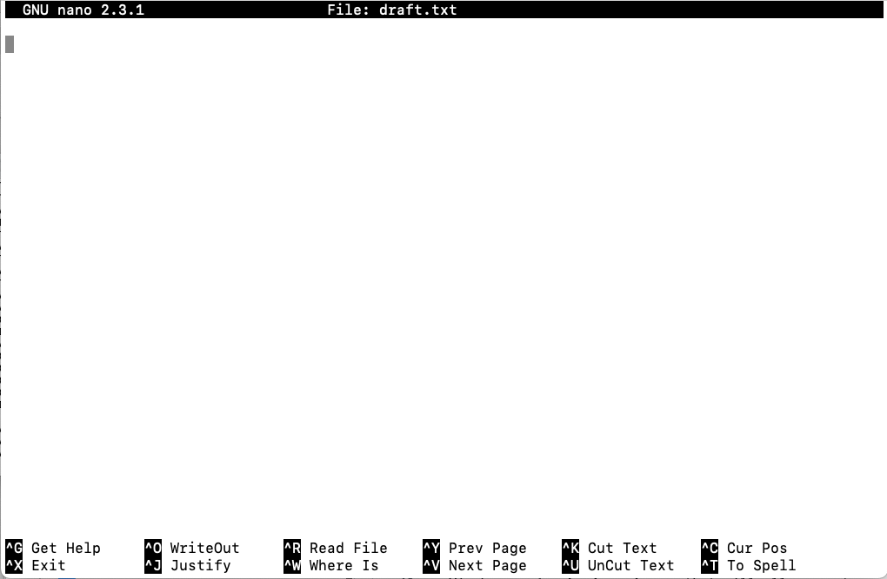

## Learning Objectives

- Create new files and make edits to existing files with nano
- Compare different commands for examining small or large files

## Creating text files

### GUI text editors

You can easily create text files on your computer by opening up a text editor program such as [TextWrangler](http://www.barebones.com/products/textwrangler/), [Sublime](http://www.sublimetext.com/), and [Notepad++](http://notepad-plus-plus.org/), and start typing. These text editors often have features to easily search text, extract text, and highlight syntax from multiple programming languages. We refer to these as **GUI text editors** since they have a **G**raphical **U**ser **I**nterface that has buttons and menus that you can click on to issue commands to the computer and you can move about the interface just by pointing and clicking.  

> **NOTE:** When we say, "text editor," we really do mean "text": these editors can only work with plain character data, not tables, images, or any other media and it explicitly excludes *Microsoft Word* or *TextEdit*. 


### Command-line text editors

But what if we need **a text editor that functions from the command line interface**? If we are working on remote computer (i.e. high-performance compute environments) we don't have access to a GUI and so we need to use **Command-line editors** to create, modify and save files. When using these types of editors, you cannot 'point-and-click', you must navigate the interface using only the keyboard.

Some popular command-line editors include [nano](http://www.nano-editor.org/), [Emacs](http://www.gnu.org/software/emacs/) or [Vim](http://www.vim.org/). These editors are available by default on any shell environment, including on high-performance compute environments (local or cloud).

### Introduction to Nano 

Today, we are going to introduce the text editor 'nano'. `nano` is simple to use and the most intuitive of the editors. It may not be as powerful in functionality, but it is a great start for those who are new to the command-line.

#### Nano Interface

You can create a document by calling a text editor and providing the name of the document you wish to create. Change directories to the `unix_lesson/other` folder and create a document using `nano` entitled `draft.txt`:

```bash
$ cd ~/unix_lesson/other
	
$ nano draft.txt
```

Now press enter.

#### Nano interface

You should see this:



This should look quite similar to using a GUI plain text editor. We can see that our file is called draft.txt and our cursor is ready to add text! Type the following into the nanao editor window:

```
This is my first document.
This is a draft.
When I save this file it will be in my "other" folder.
```

The bottom of the screen provides a legend for the keystrokes that correspond to common commands that you may need when working in nano. To **write to file (save)**, type <kbd>Ctrl</kbd> <kbd>x</kbd>. The program will ask if you are sure and you can type <kbd>Y</kbd> then press <kbd>enter</kbd>.

Open up the file again using the same command you used to create the file: `nano draft.txt` **Do not modify the file** close it again with <kbd>Ctrl</kbd> <kbd>x</kbd>. How is this different from the first time?

> If you don't change a file nano will not ask if you are sure to save it.


### Nano Editing
Create the document `spider.txt` in nano. Copy and paste the text as follows: 

```
The itsy bitsy spider
Went up the water spout
Down came the rain
And washed the spider out.
```

To make it easier to refer to distinct lines, we can **add line numbers** by typing reopening the document with:

```
nano -c spider.txt
```

While we cannot point and click to navigate the document, we can use the arrow keys to move around. Navigating with arrow keys can be very slow, so `nano` has shortcuts. You can find some [here]([https://www.nano-editor.org/dist/latest/cheatsheet.html](https://www.unomaha.edu/college-of-information-science-and-technology/computer-science-learning-center/_files/resources/CSLC-Helpdocs-Nano.pdf)) Several of the more common ones are already at the bottom of your nano window.

**NOTE:** If you are using a **Mac** you must **change your terminal preferences in order to use the option button as an alt button**. Go to: Terminal preferences -> Profiles -> (click keyboard button) -> select "Use Option as Meta key"


| Key              | Action                 |
| ---------------- | ---------------------- |
| <kbd>Ctrl + k</kbd>    | Delete the current line    |
| <kbd>Ctrl + u</kbd>    | Paste|

*** 

**Exercise**

We have covered some basic commands in `nano`, but practice is key for getting comfortable with the program. Let's practice what we just learned by folllowing the steps outlined below:

1. Open `spider.txt`, and delete line #2.
2. Quit without saving.
3. Open `spider.txt` again, go to the last line and delete it. 
4. Save the file and see whether your results below.

<details>
  <summary>Answer</summary>
  <p><pre>
The itsy bitsy spider
Went up the water spout
Down came the rain
  </pre></p>
</details>

## Examining Files

We now know how to move around the file system and look at the
contents of directories, and create files - but how do we look at the contents of files? Obviously we could open files up with a text editor like `nano` but there <i>MUST</i> be a better way!

The easiest way to examine **a small file** (i.e. few enough lines, that we could easily scroll through) is to just print out all of the contents using the command `cat`. Print the contents of `spider.txt` by entering the following command:

```bash
$ cat spider.txt
```

This prints out the all the contents of `spider.txt` to the screen.

> `cat` stands for catenate; it has many uses and printing the contents of a files onto the terminal is one of them.

`spider.txt` is all of 3 lines. When you have a 100000 line file you hardly want to print the entire thing to screen (and it can take a while!). When you are working on the cluster for data analysis you will inevitably encounter with large files. 

For **large files** the command, `less`, can be useful. Let's take a look at the files in the `raw_fastq` folder.  You can check the size of them by using the command `ls -lh`. This will give you the size of them in human readable format.

```bash
$ cd ~/unix_lesson/raw_fastq

$ ls- lh
```

These files are quite large, so we probably do not want to use the `cat` command to look at them. Instead, we can use the `less` command. Let's try this with one of the files.

```bash
less Mov10_oe_1.subset.fq
```

We will explore FASTQ files in more detail later, but notice that FASTQ files have four lines of data associated with every sequence read. Not only is there a header line and the nucleotide sequence, similar to a FASTA file, but FASTQ files also contain quality information for each nucleotide in the sequence. 

The `less` command opens the file, and lets you navigate through it. 
<span class="caption">Shortcuts for `less`</span>

| key              | action                 |
| ---------------- | ---------------------- |
| <kbd>SPACE</kbd> | to go forward          |
| <kbd>b</kbd>     | to go backwards        |
| <kbd>g</kbd>     | to go to the beginning |
| <kbd>G</kbd>     | to go to the end       |
| <kbd>q</kbd>     | to quit                |

`less` also gives you a way of searching through files. Just hit the <kbd>/</kbd> key to begin a search. Enter the name of the string of characters you would like to search for and hit enter. It will jump to the next location where that string is found. If you hit <kbd>/</kbd> then <kbd>ENTER</kbd>, `less` will just repeat the previous search. `less` searches from the current location and works its way forward. If you are at the end of the file and search for the word "cat", `less` will not find it. You need to go to the beginning of the file and search.

For instance, let's search for the sequence `GAGACCC` in our file. You can see that we go right to that sequence and can see what it looks like. To exit hit <kbd>q</kbd>.

There's another way that we can look at files, and in this case, just
look at part of them. This can be particularly useful if we just want
to see the beginning or end of the file, or see how it's formatted.

The commands are `head` and `tail` and they just let you look at
the beginning and end of a file respectively.

```bash
$ head Mov10_oe_1.subset.fq
```


```bash
$ tail Mov10_oe_1.subset.fq
```

Now that we have shown you how to create files, edit them and examin them - let's move on to the next lesson to learn more!


*This lesson has been developed by members of the teaching team at the [Harvard Chan Bioinformatics Core (HBC)](http://bioinformatics.sph.harvard.edu/). These are open access materials distributed under the terms of the [Creative Commons Attribution license](https://creativecommons.org/licenses/by/4.0/) (CC BY 4.0), which permits unrestricted use, distribution, and reproduction in any medium, provided the original author and source are credited.*

* *The materials used in this lesson were derived from work that is Copyright © Data Carpentry (http://datacarpentry.org/). 
All Data Carpentry instructional material is made available under the [Creative Commons Attribution license](https://creativecommons.org/licenses/by/4.0/) (CC BY 4.0).*
* *Adapted from the lesson by Tracy Teal. Original contributors: Paul Wilson, Milad Fatenejad, Sasha Wood and Radhika Khetani for Software Carpentry (http://software-carpentry.org/)*
