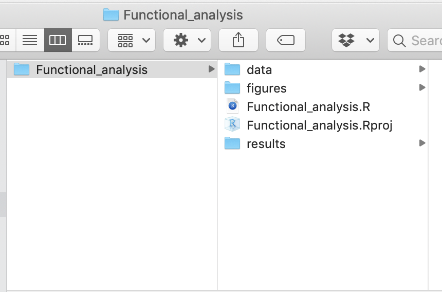
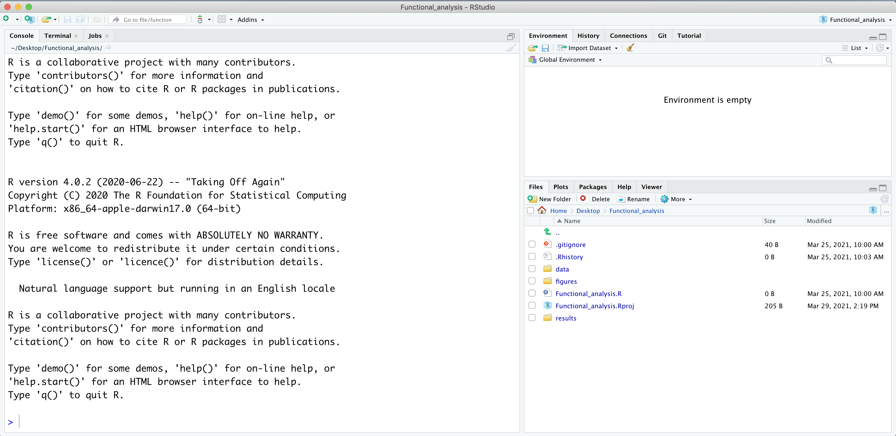

Approximate time: 15 minutes

## Set up

For this module, we will be working within an RStudio project. In order to follow along you will need to **download the R project**, if you haven't done so already. The project can be accessed using [this link](https://github.com/hbctraining/Training-modules/blob/master/data/Functional_analysis.zip?raw=true).

Once downloaded, you should see a file called `Functional_analysis.zip` on your computer (likely, in your Downloads folder). Unzipping this file will result in a folder of the same name. Move the folder to the location on your computer where you would like to perform the analysis.

Open up the folder. The contents will look like the screenshot below:



**Locate the `.Rproj file` and double-click on it.** This will open up RStudio with the "Functional_analysis" project loaded. 

An example of the **RStudio interface is shown below**. You will want to make sure that you have the directory structure (sub-directories and files) as shown in the screenshot below. 

Once you have reached this stage, you are ready to get started with the lessons!

<p align="center">

</p>

### Dataset

To interpret the results of our functional analysis, it is necessary to understand our dataset. We will be using the output from the differential expression analysis of a real RNA-Seq dataset that is part of a larger study described in [Kenny PJ et al, Cell Rep 2014](http://www.ncbi.nlm.nih.gov/pubmed/25464849). 

The goal of the study was to investigate the interactions between various genes involved in Fragile X syndrome, a disease in which there is aberrant production of the FMRP protein that results in cognitive impairment and autistic-like features.

> **FMRP** is “most commonly found in the brain and is essential for normal cognitive development and female reproductive function. Mutations of this gene can lead to fragile X syndrome, mental retardation, premature ovarian failure, autism, Parkinson's disease, developmental delays and other cognitive deficits.” - from [wikipedia](https://en.wikipedia.org/wiki/FMR1)

> **MOV10**, is a putative RNA helicase that is also associated with **FMRP** in the context of the microRNA pathway. 

**The hypothesis tested by [the paper](http://www.ncbi.nlm.nih.gov/pubmed/25464849) is that FMRP and MOV10 associate and regulate the translation of a subset of RNAs.**

<p align="center">

</p>

<cite>Illustration adapted from [Kenny PJ et al, Cell Rep 2014](http://www.ncbi.nlm.nih.gov/pubmed/25464849)</cite>

For today's workshop, we will be using the output of differential gene expression (DGE) analysis performed using the R package DESeq2 to identify differentially expressed genes between control and cells overexpressing Mov10. You should have downloaded the `Mov10oe_DE_results.csv` file with these results already.

### Reading in the data files

Let's read in the differential expression results file we have downloaded and call the new object `res_tableOE` (OE is for overexpression):

```r
## Load libraries
library(tidyverse)

## Read in differential expression results
res_tableOE <- read.csv("data/Mov10oe_DE_results.csv", row.names = 1)

## Create a tibble
res_tableOE_tb <- res_tableOE %>%
  rownames_to_column(var="gene") %>% 
  as_tibble()


```

### R package installation

We now need to install the R packages we will using for this workshop (if not already installed): 
 
```r
# Install CRAN packages
install.packages(c("BiocManager", "devtools", "tidyverse"))

# Install Bioconductor packages
BiocManager::install(c("clusterProfiler", "DOSE", "org.Hs.eg.db", "pathview", "AnnotationDbi", "EnsDb.Hsapiens.v75"))

# Optional for the lesson:
BiocManager::install(c("gProfileR", "treemap", "SPIA", "stephenturner/annotables"))
```

_**Note that these package names are case sensitive!**_


To check that a package installed successfully, load the library (without any error messages) using `library()`:

```r
## Load libraries
library(clusterProfiler)
library(DOSE)
library(org.Hs.eg.db)
library(pathview)
library(tidyverse)
library(AnnotationDbi)
library(EnsDb.Hsapiens.v75)

# Optional for the lesson
library(gProfileR)
library(treemap)
library(SPIA)
library(annotables)
```


