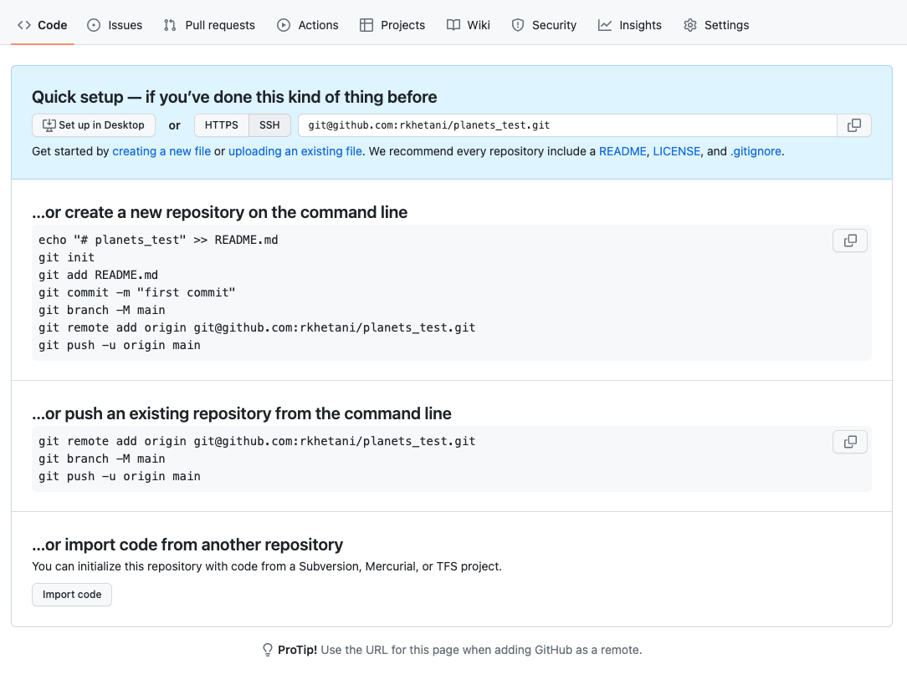

## Learning Objectives
*  Explain what remote repositories are and why they are useful.
*  Push to or pull from a remote repository.
*  Clone a remote repository.

## Introduction to Github

Version control really comes into its own
when we begin to collaborate with other people.
We already have most of the machinery we need to do this;
the only thing missing is to copy changes from one repository to another.

Systems like Git allow us to move work between any two repositories.
In practice, though, it's easiest to use one copy as a central hub, and to keep it on the web rather than on someone's laptop.
Most programmers use hosting services like 
[GitHub](http://github.com),
[BitBucket](http://bitbucket.org) or
[GitLab](http://gitlab.com/)
to hold those master copies

## 1. Create a *remote* repository

Let's start by sharing the changes we've made to our current project with the world.
Go to [Github](http://github.com), and create an account if you don't have one or log in to GitHub. Once you have logged in with your (new) credentials, click on the icon in the top right corner to create a new repository called `planets`:

Name your repository "planets" and then click "Create Repository":

As soon as the repository is created, GitHub displays a page with a URL and some information on how to configure your local repository:

This effectively does the following on GitHub's servers:

~~~ {.bash}
## DO NOT RUN
$ mkdir planets
$ cd planets
$ git init
~~~

Now that we have two repositories, we need a diagram like this:

Note that our local repository still contains our earlier work on `mars.txt`, but the remote repository on GitHub appears empty as it doesn't contain any files yet.

## 2. Connect local to remote repository

We need to connect the two repositories to **"sync"** them. We do this by making the GitHub repository a **"remote"** for the local repository. The home page of the repository on GitHub includes the URL string we need to identify it:

Click on the 'SSH' link to change the protocol from HTTPS to SSH.

> ### HTTPS vs. SSH
>
> We use SSH here because, while it requires some additional configuration, it is a security protocol widely used by many applications. The steps below describe SSH at a minimum level for GitHub. 

Copy that URL from the browser, go into the local `planets` repository, and run this command:

~~~ {.bash}
$ git remote add origin git@github.com:vlad/planets.git
~~~

Make sure to use the URL for your repository rather than Vlad's: the only difference should be your username instead of `vlad`.

`origin` is a local name used to refer to the remote repository. It could be called anything, but `origin` is a convention that is often used by default in git and GitHub, so it's helpful to stick with this unless there's a reason not to.

We can check that the command has worked by running `git remote -v`:

~~~ {.bash}
$ git remote -v
~~~

~~~ {.output}
origin   git@github.com:vlad/planets.git (fetch)
origin   git@github.com:vlad/planets.git (push)
~~~

We'll discuss remotes in more detail later in this session, while talking about how they might be used for collaboration.

## 3. SSH Background and Setup

Before we can connect to a remote repository, we need to set up a way for our computer to **authenticate with GitHub** so it knows that it is really us trying to connect (for security purposes).

We are going to set up the method that is commonly used by many different services to authenticate access on the command line.  This method is called **S**ecure **Sh**ell Protocol (SSH).  SSH is a cryptographic network protocol that allows secure communication between computers using an otherwise insecure network.  

SSH uses what is called a **key pair**. This is two keys that work together to validate access. One key is publicly known and called the public key, and the other key called the private key is kept private, as the names indicate. 

You can think of the public key as a padlock, and only you have the key (the private key) to open it. You use the public key where you want a secure method of communication, such as your GitHub account.  You give this padlock, or public key, to GitHub and say “lock the communications to my account with this so that only computers that have my private key can unlock communications and send git commands as my GitHub account.”  

What we will do now is the minimum required to set up the SSH keys and add the public key to a GitHub account.

The first thing we are going to do is check if this has already been done on the computer you’re on.  Because generally speaking, this setup only needs to happen once and then you can forget about it! 

> ### Keeping your keys secure
> You shouldn't really forget about your SSH keys, since they keep your account secure. It’s good practice to audit your secure shell keys every so often; especially, if you are using multiple computers to access your account.

We will run the list command to check what key pairs already exist on your computer.

~~~ {.bash}
$ ls -al ~/.ssh
~~~

Your output is going to look a little different depending on whether or not SSH has ever been set up on the computer you are using. 

Dracula has not set up SSH on his computer, so his output is 

~~~ {.output}
ls: cannot access '/c/Users/Vlad Dracula/.ssh': No such file or directory
~~~

If SSH has been set up on the computer you're using, the public and private key pairs will be listed. The file names are either `id_ed25519`/`id_ed25519.pub` or `id_rsa`/`id_rsa.pub` depending on how the key pairs were set up.  
Since they don’t exist on Dracula’s computer, he uses this command to create them. 

### 3.1 Create an SSH key pair
To create an SSH key pair Vlad uses this command, where the `-t` option specifies which type of algorithm to use and `-C` attaches a comment to the key (here, Vlad's email):  

~~~ {.bash}
$ ssh-keygen -t ed25519 -C "vlad@tran.sylvan.ia"
~~~

>> If you are using a legacy system that doesn't support the Ed25519 algorithm, use:
`$ ssh-keygen -t rsa -b 4096 -C "your_email@example.com"`

~~~ {.output}
Generating public/private ed25519 key pair.
Enter file in which to save the key (/c/Users/Vlad Dracula/.ssh/id_ed25519):
~~~

We want to use the default file, so just press <kbd>Enter</kbd>.

~~~ {.output}
Created directory '/c/Users/Vlad Dracula/.ssh'.
Enter passphrase (empty for no passphrase):
~~~

Now, it is prompting Dracula for a passphrase.  Since he is using his lab’s laptop that other people sometimes have access to, he wants to create a passphrase.  Be sure to use something memorable or save your passphrase somewhere, as **there is no "reset my password" option**. 

~~~ {.output}
Enter same passphrase again:
~~~

After entering the same passphrase a second time, we will receive the confirmation

~~~ {.output}
Your identification has been saved in /c/Users/Vlad Dracula/.ssh/id_ed25519
Your public key has been saved in /c/Users/Vlad Dracula/.ssh/id_ed25519.pub
The key fingerprint is:
SHA256:SMSPIStNyA00KPxuYu94KpZgRAYjgt9g4BA4kFy3g1o vlad@tran.sylvan.ia
The key's randomart image is:
+--[ED25519 256]--+
|^B== o.          |
|%*=.*.+          |
|+=.E =.+         |
| .=.+.o..        |
|....  . S        |
|.+ o             |
|+ =              |
|.o.o             |
|oo+.             |
+----[SHA256]-----+
~~~

The "identification" is actually the private key. You should never share it.  The public key is appropriately named.  The "key fingerprint" 
is a shorter version of a public key.

Now that we have generated the SSH keys, we will find the SSH files when we check.

~~~ {.bash}
$ ls -al ~/.ssh
~~~

~~~ {.output}
drwxr-xr-x 1 Vlad Dracula 197121   0 Jul 16 14:48 ./
drwxr-xr-x 1 Vlad Dracula 197121   0 Jul 16 14:48 ../
-rw-r--r-- 1 Vlad Dracula 197121 419 Jul 16 14:48 id_ed25519
-rw-r--r-- 1 Vlad Dracula 197121 106 Jul 16 14:48 id_ed25519.pub
~~~

### 3.2 Copy the public key to GitHub

Now we have a SSH key pair and we can run this command to check if GitHub can read our authentication.  

~~~ {.bash}
$ ssh -T git@github.com
~~~

~~~ {.output}
The authenticity of host 'github.com (192.30.255.112)' can't be established.
RSA key fingerprint is SHA256:nThbg6kXUpJWGl7E1IGOCspRomTxdCARLviKw6E5SY8.
This key is not known by any other names
Are you sure you want to continue connecting (yes/no/[fingerprint])? y
Please type 'yes', 'no' or the fingerprint: yes
Warning: Permanently added 'github.com' (RSA) to the list of known hosts.
git@github.com: Permission denied (publickey).
~~~

Right, we forgot that we need to give GitHub our public key!  

First, we need to copy the public key.  Be sure to include the `.pub` at the end, otherwise you’re looking at the private key. 

~~~ {.bash}
$ cat ~/.ssh/id_ed25519.pub
~~~

~~~ {.output}
ssh-ed25519 AAAAC3NzaC1lZDI1NTE5AAAAIDmRA3d51X0uu9wXek559gfn6UFNF69yZjChyBIU2qKI vlad@tran.sylvan.ia
~~~

Now, go to GitHub.com and do the following:

1. click on your profile icon in the top right corner to get the drop-down menu 
2. click "Settings" 
3. then on the settings page, click "SSH and GPG keys," on the left side "Account settings" menu.  
4. click the "New SSH key" button on the right side. 
5. now you can add the title (Dracula uses the title "Vlad's Lab Laptop" so he can remember where the original key pair files are located), paste your SSH key into the field
6. click the "Add SSH key" to complete the setup.

Now that we’ve set that up, let’s check our authentication again from the command line. 
~~~ {.bash}
$ ssh -T git@github.com
~~~

~~~ {.output}
Hi Vlad! You've successfully authenticated, but GitHub does not provide shell access.
~~~

Good! This output confirms that the SSH key works as intended. We are now ready to push our work to the remote repository.

## 4. Push local changes to a remote

Now that authentication is setup, we can return to the remote.  This command will push the changes from
our local repository to the repository on GitHub:

1. Copy the SSH URL from the planets repository online
2. `cd` into the local `planets` repository via your Terminal
3. Run the following command making sure to use the URL for your repository rather than Vlad's.

~~~ {.bash}
$ git remote add origin <SSH-URL-from-github>
~~~

We can check that the command has worked by running `git remote -v`:

~~~ {.bash}
$ git remote -v
~~~

~~~ {.output}
origin   https://github.com/vlad/planets.git (push)
origin   https://github.com/vlad/planets.git (fetch)
~~~

The name `origin` is a local nickname for your remote repository, we could use something else if we wanted to, but `origin` is by far the most common choice.

Once the nickname `origin` is set up, this command will push the changes from our local repository to the repository on GitHub:

~~~ {.bash}
$ git push origin master
~~~
~~~ {.output}
Counting objects: 9, done.
Delta compression using up to 4 threads.
Compressing objects: 100% (6/6), done.
Writing objects: 100% (9/9), 821 bytes, done.
Total 9 (delta 2), reused 0 (delta 0)
To https://github.com/vlad/planets
 * [new branch]      master -> master
Branch master set up to track remote branch master from origin.
~~~

This is what we have done so far to make sure that out local and remote repositories are in sync:

We can pull changes from the remote repository to the local one as well:

~~~ {.bash}
$ git pull origin master
~~~
~~~ {.output}
From https://github.com/vlad/planets
 * branch            master     -> FETCH_HEAD
Already up-to-date.
~~~

Pulling has no effect in this case
because the two repositories are already synchronized.
If someone else had pushed some changes to the repository on GitHub,
though,
this command would download them to our local repository.

***
**Exercises**

1. Browse to your `planets` repository on GitHub. Under the Code tab, find and click on the text that says "XX commits" (where "XX" is some number). Hover over and/or click on the three buttons to the right of each commit to explore what they point to; what information can you gather from these buttons?

2. In this lesson, we introduced the "git push" command. How is "git push" different from "git commit"?

***

*These materials were adapted from [Software Carpentry](https://swcarpentry.github.io/git-novice/), the Licensing information can be [found here](LICENSE_SWC_git_materials.md).*

***
