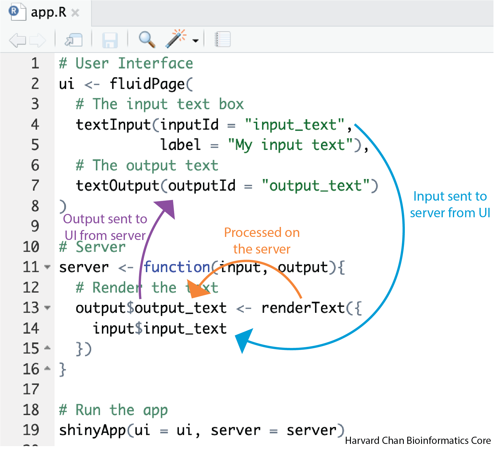

# Learning Objectives

In this lesson, you will:

- List applications for RShiny apps
- Explain the parts of an RShiny App
- Describe the flow of information through an RShiny App

# What is Shiny?

[Shiny](https://shiny.posit.co/) is a package available for both R and Python that allows the user to create a wide variety of interactive web applications (also known as apps). This workshop will focus on using Shiny within R. However, many of the principles from this workshop are applicable to Shiny on Python, but the syntax conforms to Python's syntax rules rather than R's. 

<p align="center">

</p>

Before we dig too far into the syntax or structure of an app, let's first look take a look at a [gallery of Shiny Apps that have been made by others](https://shiny.posit.co/r/gallery/).

As you can see, there are a wide array of use cases for apps made with Shiny.

---

## [**Exercise 1**](01_syntax_and_structure_shiny-Answer_key.md#exercise-1)

After browsing the [gallery of Shiny Apps that have been made by others](https://shiny.posit.co/r/gallery/), what apps do you think you could develop to analyze your own data?

---

# RShiny App Structure

Each Shiny App has 3 main components:

1. **User Interface (UI)** - This section outlines how the app will look and where items are placed. This is referred to as the _front-end_ of the app
2. **Server** - This section provides the instructions for how input data will be processed and returned by the app. This is referred to as the _back-end_ of the app
3. **shinyApp** - This is the line that ties the UI and the server together and launches the app

# Setup

Before we make our first app, let's get our RStudio environment set-up:

1. Open RStudio
2. On the top menu, click "**File**" and then "**New Project...**"
3. Select "**New Directory**"
4. Select "**New Project**"
5. Name your project "**Shiny_demo**" and then click "**Create Project**"

<p align="center">

</p>

6. On the top menu, click "**File**", then "**New File >**" and then "**R Script**"
7. Next, we want to save this R Script file, so on the top menu, click "**File**"  and then "**Save As...**"
8. Save the file as "**app.R**" then click "**Save**"

<p align="center">

</p>

At the top of the script add and run the command to load Shiny:

```
# Load libraries
library(shiny)
```

> It is very important when you go to host your apps on external platforms that the app is titled "**app.R**". Typically `app.R` will contain code for a single Shiny app, however for this workshop we will paste in multiple apps to demonstrate Shiny's capabilities. 

# Your first app

Let's go ahead and create an app to help demonstrate these components and how they tie together. Copy and paste this code into your Rscript, highlight all of the code then send the code to the console using <kbd>Ctrl</kbd> + <kbd>Enter/Return</kbd>:

```
# User Interface
ui <- fluidPage(
    # The input text box
    textInput(inputId = "input_text", 
              label = "My input text"),
    # The output text
    textOutput(outputId = "output_text")
)

# Server
server <- function(input, output){
    # Render the text
    output$output_text <- renderText({
        input$input_text
    })
}

# Run the app
shinyApp(ui = ui, server = server)
```

The app that returns should look like the one below:

<p align="center"><iframe src="https://hcbc.connect.hms.harvard.edu/input_text_demo/?showcase=0" width="300px" height="200px" data-external="1"> </iframe></p>

You can see that while your app is running the console will look something similar to:

```
Listening on http://127.0.0.1:4108
```

When you are running an app, your console will be unavailable. In order **to get your console back** you need to either **close the app or press the red stop sign** in the top right of the console. If you relaunch the app (by re-running the `shinyApp` function), you can view the app in a web browser by:

1. Clicking "Open in Browser" at the top of the the app window
2. Copy and paste the URL in your console after "Listening on" into the URL of your preferred web browser

## User Interface

Let's go line-by line and breakdown the code for the UI:

```
# DO NOT RUN
# User Interface
ui <- fluidPage(
  ...
)
```

The `fluidPage()` function is a common function used to develop UI layouts in Shiny and it is being assigned to the object `ui`. It is considered "fluid" because the page width adjust automatically. There is an alternative function for creating UI layouts called `fixedPage()`, which is similar to `fluidPage()`, except it used a fixed page width rather than a fluid page width. Most apps use a fluid approach in practice, so we will be using `fluidPage()`.

```
# DO NOT RUN
# The input text box
textInput(inputId = "input_text",
          label = "My input text"),
```

There are many types of input and output types in RShiny, we will discuss these types at length in the upcoming lessons. In this example, we are **creating a text input** using the `textInput()` function. There are two arguments:

1. The first argument, `inputId`, is the variable name for the user input to be stored to.
2. The second argument, `label`, is a character string representing the text which will be placed above the input text box.

Because this is the first line of code for the user interface, this input text box will appear at the top of the app.

```
# DO NOT RUN
# The output text
textOutput(outputId = "output_text")
```

The `textOuput()` function is telling the UI where to put the output text after it has been rendered by the server. We haven't seen where the variable `output_text` is created yet, but we will see it in the server section below. 

Importantly, each line at the same scope in the UI is separated by a comma.

> You'll frequently see Shiny functions written with just the arguments, like `textInput("input_text", "My input text")` or `textOutput("output_text")`. In this tutorial, we'll include explicit argument names (e.g., `inputId =`, `label =` and `outputId =`) to help make the code more readable and easier to follow as you're learning.


## Server

Now let's investigate the server side of the app:

```
# DO NOT RUN
# Server
server <- function(input, output){
  ...
  })
```

The server function is created with the variables `input` and `output` to hold the input and output of the app, respectively. 

> In addition to `input` and `output` arguments, you will sometimes see a `session` argument. The `session` argument is beyond the scope of this workshop, but it can help give you a more dynamic UI.

Inside the function we place the following code:

```
# DO NOT RUN 
    # Render the text
    output$output_text <- renderText({
        input$input_text
    })
```

Here, we are using the `renderText()` function to take the object from `textInput()` render it as output. We then take that rendering and assign it to `output$output_text` which ties back to the  `textOutput()` function we had in the UI section of code. 

> The `render[Type]()` family of functions are specific to the type of `[type]Output()`. We will talk about this more in upcoming lessons.

## Putting it all together 

Now that we've gone through each line, let's talk about what happens when we run the `shinyApp()` function to tie it all together. 

1. The input text is entered into the box created by `textInput()` and saved as `input$input_text`
2. This `input$input_text` object is sent to the server which sees that `input$input_text` is used to create the rendered text for `output$output_text`.
3. This `output$output_text` output is then sent back to the UI where it is displayed in the `textOutput()` fucntion

The diagram below illustrates how this works.

<p align="center">

</p>

Now that we have created our first Shiny app in R, we will explore various input and output options in the next lessons.

>Alternatively, you will sometimes see the UI and the server separated into a `ui.R` file, which contains the UI code, and a `server.R` file, which contains the server code. Like `app.R`, these files need to be named explicitly "**ui.R**" and "**server.R**" within your R project. Whichever convention you wish to follow is mostly a matter of preference.
>
>The only difference is that `app.R` does need to contain the `shinyApp()` function in the script, whereas `server.R`/`ui.R` does not contain the `shinyApp()` explicitly anywhere in the code.

---

## [**Exercise 2**](01_syntax_and_structure_shiny-Answer_key.md#exercise-2)

1. Name the three parts of an RShiny app and give a brief explanation of each part.

2. In the basic app that we created in this lesson:

```
# Load libraries
library(shiny)

# User Interface
ui <- fluidPage(
    # The input text box
    textInput(inputId = "input_text", 
              label = "My input text"),
    # The output text
    textOutput(outputId = "output_text")
)

# Server
server <- function(input, output){
    # Render the text
    output$output_text <- renderText({
        input$input_text
    })
}

# Run the app
shinyApp(ui = ui, server = server)
```

Describe what information `input$input_text` and `output$output_text` holds.

---

[Next Lesson >>](02_inputs.qmd)

[Back to Schedule](../README.md)
