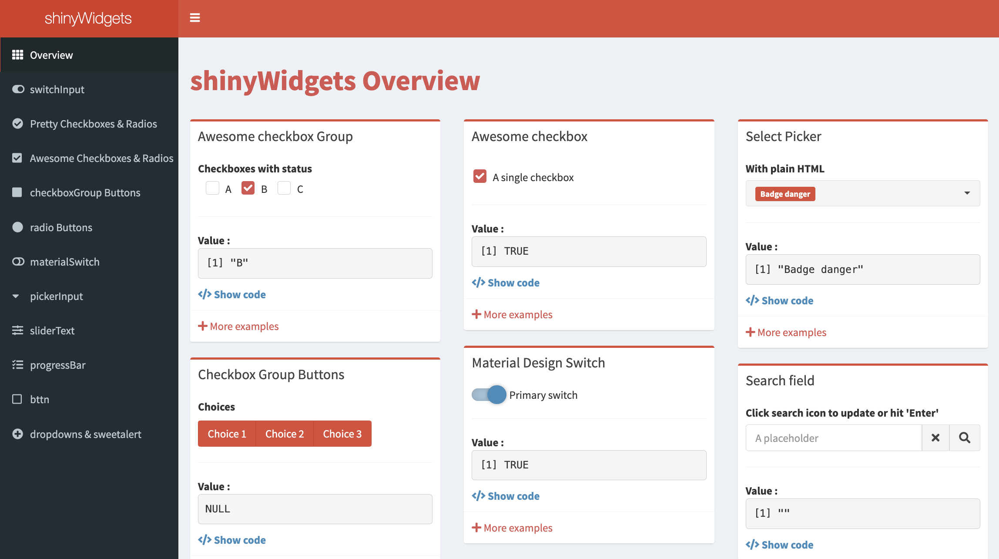

## Learning Objectives

In this lesson, you will:

- Create apps that accept a diverse array of Widget inputs
- Implement an action buttons within an app


# Widget options

In the previous lesson, we introduced using the `textInput()` function. This function is actually a type of widget and there are many widget inputs that exist. In this next section, we will explore some of these different input widgets.

## Text box

Similar to `textInput()`, `textAreaInput()` functions in many of the same ways, but instead of having a single line where you can enter text into, it allows for multi-line input. An example of the code you would use to do that is below:

```
library(shiny)

ui <- fluidPage(
  textAreaInput("input_text", "My input text"),
  textOutput("output_text")
)

server <- function(input, output) {
  output$output_text <- renderText({ 
    input$input_text 
    })
}

shinyApp(ui = ui, server = server)
```

This will render an app that looks like:

<p align="center"><iframe src="https://hcbc.connect.hms.harvard.edu/Input_text_area_demo/?showcase=0" width="300" height="175px" data-external="1"></iframe></p>


> Note: If you want to maintain new line character you could use `verbatimTextOutput()` rather than `textOutput()`. `verbatimTextOutput()` will treat the text output exactly like it is entered without any formatting.

If you would like to have some text appear by default in your app's text area input, you can change:

```
textAreaInput("input_text", "My input text")
```

to add a third argument:

```
  textAreaInput("input_text", "My input text", "Write about anything you like here...")
```

Adding this in creates that default text to appear in the box, giving the user an example. 

## Sliding range 

Sliders inputs are a great way to provide an interactive range for the user to select a value from. Below we will have the example code that one can use to create a slider:

```
library(shiny)

ui <- fluidPage(
  sliderInput("input_slider", "My input slider", min = 0, max = 10, value = 6),
  textOutput("output_text")
)

server <- function(input, output) {
  output$output_text <- renderText({ 
    input$input_slider
    })
}

shinyApp(ui = ui, server = server)
```

This app would visualize like:


<p align="center"><iframe src="https://hcbc.connect.hms.harvard.edu/Input_slider_demo/?showcase=0" width="300" height="175px" data-external="1"></iframe></p>

Note that the only line we changed was the `textAreaInput()` line to `sliderInput()`. The `renderText()` function has no issues handling integer or character data types. We also provided arguments to specify the minimum and maximum values and the `value` we would like the slider to sit at by default. There are some additional `sliderInput()` arguments provided in the table below:

| Argument | Description |  Example  |
|----------|-------------|-----------|
| step | This can define the step size of the slider rather than using the default step size | `step = 2` |
| pre | Allows you to add text _prior_ the value in the slider | `pre = "Sample_"` |
| post | Allows you to add text _after_ the value in the slider | `post = "kg"` |
| ticks | Allows you toggle tick marks on/off | `ticks = FALSE` |
| dragRange | Allows you to create a range with your slider. You will likely want to change `value` to be a vector containing the default start and stop of this range like `value = c(2,6)` | `dragRange = TRUE` |


## Dropdown 

Oftentimes when you are working with input data, you would like to select some of your data from a list of options. One way of doing this is to have a dropdown list of options and `selectInput()` is the function you would use to accomplish this. For this function, the additonal argument is `choices`, used to specify all the options in the dropdown.

```
library(shiny)

ui <- fluidPage(
  selectInput("input_select", "My favorite game", choices = c("Pick a game" = "", "Catan", "Carcassonne", "Caverna", "Twillight Imperium")),
  textOutput("output_text")
)

server <- function(input, output) {
  output$output_text <- renderText({ 
    input$input_select
    })
}

shinyApp(ui = ui, server = server)
```
<p align="center"><iframe src="https://hcbc.connect.hms.harvard.edu/Input_select_demo/?showcase=0" width="300" height="200px" data-external="1"></iframe></p>


> **NOTE:** Within the choices argument, you can see that we made a placeholder value in the first position, `"Pick a game" = ""`, and this visualizes as the default placeholder. Otherwise, the placeholder will default to the first element in the choice vector.

Some additional arguments for `selectInput()` are provided below:

| Argument | Description |  Example  |
|----------|-------------|-----------|
| multiple | Allows you to select multiple option from the selection dropdown menu | `multiple = TRUE` |
| selected | Allows you to define the default selection, otherwise the default selection will be the first item in the list, unless the `multiple` arugment is `TRUE`, then it will default to no selection | `selected = "Twillight Imperium"` |

> Note that you can alternatively use `selectizeInput()` instead of `selectInput()` to have more control over the dropdown. While this is outside of the scope of this lesson, the documentation foir this can be found [here](https://selectize.dev/docs/usage).


## Radio buttons

If you would like your user to be able to toggle between various options, then radio buttons might an an option that you are interested in. Below we have an example code for radio buttons:

```
library(shiny)

ui <- fluidPage(
  radioButtons("radio_button_input", "My favorite ice cream", choices = c("Vanilla", "Chocolate", "Strawberry", "Mint Chocolate Chip")),
  textOutput("output_text")
)

server <- function(input, output) {
  output$output_text <- renderText({ 
    input$radio_button_input
  })
}

shinyApp(ui = ui, server = server)
```

This would visualize like:

<p align="center"><iframe src="https://hcbc.connect.hms.harvard.edu/Input_radio_button_demo/?showcase=0" width="300" height="175px" data-external="1"></iframe></p>

| Argument | Description |  Example  |
|----------|-------------|-----------|
| inline | Allows you to display the radio buttons horizontally rather than vertically | `inline = TRUE` |
| selected | Allows you to define the default selection, otherwise the default selection will be the first item in the list | `selected = "Strawberry"` |  

> **NOTE:** that you can set `selected` to be `selected = character(0)` and no initial option will be selected, but the documentation recommends against this since users will not be able to return back to this default state.

## Checkboxes

The are **two styles** of checkboxes that you can choose from. A single checkbox (`checkboxInput()`) that will return the values of `TRUE` and `FALSE` and also a group of checkboxes (`checkboxGroupInput()`) where you can select multiple items from. 

### checkboxInput

If we want a single checkbox to toggle then we can use `checkboxInput()`. An example is below:

```
library(shiny)

ui <- fluidPage(
  checkboxInput("checkbox_input", "Apply Benjamini–Hochberg correction", value = TRUE),
  textOutput("output_text")
)

server <- function(input, output) {
  output$output_text <- renderText({ 
    input$checkbox_input
  })
}

shinyApp(ui = ui, server = server)
```

<p align="center"><iframe src="https://hcbc.connect.hms.harvard.edu/Input_checkbox_demo/?showcase=0" width="200" height="175px" data-external="1"></iframe></p>

| Argument | Description |  Example  |
|----------|-------------|-----------|
| value | Allows you set the default to be equal to `TRUE` or `FALSE` | `value = TRUE` |


### checkboxGroupInput

Similar to radio buttons, Shiny apps can provide checkboxes for users to utilize. Let's look at an example code for this:

```
library(shiny)

ui <- fluidPage(
  checkboxGroupInput("checkbox_input", "Which fruits do you like?", choices = c("Orange", "Strawberry", "Apple", "Pinnapple")),
  textOutput("output_text")
)

server <- function(input, output) {
  output$output_text <- renderText({ 
    input$checkbox_input
  })
}

shinyApp(ui = ui, server = server)
```

<p align="center"><iframe src="https://hcbc.connect.hms.harvard.edu/Input_checkbox_group_demo/?showcase=0" width="300" height="175px" data-external="1"></iframe></p>

| Argument | Description |  Example  |
|----------|-------------|-----------|
| inline | Allows you to display the checkboxes horizontally rather than vertically | `inline = TRUE` |
| selected | Allows you to define the default selection, otherwise the default selection will be nothing checked. You can also have multiple selected options by putting the selected options in a vector | `selected = "Strawberry"` or  `selected = c("Strawberry", "Pinnapple")`|  

## Dates

The widget for dates allows you to select a specific date from a dropdown calendar. There are two functions that allow you to do this:

1. `dateInput()`: Selecting a single date 
2. `dateRangeInput()`: Selecting a range of dates

### Single date

When selecting a single date from a calendar, we can use the `dateInput()` function. An example is below:

```
library(shiny)

ui <- fluidPage(
  dateInput("date_input", "When is this project due?"),
  textOutput("output_text")
)

server <- function(input, output) {
  output$output_text <- renderText({ 
    as.character(input$date_input)
  })
}

shinyApp(ui = ui, server = server)
```

> **NOTE:** We have had to add the `as.character()` function around `input$date_input` otherwise it will return the number of days because of the Unix Epoch (https://en.wikipedia.org/wiki/Unix_time).

<p align="center"><iframe src="https://hcbc.connect.hms.harvard.edu/Input_date_demo/?showcase=0" width="400px" height="325px" data-external="1"></iframe></p>

| Argument | Description |  Example  |
|----------|-------------|-----------|
| value | Allows you to set the default day to open the calendar on. If not set, then it will default to the current day in yyyy-mm-dd format |  value = "2024-07-24"|
| min | Allows you to set _earliest_ date that can be selected | `min = "2024-07-20"` |
| max | Allows you to set _latest_ date that can be selected | `max = "2024-07-28"` |
| weekstart | Allows you to select which day of the week the calendar should start on with Sunday being 0 and incrementing to Saturday being 6 | `weekstart = 1` |
| language | Allows you to set the language for the calendar | `language = "de"` |
| daysofweekdisabled | Allows you to make certain days of the week unavailible for selection with Sunday being 0 and incrementing to Saturday being 6. You can also make a vector of values to block out multiple days of the week. | `daysofweekdisabled = c(0,6)` |

### Date Range

You can also collect a date range using Shiny. An example of this is below:

```
library(shiny)

ui <- fluidPage(
  dateRangeInput("date_input", "When is your vacation?"),
  textOutput("output_text")
)

server <- function(input, output) {
  output$output_text <- renderText({ 
    as.character(input$date_input)
  })
}

shinyApp(ui = ui, server = server)
```

This would look like:

<p align="center"><iframe src="https://hcbc.connect.hms.harvard.edu/Input_date_range_demo/?showcase=0" width="500px" height="325px" data-external="1"></iframe></p>

The same addtional arguments apply here.

***

**Exercise**

1. In this exercise, you will use the widget options presented above and the associate code to create your own RShiny app! It will take the input from a select dropdown, radio button and slider and return the product of the values. Feel free to play with the app below to help model the way your app should look.

***

## Conditional Panel

Suppose you want some input appearing to be conditional on another input's value. This is a good place to utilize the `conditionalPanel()` function. The general syntax for using `conditionalPanel()` is:

```
conditionalPanel(
  condition = "input.<variable_name> == '<value>'",
  <what_to_appear_if_the_condition_is_true>
)
```

Below is an example of using the `conditionalPanel()`. In this example, the user selects 'Yes' or 'No', and if they select 'Yes' they are prompted to select from a list of courses that they have taken. If they select 'No', there is nothing further.

```
library(shiny)

ui <- fluidPage(
  selectInput("select_input", "Have you taken a Current Topics in Bioinformatics module with us before?", choices = c("Please Answer" = "", "Yes", "No")),
  conditionalPanel(
    condition = "input.select_input == 'Yes'",
    selectInput("select_courses", "Which courses have you taken?", choices = c("R Basics", "Shell basics", "Advanced shell"), multiple = TRUE)
  ),
  textOutput("courses")
)

server <- function(input, output) {
   output$courses <- renderText({ 
     input$select_courses
   })
}

shinyApp(ui = ui, server = server)
```

> **NOTE:** When using boolean values the '<value>' is 0 for `FALSE` and 1 for `TRUE`. Entering the character values TRUE or FALSE for the value will not work.

<p align="center"><iframe src="https://hcbc.connect.hms.harvard.edu/Conditional_panel_demo/?showcase=0" width="300" height="250px" data-external="1"></iframe></p>

## Required Input

We may have situation in which the app _requires_ input in order for folowing code to be evaluated. We can actually see an example of this in the previous app. If you still have the previous app still open, select "Yes", then select a course of your choosing. Next, change the input to "No". You'll see that the course selections we've made are still present!


If we didn't want this type of contradiction (i.e if they select "No" then there should not be any course selections present), then one way that we could **resolve this is with the use of the `req()` function**. 


Let's look at an example of the `req()`. On the UI side, nothing has really changed. On the server side we have placed `req()` inside the `renderText()` which tells Shiny that we are **_req_**uiring `input$select_input` to be equal to "Yes" in order to have the `input$select_courses` text rendered.

```
library(shiny)

ui <- fluidPage(
  selectInput("select_input", "Have you taken a Current Topics in Bioinformatics module with us before?", choices = c("Please Answer" = "", "Yes", "No")),
  conditionalPanel(
    condition = "input.select_input == 'Yes'",
    selectInput("select_courses", "Which courses have you taken?", choices = c("R Basics", "Shell basics", "Advanced shell"), multiple = TRUE)
  ),
  textOutput("courses")
)

server <- function(input, output) {
   output$courses <- renderText({ 
     req(input$select_input == "Yes")
     input$select_courses
   })
}

shinyApp(ui = ui, server = server)
```


Test out the app with the "Yes" and "No" options and see how it differs from before!

<p align="center"><iframe src="https://hcbc.connect.hms.harvard.edu/Conditional_panel_demo_2/?showcase=0" width="300" height="250px" data-external="1"></iframe></p>


## shinyWidgets

We have only scratched the surface of widgets for RShiny! There is so much more you can do, and we encourage you to delve deeper and explore added functionality.

Also, to enhance the widget inputs, [shinyWidgets](https://github.com/dreamRs/shinyWidgets) is an R package that you can install that give you even more stylistic options for your Shiny app. The gallery of widget input that you can create using shinyWidgets can be found [here](https://shinyapps.dreamrs.fr/shinyWidgets/). A useful part of the gallery is that each widget input displayed has a `</> Show code` section that gives you the code needed to create the widget input on the UI side.

<p align="center">

</p>

***

[Next Lesson >>](03_visuals.md)

[Back to Schedule](..)

*** 

*This lesson has been developed by members of the teaching team at the [Harvard Chan Bioinformatics Core (HBC)](http://bioinformatics.sph.harvard.edu/). These are open access materials distributed under the terms of the [Creative Commons Attribution license](https://creativecommons.org/licenses/by/4.0/) (CC BY 4.0), which permits unrestricted use, distribution, and reproduction in any medium, provided the original author and source are credited.*
