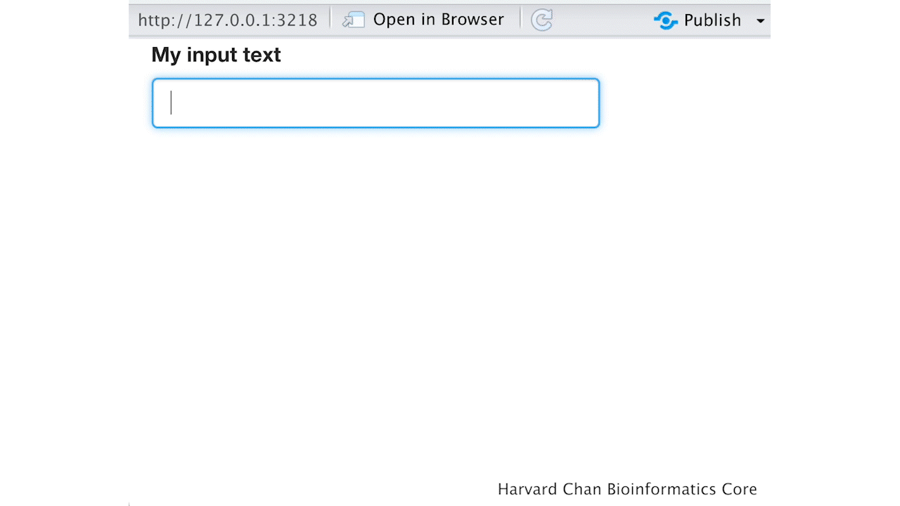

# Learning Objectives

In this lesson, you will:

- Create apps that accept a diverse array of inputs
- Differentiate between Observe and Reactive family of functions 
- Implement an action buttons within an app

# 

Let's create your first R Shiny app! In this app we are going to have R shiny return text that you type into a text box. It will look like:

<p align="center">

</p>

Let's put this below below into our R Script and run it:

```
library(shiny)

ui <- fluidPage(
    textInput("input_text", "My input text"),
    textOutput("output_text")
)

server <- function(input, output){
    output$output_text <- renderText({
        input$input_text
    })
}

shinyApp(ui = ui, server = server)
```

A window should pop-up and allow you to enter text that is returned below the input field. Let's spend some time discussing how this code is being processed. The UI uses having two functions `textInput()` and `textOutput()`. Notably, `textInput()` is before `textOutput()`, which is why it is rendered above `textOutput()`


<p align="center">

</p>


Input options

Text
Checkboxes
Slider
RadioButtons
Date
Observe vs. Reactive
Action Buttons
Req
Isolate?
