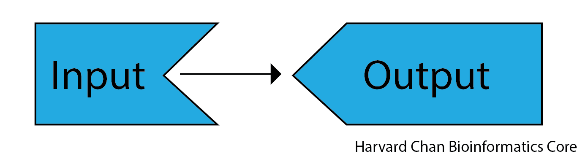
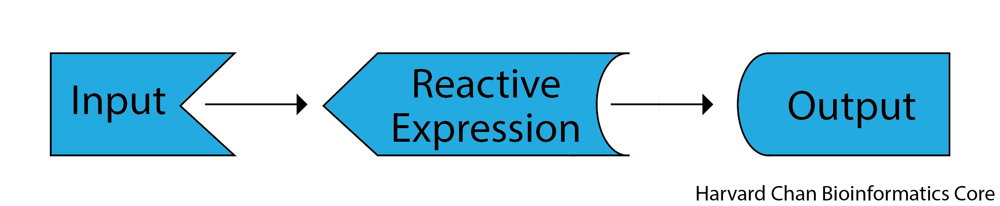
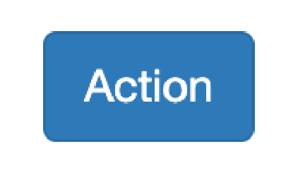
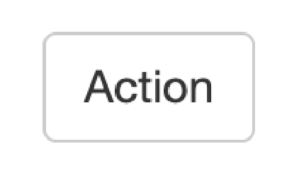
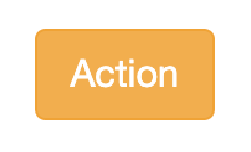
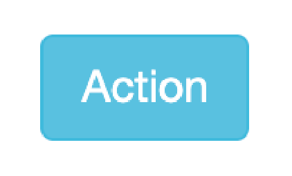
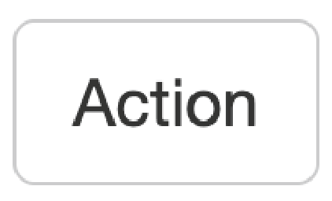
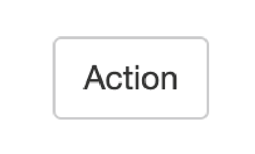
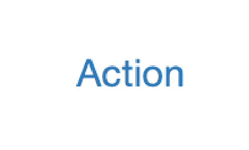
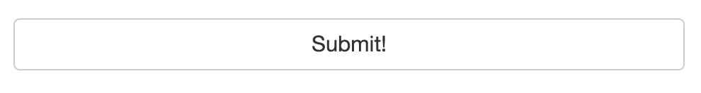

# Learning Objectives

In this lesson, you will:

- Create apps that accept a diverse array of Widget inputs
- Implement an action buttons within an app


# Widget options

In the previous lesson, we introduced using the `textInput()` as type of wdiget. Hoever, there are many widget inputs that exist. In this next section, we will explore some of these different input widgets.

## textAreaInput()

Similar to `textInput()`, `textAreaInput()` functions in many of the same ways, but instead of have a single line where you can enter text into, you will get a text box that allows for multi-line input. An example of the code you would use to do that is below:

```
library(shiny)

ui <- fluidPage(
  textAreaInput("input_text", "My input text"),
  textOutput("output_text")
)

server <- function(input, output) {
  output$output_text <- renderText({ 
    input$input_text 
    })
}

shinyApp(ui = ui, server = server)
```

This will render an app that looks like:

<p align="center"><iframe src="https://hcbc.connect.hms.harvard.edu/Input_text_area_demo/?showcase=0" width="300" height="175px" data-external="1"></iframe></p>


> Note: If you want to maintain new line character you could use `verbatimTextOutput()` rather than `textOutput()`. `verbatimTextOutput()` will treat the text output exactly like it is entered without any formatting.

If you would like to have there be default text in your app's text area input, you can change:

```
textAreaInput("input_text", "My input text")
```

To:

```
textAreaInput("input_text", "My input text", "My Default text")
```

Adding this third parameter `"My Default text"` creates that default text and also works with `textInput()` in the same way.

## sliderInput

Sliders inputs are a great way to provide an interactive range for the user to select a value from. Below we will have the example code that one can use to create a slider:

```
library(shiny)

ui <- fluidPage(
  sliderInput("input_slider", "My input slider", min = 0, max = 10, value = 6),
  textOutput("output_text")
)

server <- function(input, output) {
  output$output_text <- renderText({ 
    input$input_slider
    })
}

shinyApp(ui = ui, server = server)
```

This app would visualize like:

<p align="center"><iframe src="https://hcbc.connect.hms.harvard.edu/Input_slider_demo/?showcase=0" width="300" height="150px" data-external="1" </iframe></p>

Note that the only line we changed was the `textAreaInput()` line to `sliderInput()`. We can see that the `renderText()` function has no issues handling integer or character data types. Above we have provided the minimum number of input arguments for `sliderInput()`. However, there are some interesting arguments that you can also add to your slider in the table below:

| Argument | Description |  Example  |
|----------|-------------|-----------|
| step | This can define the step size of the slider rather than using the default step size | `step = 2` |
| pre | Allows you to add text _prior_ the value in the slider | `pre = "Sample_"` |
| post | Allows you to add text _after_ the value in the slider | `post = "kg"` |
| ticks | Allows you toggle tick marks on/off | `ticks = FALSE` |
| dragRange | Allows you to create a range with your slider. You will likely want to change `value` to be a vector containing the default start and stop of this range like `value = c(2,6)` | `dragRange = TRUE` |


## selectInput

Oftentimes when you are working with input data, you would like to select some of your data from a list of options. One way of doing this is to have a dropdown list of options and `selectInput()` is the function you would use to accomplish this. 

```
library(shiny)

ui <- fluidPage(
  selectInput("input_select", "My favorite game", choices = c("Pick a game" = "", "Catan", "Carcassonne", "Caverna", "Twillight Imperium")),
  textOutput("output_text")
)

server <- function(input, output) {
  output$output_text <- renderText({ 
    input$input_select
    })
}

shinyApp(ui = ui, server = server)
```
<p align="center"><iframe src="https://hcbc.connect.hms.harvard.edu/Input_select_demo/?showcase=0" width="300" height="200px" data-external="1"></iframe></p>


> Within the choices argument, you can see that we made a placeholder value in the first position, `"Pick a game" = ""`, and this visualizes as the default placeholder. Otherwise, the placeholder will default to the first element in the choice vector.

| Argument | Description |  Example  |
|----------|-------------|-----------|
| multiple | Allows you to select multiple option from the selection dropdown menu | `multiple = TRUE` |
| selected | Allows you to define the default selection, otherwise the default selection will be the first item in the list, unless the `multiple` arugment is `TRUE`, then it will default to no selection | `selected = "Twillight Imperium"` |

> Note that you can alternatively use `selectizeInput()` instead of `selectInput()` to have more control over the dropdown. While this is outside of the scope of this lesson, the documentation foir this can be found [here](https://selectize.dev/docs/usage).


## Radio buttons

If you would like your user to be able to toggle between various options, then radio buttons might an an option that you are interested in. Below we have an example code for radio buttons:

```
library(shiny)

ui <- fluidPage(
  radioButtons("radio_button_input", "My favorite ice cream", choices = c("Vanilla", "Chocolate", "Strawberry", "Mint Chocolate Chip")),
  textOutput("output_text")
)

server <- function(input, output) {
  output$output_text <- renderText({ 
    input$radio_button_input
  })
}

shinyApp(ui = ui, server = server)
```

This would visualize like:

<p align="center"><iframe src="https://hcbc.connect.hms.harvard.edu/Input_radio_button_demo/?showcase=0" width="300" height="175px" data-external="1"></iframe></p>

| Argument | Description |  Example  |
|----------|-------------|-----------|
| inline | Allows you to display the radio buttons horizontally rather than vertically | `inline = TRUE` |
| selected | Allows you to define the default selection, otherwise the default selection will be the first item in the list | `selected = "Strawberry"` |  

> Note that you can set `selected` to be `selected = character(0)` and no initial option will be selected, but the documentation recommends against this since users will not be able to return back to this default state.

## Checkboxes

The are two styles of checkboxes that you can choose from. A single checkbox (`checkboxInput()`) that will return the values of `TRUE` and `FALSE` and also a group of checkboxes (`checkboxGroupInput()`) where you can select multiple items from. 

### checkboxInput

If we want a single checkbox to toggle then we can use `checkboxInput()`. An example is below:

```
library(shiny)

ui <- fluidPage(
  checkboxInput("checkbox_input", "Apply Benjamini–Hochberg correction", value = TRUE),
  textOutput("output_text")
)

server <- function(input, output) {
  output$output_text <- renderText({ 
    input$checkbox_input
  })
}

shinyApp(ui = ui, server = server)
```

<p align="center"><iframe src="https://hcbc.connect.hms.harvard.edu/Input_checkbox_demo/?showcase=0" width="300" height="175px" data-external="1"></iframe></p>

| Argument | Description |  Example  |
|----------|-------------|-----------|
| value | Allows you set the default to be equal to `TRUE` or `FALSE` | `value = TRUE` |


### checkboxGroupInput

Similar to radio buttons, Shiny apps can provide checkboxes for users to utilize. Let's look at an example code for this:

```
library(shiny)

ui <- fluidPage(
  checkboxGroupInput("checkbox_input", "Which fruits do you like?", choices = c("Orange", "Strawberry", "Apple", "Pinnapple")),
  textOutput("output_text")
)

server <- function(input, output) {
  output$output_text <- renderText({ 
    input$checkbox_input
  })
}

shinyApp(ui = ui, server = server)
```

<p align="center"><iframe src="https://hcbc.connect.hms.harvard.edu/Input_checkbox_group_demo/?showcase=0" width="300" height="175px" data-external="1"></iframe></p>

| Argument | Description |  Example  |
|----------|-------------|-----------|
| inline | Allows you to display the checkboxes horizontally rather than vertically | `inline = TRUE` |
| selected | Allows you to define the default selection, otherwise the default selection will be nothing checked. You can also have multiple selected options by putting the selected options in a vector | `selected = "Strawberry"` or  `selected = c("Strawberry", "Pinnapple")`|  

## Dates

Within selecting dates, you have two choices:

1) Selecting a single date 
2) Selecting a range of dates

### Single date

When selecting a single date from a calendar, we can use the `dateInput()` function. An example is below:

```
library(shiny)

ui <- fluidPage(
  dateInput("date_input", "When is this project due?"),
  textOutput("output_text")
)

server <- function(input, output) {
  output$output_text <- renderText({ 
    as.character(input$date_input)
  })
}

shinyApp(ui = ui, server = server)
```

> Note that we have had to add the `as.character()` function around `input$date_input` otherwise it will return the number of days since the Unix Epoch (https://en.wikipedia.org/wiki/Unix_time).

<p align="center"><iframe src="https://hcbc.connect.hms.harvard.edu/Input_date_demo/?showcase=0" width="400px" height="325px" data-external="1"></iframe></p>

| Argument | Description |  Example  |
|----------|-------------|-----------|
| value | Allows you to set the default day to open the calendar on. If not set, then it will default to the current day in yyyy-mm-dd format |  value = "2024-07-24"|
| min | Allows you to set _earliest_ date that can be selected | `min = "2024-07-20"` |
| max | Allows you to set _latest_ date that can be selected | `max = "2024-07-28"` |
| weekstart | Allows you to select which day of the week the calendar should start on with Sunday being 0 and incrementing to Saturday being 6 | `weekstart = 1` |
| language | Allows you to set the language for the calendar | `language = "de"` |
| daysofweekdisabled | Allows you to make certain days of the week unavailible for selection with Sunday being 0 and incrementing to Saturday being 6. You can also make a vector of values to block out multiple days of the week. | `daysofweekdisabled = c(0,6)` |

### Date Range

You can also collect a date range using Shiny. An example of this is below:

```
library(shiny)

ui <- fluidPage(
  dateRangeInput("date_input", "When is your vacation?"),
  textOutput("output_text")
)

server <- function(input, output) {
  output$output_text <- renderText({ 
    as.character(input$date_input)
  })
}

shinyApp(ui = ui, server = server)
```

This would look like:

<p align="center"><iframe src="https://hcbc.connect.hms.harvard.edu/Input_date_range_demo/?showcase=0" width="500px" height="325px" data-external="1"></iframe></p>

| Argument | Description |  Example  |
|----------|-------------|-----------|
| start | Allows you to set the default _starting_ day to open the calendar on. If not set, then it will default to the current day in yyyy-mm-dd format |  `value = "2024-07-24"` |
| end | Allows you to set the default _ending_ day to open the calendar on. If not set, then it will default to the current day in yyyy-mm-dd format |  `value = "2024-07-29"` |
| min | Allows you to set _earliest_ date that can be selected | `min = "2024-07-20"` |
| max | Allows you to set _latest_ date that can be selected | `max = "2024-07-28"` |
| weekstart | Allows you to select which day of the week the calendar should start on with Sunday being 0 and incrementing to Saturday being 6 | `weekstart = 1` |
| language | Allows you to set the language for the calendar | `language = "de"` |
| daysofweekdisabled | Allows you to make certain days of the week unavailible for selection with Sunday being 0 and incrementing to Saturday being 6. You can also make a vector of values to block out multiple days of the week. | `daysofweekdisabled = c(0,6)` |

## Exercise

In this exercise, you will attempt to recrete the following app. It will take the input from a select dropdown, radio button and slider and return the product of the values. Feel free to play with the app below to help model the way your app should look.

# Conditional Panel

It is not uncommon that you might run into a case where you want some input appearing to be conditional on another input's value. This is a good place to utilize the `conditionalPanel()` function. The general syntax for using `conditionalPanel()` is:

```
conditionalPanel(
  condition = "input.<variable_name> == '<value>'",
  <what_to_appear_if_the_condition_is_true>
)
```

> When using boolean values the `'<value>'` is `0` for `FALSE` and `1` for `TRUE`. Entering `TRUE` or `FALSE` for the value will not work.

Below is an example of using the `conditionalPanel()`:

```
library(shiny)

ui <- fluidPage(
  selectInput("select_input", "Have you taken a Current Topics in Bioinformatics module with us before?", choices = c("Please Answer" = "", "Yes", "No")),
  conditionalPanel(
    condition = "input.select_input == 'Yes'",
    selectInput("select_courses", "Which courses have you taken?", choices = c("R Basics", "Shell basics", "Advanced shell"), multiple = TRUE)
  ),
  textOutput("courses")
)

server <- function(input, output) {
   output$courses <- renderText({ 
     input$select_courses
   })
}

shinyApp(ui = ui, server = server)
```

<p align="center"><iframe src="https://hcbc.connect.hms.harvard.edu/Conditional_panel_demo/?showcase=0" width="300" height="250px" data-external="1"></iframe></p>

## Req

Let's imagine now that we have data that _requires_ input in order to be evaluated. We can actually see this in the previous app. With the previous app still open, select "Yes", then select a course of your choosing. Next, change the input to "No". You'll see that the course selections we've made are still present. If we didn't want this type of contradiction, then one way that we could resolve this is with the use of the `req()` function. Let's look at an example of the `req()`:

```
library(shiny)

ui <- fluidPage(
  selectInput("select_input", "Have you taken a Current Topics in Bioinformatics module with us before?", choices = c("Please Answer" = "", "Yes", "No")),
  conditionalPanel(
    condition = "input.select_input == 'Yes'",
    selectInput("select_courses", "Which courses have you taken?", choices = c("R Basics", "Shell basics", "Advanced shell"), multiple = TRUE)
  ),
  textOutput("courses")
)

server <- function(input, output) {
   output$courses <- renderText({ 
     req(input$select_input == "Yes")
     input$select_courses
   })
}

shinyApp(ui = ui, server = server)
```

We added:

```
req(input$select_input == "Yes")
```

Which tells Shiny that we are **_req_**uiring `input$select_input` to be equal to "Yes" in order to have the `input$select_courses` text rendered. This app would look like:


<p align="center"><iframe src="https://hcbc.connect.hms.harvard.edu/Conditional_panel_demo_2/?showcase=0" width="300" height="250px" data-external="1"></iframe></p>

## Reactive Expressions

Previously, we have seen the case of input being used to directly create outputs. However, there is third tool in the Shiny toolkit and it is called reactive expressions. Reactive expressions are useful because they take inputs and produce outputs and they cache, or store, their output. This can be very useful for three reasons:

1) When a step is present multiple times in your code and this step that is either computationally intensive or requires interacting with outside databases, Shiny will only need to carry out the task once rather than each time the process is called since the output will be cached for future uses
2) It makes your code cleaner because you only need to maintain the code for a repetitive step in a single place
3) They are needed to use action buttons (discussed in the next section)

Below we see relationship between input and output that we have seen up to this point:

<p align="center">

</p>

As we see once we add a reactive expression, it functions as a intermediary between inputs and outputs. 

<p align="center">

</p>

When we use a reactive expression, we will wrap it within a `reactive()` function. We will use a `reactive()` function in the next section when we use an action button.

> Note: You can also have multiple reactive expressions that connect to each other in between inputs and outputs. 

## Action buttons

Action buttons allow the user to tell Shiny to carry out a given function. This can be helpful when you have a computationally heavy task where you don't want R to be trying to carry out the computation for each input value as you drag a a slider across its scale. Rather you'd only like for outputs to be computed when you have all of your input parameters set. The syntax for using an action button looks like:

On the UI side:
```
actionButton("inputID", "Label")
```

On the Server side:
```
reactive_expression_with_action_button <- bindEvent(reactive(
    <reactive_expression>
  ), input$<action_button_inputID>)
```

The `actionButton("inputID", "Label")` line creates our action button in the UI, while `bindEvent(reactive(<reactive_expression>), input$<action_button_inputID>)` wraps a reactive expression within the `bindEvent()` function on the server side. Alternatively, you may see in other's code using a pipe (from the tidyverse package), but this is equivalent code to what is listed above:

On the UI side:
```
actionButton("inputID", "Label")
```

On the server side:
```
reactive_expression_with_action_button <- reactive(
    <reactive_expression>
  ) >%>
  bindEvent(input$<action_button_inputID>)
```

Below is some example code on how we could implement this:

```
library(shiny)

ui <- fluidPage(
  sliderInput("slider_input_1", "Select a number", value = 5, min = 1, max = 10),
  sliderInput("slider_input_2", "Select a number", value = 5, min = 1, max = 10),
  actionButton("calculate", "Multiply!"),
  textOutput("product")
)

server <- function(input, output) {
  multiply <- bindEvent(reactive(
    input$slider_input_1 * input$slider_input_2
  ), input$calculate)
  output$product <- renderText({ 
    multiply()
  })
}

shinyApp(ui = ui, server = server)
```

This app would visualize like:

<p align="center"><iframe src="https://hcbc.connect.hms.harvard.edu/Input_action_button_demo/?showcase=0" width="400px" height="300px" data-external="1"></iframe></p>

A wide variety of action button styles exist by adding the `class` argument to your `actionButton()` function. Such as:

```
actionButton("inputID", "Label", class = "btn-primary")
```


<table>
  <tr>
    <th>Clas</th>
    <th>Description</th>
    <th>Example Code</th>
    <th>Example</th>
  </tr>
  <tr>
    <td>btn-primary</td>
    <td>Default dark blue button</td>
    <td><code>class = "btn-primary"</code></td>
    <td><p align="center"></p></td>
  </tr>
  <tr>
    <td>btn-default /  <br/>btn-secondary</td>
    <td>Creates a white button</td>
    <td><code>class = "btn-default"</code> / <br/><code>class = "btn-secondary"</code></td>
    <td><p align="center"></p></td>
  </tr>
  <tr>
    <td>btn-warning</td>
    <td>Creates an orange button</td>
    <td><code>class = "btn-warning"</code></td>
    <td><p align="center"></p></td>
  </tr>
  <tr>
    <td>btn-danger</td>
    <td>Creates a red button</td>
    <td><code>class = "btn-danger"</code></td>
    <td><p align="center"></p></td>
  </tr>
  <tr>
    <td>btn-info</td>
    <td>Creates a light blue button</td>
    <td><code>class = "btn-info"</code></td>
    <td><p align="center"></p></td>
  </tr>
  <tr>
    <td>btn-lg</td>
    <td>Creates a larger button</td>
    <td><code>class = "btn-lg"</code></td>
    <td><p align="center"></p></td>
  </tr>
  <tr>
    <td>btn-sm</td>
    <td>Creates a smaller button</td>
    <td><code>class = "btn-sm"</code></td>
    <td><p align="center"></p></td>
  </tr>
  <tr>
    <td>btn-link</td>
    <td>Creates a hyperlink-style button</td>
    <td><code>class = "btn-link"</code></td>
    <td><p align="center"></p></td>
  </tr>
  <tr>
    <td>btn-block</td>
    <td>Creates a button the width of the page</td>
    <td><code>class = "btn-block"</code></td>
    <td></td>
</table>

> Note: You can have multiple classes for a given action button as long as each class is separated by a space. For example, if you wanted a large, dark blue action button that goes across the entire browser, then you could use: `class = "btn-primary btn-lg btn-block"`. However, whichever non-white color you put last in your list of classes will be the color of the button.

> Note: `bindEvent()` is a newer function and it replaces functions like `observeEvent()` and `eventReactive()` when coupled with `observe()` and `reactive()` function, respectively. It is recommended to use `bindEvent()` moving forward as it is more flexible, but you may still run across code that utilizes `observeEvent()` and `eventReactive()`. 

## Isolate

In Shiny, you may find that you will want to limit the reactivity as we did in the previous example. However, you might want only partial reactivity and this is where the `isolate()` feature can be quite helpful. You can create a non=-reactive scope around an expression using `isolate`. The syntax for using `isolate()` is:

```
isolate(<non_reactive_expression>)
```

We can create a similar app to the one above but edit the code to use isolate. In this example, we will see that the first slider is completely reactive, however the second slider is only reacts once the action button has been clicked:

```
library(shiny)

ui <- fluidPage(
  sliderInput("slider_input_1", "Select a number", value = 5, min = 1, max = 10),
  sliderInput("slider_input_2", "Select a number", value = 5, min = 1, max = 10),
  actionButton("calculate", "Multiply!"),
  textOutput("product")
)

server <- function(input, output) {
  output$product <- renderText({
    input$calculate
    input$slider_input_1 * isolate(input$slider_input_2)
  })
}

shinyApp(ui = ui, server = server)
```

This app would look like:

<p align="center"><iframe src="https://hcbc.connect.hms.harvard.edu/Input_isolate_demo/?showcase=0" width="400px" height="300px" data-external="1"></iframe></p>


> Note: If we had used `isolate(input$slider_input_1 * input$slider_input_2)` instead of `input$slider_input_1 * isolate(input$slider_input_2)`, then this app would function similarly to the app from the previous section since there are now two sliders' widget inputs are within the `isolate()` function.

# Exercise

Create an app that asks the user Yes or No if they know any programming languages. If they do, provide a handful of progrmaming languages in a checkbox group. Once the user has made their selection, allow to hit an action put to display the languages that they selected. The app should look like:

<p align="center"><iframe src="https://hcbc.connect.hms.harvard.edu/Input_exercise_2//?showcase=0" width="400px" height="300px" data-external="1"></iframe></p>

```
library(shiny)

ui <- fluidPage(
  radioButtons("radio_button_input", "Do you know any programming languages?", choices = c("No", "Yes")),
   conditionalPanel(
     condition = "input.radio_button_input == 'Yes'",
    checkboxGroupInput("checkbox_group_language_input", "Which programming languages do you know?", choices = c("R", "Perl", "Python", "Ruby", "C++"), inline = TRUE),
  ),
  actionButton("languages_action_button", "Submit!", class = "btn-primary"),
  textOutput("languages")
)

server <- function(input, output) {
  output$languages <- renderText({
    input$languages_action_button
    isolate(input$checkbox_group_language_input)
  })
}

shinyApp(ui = ui, server = server)
```

# shinyWidgets

[shinyWidgets](https://github.com/dreamRs/shinyWidgets) is an R package that you can install that give you even more stylistic options you have when choosing widget inputs for your Shiny app. The gallery of widget input that you can create using shinyWidgets can be found [here](https://shinyapps.dreamrs.fr/shinyWidgets/). A useful part of the gallery is that each widget input displayed has a `</> Show code` section that gives you the code needed to create the widget input on the UI side.

<p align="center">

</p>


