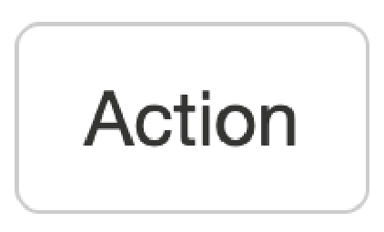

## Reactive Expressions

Previously, we have seen the case of input being used to directly create outputs. However, there is third tool in the Shiny toolkit and it is called reactive expressions. Reactive expressions are useful because they take inputs and produce outputs and they cache, or store, their output. This can be very useful for three reasons:

1) When a step is present multiple times in your code and this step that is either computationally intensive or requires interacting with outside databases, Shiny will only need to carry out the task once rather than each time the process is called since the output will be cached for future uses
2) It makes your code cleaner because you only need to maintain the code for a repetitive step in a single place
3) They are needed to use action buttons (discussed in the next section)

Below we see relationship between input and output that we have seen up to this point:

<p align="center">

</p>

As we see once we add a reactive expression, it functions as a intermediary between inputs and outputs. 

<p align="center">

</p>

When we use a reactive expression, we will wrap it within a `reactive()` function. We will use a `reactive()` function in the next section when we use an action button.

> Note: You can also have multiple reactive expressions that connect to each other in between inputs and outputs. 

## Action buttons

Action buttons allow the user to tell Shiny to carry out a given function. This can be helpful when you have a computationally heavy task where you don't want R to be trying to carry out the computation for each input value as you drag a a slider across its scale. Rather you'd only like for outputs to be computed when you have all of your input parameters set. The syntax for using an action button looks like:

On the UI side:
```
actionButton("inputID", "Label")
```

On the Server side:
```
reactive_expression_with_action_button <- bindEvent(reactive(
    <reactive_expression>
  ), input$<action_button_inputID>)
```

The `actionButton("inputID", "Label")` line creates our action button in the UI, while `bindEvent(reactive(<reactive_expression>), input$<action_button_inputID>)` wraps a reactive expression within the `bindEvent()` function on the server side. Alternatively, you may see in other's code using a pipe (from the tidyverse package), but this is equivalent code to what is listed above:

On the UI side:
```
actionButton("inputID", "Label")
```

On the server side:
```
reactive_expression_with_action_button <- reactive(
    <reactive_expression>
  ) >%>
  bindEvent(input$<action_button_inputID>)
```

Below is some example code on how we could implement this:

```
library(shiny)

ui <- fluidPage(
  sliderInput("slider_input_1", "Select a number", value = 5, min = 1, max = 10),
  sliderInput("slider_input_2", "Select a number", value = 5, min = 1, max = 10),
  actionButton("calculate", "Multiply!"),
  textOutput("product")
)

server <- function(input, output) {
  multiply <- bindEvent(reactive(
    input$slider_input_1 * input$slider_input_2
  ), input$calculate)
  output$product <- renderText({ 
    multiply()
  })
}

shinyApp(ui = ui, server = server)
```

This app would visualize like:

<p align="center"><iframe src="https://hcbc.connect.hms.harvard.edu/Input_action_button_demo/?showcase=0" width="400px" height="300px" data-external="1"></iframe></p>

A wide variety of action button styles exist by adding the `class` argument to your `actionButton()` function. Such as:

```
actionButton("inputID", "Label", class = "btn-primary")
```


<table>
  <tr>
    <th>Clas</th>
    <th>Description</th>
    <th>Example Code</th>
    <th>Example</th>
  </tr>
  <tr>
    <td>btn-primary</td>
    <td>Creates a dark blue button</td>
    <td><code>class = "btn-primary"</code></td>
    <td><p align="center"></p></td>
  </tr>
  <tr>
    <td>btn-default /  <br/>btn-secondary</td>
    <td>Creates a white button</td>
    <td><code>class = "btn-default"</code> / <br/><code>class = "btn-secondary"</code></td>
    <td><p align="center"></p></td>
  </tr>
  <tr>
    <td>btn-warning</td>
    <td>Creates an orange button</td>
    <td><code>class = "btn-warning"</code></td>
    <td><p align="center"></p></td>
  </tr>
  <tr>
    <td>btn-danger</td>
    <td>Creates a red button</td>
    <td><code>class = "btn-danger"</code></td>
    <td><p align="center"></p></td>
  </tr>
  <tr>
    <td>btn-info</td>
    <td>Creates a light blue button</td>
    <td><code>class = "btn-info"</code></td>
    <td><p align="center"></p></td>
  </tr>
  <tr>
    <td>btn-lg</td>
    <td>Creates a larger button</td>
    <td><code>class = "btn-lg"</code></td>
    <td><p align="center"></p></td>
  </tr>
  <tr>
    <td>btn-sm</td>
    <td>Creates a smaller button</td>
    <td><code>class = "btn-sm"</code></td>
    <td><p align="center"></p></td>
  </tr>
  <tr>
    <td>btn-link</td>
    <td>Creates a hyperlink-style button</td>
    <td><code>class = "btn-link"</code></td>
    <td><p align="center"></p></td>
  </tr>
  <tr>
    <td>btn-block</td>
    <td>Creates a button the width of the page</td>
    <td><code>class = "btn-block"</code></td>
    <td></td>
  </tr>
</table>

> Note: You can have multiple classes for a given action button as long as each class is separated by a space. For example, if you wanted a large, dark blue action button that goes across the entire browser, then you could use: `class = "btn-primary btn-lg btn-block"`. However, whichever non-white color you put last in your list of classes will be the color of the button.

> Note: `bindEvent()` is a newer function and it replaces functions like `observeEvent()` and `eventReactive()` when coupled with `observe()` and `reactive()` function, respectively. It is recommended to use `bindEvent()` moving forward as it is more flexible, but you may still run across code that utilizes `observeEvent()` and `eventReactive()`. 

## Isolate

In Shiny, you may find that you will want to limit the reactivity as we did in the previous example. However, you might want only partial reactivity and this is where the `isolate()` feature can be quite helpful. You can create a non=-reactive scope around an expression using `isolate`. The syntax for using `isolate()` is:

```
isolate(<non_reactive_expression>)
```

We can create a similar app to the one above but edit the code to use isolate. In this example, we will see that the first slider is completely reactive, however the second slider is only reacts once the action button has been clicked:

```
library(shiny)

ui <- fluidPage(
  sliderInput("slider_input_1", "Select a number", value = 5, min = 1, max = 10),
  sliderInput("slider_input_2", "Select a number", value = 5, min = 1, max = 10),
  actionButton("calculate", "Multiply!"),
  textOutput("product")
)

server <- function(input, output) {
  output$product <- renderText({
    input$calculate
    input$slider_input_1 * isolate(input$slider_input_2)
  })
}

shinyApp(ui = ui, server = server)
```

This app would look like:

<p align="center"><iframe src="https://hcbc.connect.hms.harvard.edu/Input_isolate_demo/?showcase=0" width="400px" height="300px" data-external="1"></iframe></p>


> Note: If we had used `isolate(input$slider_input_1 * input$slider_input_2)` instead of `input$slider_input_1 * isolate(input$slider_input_2)`, then this app would function similarly to the app from the previous section since there are now two sliders' widget inputs are within the `isolate()` function.

# Exercise

Create an app that asks the user Yes or No if they know any programming languages. If they do, provide a handful of progrmaming languages in a checkbox group. Once the user has made their selection, allow to hit an action put to display the languages that they selected. The app should look like:

<p align="center"><iframe src="https://hcbc.connect.hms.harvard.edu/Input_exercise_2//?showcase=0" width="400px" height="300px" data-external="1"></iframe></p>

```
library(shiny)

ui <- fluidPage(
  radioButtons("radio_button_input", "Do you know any programming languages?", choices = c("No", "Yes")),
   conditionalPanel(
     condition = "input.radio_button_input == 'Yes'",
    checkboxGroupInput("checkbox_group_language_input", "Which programming languages do you know?", choices = c("R", "Perl", "Python", "Ruby", "C++"), inline = TRUE),
  ),
  actionButton("languages_action_button", "Submit!", class = "btn-primary"),
  textOutput("languages")
)

server <- function(input, output) {
  output$languages <- renderText({
    input$languages_action_button
    isolate(input$checkbox_group_language_input)
  })
}

shinyApp(ui = ui, server = server)
```
