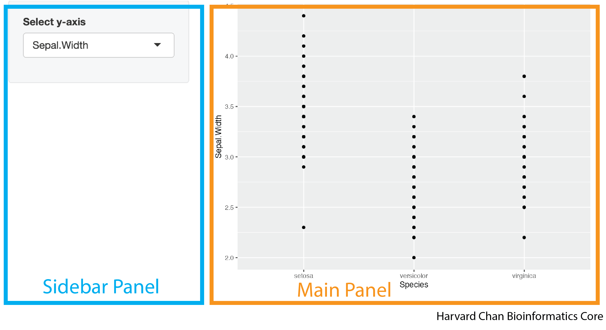

# Learning Objectives
In this lesson, you will:
- Implement sidebars into your Shiny app
- Create tabsets
- Implement different shinythemes

# Introduction 

Until now most of our work has focused on server side implementations of concepts. We have discussed the UI components required to carry the tasks that we want, but we haven't discussed how we want to arrange them. This section will almost exclusively focus on the UI and how to arrange and organize the components of the UI into a visually appealing app.

# Sidebars

It is common in many apps to have the user defined input control on a sidebar to the left and the rendered plots and tables on the right. In the image below we have highlighted what a sidepanel and mainpanel might like in a Shiny App. 

<p align="center"></p>

Creating this structure within a Shiny app utilizes the `sidebarLayout()` function. The `sidebarLayout()` function in your UI defines that this region of your app is using a sidebar panel defined by `sidebarPanel()` and a main panel defined by `mainPanel()`. The `sidebarPanel()` and `mainPanel()` function are nested inside of your `sidebarLayout()`. Let's look at the syntax for how to implement this:

```
ui <- fluidPage(
  sidebarLayout(
    sidebarPanel(
      <objects_in_your_sidebar_panel>
    ),
    mainPanel(
      <objects_in_your_main_panel>
    )
  )
)
```

A sample app demoing this syntax would look like:

```
library(shiny)
library(ggplot2)

ui <- fluidPage(
  sidebarLayout(
    sidebarPanel(
      selectInput("y_axis_input", "Select y-axis", choices = c("Sepal.Length", "Sepal.Width", "Petal.Length", "Petal.Width"))
    ),
    mainPanel(
      plotOutput("plot")
    )
  )
)

server <- function(input, output) {
  output$plot <- renderPlot({
    ggplot(iris) +
      geom_point(aes(x = Species, y = .data[[input$y_axis_input]]))
  })
}

shinyApp(ui = ui, server = server)
```

This app would look like:

<p align="center"><iframe src="https://hcbc.connect.hms.harvard.edu/Sidepanel_demo/?showcase=0" width="300" height="175px" data-external="1"></iframe>

# Adding a title

You may want your app to have a title. You can add this with the `titlePanel()` function. The syntax for doing this looks like:

```
titlePanel("<title_of_your_app>")
```

The default behavior of `titlePanel()` is to left-align the title. If you would like center your title you will need to use an `h1()` function within your `titlePanel()` function. The `h1()` function is borrowed from HTML nonmenclature and refers to the largest sized header. The smallest sized header in HTML is `h6()` and the values in between `h1()` and `h6()` (`h2()`, `h3()`, `h4()`, `h5()`) span the range of sizes between `h1()` and `h6()`. Within the `h[1-6]()` family of function, there is an `align` argument that accepts the (`"left"`, `"center"`, and `"right"`) for the alignment. So a center aligned title could looke like:

```
titlePanel(
  h1("<title_of_your_app>", align = "center")
)
```

We can add this title to our previous app:

```
library(shiny)
library(ggplot2)

ui <- fluidPage(
  titlePanel(
    h1("My iris Shiny App", align = "center")
  ),
  sidebarLayout(
    sidebarPanel(
      selectInput("y_axis_input", "Select y-axis", choices = c("Sepal.Length", "Sepal.Width", "Petal.Length", "Petal.Width"))
    ),
    mainPanel(
      plotOutput("plot")
    )
  )
)

server <- function(input, output) {
  output$plot <- renderPlot({
    ggplot(iris) +
      geom_point(aes(x = Species, y = .data[[input$y_axis_input]]))
  })
}

shinyApp(ui = ui, server = server)
```

This app would now look like:

<p align="center"><iframe src="https://hcbc.connect.hms.harvard.edu/Title_panel_demo/?showcase=0" width="300" height="175px" data-external="1"></iframe>

# Creating columns

We have shown how to use the `sidebarLayout()` function, but we may want to have multiple columns in our data and the `sidebarLayout()` function can't help to much with that. Fortunately, there is the `fluidRow()` function that allows us to divide up the row into columns using the `column()` function nested within it. The first argument within the `column()` function defines the width of the column and the sum of all of the widths of a column for a given `fluidRow()` function should sum to 12. An example of this syntax would be:

```
fluidRow(
  column(<width_of_first_column>,
    <objects_in_first_column>
  ),
  column(<width_of_second_column>,
    <objects_in_second_column>
  )
```

We could make equally sized columns in our app like:

```
library(shiny)
library(ggplot2)

ui <- fluidPage(
  titlePanel(
    h1("My iris Shiny App", align = "center")
  ),
  fluidRow(
    column(6,
      h3("First column"),
      selectInput("y_axis_input", "Select y-axis", choices = c("Sepal.Length", "Sepal.Width", "Petal.Length", "Petal.Width"))
    ),
    column(6,
      h3("Second column"),
      plotOutput("plot")
    )
  )
)

server <- function(input, output) {
  output$plot <- renderPlot({
    ggplot(iris) +
      geom_point(aes(x = Species, y = .data[[input$y_axis_input]]))
  })
}

shinyApp(ui = ui, server = server)
```

This app would look like:

<p align="center"><iframe src="https://hcbc.connect.hms.harvard.edu/Fluid_row_demo/?showcase=0" width="300" height="175px" data-external="1"></iframe>

## Nesting columns

You can also nest `fluidRow()` functions within the `column()` function of another `fluidRow()` function. Once again, the important rule when using `fluidRow()` is that the sum of the `column()`'s width value within *each* `fluidRow()` sums to 12. Let's take a look at some example syntax of how this would look:

```
  fluidRow(
    column(<width_of_first_main_column>,
      fluidRow(
        column(<width_of_first_subcolumn_of_the_first_main_column>,
          <objects_in_first_column_first_subcolumn>
        ),
        column(<width_of_second_subcolumn_of_the_first_main_column>,
          <objects_in_first_column_second_subcolumn>
        )
      )
    ),
    column(<width_of_second_main_column>,
      <objects_in_second_column>
    )
  )
)
```

We can apply these principles to our app:

```
library(shiny)
library(ggplot2)

ui <- fluidPage(
  titlePanel(
    h1("My iris Shiny App", align = "center")
  ),
  fluidRow(
    column(7,
      fluidRow(
        column(6,
        h3("First column: First subcolumn"),
        selectInput("x_axis_input", "Select x-axis", choices = c("Sepal.Length", "Sepal.Width", "Petal.Length", "Petal.Width"))
        ),
        column(6,
        h3("First column: Second subcolumn"),
        selectInput("y_axis_input", "Select y-axis", choices = c("Sepal.Length", "Sepal.Width", "Petal.Length", "Petal.Width"))
        )
      )
    ),
    column(5,
      h3("Second column"),
      plotOutput("plot")
    )
  )
)

server <- function(input, output) {
  output$plot <- renderPlot({
    ggplot(iris) +
      geom_point(aes(x = .data[[input$x_axis_input]], y = .data[[input$y_axis_input]]))
  })
}

shinyApp(ui = ui, server = server)
```

This app would look like:

<p align="center"><iframe src="https://hcbc.connect.hms.harvard.edu/Fluid_row_nested_demo/?showcase=0" width="300" height="175px" data-external="1"></iframe>

## Multiple Rows

## Thematic Breaks

# Topics to still be written up

fluid row, tabset, hr, navbar, shiny themes
