## Learning Objectives

In this lesson, you will:

- Implement reactive expressions
- Create action buttons for a Shiny app
- Read data into your Shiny app
- Download a data table and plot from Shiny app

## Reactive Expressions

Previously, we have seen the case of input being used to directly create outputs. However, there is another tool in the Shiny toolkit and it is called reactive expressions. Reactive expressions are useful because they take inputs and produce outputs and they cache, or store, their output. This can be very useful for three reasons:

1. When a step is present multiple times in your code and this step that is either computationally intensive or requires interacting with outside databases, Shiny will only need to carry out the task once rather than each time the process is called since the output will be cached for future uses

2. It makes your code cleaner because you only need to maintain the code for a previously repetitive step in a single place

3. They are needed to use action buttons (discussed later in this section)

Below we see relationship between input and output that we have seen up to this point:

<p align="center">
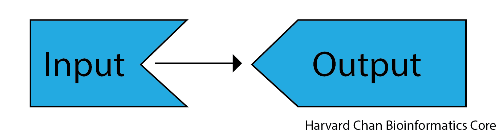
</p>

As we see once we add a reactive expression, it functions as a intermediary between inputs and outputs. 

<p align="center">
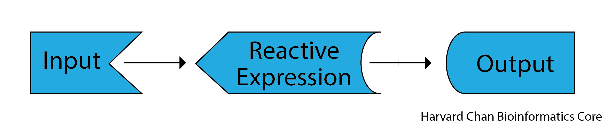
</p>

When we use a reactive expression, we will wrap it within a `reactive()` function and using a `reactive()` function will be critical for using an action button.

>You can also have multiple reactive expressions that connect to each other in between inputs and outputs. 

## Action Buttons

Action buttons allow the user to tell Shiny when to process information. This can be helpful when you have a computationally heavy task where you don't want R to be trying to carry out the computation for each input value as you drag a slider across its scale. Rather you'd only like for outputs to be computed when you have all of your input parameters set. The syntax for using an action button looks like:

On the UI side:
```
# DO NOT RUN
actionButton(inputId = "inputID", 
             label = "Label")
```

On the Server side:

```
# DO NOT RUN
reactive_expression_with_action_button <- bindEvent(reactive(
    <reactive_expression>
  ), input$<action_button_inputID>)
```

The `actionButton(inputId = "inputID", label = "Label")` line creates our action button in the UI, while `bindEvent(reactive(<reactive_expression>), input$<action_button_inputID>)` wraps a reactive expression within the `bindEvent()` function on the server side. Alternatively, you may see in others' code using a pipe (see below), but this is equivalent code to what is listed above:

On the UI side:

```
# DO NOT RUN
actionButton(inputId = "inputID",
             label = "Label")
```

On the server side:

```
# DO NOT RUN
reactive_expression_with_action_button <- reactive(
    <reactive_expression>
  ) %>%
  bindEvent(input$<action_button_inputID>)
```

>In the above action button example with the pipe, we would need to load `magrittr` in order to gain the pipe functionality. Alternatively, you could load `tidyverse`, which contains many useful functions including packages like like `ggplot2`, `dplyr` and `magrittr`. However, when you go to upload the app to a hosting website, it will take much longer to upload if you use `tidyverse` because it needs to install all of the packages that are part of `tidyverse` rather than just the ones you are using. For that reason, it can sometimes be nice to limit the scope of the packages you need when creating an app that will at some point go to a hosting platform.

Below is example code on how we could implement this:

```
# Load libraries
library(shiny)

# User interface
ui <- fluidPage(
    # Slider for the user to select a number between 1 and 10
    sliderInput(inputId = "slider_input_1",
                label = "Select a number",
                value = 5,
                min = 1,
                max = 10),
    # Slider for the user to select a number between 1 and 10
    sliderInput(inputId = "slider_input_2",
                label = "Select a number",
                value = 5,
                min = 1,
                max = 10),
    # Action button to tell Shiny to evaluate the multiplication when it is clicked
    actionButton(inputId = "calculate",
                 label = "Multiply!"),
    # The text output
    textOutput(outputId = "product")
)

# Server
server <- function(input, output) {
    # Create a reactive expression that responds to a mouse clicking the action button
    multiply <- bindEvent(reactive(
        input$slider_input_1 * input$slider_input_2
    ), input$calculate)
    # Render the reactive expression as text
    output$product <- renderText({ 
        multiply()
    })
}

# Run the app
shinyApp(ui = ui, server = server)
```

This app would visualize like:

<p align="center"><iframe src="https://hcbc.connect.hms.harvard.edu/Input_action_button_demo/?showcase=0" width="400px" height="300px" data-external="1"></iframe></p>

A wide variety of action button classes exist by adding the `class` argument to your `actionButton()` function. Such as:

```
# DO NOT RUN
actionButton(inputId = "inputID",
             label = "Label",
             class = "btn-primary")
```

<details>
<summary><b>Click here if you would like to see a table of available action button styles</b></summary>
<table>
  <tr>
    <th>Class</th>
    <th>Description</th>
    <th>Example Code</th>
    <th>Example</th>
  </tr>
  <tr>
    <td>btn-primary</td>
    <td>Creates a dark blue button</td>
    <td><code>class = "btn-primary"</code></td>
    <td><p align="center">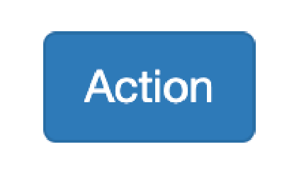</p></td>
  </tr>
  <tr>
    <td>btn-default /  <br/>btn-secondary</td>
    <td>Creates a white button</td>
    <td><code>class = "btn-default"</code> / <br/><code>class = "btn-secondary"</code></td>
    <td><p align="center">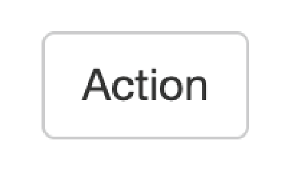</p></td>
  </tr>
  <tr>
    <td>btn-warning</td>
    <td>Creates an orange button</td>
    <td><code>class = "btn-warning"</code></td>
    <td><p align="center">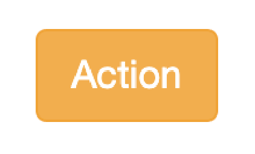</p></td>
  </tr>
  <tr>
    <td>btn-danger</td>
    <td>Creates a red button</td>
    <td><code>class = "btn-danger"</code></td>
    <td><p align="center">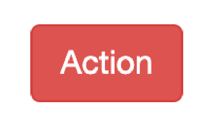</p></td>
  </tr>
  <tr>
    <td>btn-info</td>
    <td>Creates a light blue button</td>
    <td><code>class = "btn-info"</code></td>
    <td><p align="center">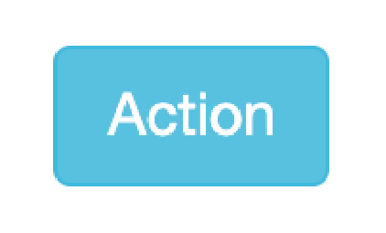</p></td>
  </tr>
  <tr>
    <td>btn-lg</td>
    <td>Creates a larger button</td>
    <td><code>class = "btn-lg"</code></td>
    <td><p align="center">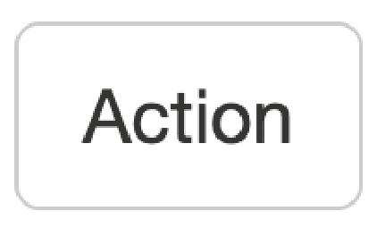</p></td>
  </tr>
  <tr>
    <td>btn-sm</td>
    <td>Creates a smaller button</td>
    <td><code>class = "btn-sm"</code></td>
    <td><p align="center">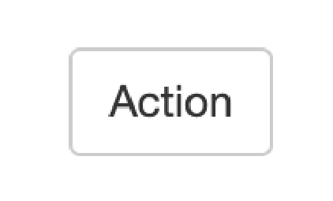</p></td>
  </tr>
  <tr>
    <td>btn-link</td>
    <td>Creates a hyperlink-style button</td>
    <td><code>class = "btn-link"</code></td>
    <td><p align="center">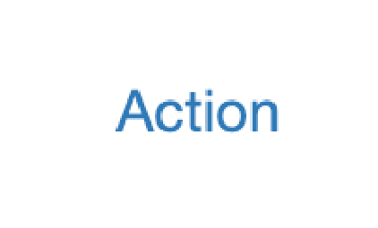</p></td>
  </tr>
  <tr>
    <td>btn-block</td>
    <td>Creates a button the width of the page</td>
    <td><code>class = "btn-block"</code></td>
    <td>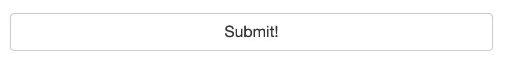</td>
  </tr>
</table>
</details>

>You can have multiple classes for a given action button as long as each class is separated by a space. For example, if you wanted a large, dark blue action button that goes across the entire browser, then you could use: `class = "btn-primary btn-lg btn-block"`. However, whichever non-white color you put last in your list of classes will be the color of the button.
>
>If you want to edit the button more than combining classes, it is recommended that you consider editing the CSS file.

>`bindEvent()` is a newer function and when coupled with `observe()` and `reactive()` functions, it replaces `observeEvent()` and `eventReactive()` functions, respectively. It is recommended to use `bindEvent()` moving forward as it is more flexible, but you may still run across code that utilizes `observeEvent()` and `eventReactive()`. 

## Isolate

In Shiny, you may find that you will want to limit the reactivity. For example, you might want only partial reactivity and this is where the `isolate()` feature can be quite helpful. You can create a non-reactive scope around an expression using `isolate`. The syntax for using `isolate()` is:

```
# DO NOT RUN
isolate(<non_reactive_expression>)
```

We can create a similar app to the one above but edit the code to use `isolate()`. In this example, we will see that the first slider is completely reactive, however the second slider is only reacts once the action button has been clicked:

```
# Load libraries
library(shiny)

# User interface
ui <- fluidPage(
    # Slider for the user to select a number between 1 and 10
    sliderInput(inputId = "slider_input_1",
                label = "Select a number",
                value = 5,
                min = 1,
                max = 10),
    # Slider for the user to select a number between 1 and 10
    sliderInput(inputId = "slider_input_2",
                label = "Select a number",
                value = 5,
                min = 1,
                max = 10),
    # The button that will re-process the calculation containing elements within the isolate function after it has been clicked
    actionButton(inputId = "calculate",
                 label = "Multiply!"),
    # The output text
    textOutput(outputId = "product")
)

# Server
server <- function(input, output) {
    # Renders the text for the product of the values from the two sliders
    # Note that the first slider is not inside an isolate function and will thus react in real-time, while the second slider is within an isolate function, so it will only be evaluated when the action button has been clicked
    output$product <- renderText({
        input$calculate
        input$slider_input_1 * isolate(input$slider_input_2)
    })
}

# Run the app
shinyApp(ui = ui, server = server)
```

This app would look like:

<p align="center"><iframe src="https://hcbc.connect.hms.harvard.edu/Input_isolate_demo/?showcase=0" width="400px" height="300px" data-external="1"></iframe></p>

>If we had used `isolate(input$slider_input_1 * input$slider_input_2)` instead of `input$slider_input_1 * isolate(input$slider_input_2)`, then this app would function similarly to the app from the previous section since there are now two sliders' widget inputs are within the `isolate()` function.

## Uploads and Downloads

Transferring files to and from an app is a common feature of Shiny apps. You can use it to upload data for analysis, download the results of an analysis or a figure you generated. Now, we will introduce you to functions that help with file handling.

### Uploading data
Apps are oftentimes created such that one can explore their own data in some way. To allows users to upload their own data into the app we use the `fileInput()` function on the UI side:

```
# DO NOT RUN
fileInput(inputId = "<input_fileID>",
          label = "<Text_above_file_upload>")
```

There are some additional options that you might want to consider when using the `fileInput()` function. 

| Argument | Description |  Example  |
|----------|-------------|-----------|
| multiple | Allows the user to upload multiple files\* | `multiple = TRUE` |
| accept | Limit the file extensions that can be selected by the user | `accept = ".csv"` |
| placeholder | Text to be entered as a placeholder instead of the "No file selected" default | `placeholder = "Waiting for file selection"` |
| buttonLabel | Text to be entered onto the upload button instead of "Browse..." default | `buttonLabel = "Select File..."` |

_\* Uploading multiple files can be a bit tricky and is outside of the scope of this workshop._

On the server side it would look like:

```
# DO NOT RUN
  uploaded_file <- reactive({
    req(input$<input_fileID>)
    read.table(file = input$<input_fileID>$datapath)
  })
  output$table <- renderDT(
    uploaded_file()
  )
```

The first part of this code is **creating the reactive expression `uploaded_file()`**. We require that the file exist with `req(input$<input_fileID>)`, otherwise Shiny will return an error until we upload a file. Then, we read in the file with a function from the `read.table()` family of functions. 

The example app for this would look like:

```
# Load libraries
library(shiny)
library(DT)

# User interface
ui <- fluidPage(
    # File upload button
    fileInput(inputId = "input_file",
              label = "Upload your file"),
    # The output table
    DTOutput(outputId = "table")
)

# Server
server <- function(input, output) {
    # Create a reactive expression that requires a file have been uploaded and reads in the CSV file that was uploaded
    uploaded_file <- reactive({
        req(input$input_file)
        read.csv(file = input$input_file$datapath,
                 header = TRUE,
                 row.names = 1)
    })
    # Renders the reactive expression as a table
    output$table <- renderDT(
        uploaded_file()
    )
}

# Run the app
shinyApp(ui = ui, server = server)
```

An example CSV file of the `iris` dataset that you can use to test out this app can be downloaded from [here](https://www.dropbox.com/scl/fi/tvjyczwcn7flfn5b5t5wq/iris.csv?rlkey=oclp1f8f4scuqh2k43xv5p57p&dl=1).

This app would look like:

<p align="center"><iframe src="https://hcbc.connect.hms.harvard.edu/File_upload_demo/?showcase=0" width="300" height="150px" data-external="1"></iframe></p>

### Downloading Analysis
In the course of doing your analyses, it is likely that you will get to a point where you want to download data stored in a data frame or a plot that you've created. Shiny also provides functionality to do this. When you are interested in downloading data or plots, you are going to want to use the `downloadButton()` (UI side) and `downloadHandler()` (server side) functions.

#### Downloading a Data Frame

If you have a data frame that you want to download then the important pieces of syntax are:

On the UI side:

```
# DO NOT RUN
downloadButton(outputId = "<download_buttonID>",
               label = "Download the data .csv")
```

The download button is very similar to the `actionButton()` function that we've recently explored. In fact, it also accepts the `class` argument(s) similar to the `actionButton()` function. 

On the server side:

```
# DO NOT RUN
output$<download_buttonID> <- downloadHandler(
  filename = function() {
    "<your_placeholder_filename>.csv"
  },
  content = function(file) {
    write.csv(<your_data_frame>, file, quote = FALSE)
  }
)
```

On the server side, we need to use the `downloadHandler()` function. The `downloadHandler()` function has two main arguments:

- `filename` - This is the default filename that will pop-up when you try to save the file.
- `content` - This is the argument where you write your data frame to a file. In this case, we are writing to a `.csv`, so we use `write.csv()`. We are writing it to a temporary object called `file` that `downloadHandler()` recognizes as the output from `content`.

An example app using this is similar to the brushed points example we used previously:

```
# Load libraries
library(shiny)
library(DT)

# User interface
ui <- fluidPage(
    #  Plot the output with an interactive brushing argument
    plotOutput(outputId = "plot",
               brush = "plot_brush"),
    # The output table
    DTOutput(outputId = "table"),
    # Download button
    downloadButton(outputId = "download_button",
                   label = "Download the data .csv")
)

# Server
server <- function(input, output) {
    # Render a plot from the built-in mtcars dataset
    output$plot <- renderPlot(
        ggplot(mtcars) +
            geom_point(aes(x = mpg,
                           y = disp))
    )
    # Reactive expression to hold the brushed points
    brushed_points <- reactive(
        brushedPoints(df = mtcars,
                      brush = input$plot_brush,
                      xvar = "mpg",
                      yvar = "disp")
    )
    # Render a table from brushed points the reactive expression is caching
    output$table <- renderDT({
        brushed_points()
    })
    # Download the data
    output$download_button <- downloadHandler(
        # The placeholder name for the file will be called mtcars_subset.csv
        filename = function() {
            "mtcars_subset.csv"
        },
        # The content of the file will be the contents of the brushed points reactive expression
        content = function(file) {
            write.csv(brushed_points(), file, quote = FALSE)
        }
    )
}

# Run the app
shinyApp(ui = ui, server = server)
```

In the above script, we tweaked our script to allow us to download the table containing the brushed points. 

- We added a download button to our UI with `downloadButton("download_button", "Download the data .csv")`

- We moved our `brushedPoints()` function out of `renderDT()` and placed it within a `reactive()` function since we will be calling it twice, once in the `renderDT()` function and again when we write our data in the `downloadHandler()` function

- Within the `downloadHandler()` function we provided a filename to use as a placeholder (`"mtcars_subset.csv"`) as well as defining the content of our `.csv` file (`write.csv(brushed_points(), file, quote = FALSE)`)

This app looks like:

<p align="center"><iframe src="https://hcbc.connect.hms.harvard.edu/Data_frame_download_demo/?showcase=0" width="800" height="750px" data-external="1"></iframe></p>

### Downloading a plot

Downloading a plot is similiar to downloading a table. It also uses the `downloadButton()` and `downloadHandler()` functions and the arguments are largely similar. The syntax looks like:

On the UI side:

```
# DO NOT RUN
downloadButton(outputId = "<download_buttonID>",
               label = "Download the data .png")
```

On the server side:

```
# DO NOT RUN
output$<download_buttonID> <- downloadHandler(
  filename = function() {
    "<your_placeholder_filename>.png"
  },
  content = function(file) {
    png(file)
    print(<your_plot>)
    dev.off()
  }
)
```

We can modify our first plot app to allow us to download the plot:

```
# Load libraries
library(shiny)
library(ggplot2)

# User Interface
ui <- fluidPage(
    # Dropdown menu to select the column of data to put on the x-axis
    selectInput(inputId = "x_axis_input",
                label = "Select x-axis",
                choices = colnames(mtcars)),
    # Dropdown menu to select the column of data to put on the y-axis
    selectInput(inputId = "y_axis_input",
                label = "Select y-axis",
                choices = colnames(mtcars),
                selected = "disp"),
    # The output plot
    plotOutput(outputId = "plot"),
    # Download button
    downloadButton(outputId = "download_button",
                   label = "Download the data .png")
)

# Server
server <- function(input, output) {
    # Reactive expression to hold the scatter plot
    mtcars_plot <- reactive({
        ggplot(mtcars) +
            geom_point(aes(x = .data[[input$x_axis_input]],
                           y = .data[[input$y_axis_input]]))
    })
    # Render plot from the reactive expression
    output$plot <- renderPlot({
        mtcars_plot()
    })
    # Download the data
    output$download_button <- downloadHandler(
        # The placeholder name for the file will be called mtcars_plot.png
        filename = function() {
            "mtcars_plot.png"
        },
        # The content of the file will be the contents of the mtcars_plot() reactive expression
        content = function(file) {
          ggsave(
            filename = file,
            plot = mtcars_plot()
          )
        }
    )
}

# Run the app
shinyApp(ui = ui, server = server)
```

Some key aspects of this app are:

- Similarly to when we downloaded the data frame, we have moved our plot function to be within a `reactive()` function (called `mtcars_plot`).

- Our `renderPlot()` function called the `mtcars_plot()` reactive expression.

- We call our `downloadHandler()` function and provide it a default file name of `"mtcars_plot.png"` and for `content`, we save it the same way would would normally save a figure using `ggsave`. If we wanted to use the base R device syntax, we would call it mostly the same way as we would make a plot in R; calling the `png()` function, plotting our plot, then closing the device with the `dev.off()` function. The only thing of note here is that we would go need to wrap the `mtcars_plot()` reactive expression within a `print()` function. That would look like:

```
# Download the data
output$download_button <- downloadHandler(
  # The placeholder name for the file will be called mtcars_plot.png
  filename = function() {
    "mtcars_plot.png"
  },
  # The content of the file will be the contents of the mtcars_plot() reactive expression
  # Note how we need to encapsulate the plot in png() and dev.off() functions
  # The syntax also demands that we put print() around our plot
  content = function(file) {
    png(file)
    print(mtcars_plot())
    dev.off()
  }
)
```

This app looks like:

<p align="center"><iframe src="https://hcbc.connect.hms.harvard.edu/Plot_download_demo/?showcase=0" width="800" height="600px" data-external="1"></iframe></p>

---

## [**Exercise 1**](04_uploading_downloading_data-Answer_key.md#exercise-1)

Create an app in R Shiny that lets users upload the `iris` dataset that can be found [here](https://www.dropbox.com/scl/fi/tvjyczwcn7flfn5b5t5wq/iris.csv?rlkey=oclp1f8f4scuqh2k43xv5p57p&st=yzjbe11s&dl=1). Then create a scatterplot where the user selects x-axis and y-axis from separate `selectInput()` menus, containing the values `Sepal.Length`, `Sepal.Width`, `Petal.Length` and `Petal.Width`. Lastly, allow the user to be able to download the scatterplot to a `.png`.

The app will look like:
<p align="center"><iframe src="https://hcbc.connect.hms.harvard.edu/Plot_upload_download_exercise/?showcase=0" width="800" height="700px" data-external="1"></iframe></p>

1. Write the UI with the appropriate `fileInput()`, `selectInput()`, `plotOutput` and `downloadButton()` functions

2. Write the server side with, a `reactive()` function for reading in the CSV file

3. Add a `reactive()` function to create the ggplot figure to the server side

4. Add a `renderPlot()` function to render the ggplot figure from the reactive expression  to the server side

5. Add a `downloadHandler()` function for downloading the image  to the server side

---

[Next Lesson >>](05_hosting.md)

[Back to Schedule](../README.md)
