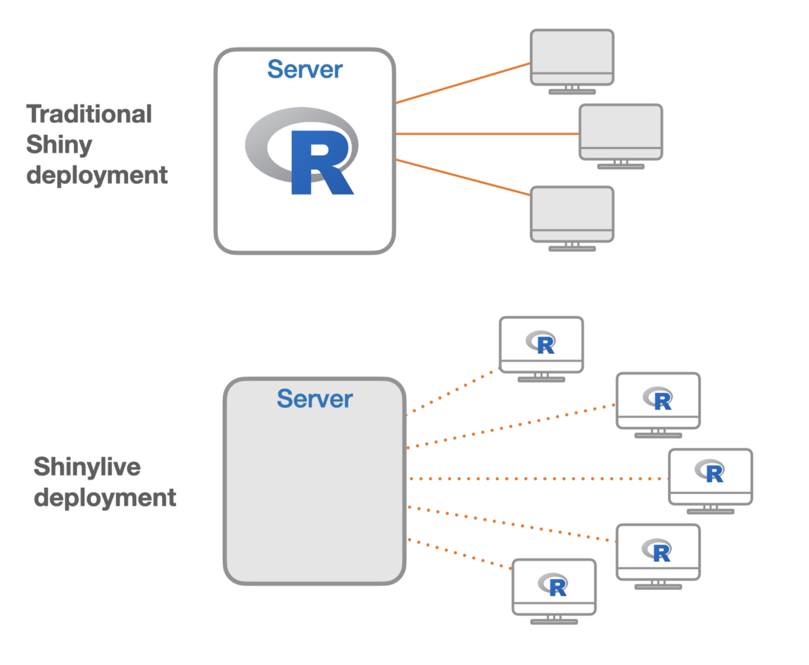

# Learning Objectives

In this lesson, you will:

- Describe Shiny app hosting options

# App Hosting

When one develops an app, they are commonly placed on a server that makes the app accessible to a broader audience. These servers are connected to the internet and thus allow users to utilize your app globally, any time of day. However, there are computaitonal needs to hosting these apps and costs associated with running the servers behind these apps. We will briefly discuss a few options that app developers have for distributing their apps. 

## Local usage

One option for distributing your app is for it to be run on people's own computers (locally). If your app is small-scale, this might be a reasonable solution in order to escape the fees associated with running a server to host your app, since this can be done for free. However, one issue with this approach is that it is sensitive to version issues. If a developer develops their app with a certain version of a given package and the user is using a different version, there could be version incapabilities. For this reason alone, sharing apps to be run locally is not considered a great practice.

## Server Hosting

As we previously mentioned, the most common way for apps to hosted is via servers. One nice aspect of hosting an app within a server is that the version concerns of running an app locally disappears because the developer's versions of the loaded packages are the ones that are used on the server. There are two ways that you might choose to host your apps on a server:

### Posit Connect / HMS Research Data Visualization Platform (RDVP)

One option for hosting your Shiny apps is to use [Posit Connect](https://posit.co/products/enterprise/connect/), which your institution may have an account for. HMS has made a pilot for Posit Connect availible to **HMS Quad-based faculty, staff, and students** through the [HMS Research Data Visualization Platform](https://it.hms.harvard.edu/service/research-data-visualization-platform-rdvp-pilot). Unfortunately, HSDM, HSPH, hospital affiliates, and hospital-based labs are _not_ eligible. Users who use this option have access to an unlimited number of apps and computational hours for the duration of the pilot at no cost. This is the likely best option for people who are eligible. Uploading apps through this platform has a few advantages:

1. Uploading apps is simple
2. It allows you to control access to who can see and use your app. You can let anyone use it, require a login or only invite certain people to be able to use it
3. You can give it a custom URL

### Shinyapps.io

If you aren't eligible for Posit Connect or the HMS Research Data Visualization Platform then [Shinyapps.io](https://www.shinyapps.io/) is a platform that is run by Posit for hosting Shiny apps and it is likely your next best choice. It has several different levels of access. Its lowest level of access is free and allows the developer to upload up to 5 apps and have 25 hours of computing per month. This level is recommended if you are new to the Shiny world. It allows you host a few apps and play around with them a bit. However, you can quickly go through the 25 hours of computational resources and it won't be too hard to create more than 5 apps. After the free level, they have higher levels of service that provide developers with more computational hours and higher, or even no, limits on the number of apps. Higher levels also come with more customer services options as well. Pricing information can be found [here](https://www.shinyapps.io/#pricing-anchor).

## Serverless with Shinylive

The last option for hosting is to host your app online on a site like GitHub Pages in a serverless manner. This can work because at the heart of R, it uses C/C++ and modern web browsers can interpret C/C++ code. While there are some limitations to this approach, what it means is that you can host the code for your Shiny app on a website and it is interpretted locally in the user's web browser. To the user it feels like a traditional, server-hosted app, but under the hood it is actually being run from their own web browser. Due to it being running locally from the user's web browser, the user is limited by their local memory constraints. The image below contrasts the more traditional server-hosted approach with this server-less shinylive approach:

*Image credit: Joe Cheng "Running Shiny without a server"*

Full documentation for how to host your app using `shinylive` can be found [here](shinylive.md) and an example of a `shinylive` app hosted on our GitHub can be found [here](https://hbctraining.github.io/shinylive_app/).

***

[Back to Schedule](..)

*** 

*This lesson has been developed by members of the teaching team at the [Harvard Chan Bioinformatics Core (HBC)](http://bioinformatics.sph.harvard.edu/). These are open access materials distributed under the terms of the [Creative Commons Attribution license](https://creativecommons.org/licenses/by/4.0/) (CC BY 4.0), which permits unrestricted use, distribution, and reproduction in any medium, provided the original author and source are credited.*
