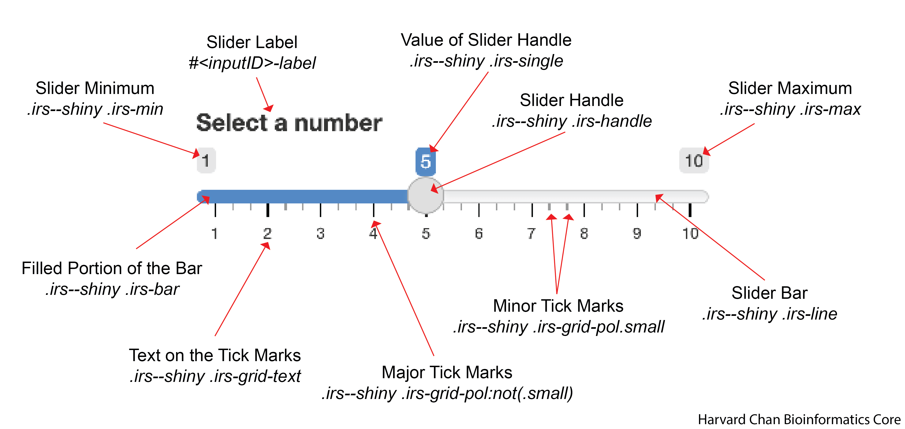

# Learning Objectives

In this lesson, you will:
- Utilize CSS to customize your UI

# What is CSS?

CSS, also known as Cascading Style Sheet, is a style sheet language. When we use a CSS file in confunction with our Shiny app, it gives up much more control over the styling of each aspect of the elements in our UI in the same way that you can have fine control over your plots when creating them in R. To this end, it should be noted that this resource is not intended to be exhaustive as there are virtually endless combinations of things you can tweak and way to tweak them. We will try over time, to compile common items and things you might want to edits within parts of your UI.

# Setting your workspace up for CSS

First, you will need to make a directory within your Shiny app's directory called `www`. Whenever you run a Shiny app, it will check for this folder. However, we need to make a `style.css` file in a text editor and place it within this `www` directory. Then, you need to add to your UI:

```
ui <- fluidPage(
  includeCSS("www/style.css")
  <rest_of_your_UI>
)
```

Now, let's open up the `style.css` file in RStudio next to our app and get to work!

# Editing Input Widgets

## sliderInput

Below is a key for the many of the elements that can be altered within the `sliderInput()`. 

<p align="center"></p>

### Slider Label

An example CSS entry for the slider label is below:

```
#<inputID>-label{
  background-color: red;
  color: orange;
  font-size: 20px;
  font-weight: 100;
  font-family: Monospace;
  font-style: italic;
}
```

> **Note**: Replace `<inputID>` with what the inputID for the slider

| Argument | Note |
|----------|------|
| `background-color` | The background color for the text |
| `color` | The color of the text |
| `font-size` | The size of the font (as measured in pixels(px)) |
| `font-weight` | How thick the font is (values from 100 to 900 by 100) |
| `font-family` | The font used |
| `font-style` | Whether the font is `normal` or `italic` |


