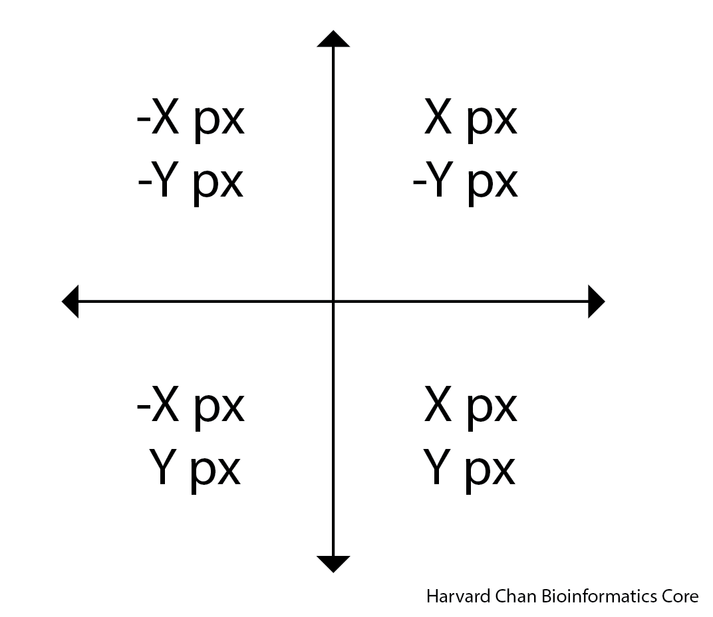
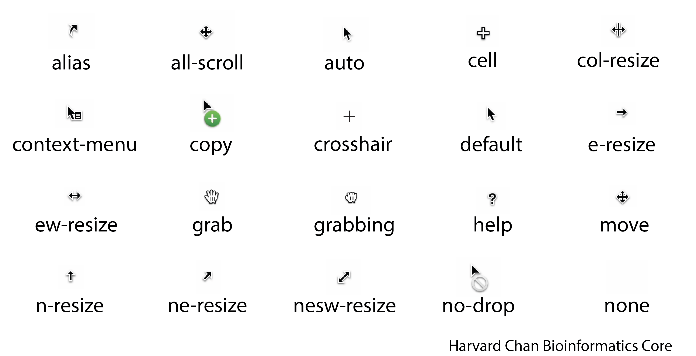
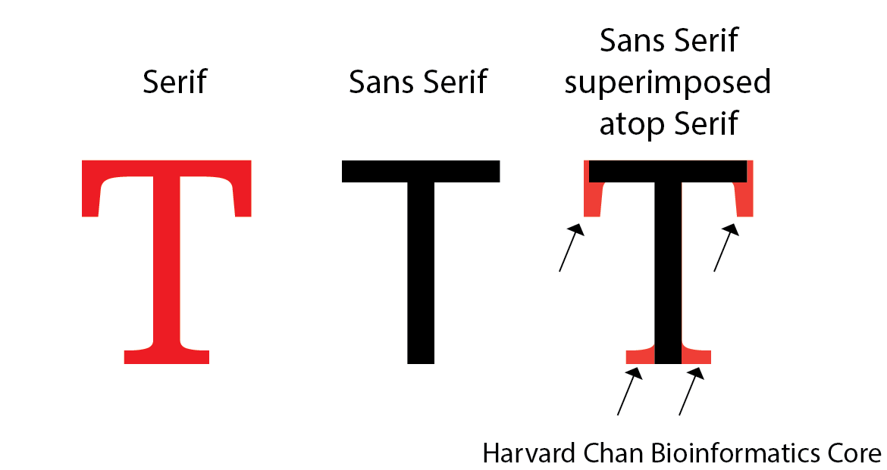

# CSS Input Option Reference

This document gives a more detailed guide to the different options that one can use for each of the css inputs.

[background-color](#background-color)
[border-radius](#border-radius)
[border-style](#border-style)
[border-width](#border-width)
[border-color](#border-color)
[box-shadow](#box-shadow)
[color](#color)
[cursor](#cursor)
[font-color](#font-color)
[font-family](#font-family)
[font-size](#font-size)
[font-weight](#font-weight)
[opacity](#opacity)
[padding](#padding)
[text-shadow](#text-shadow)

## background-color

Similar options availible to [color](#color).

[Back to the top](#CSS-Input-Option-Reference)

## border-radius

| Number of arguments |  Example | Explanation |
|:---:|---|:---|
| 1 | `border-radius: 1px;` | All corners have the same radius of curve (1px) |
| 2 | `border-radius: 1px 2px;` | The top-left and bottom-right corners use the radius of the first value (1px)<br>The top-right and bottom-left coners use the radius of the second value (2px) |
| 3 | `border-radius: 1px 2px 3px;` | The top-left corner uses the radius of the first value (1px)<br>The top-right and bottom-left use the radius of the second value (2px)<br>The bottom-right uses the radius of the third value (3px) |
| 4 | `border-radius: 1px 2px 3px 4px;` | The top-left corner uses the radius of the first value (1px)<br>The top-right corner uses the radius of the second value (2px)<br>The bottom-right corner uses the radius of the third value (3px)<br>The bottom-left corner uses the radius of the fourth value (4px) |

[Back to the top](#CSS-Input-Option-Reference)

## border-style

[Back to the top](#CSS-Input-Option-Reference)

## border-width

[Back to the top](#CSS-Input-Option-Reference)

## border-color

This defines the border color using similar options availible to [color](#color).

[Back to the top](#CSS-Input-Option-Reference)

## box-shadow

If you's like to create shadow gradient for an object it can either be an outset shadow (behind the object) or an inset shadow (on top of the object). When creating the shadow, it is important to consider the x and y offset for the shadow. The image below can help you figure out if your value of x and y need to be negative or positive. 

<p align="center"></p>

### outset

If you want a shadow on the background of the object then you want to use outset. An example for the syntax for outset is:

```
  box-shadow: 4px -6px 3px rgba(0, 0, 0, 0.2),
```

| Argument Position | Example | Explanation |
|:---:|:---:|:---|
| 1 | `4px` | x offset, where negative values are to the left and positive values are to the right |
| 2 | `-6px` | y offset, where negative value are up and positive values are down |
| 3 | `3px` | Magnitude of the blur, where 0 is no blur and higher numbers are more blur, this is measured in pixels (`px`) |
| 4 | `rgba(0, 0, 0, 0.2)` | Color of the blur following `color` guidlines (see [color](#color)) |


### inset

If you want a shadow on the foreground of the object then you want to use inset. An example for the syntax for inset is:

```
  box-shadow: inset -2px 3px 0px green,
```

| Argument Position | Example | Explanation |
|:---:|:---:|:---|
| 1 | `inset` | Needed to define the shadow as inset |
| 2 | `-2px` | x offset, where negative values are to the left and positive values are to the right |
| 3 | `3px` | y offset, where negative value are up and positive values are down |
| 4 | `0px` | Magnitude of the blur, where 0 is no blur and higher numbers are more blur, this is measured in pixels (`px`) |
| 5 | `green` | Color of the blur following `color` guidlines (see [color](#color)) |

### outset and inset

It is a little bit trickier to back an object to have both an inset and outset shadow. You can define the outset shadow, then add a comma and then add the inset shadow argument after on the next line. However it will not work in the reverse order.

```
box-shadow: -1px 3px 6px #6495ED,
  inset 5px -4px 10px rgba(0, 0, 0, 0.5);  
```

[Back to the top](#CSS-Input-Option-Reference)

## color

There are a few ways to define color in CSS:

- Use their HTML standard color name (if available)
- Define them using rgb()
- Call them by their hexidecimal code

Here is a [helpful resource](https://www.rapidtables.com/web/color/html-color-codes.html) that connects the 140 HTML Standard colors with their RGB and hexidecimal equivalents. It also has a tool that you can use to select a color and it will provide you with the RBG and hexidecimal code for that color.

An example of each method of defining a color is given below:

### HTML Standard Color Name

There are 140 recognized colors in HTML that have names associated with them. You can use the HTML color name (if available):

```
color: cornflowerblue
```

### RGB

Alternatively, you can use the RGB code for the color:

```
color: rgb(100, 149, 237)
```

You can also include the opacity, or alpha, value in when using `rbg()` but using `rgba()`, where the last value is the transparency (alpha) value and it needs to be between 0 (completely transparent) to 1 (completely opaque):

```
color: rgba(100, 149, 237, 0.2),
```

Alternatively, to `rgba()`, you can also just use `rgb()` for `color` and set your opacity, or alpha, with `opacity`. See [opacity](#opacity). 

### Hexidecimal

This RGB code can also be converted into its hexidecimal code:

```
color: #6495ED
```

[Back to the top](#CSS-Input-Option-Reference)

## cursor

Below is a cheatsheet for the different cursor options:

<p align="center"></p>

[Back to the top](#CSS-Input-Option-Reference)

## font-color

This defines the color of the font similar to the options available to [color](#color).

[Back to the top](#CSS-Input-Option-Reference)

## font-family

This will dictate the font that will be used for a given piece of text. 

### Font Families

Let's briefly start by discussing the five major font families:

1. `Monospace` - This family is defined as fonts that have a fixed-width to them. Things like code are often Monospace and a popular font in this family is Courier New.
2. `Serif` - This family is characterized by having small strokes that extend beyond the letters. Times New Roman is an example of a font in this family.
3. `Sans Serif` - Since "sans" means "without", this family is characterized by not having the small strokes that extend beyond the letters. Arial is an example of a font in this family.

The image below can help detail the difference between a serif font and a sans serif font:

<p align="center"></p>

4. `Cursive` - This family of fonts are supposed to imitate handwriting. Comic Sans MS is an example of a font in this family.
5. `Fanstay` - This family is characterized by being more decorative or whimsical. Impact is an example of a font in this family.

More examples of fonts in each of these generic families can be found [here](https://www.w3.org/Style/Examples/007/fonts.en.html).

You can use these generic font families in a declaration block like:

```
font-family: Monospace
```

### Specific Fonts

You can also use specific fonts and these are broken up into two classes:

1. Pre-defined fonts
2. Imported fonts

#### Pre-defined fonts

While not all fonts are universal, there are some that are more popular than others and they fall into one of the five above generic categories. It is not guaranteed that a given browser will have one of these fonts. So when using one fo these it is imperative to provide a fallback generic font family to have it rendered. For example, you may want to use Comic Sans MS, but if it is unavailble you want it to fall back on the sans serif family. Notably, it does not need to fal; back on the generic font family that the specific font comes from. It would looke like this within the declaration block:

```
  font-family: 'Comic Sans MS', sans-serif;
```

#### Imported Fonts

Since not all fonts are universal across browsers, you may want to create a command to import a font. A popular place to import a font from is [Google Fonts](https://fonts.google.com/). When you import a font, it is important that you place the `@import` line at the beginning of your CSS file. It is possible to place it other locations, but the recommended practice is to place it at the top as to not cause any issues. Like pre-defined fonts, it is always a good idea to provide a fallback generic font family in case the font fails to be rendered.

You can also import multiple font families. In the upcoming examples, we are going to try to import "Just Me Again Down Here" and "Meow Script". This can be do individually:

```
@import url('https://fonts.googleapis.com/css2?family=Just+Me+Again+Down+Here&display=swap');
@import url('https://fonts.googleapis.com/css2?family=Meow+Script&display=swap');
```

In the GIF below, we show how to get this `@import` line from Google Fonts:


Or together:

```
@import url('https://fonts.googleapis.com/css2?family=Just+Me+Again+Down+Here&family=Meow+Script&display=swap');
```

Similarly to getting a font individually, if you select both of the fonts and improt then, then they will both be in the same `@import` as shown in the GIF below:

Once, you have your fonts imported, then you can use them just like a pre-defined font in your declaration block:

```
font-family: "Just Me Again Down Here", serif;
```

[Back to the top](#CSS-Input-Option-Reference)

## font-size

[Back to the top](#CSS-Input-Option-Reference)

## font-weight

`font-weight` refer to the thickness or how bold text is. The values to select from go from 100 to 900 in 100 increments. You can also use 'normal', which can correspond to around a thickness of 400 in some fonts or 'bold', which can correspond to around a thickness of 700 in some fonts. An example of the syntax for `font-weight` is:

```
font-weight: 500
```

[Back to the top](#CSS-Input-Option-Reference)

## opacity

This controls the the opacity, or alpha, for an object. Opacity can be given values:

- On a scale from 0-1, where 0 is completely transparent and 1 is completely opaque
- On a scale from 0-100%, where 0% is completely transparent and 100% is completely opaque

[Back to the top](#CSS-Input-Option-Reference)

## padding

| Number of arguments |  Example | Explanation |
|:---:|---|:---|
| 1 | `padding: 1px;` | All sides have the same amount of space around the text (1px) |
| 2 | `padding: 1px 2px;` | The top and bottom have the same amount of space around the text using the first value (1px)<br>The left and right have the same amount of space around the text using the second value (2px)|
| 3 | `padding: 1px 2px 3px;` | The top has amount of space around the text using the first value (1px)<br>The left and right have the same amount of space around the text using the second value (2px)<br>The bottom has amount of space around the text using the third value (3px) |
| 4 | `padding: 1px 2px 3px 4px;` | The top has amount of space around the text using the first value (1px)<br>The right has amount of space around the text using the second value (2px)<br>The bottom has amount of space around the text using the third value (3px)<br>The left has amount of space around the text using the fourth value (4px) |

[Back to the top](#CSS-Input-Option-Reference)

## text-shadow

`text-shadow` works very similar to `box-shadow` (see [box-shadow](#box-shadow)) except it gives a shadow for the text rather than for the object. Another notable difference from `box-shadow` is that `text-shadow` only utilizes `outset` (background shadow) and not `inset` (foreground shadow). Like `box-shadow`, the y-axis is a feels inverted. The image below can help you figure out if your value of x and y need to be negative or positive. 

<p align="center"></p>

Below we have an example of the `text-shadow` syntax:

```
text-shadow: -2px 2px 0px tomato;
```

| Argument Position | Example | Explanation |
|:---:|:---:|:---|
| 1 | `-2px` | x offset, where negative values are to the left and positive values are to the right |
| 2 | `2px` | y offset, where negative value are up and positive values are down |
| 3 | `0px` | Magnitude of the blur, where 0 is no blur and higher numbers are more blur, this is measured in pixels (`px`) |
| 4 | `tomato` | Color of the blur following `color` guidlines (see [color](#color)) |

[Back to the top](#CSS-Input-Option-Reference)

---

[Back to Table of Contents](table_of_contents.md)
