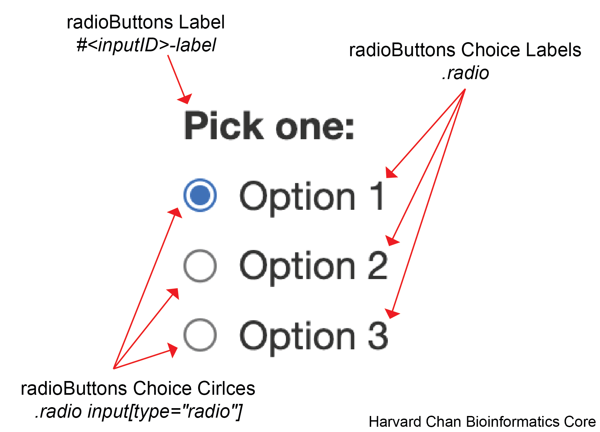

# radioButtons

Below is a key for the elements that can be altered within the `radioButtons()`:

<p align="center"></p>

Jump to the following sections:

- [radioButtons Label](#radioButtons-label)
- [radioButtons Choice Labels](#radioButtons-choice-labels)
- [radioButtons Choice Circles](#radioButtons-choice-circles)

## radioButtons Label

An example CSS entry for the `radioButtons` label is below:

```
/* radioButtons Label */
#<inputID>-label{
  height: 100px;
  width: 200px;
  background-color: purple;
  color: green;
  font-family: Monospace;
  font-size: 20px;
  font-style: italic;
  font-weight: 400;
  border-color: orange;
  border-radius: 5px;
  border-style: dotted;
  border-width: 5px;
  padding: 1px 2px 3px 4px;
  opacity: 40%;
  box-shadow: inset 0 0 10px rgba(0, 0, 0, 0.5);
  text-shadow: -3px -3px 2px tomato;
}
```

> **Note**: Replace `<inputID>` with what the inputID for the slider

| Argument | Note |
|----------|------|
| `height` | Height of the radioButtons label box ([reference](css_input_option_reference.md#height)) |
| `width` | Width of the radioButtons label box ([reference](css_input_option_reference.md#width)) |
| `background-color` | The background color for the text space ([reference](css_input_option_reference.md#background-color)) |
| `color` | The color of the text ([reference](css_input_option_reference.md#color)) |
| `font-family` | The font used ([reference](css_input_option_reference.md#font-family)) |
| `font-size` | The size of the font ([reference](css_input_option_reference.md#font-size)) |
| `font-style` | Whether the font is `normal` or `italic` ([reference](css_input_option_reference.md#font-style)) |
| `font-weight` | How thick or bold the font is ([reference](css_input_option_reference.md#font-weight)) |
| `border-color` | Color of the border ([reference](css_input_option_reference.md#border-color)) |
| `border-radius` | How curved the radius of the corners are ([reference](css_input_option_reference.md#border-radius)) |
| `border-style` | Style of the border ([reference](css_input_option_reference.md#border-style)) |
| `border-width` | Width of the border ([reference](css_input_option_reference.md#border-width)) |
| `padding` | How much space to leave around the text([reference](css_input_option_reference.md#padding)) |
| `opacity` | Opacity of the label ([reference](css_input_option_reference.md#opacity)) |
| `box-shadow` | The shadow of the box outlining the text space ([reference](css_input_option_reference.md#box-shadow)) |
| `text-shadow` | The shadow of the text within the text space ([reference](css_input_option_reference.md#text-shadow)) |

## radioButtons Choice Labels

An example CSS entry for the `radioButtons` choice labels is below:

```
/* radioButtons Choice Labels */
.radio {
  height: 50px; 
  width: 200px;
  background-color: blue;
  color: white;
  font-family: sans-serif;
  font-size: 10px;
  font-style: italic;
  font-weight: 100;
  border-color: green;
  border-radius: 10px;
  border-style: dashed;
  border-width: 5px;
  padding: 20px 10px 30px 40px;
  opacity: 70%;
  box-shadow: inset 0 0 10px rgba(0, 0, 0, 0.5);
  text-shadow: -3px -3px 2px tomato;
}
```

| Argument | Note |
|----------|------|
| `height` | Height of the radioButtons choice label boxes ([reference](css_input_option_reference.md#height)) |
| `width` | Width of the radioButtons choice label boxes ([reference](css_input_option_reference.md#width)) |
| `background-color` | The background color for the text space ([reference](css_input_option_reference.md#background-color)) |
| `color` | The color of the text ([reference](css_input_option_reference.md#color)) |
| `font-family` | The font used ([reference](css_input_option_reference.md#font-family)) |
| `font-size` | The size of the font ([reference](css_input_option_reference.md#font-size)) |
| `font-style` | Whether the font is `normal` or `italic` ([reference](css_input_option_reference.md#font-style)) |
| `font-weight` | How thick or bold the font is ([reference](css_input_option_reference.md#font-weight)) |
| `border-color` | Color of the border ([reference](css_input_option_reference.md#border-color)) |
| `border-radius` | How curved the radius of the corners are ([reference](css_input_option_reference.md#border-radius)) |
| `border-style` | Style of the border ([reference](css_input_option_reference.md#border-style)) |
| `border-width` | Width of the border ([reference](css_input_option_reference.md#border-width)) |
| `padding` | How much space to leave around the text([reference](css_input_option_reference.md#padding)) |
| `opacity` | Opacity of the label ([reference](css_input_option_reference.md#opacity)) |
| `box-shadow` | The shadow of the box outlining the text space ([reference](css_input_option_reference.md#box-shadow)) |
| `text-shadow` | The shadow of the text within the text space ([reference](css_input_option_reference.md#text-shadow)) |

### Targeting Specific Choices

If you only want to make changes to specific choices then you can use `:nth-child` pseudo class like:

```
/* radioButtons Choice Label Specific */
.radio:nth-child(<insert_element_number>) {
  color: red
}
```

Where `<insert_element_number>` represents a 1-indexed numbering of the `radioButton` choice.

## radioButtons Choice Circles

An example CSS entry for the `radioButtons` choice circles is below:

```
/* radioButtons Choice Circles */
.radio input[type="radio"] {
  accent-color: red;
  opacity: 50%;
}
```

| Argument | Note |
|----------|------|
| `accent-color` | The color of the radioButtons choice circles ([reference](css_input_option_reference.md#accent-color)) |
| `opacity` | Opacity of the radioButtons choice circles ([reference](css_input_option_reference.md#opacity)) |

### Targeting Specific Choice Circles

If you only want to make changes to a specific choice circle then you can use `:nth-child()` pseudo class like:

```
/* radioButtons Choice Circle Specific */
.radio:nth-child(<insert_element_number>) input[type="radio"] {
  accent-color: red
}
```

Where `<insert_element_number>` represents a 1-indexed numbering of the `radioButton` choice circle.

---

[Back to Table of Contents](table_of_contents.md)
