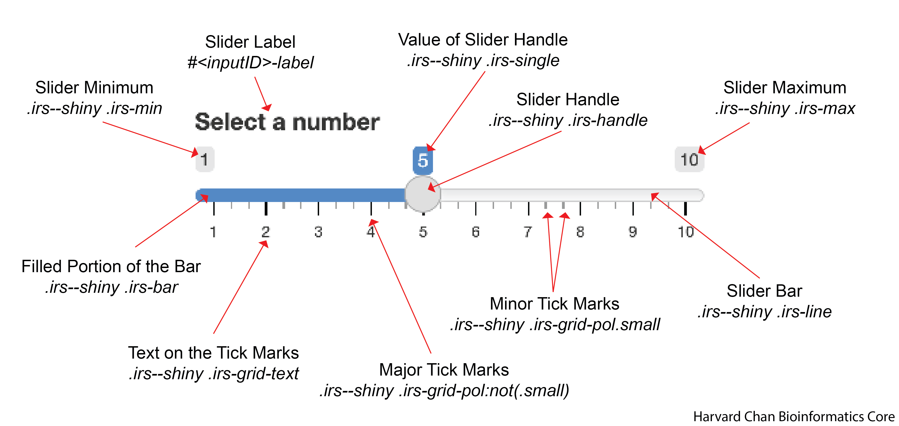

# sliderInput

Below is a key for the many of the elements that can be altered within the `sliderInput()`. 

<p align="center"></p>

## Slider Handle

An example CSS entry for the slider handle is below:

```
.irs--shiny .irs-handle{
  height: 22px;
  width: 22px;
  background-color: pink;
  border-width: 2px;
  border-style: solid;
  border-color: green;
  cursor: pointer;
}
```

| Argument | Note |
|----------|------|
| `height` | Height of the slider handle |
| `width` | Width of the slider handle |
| `background-color` | Color of the inner circle of the slider handle |
| `border-width` | Width of the border (see [reference](css_input_option_reference.md#border-width) |
| `border-style` | Style of the border (see [reference](css_input_option_reference.md#border-style) |
| `cursor` | Image of cursor (see [reference](css_input_option_reference.md#cursor)) |


### Hover pseudo-class

The default sliderInput changes slight shades as you hover over it. If you would like to edit this behavior you will need to use the `:hover` pseudo-class:

```
.irs--shiny .irs-handle:hover{
  cursor: grab;
}
```

The options availible to the hover pseudo-class are the same as for the normal slider handle.

### Active pseudo-class

You can also alter the the slider handle while you are dragging it by using the `:active` pseudoclass:

```
.irs--shiny .irs-handle:active{
  cursor: grabbing;
}
```

The options availible to the active pseudo-class are the same as for the normal slider handle.

## Slider Label

An example CSS entry for the slider label is below:

```
#<inputID>-label{
  background-color: red;
  color: orange;
  font-size: 20px;
  font-weight: 100;
  font-family: Monospace;
  font-style: italic;
}
```

> **Note**: Replace `<inputID>` with what the inputID for the slider

| Argument | Note |
|----------|------|
| `background-color` | The background color for the text |
| `color` | The color of the text |
| `font-size` | The size of the font (as measured in pixels(px)) |
| `font-weight` | How thick the font is (values from 100 to 900 by 100) |
| `font-family` | The font used |
| `font-style` | Whether the font is `normal` or `italic` |

## Slider Minimum

An example CSS entry for the slider minimum label is below:

```
.irs--shiny .irs-min{
  background-color: blue;
  color: white;
  font-size: 10px;
  font-family: sans-serif;
  font-style: italic;
  border-radius: 3px;
  padding: 1px 2px 3px 4px
}
```

| Argument | Note |
|----------|------|
| `background-color` | The background color for the text |
| `color` | The color of the text |
| `font-size` | The size of the font (as measured in pixels(px)) |
| `font-family` | The font used |
| `font-style` | Whether the font is `normal` or `italic` |
| `border-radius` | How curved the radius of the box is. This can have one to four values to define (see [reference](css_input_option_reference.md#border-radius)) |
| `padding` | How much space to leave around the text. This can have one to four values to define (see [reference](css_input_option_reference.md#padding)) |

## Slider Maximum

An example CSS entry for the slider maximum label is below:

```
.irs--shiny .irs-max{
  background-color: yellow;
  color: green;
  font-size: 10px;
  font-family: sans-serif;
  font-style: italic;
  border-radius: 10px;
  padding: 1px 2px 3px 4px
}
```
| Argument | Note |
|----------|------|
| `background-color` | The background color for the text |
| `color` | The color of the text |
| `font-size` | The size of the font (as measured in pixels(px)) |
| `font-family` | The font used |
| `font-style` | Whether the font is `normal` or `italic` |
| `border-radius` | How curved the radius of the box is. This can have one to four values to define (see [reference](css_input_option_reference.md#border-radius)) |
| `padding` | How much space to leave around the text. This can have one to four values to define (see [reference](css_input_option_reference.md#padding)) |

## Slider Minimum and Maximum

Likely, we want want the slider's minimum and maximum to be identical and this can be accomplished by separating `.irs--shiny .irs-min` and `.irs--shiny .irs-max` with a comma.

```
.irs--shiny .irs-min, .irs--shiny .irs-max{
  background-color: yellow;
  color: green;
  font-size: 10px;
  font-family: sans-serif;
  font-style: italic;
  border-radius: 10px;
  padding: 1px 2px 3px 4px
}
```

| Argument | Note |
|----------|------|
| `background-color` | The background color for the text |
| `color` | The color of the text |
| `font-size` | The size of the font (as measured in pixels(px)) |
| `font-family` | The font used |
| `font-style` | Whether the font is `normal` or `italic` |
| `border-radius` | How curved the radius of the box is. This can have one to four values to define (see [reference](css_input_option_reference.md#border-radius)) |
| `padding` | How much space to leave around the text. This can have one to four values to define (see [reference](css_input_option_reference.md#padding)) |


[Back to Table of Contents](table_of_contents.md)

