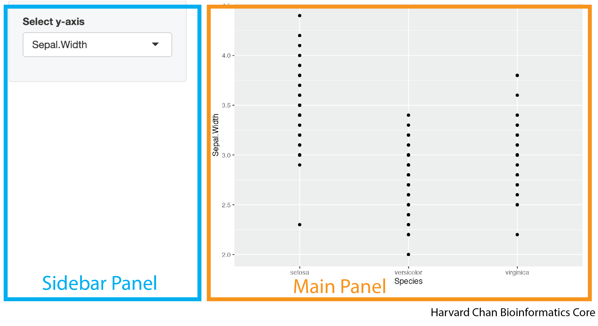

# Learning Objectives
In this lesson, you will:
- Implement sidebars into your Shiny app
- Create tabsets
- Implement different shinythemes

# Introduction 

Until now most of our work has focused on server side implementations of concepts. We have discussed the UI components required to carry the tasks that we want, but we haven't discussed how we want to arrange them. This section will almost exclusively focus on the UI and how to arrange and organize the components of the UI into a visually appealing app.

# Sidebars

It is common in many apps to have the user defined input control on a sidebar to the left and the rendered plots and tables on the right. In the image below we have highlighted what a sidepanel and mainpanel might like in a Shiny App. 

<p align="center"></p>

Creating this structure within a Shiny app utilizes the `sidebarLayout()` function. The `sidebarLayout()` function in your UI defines that this region of your app is using a sidebar panel defined by `sidebarPanel()` and a main panel defined by `mainPanel()`. The `sidebarPanel()` and `mainPanel()` function are nested inside of your `sidebarLayout()`. Let's look at the syntax for how to implement this:

```
ui <- fluidPage(
  sidebarLayout(
    sidebarPanel(
      <objects_in_your_sidebar_panel>
    ),
    mainPanel(
      <objects_in_your_main_panel>
    )
  )
)
```

A sample app demoing this syntax would look like:

```
library(shiny)
library(ggplot2)

ui <- fluidPage(
  sidebarLayout(
    sidebarPanel(
      selectInput("y_axis_input", "Select y-axis", choices = c("Sepal.Length", "Sepal.Width", "Petal.Length", "Petal.Width"))
    ),
    mainPanel(
      plotOutput("plot")
    )
  )
)

server <- function(input, output) {
  output$plot <- renderPlot({
    ggplot(iris) +
      geom_point(aes(x = Species, y = .data[[input$y_axis_input]]))
  })
}

shinyApp(ui = ui, server = server)
```

This app would look like:

<p align="center"><iframe src="https://hcbc.connect.hms.harvard.edu/Sidepanel_demo/?showcase=0" width="800" height="400px" data-external="1"></iframe></p>


# Adding a title

You may want your app to have a title. You can add this with the `titlePanel()` function. The syntax for doing this looks like:

```
titlePanel("<title_of_your_app>")
```

The default behavior of `titlePanel()` is to left-align the title. If you would like center your title you will need to use an `h1()` function within your `titlePanel()` function. The `h1()` function is borrowed from HTML nonmenclature and refers to the largest sized header. The smallest sized header in HTML is `h6()` and the values in between `h1()` and `h6()` (`h2()`, `h3()`, `h4()`, `h5()`) span the range of sizes between `h1()` and `h6()`. Within the `h[1-6]()` family of function, there is an `align` argument that accepts the (`"left"`, `"center"`, and `"right"`) for the alignment. So a center aligned title could looke like:

```
titlePanel(
  h1("<title_of_your_app>", align = "center")
)
```

We can add this title to our previous app:

```
library(shiny)
library(ggplot2)

ui <- fluidPage(
  titlePanel(
    h1("My iris Shiny App", align = "center")
  ),
  sidebarLayout(
    sidebarPanel(
      selectInput("y_axis_input", "Select y-axis", choices = c("Sepal.Length", "Sepal.Width", "Petal.Length", "Petal.Width"))
    ),
    mainPanel(
      plotOutput("plot")
    )
  )
)

server <- function(input, output) {
  output$plot <- renderPlot({
    ggplot(iris) +
      geom_point(aes(x = Species, y = .data[[input$y_axis_input]]))
  })
}

shinyApp(ui = ui, server = server)
```

This app would now look like:

<p align="center"><iframe src="https://hcbc.connect.hms.harvard.edu/Title_panel_demo/?showcase=0" width="800" height="500px" data-external="1"></iframe></p>

# Creating columns

We have shown how to use the `sidebarLayout()` function, but we may want to have multiple columns in our data and the `sidebarLayout()` function can't help to much with that. Fortunately, there is the `fluidRow()` function that allows us to divide up the row into columns using the `column()` function nested within it. The first argument within the `column()` function defines the width of the column and the sum of all of the widths of a column for a given `fluidRow()` function should sum to 12. If the width value in `fluidRow()` is left undefined then it defaults to 12. An example of this syntax would be:

```
fluidRow(
  column(<width_of_first_column>,
    <objects_in_first_column>
  ),
  column(<width_of_second_column>,
    <objects_in_second_column>
  )
```

We could make equally sized columns in our app like:

```
library(shiny)
library(ggplot2)

ui <- fluidPage(
  titlePanel(
    h1("My iris Shiny App", align = "center")
  ),
  fluidRow(
    column(6,
      h3("First column"),
      selectInput("y_axis_input", "Select y-axis", choices = c("Sepal.Length", "Sepal.Width", "Petal.Length", "Petal.Width"))
    ),
    column(6,
      h3("Second column"),
      plotOutput("plot")
    )
  )
)

server <- function(input, output) {
  output$plot <- renderPlot({
    ggplot(iris) +
      geom_point(aes(x = Species, y = .data[[input$y_axis_input]]))
  })
}

shinyApp(ui = ui, server = server)
```

This app would look like:

<p align="center"><iframe src="https://hcbc.connect.hms.harvard.edu/Fluid_row_demo/?showcase=0" width="800" height="550px" data-external="1"></iframe></p>

## Nesting columns

You can also nest `fluidRow()` functions within the `column()` function of another `fluidRow()` function. Once again, the important rule when using `fluidRow()` is that the sum of the `column()`'s width value within *each* `fluidRow()` sums to 12. Let's take a look at some example syntax of how this would look:

```
  fluidRow(
    column(<width_of_first_main_column>,
      fluidRow(
        column(<width_of_first_subcolumn_of_the_first_main_column>,
          <objects_in_first_column_first_subcolumn>
        ),
        column(<width_of_second_subcolumn_of_the_first_main_column>,
          <objects_in_first_column_second_subcolumn>
        )
      )
    ),
    column(<width_of_second_main_column>,
      <objects_in_second_column>
    )
  )
)
```

We can apply these principles to our app:

```
library(shiny)
library(ggplot2)

ui <- fluidPage(
  titlePanel(
    h1("My iris Shiny App", align = "center")
  ),
  fluidRow(
    column(7,
      fluidRow(
        column(6,
        h3("First column: First subcolumn"),
        selectInput("x_axis_input", "Select x-axis", choices = c("Sepal.Length", "Sepal.Width", "Petal.Length", "Petal.Width"))
        ),
        column(6,
        h3("First column: Second subcolumn"),
        selectInput("y_axis_input", "Select y-axis", choices = c("Sepal.Length", "Sepal.Width", "Petal.Length", "Petal.Width"))
        )
      )
    ),
    column(5,
      h3("Second column"),
      plotOutput("plot")
    )
  )
)

server <- function(input, output) {
  output$plot <- renderPlot({
    ggplot(iris) +
      geom_point(aes(x = .data[[input$x_axis_input]], y = .data[[input$y_axis_input]]))
  })
}

shinyApp(ui = ui, server = server)
```

This app would look like:

<p align="center"><iframe src="https://hcbc.connect.hms.harvard.edu/Fluid_row_nested_demo/?showcase=0" width="800" height="550px" data-external="1"></iframe></p>

## Multiple Rows

Now that we've seen how to make multiple columns, let's breifly talk about multiple rows. Instead of nesting `fluidRow()` function within one another, we will treat them like we've treated objects that go underneath one another, by putting complete `fluidRow()` functions underneath each other in out code. An example of this syntax can be seen below:

```
fluidRow(
  column(<width_of_first_column_in_the_first_row>,
    <objects_in_first_column_first_row>
  ),
  column(<width_of_second_column_in_the_first_row>,
    <objects_in_second_column_first_row>
  )
),
fluidRow(
  column(<width_of_first_column_in_the_second_row>,
    <objects_in_first_column_second_row>
  ),
  column(<width_of_second_column_in_the_second_row>,
    <objects_in_second_column_second_row>
  )
)
```

We can apply the concept of multiple rows to our app:

```
library(shiny)
library(ggplot2)

ui <- fluidPage(
  titlePanel(
    h1("My iris Shiny App", align = "center")
  ),
  fluidRow(
    column(6,
      h3("First Row: First column"),
      selectInput("x_axis_input", "Select x-axis", choices = c("Sepal.Length", "Sepal.Width", "Petal.Length", "Petal.Width"))
    ),
      column(6,
      h3("First Row: Second column"),
      selectInput("y_axis_input", "Select y-axis", choices = c("Sepal.Length", "Sepal.Width", "Petal.Length", "Petal.Width"))
    )
  ),
  fluidRow(
      h3("Second Row"),
      plotOutput("plot")
  )
)

server <- function(input, output) {
  output$plot <- renderPlot({
    ggplot(iris) +
      geom_point(aes(x = .data[[input$x_axis_input]], y = .data[[input$y_axis_input]]))
  })
}

shinyApp(ui = ui, server = server)
```

This app would look like:

<p align="center"><iframe src="https://hcbc.connect.hms.harvard.edu/Fluid_row_multiple_rows_demo/?showcase=0" width="800" height="700px" data-external="1"></iframe></p>

## Thematic Breaks

Thematic breaks are a great way to break-up different parts of an app. The function to add a themetic break is also borrowed from HTML and it is called `hr()`. The syntax for using it is very simple:

```
hr()
```

In the previous example, if we wanted to break up the `selectInput()` functions from the `plotOutput()` function, then we could add a thematic break like:

```
library(shiny)
library(ggplot2)

ui <- fluidPage(
  titlePanel(
    h1("My iris Shiny App", align = "center")
  ),
  fluidRow(
    column(6,
           h3("First Row: First column"),
           selectInput("x_axis_input", "Select x-axis", choices = c("Sepal.Length", "Sepal.Width", "Petal.Length", "Petal.Width"))
    ),
    column(6,
           h3("First Row: Second column"),
           selectInput("y_axis_input", "Select y-axis", choices = c("Sepal.Length", "Sepal.Width", "Petal.Length", "Petal.Width"))
    )
  ),
  hr(),
  fluidRow(
    h3("Second Row"),
    plotOutput("plot")
  )
)

server <- function(input, output) {
  output$plot <- renderPlot({
    ggplot(iris) +
      geom_point(aes(x = .data[[input$x_axis_input]], y = .data[[input$y_axis_input]]))
  })
}

shinyApp(ui = ui, server = server)
```

This app would now look like:

<p align="center"><iframe src="https://hcbc.connect.hms.harvard.edu/Fluid_row_multiple_rows_with_break_demo/?showcase=0" width="800" height="750px" data-external="1"></iframe></p>

# Navbar

Within an app, adding a navigation bar can help users more easily more around an app. The syntax for adding a navigation bar looks like:

```
navbarPage("<title_of_navigation_bar>",
  tabPanel("<title_of_tab_1>",
    <content_of_tab_1>
  ),
  tabPanel("<title_of_tab_2>",
    <content_of_tab_2>
  ),
)
```

The use of the `navbarPage()` function lets the Shiny UI know that there will be a nagivation bar on the app. The `tabPanel()` is used within the `navbarPage()` function along with a few other functions that we will explore to define the contents of each tab. An example of this code is shown below:

```
library(shiny)
library(ggplot2)

ui <- fluidPage(
  navbarPage("My iris dataset",
    tabPanel("Inputs",
      selectInput("x_axis_input", "Select x-axis", choices = c("Sepal.Length", "Sepal.Width", "Petal.Length", "Petal.Width")),
      selectInput("y_axis_input", "Select y-axis", choices = c("Sepal.Length", "Sepal.Width", "Petal.Length", "Petal.Width"))
    ),
    tabPanel("Output Plot",
      plotOutput("plot")
    ),
  )
)

server <- function(input, output) {
  output$plot <- renderPlot({
    ggplot(iris) +
      geom_point(aes(x = .data[[input$x_axis_input]], y = .data[[input$y_axis_input]]))
  })
}

shinyApp(ui = ui, server = server)
```

This app would look like:

<p align="center"><iframe src="https://hcbc.connect.hms.harvard.edu/Navbar_demo/?showcase=0" width="800" height="500px" data-external="1"></iframe></p>

Within the `navbarPage()` function there is a `position` argument, with three options:

| Argument | Description |
|----------|-------------|
| `position = "static-top"` | The navigation bar is at the top of the app and when you scroll down it disappears | 
| `position = "fixed-top"` | The navigation bar is at the top of the app and when you scroll down it stays in the frame for the browser window |
| `position = "fixed-bottom"` | The navigation bar is at the bottom of the app and when you scroll down it stays in the frame for the browser window |

## Navigation Bar Menu

Within the navigaton bar, we can have a dropdown menu that gives us more options in a list. This would be accomplished using the `navbarMenu()` function, which also utilizes `tabPanel()` function that `navbarPage()` uses. The syntax for using a dropdown menu anvigation bar menu is:

```
navbarPage("<title_of_navigation_bar>",
  navbarMenu("<name_for_dropdown_menu>",
    tabPanel("<title_of_option_1_in_menu>",
      <content_of_option_1_in_menu>
    ),
    tabPanel("<title_of_option_2_in_menu>",
      <content_of_option_2_in_menu>
    )
  )
)
```


A code example of the `navbarMenu()` function can be seen below:

```
library(shiny)
library(ggplot2)
library(DT)

ui <- fluidPage(
  navbarPage("My iris dataset",
    tabPanel("Inputs",
      selectInput("x_axis_input", "Select x-axis", choices = c("Sepal.Length", "Sepal.Width", "Petal.Length", "Petal.Width")),
      selectInput("y_axis_input", "Select y-axis", choices = c("Sepal.Length", "Sepal.Width", "Petal.Length", "Petal.Width"))
    ),
    navbarMenu("Outputs",
      tabPanel("Plot",
        plotOutput("plot")
      ),
      tabPanel("Table",
        DTOutput("table")   
      )
    )
  )
)

server <- function(input, output) {
  output$plot <- renderPlot({
    ggplot(iris) +
      geom_point(aes(x = .data[[input$x_axis_input]], y = .data[[input$y_axis_input]]))
  })
  output$table <- renderDT({
    iris[,c(input$x_axis_input, input$y_axis_input), drop = FALSE]
  })
}

shinyApp(ui = ui, server = server)
```

This app would look like:

<p align="center"><iframe src="https://hcbc.connect.hms.harvard.edu/Navbar_menu_demo/?showcase=0" width="800" height="600px" data-external="1"></iframe></p>

## Navigation List

In place of of a navigation bar along the top of the window, you can also opt for a list down the side of the app using the `navlistPanel()` in place of the `navbarPage()` function. The syntax for using this style of list looks like:

```
navlistPanel("<title_of_navigation_list>",
  tabPanel("<title_of_tab_1>",
    <content_of_tab_1>
  ),
  tabPanel("<title_of_tab_2>",
    <content_of_tab_2>
  ),
)
```

An example for this code is below:

```
library(shiny)
library(ggplot2)
library(DT)

ui <- fluidPage(
  navlistPanel("My iris dataset",
             tabPanel("Inputs",
                      selectInput("x_axis_input", "Select x-axis", choices = c("Sepal.Length", "Sepal.Width", "Petal.Length", "Petal.Width")),
                      selectInput("y_axis_input", "Select y-axis", choices = c("Sepal.Length", "Sepal.Width", "Petal.Length", "Petal.Width"))
             ),
             navbarMenu("Outputs",
                        tabPanel("Plot",
                                 plotOutput("plot")
                        ),
                        tabPanel("Table",
                                 DTOutput("table")   
                        )
             )
  )
)

server <- function(input, output) {
  output$plot <- renderPlot({
    ggplot(iris) +
      geom_point(aes(x = .data[[input$x_axis_input]], y = .data[[input$y_axis_input]]))
  })
  output$table <- renderDT({
    iris[,c(input$x_axis_input, input$y_axis_input), drop = FALSE]
  })
}

shinyApp(ui = ui, server = server)
```

This would create an app that looks like:

<p align="center"><iframe src="https://hcbc.connect.hms.harvard.edu/Nav_list_panel_demo/?showcase=0" width="800" height="550px" data-external="1"></iframe></p>

> Note that the `navbarMenu()` function also works within `navlistPanel()` just like it works within `navbarPage()`.

# Creating tabs without a navigation bar

An app might require that the user can click on various tabs on a single page. While this could be accomplished with the navigation bar, this can be accomplished by providing different tabs that can easily be embedded within parts of an app using `tabsetPanel()`. The syntax looks like:

```
tabsetPanel(
  tabPanel("<title_of_tab_1>",
    <content_of_tab_1>
  ),
  tabPanel("<title_of_tab_2>",
    <content_of_tab_2>
  ),
)
```

We will embed this within `mainPanel()` function below, but it doesn't necessarily need to be that way:

```
library(shiny)
library(ggplot2)
library(DT)

ui <- fluidPage(
  sidebarLayout(
    sidebarPanel(
      selectInput("x_axis_input", "Select x-axis", choices = c("Sepal.Length", "Sepal.Width", "Petal.Length", "Petal.Width")),
      selectInput("y_axis_input", "Select y-axis", choices = c("Sepal.Length", "Sepal.Width", "Petal.Length", "Petal.Width"))
    ),
    mainPanel(
      tabsetPanel(
        tabPanel("Plot", 
          plotOutput("plot")
        ),
        tabPanel("Table",
          DTOutput("table")
        )
      )
    )
  )
)

server <- function(input, output) {
  output$plot <- renderPlot({
    ggplot(iris) +
      geom_point(aes(x = .data[[input$x_axis_input]], y = .data[[input$y_axis_input]]))
  })
  output$table <- renderDT({
    iris[,c(input$x_axis_input, input$y_axis_input), drop = FALSE]
  })
}

shinyApp(ui = ui, server = server)
```

This app would look like:

<p align="center"><iframe src="https://hcbc.connect.hms.harvard.edu/Tabset_panel_demo/?showcase=0" width="800" height="650px" data-external="1"></iframe></p>

> Note: `navbarPage()` can also be embedded within `mainPanel()`. However, traditionally you will see `navbarPage()` be used to as the banner at the top of the app while `tabsetPanel()` will be used as different tabs within a single tab of `navbarPage()`.

# Shiny Themes

Until now we have used the default UI color scheme within Shiny. However, that is not the only option. There is a package of preset themes that app developers can choose from to make their app more visually appealing. This package is called `shinythemes` and it has over a {dozen different themes](https://rstudio.github.io/shinythemes/) that app developers can choose from. Implementing a theme is straightforward once you've loaded the `shinythemes` package:

```
ui <- fluidPage(theme = shinytheme("<name_of_shiny_theme>")
  <rest_of_the_ui>
)
```

We can add this to the previous app we made:

```
library(shiny)
library(ggplot2)
library(DT)
library(shinythemes)

ui <- fluidPage(theme = shinytheme("cerulean"),
  navbarPage("My iris dataset",
    tabPanel("Inputs",
      selectInput("x_axis_input", "Select x-axis", choices = c("Sepal.Length", "Sepal.Width", "Petal.Length", "Petal.Width")),
      selectInput("y_axis_input", "Select y-axis", choices = c("Sepal.Length", "Sepal.Width", "Petal.Length", "Petal.Width"))
    ),
    navbarMenu("Outputs",
      tabPanel("Plot",
        plotOutput("plot")
      ),
      tabPanel("Table",
        DTOutput("table")   
      )
    )
  )
)

server <- function(input, output) {
  output$plot <- renderPlot({
    ggplot(iris) +
      geom_point(aes(x = .data[[input$x_axis_input]], y = .data[[input$y_axis_input]]))
  })
  output$table <- renderDT({
    iris[,c(input$x_axis_input, input$y_axis_input), drop = FALSE]
  })
}

shinyApp(ui = ui, server = server)
```

This app would look like:

<p align="center"><iframe src="https://hcbc.connect.hms.harvard.edu/Shiny_themes_demo/?showcase=0" width="800" height="600px" data-external="1"></iframe></p>

If you wanted to see how various themes might look on your specific app, instead of in the gallery provided by `shinythemes`, then you can apply them from a selection menu by adding this code to your app:

```
ui <- fluidPage(themeSelector(),
  <rest_of_the_ui>
)
```


