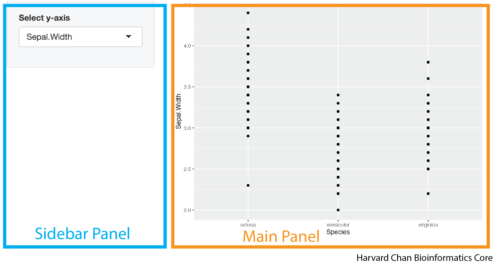

## Learning Objectives

In this lesson, you will:

- Manage the layout of your Shiny app
- Implement different shinythemes

## Introduction 

Until now most of our work has focused on server side implementations of concepts. We have discussed the UI components required to carry the tasks that we want, but we haven't discussed how we want to arrange them. This section will almost exclusively focus on the UI and how to arrange and organize the components of the UI into a visually appealing app.

## Sidebars

It is common in many apps to have the user defined input control on a sidebar to the left and the rendered plots and tables on the right. In the image below we have highlighted what a sidebar panel and main panel might look like in a Shiny App. 

<p align="center"></p>

Creating this structure within a Shiny app utilizes the `sidebarLayout()` function. The `sidebarLayout()` function in your UI defines that your app is using a sidebar panel defined by `sidebarPanel()` and a main panel defined by `mainPanel()`. The `sidebarPanel()` and `mainPanel()` functions are nested inside of your `sidebarLayout()` function. Let's look at the syntax for how to implement this:

```
# DO NOT RUN
ui <- fluidPage(
  sidebarLayout(
    sidebarPanel(
      <objects_in_your_sidebar_panel>
    ),
    mainPanel(
      <objects_in_your_main_panel>
    )
  )
)
```

A sample app demostrating this syntax would look like:

```
# Load libraries
library(shiny)
library(ggplot2)

ui <- fluidPage(
  sidebarLayout(
    sidebarPanel(
      selectInput(inputId = "y_axis_input",
                  label = "Select y-axis",
                  choices = c("Sepal.Length", "Sepal.Width", "Petal.Length", "Petal.Width"))
    ),
    mainPanel(
      plotOutput(outputId = "plot")
    )
  )
)

server <- function(input, output) {
  output$plot <- renderPlot({
    ggplot(iris) +
      geom_point(aes(x = Species,
                     y = .data[[input$y_axis_input]]))
  })
}

shinyApp(ui = ui, server = server)
```

This app would look like:

<p align="center"><iframe src="https://hcbc.connect.hms.harvard.edu/Sidepanel_demo/?showcase=0" width="800px" height="425px" data-external="1"></iframe></p>

> If your sidebar panel appears on top of your main panel, you may need to increase the size of the window your app is in a bit.

## Adding a title

You may want your app to have a title. You can add this with the `titlePanel()` function. The syntax for doing this looks like:

```
# DO NOT RUN
titlePanel("<title_of_your_app>")
```

The default behavior of `titlePanel()` is to left-align the title. If you would like center your title you will need to use an `h1()` function within your `titlePanel()` function. The `h1()` function is borrowed from HTML nomenclature and refers to the largest sized header. The smallest sized header in HTML is `h6()` and the values in between `h1()` and `h6()` (`h2()`, `h3()`, `h4()`, `h5()`) span the range of sizes between `h1()` and `h6()`. Within the `h[1-6]()` family of function, there is an `align` argument that accepts the (`"left"`, `"center"`, and `"right"`) for the alignment. So a center aligned title could look like:

```
# DO NOT RUN
titlePanel(
  h1("<title_of_your_app>", align = "center")
)
```

We can add this title to our previous app:

```
# Load libraries
library(shiny)
library(ggplot2)

ui <- fluidPage(
  titlePanel(
    h1("My iris Shiny App", align = "center")
  ),
  sidebarLayout(
    sidebarPanel(
      selectInput(inputId = "y_axis_input",
                  label = "Select y-axis",
                  choices = c("Sepal.Length", "Sepal.Width", "Petal.Length", "Petal.Width"))
    ),
    mainPanel(
      plotOutput(outputId = "plot")
    )
  )
)

server <- function(input, output) {
  output$plot <- renderPlot({
    ggplot(iris) +
      geom_point(aes(x = Species,
                     y = .data[[input$y_axis_input]]))
  })
}

shinyApp(ui = ui, server = server)
```

This app would now look like:

<p align="center"><iframe src="https://hcbc.connect.hms.harvard.edu/Title_panel_demo/?showcase=0" width="800px" height="500px" data-external="1"></iframe></p>

## Creating columns

We have shown how to use the `sidebarLayout()` function, but we may want to have multiple columns in our app and the `sidebarLayout()` function can't help to much with that. Fortunately, there is the `fluidRow()` function that allows us to divide up the row into columns using the `column()` function nested within it. The first argument within the `column()` function defines the width of the column and the sum of all of the widths of the columns for a given `fluidRow()` function should sum to 12. An example of this syntax would be:

```
# DO NOT RUN
fluidRow(
  column(<width_of_first_column>,
    <objects_in_first_column>
  ),
  column(<width_of_second_column>,
    <objects_in_second_column>
  )
)
```

We could make equally sized columns in our app like:

```
# Load libraries
library(shiny)
library(ggplot2)

ui <- fluidPage(
  titlePanel(
    h1("My iris Shiny App", align = "center")
  ),
  fluidRow(
    column(width = 6,
           h3("First column"),
           selectInput(inputId = "y_axis_input",
                       label = "Select y-axis",
                       choices = c("Sepal.Length", "Sepal.Width", "Petal.Length", "Petal.Width"))
    ),
    column(width = 6,
           h3("Second column"),
           plotOutput(outputId = "plot")
    )
  )
)

server <- function(input, output) {
  output$plot <- renderPlot({
    ggplot(iris) +
      geom_point(aes(x = Species,
                     y = .data[[input$y_axis_input]]))
  })
}

shinyApp(ui = ui, server = server)
```

This app would look like:

<p align="center"><iframe src="https://hcbc.connect.hms.harvard.edu/Fluid_row_demo/?showcase=0" width="800" height="550px" data-external="1"></iframe></p>

>Within the `column()` function, you can also specify the alignment within the column by using the `align` option. When using the `align` option, you can specify the alignment be `"left"`, `"right"` or `"center"`. The syntax for this would look like:
>
>```
>column(width = <width_of_column>,
>       align = "center",
>       <content_of_column>)
>```

### Nested columns

You can also nest `fluidRow()` functions within the `column()` function of another `fluidRow()` function. Once again, the important rule when using `fluidRow()` is that the sum of the `column()`s' width value within *each* `fluidRow()` sums to 12. Let's take a look at some example syntax of how this would look:

```
# DO NOT RUN
fluidRow(
  column(width = <width_of_first_main_column>,
         fluidRow(
           column(width = <width_of_first_subcolumn_of_the_first_main_column>,
                  <objects_in_first_column_first_subcolumn>
           ),
           column(width = <width_of_second_subcolumn_of_the_first_main_column>,
                  <objects_in_first_column_second_subcolumn>
           )
         )
  ),
  column(width = <width_of_second_main_column>,
         <objects_in_second_column>
  )
)
```

We can apply these principles to our app:

```
# Load libraries
library(shiny)
library(ggplot2)

ui <- fluidPage(
  titlePanel(
    h1("My iris Shiny App", align = "center")
  ),
  fluidRow(
    column(width = 7,
           fluidRow(
              column(width = 6,
                     h3("First column: First subcolumn"),
                     selectInput(inputId = "x_axis_input",
                                 label = "Select x-axis",
                                 choices = c("Sepal.Length", "Sepal.Width", "Petal.Length", "Petal.Width"))
              ),
              column(width = 6,
                     h3("First column: Second subcolumn"),
                     selectInput(inputId = "y_axis_input",
                                 label = "Select y-axis",
                                 choices = c("Sepal.Length", "Sepal.Width", "Petal.Length", "Petal.Width"))
              )
           )
    ),
    column(width = 5,
           h3("Second column"),
           plotOutput(outputId = "plot")
    )
  )
)

server <- function(input, output) {
  output$plot <- renderPlot({
    ggplot(iris) +
      geom_point(aes(x = .data[[input$x_axis_input]],
                     y = .data[[input$y_axis_input]]))
  })
}

shinyApp(ui = ui, server = server)
```

This app would look like:

<p align="center"><iframe src="https://hcbc.connect.hms.harvard.edu/Fluid_row_nested_demo/?showcase=0" width="800" height="550px" data-external="1"></iframe></p>

### Multiple Rows

Now that we've seen how to make multiple columns, let's briefly talk about multiple rows. We will treat them like we've treated objects that go underneath one another, by putting complete `fluidRow()` functions underneath each other in our code. An example of this syntax can be seen below:

```
# DO NOT RUN
fluidRow(
  column(width = <width_of_first_column_in_the_first_row>,
         <objects_in_first_column_first_row>
  ),
  column(width = <width_of_second_column_in_the_first_row>,
         <objects_in_second_column_first_row>
  )
),
fluidRow(
  column(width = <width_of_first_column_in_the_second_row>,
         <objects_in_first_column_second_row>
  ),
  column(width = <width_of_second_column_in_the_second_row>,
         <objects_in_second_column_second_row>
  )
)
```

We can apply the concept of multiple rows to our app:

```
# Load libraries
library(shiny)
library(ggplot2)

ui <- fluidPage(
  titlePanel(
    h1("My iris Shiny App", align = "center")
  ),
  fluidRow(
    column(width = 6,
           h3("First Row: First column"),
           selectInput(inputId = "x_axis_input",
                       label = "Select x-axis",
                       choices = c("Sepal.Length", "Sepal.Width", "Petal.Length", "Petal.Width"))
    ),
      column(width = 6,
             h3("First Row: Second column"),
             selectInput(inputId = "y_axis_input",
                         label = "Select y-axis",
                         choices = c("Sepal.Length", "Sepal.Width", "Petal.Length", "Petal.Width"))
    )
  ),
  fluidRow(
      h3("Second Row"),
      plotOutput(outputId = "plot")
  )
)

server <- function(input, output) {
  output$plot <- renderPlot({
    ggplot(iris) +
      geom_point(aes(x = .data[[input$x_axis_input]], 
                     y = .data[[input$y_axis_input]]))
  })
}

shinyApp(ui = ui, server = server)
```

This app would look like:

<p align="center"><iframe src="https://hcbc.connect.hms.harvard.edu/Fluid_row_multiple_rows_demo/?showcase=0" width="800" height="700px" data-external="1"></iframe></p>

## Thematic Breaks

Thematic breaks are a great way to break-up different parts of an app. The function to add a themetic break is also borrowed from HTML and it is called `hr()`. The syntax for using it is very simple:

```
# DO NOT RUN
hr()
```

In the previous example, if we wanted to break up the `selectInput()` functions from the `plotOutput()` function, then we could add a thematic break like:

```
# Load libraries
library(shiny)
library(ggplot2)

ui <- fluidPage(
  titlePanel(
    h1("My iris Shiny App", align = "center")
  ),
  fluidRow(
    column(width = 6,
           h3("First Row: First column"),
           selectInput(inputId = "x_axis_input",
                       label = "Select x-axis",
                       choices = c("Sepal.Length", "Sepal.Width", "Petal.Length", "Petal.Width"))
    ),
    column(width = 6,
           h3("First Row: Second column"),
           selectInput(inputId = "y_axis_input",
                       label = "Select y-axis",
                       choices = c("Sepal.Length", "Sepal.Width", "Petal.Length", "Petal.Width"))
    )
  ),
  hr(),
  fluidRow(
    h3("Second Row"),
    plotOutput(outputId = "plot")
  )
)

server <- function(input, output) {
  output$plot <- renderPlot({
    ggplot(iris) +
      geom_point(aes(x = .data[[input$x_axis_input]],
                     y = .data[[input$y_axis_input]]))
  })
}

shinyApp(ui = ui, server = server)
```

This app would now look like:

<p align="center"><iframe src="https://hcbc.connect.hms.harvard.edu/Fluid_row_multiple_rows_with_break_demo/?showcase=0" width="800" height="750px" data-external="1"></iframe></p>

## Navbar

Within an app, adding a navigation bar can help users more easily move around an app. The syntax for adding a navigation bar looks like:

```
# DO NOT RUN
navbarPage(title = "<title_of_navigation_bar>",
           tabPanel(title = "<title_of_tab_1>",
                    <content_of_tab_1>
           ),
           tabPanel(title = "<title_of_tab_2>",
                    <content_of_tab_2>
           ),
)
```

The use of the `navbarPage()` function lets the Shiny UI know that there will be a nagivation bar on the app. The `tabPanel()` is used within the `navbarPage()` function along with a few other functions that we will explore to define the contents of each tab. An example of this code is shown below:

```
# Load libraries
library(shiny)
library(ggplot2)

ui <- fluidPage(
  navbarPage(title = "My iris dataset",
             tabPanel(title = "Inputs",
                      selectInput(inputId = "x_axis_input",
                                  label = "Select x-axis",
                                  choices = c("Sepal.Length", "Sepal.Width", "Petal.Length", "Petal.Width")),
                      selectInput(inputId = "y_axis_input",
                                  label = "Select y-axis",
                                  choices = c("Sepal.Length", "Sepal.Width", "Petal.Length", "Petal.Width"))
             ),
             tabPanel(title = "Output Plot",
                      plotOutput(outputId = "plot")
             ),
  )
)

server <- function(input, output) {
  output$plot <- renderPlot({
    ggplot(iris) +
      geom_point(aes(x = .data[[input$x_axis_input]],
                     y = .data[[input$y_axis_input]]))
  })
}

shinyApp(ui = ui, server = server)
```

This app would look like:

<p align="center"><iframe src="https://hcbc.connect.hms.harvard.edu/Navbar_demo/?showcase=0" width="800" height="500px" data-external="1"></iframe></p>

Within the `navbarPage()` function there is a `position` argument, with three options:

| Argument | Description |
|----------|-------------|
| `position = "static-top"` | The navigation bar is at the top of the app and when you scroll down it disappears | 
| `position = "fixed-top"` | The navigation bar is at the top of the app and when you scroll down it stays in the frame for the browser window |
| `position = "fixed-bottom"` | The navigation bar is at the bottom of the app and when you scroll down it stays in the frame for the browser window |

### Navigation Bar Menu

Within the navigation bar, we can have a dropdown menu that gives us more options in a list. This would be accomplished using the `navbarMenu()` function, which also utilizes `tabPanel()` function that `navbarPage()` uses. The syntax for using a dropdown menu navigation bar menu is:

```
# DO NOT RUN
navbarPage(title = "<title_of_navigation_bar>",
           navbarMenu(title = "<name_for_dropdown_menu>",
                      tabPanel(title = "<title_of_option_1_in_menu>",
                               <content_of_option_1_in_menu>
                      ),
                      tabPanel(title = "<title_of_option_2_in_menu>",
                               <content_of_option_2_in_menu>
                      )
           )
)
```

A code example of the `navbarMenu()` function can be seen below:

```
# Load libraries
library(shiny)
library(ggplot2)
library(DT)

ui <- fluidPage(
  navbarPage(title = "My iris dataset",
             tabPanel(title = "Inputs",
                      selectInput(inputId = "x_axis_input",
                                  label = "Select x-axis",
                                  choices = c("Sepal.Length", "Sepal.Width", "Petal.Length", "Petal.Width")),
                      selectInput(inputId = "y_axis_input",
                                  label = "Select y-axis",
                                  choices = c("Sepal.Length", "Sepal.Width", "Petal.Length", "Petal.Width"))
             ),
             navbarMenu(title = "Outputs",
                        tabPanel(title = "Plot",
                                 plotOutput(outputId = "plot")
                        ),
                        tabPanel(title = "Table",
                                 DTOutput(outputId = "table")   
                        )
             )
  )
)

server <- function(input, output) {
  output$plot <- renderPlot({
    ggplot(iris) +
      geom_point(aes(x = .data[[input$x_axis_input]], 
                     y = .data[[input$y_axis_input]]))
  })
  output$table <- renderDT({
    iris[,c(input$x_axis_input, input$y_axis_input), drop = FALSE]
  })
}

shinyApp(ui = ui, server = server)
```

This app would look like:

<p align="center"><iframe src="https://hcbc.connect.hms.harvard.edu/Navbar_menu_demo/?showcase=0" width="800" height="600px" data-external="1"></iframe></p>

### Navigation List

In place of of a navigation bar along the top of the window, you can also opt for a list down the side of the app using the `navlistPanel()` in place of the `navbarPage()` function. The syntax for using this style of list looks like:

```
# DO NOT RUN
navlistPanel("<title_of_navigation_list>",
             tabPanel(title = "<title_of_tab_1>",
                      <content_of_tab_1>
             ),
             tabPanel(title = "<title_of_tab_2>",
                      <content_of_tab_2>
             ),
)
```

An example for this code is below:

```
# Load libraries
library(shiny)
library(ggplot2)
library(DT)

ui <- fluidPage(
  navlistPanel("My iris dataset",
               tabPanel(title = "Inputs",
                        selectInput(inputId = "x_axis_input", 
                                    label = "Select x-axis",
                                    choices = c("Sepal.Length", "Sepal.Width", "Petal.Length", "Petal.Width")),
                        selectInput(inputId = "y_axis_input",
                                    label = "Select y-axis",
                                    choices = c("Sepal.Length", "Sepal.Width", "Petal.Length", "Petal.Width"))
               ),
               navbarMenu(title = "Outputs",
                          tabPanel(title = "Plot",
                                   plotOutput(outputId = "plot")
                          ),
                          tabPanel(title = "Table",
                                 DTOutput(outputId = "table")   
                          )
               )
  )
)

server <- function(input, output) {
  output$plot <- renderPlot({
    ggplot(iris) +
      geom_point(aes(x = .data[[input$x_axis_input]],
                     y = .data[[input$y_axis_input]]))
  })
  output$table <- renderDT({
    iris[,c(input$x_axis_input, input$y_axis_input), drop = FALSE]
  })
}

shinyApp(ui = ui, server = server)
```

This would create an app that looks like:

<p align="center"><iframe src="https://hcbc.connect.hms.harvard.edu/Nav_list_panel_demo/?showcase=0" width="800" height="550px" data-external="1"></iframe></p>

> The `navbarMenu()` function also works within `navlistPanel()` just like it works within `navbarPage()`.

## Creating tabs without a navigation bar

An app might require that the user can click on various tabs on a single page. While this could be accomplished with the navigation bar, this can be accomplished by providing different tabs that can easily be embedded within parts of an app using `tabsetPanel()`. The syntax looks like:

```
# DO NOT RUN
tabsetPanel(
  tabPanel(title = "<title_of_tab_1>",
           <content_of_tab_1>
  ),
  tabPanel(title = "<title_of_tab_2>",
           <content_of_tab_2>
  ),
)
```

We will embed this within `mainPanel()` function below, but it doesn't necessarily need to be that way:

```
# Load libraries
library(shiny)
library(ggplot2)
library(DT)

ui <- fluidPage(
  sidebarLayout(
    sidebarPanel(
      selectInput(inputId = "x_axis_input",
                  label = "Select x-axis",
                  choices = c("Sepal.Length", "Sepal.Width", "Petal.Length", "Petal.Width")),
      selectInput(inputId = "y_axis_input",
                  label = "Select y-axis",
                  choices = c("Sepal.Length", "Sepal.Width", "Petal.Length", "Petal.Width"))
    ),
    mainPanel(
      tabsetPanel(
        tabPanel(title = "Plot", 
                 plotOutput(outputId = "plot")
        ),
        tabPanel(title = "Table",
                 DTOutput(outputId = "table")
        )
      )
    )
  )
)

server <- function(input, output) {
  output$plot <- renderPlot({
    ggplot(iris) +
      geom_point(aes(x = .data[[input$x_axis_input]],
                     y = .data[[input$y_axis_input]]))
  })
  output$table <- renderDT({
    iris[,c(input$x_axis_input, input$y_axis_input), drop = FALSE]
  })
}

shinyApp(ui = ui, server = server)
```

This app would look like:

<p align="center"><iframe src="https://hcbc.connect.hms.harvard.edu/Tabset_panel_demo/?showcase=0" width="800" height="650px" data-external="1"></iframe></p>

> The `navbarPage()` function can also be embedded within `mainPanel()`. However, traditionally you will see `navbarPage()` be used to as the banner at the top of the app while `tabsetPanel()` will be used as different tabs within a single tab of `navbarPage()`.

## Shiny Themes

Until now we have used the default UI color scheme within Shiny. However, that is not the only option. There is a package of preset themes that app developers can choose from to make their apps more visually appealing. This package is called `shinythemes` and it has over a [dozen different themes](https://rstudio.github.io/shinythemes/) that app developers can choose from. Implementing a theme is straightforward once you've loaded the `shinythemes` package:

```
ui <- fluidPage(
  theme = shinytheme("<name_of_shiny_theme>"),
  <rest_of_the_ui>
)
```

We can add this to the previous app we made:

```
# Load libraries
library(shiny)
library(ggplot2)
library(DT)
library(shinythemes)

ui <- fluidPage(
  theme = shinytheme("cerulean"),
  navbarPage(title = "My iris dataset",
             tabPanel(title = "Inputs",
             selectInput(inputId = "x_axis_input",
                         label = "Select x-axis",
                         choices = c("Sepal.Length", "Sepal.Width", "Petal.Length", "Petal.Width")),
             selectInput(inputId = "y_axis_input",
                         label = "Select y-axis",
                         choices = c("Sepal.Length", "Sepal.Width", "Petal.Length", "Petal.Width"))
             ),
             navbarMenu(title = "Outputs",
                        tabPanel(title = "Plot",
                                 plotOutput(outputId = "plot")
                        ),
                        tabPanel(title = "Table",
                                 DTOutput(outputId = "table")   
                        )
             )
  )
)

server <- function(input, output) {
  output$plot <- renderPlot({
    ggplot(iris) +
      geom_point(aes(x = .data[[input$x_axis_input]],
                     y = .data[[input$y_axis_input]]))
  })
  output$table <- renderDT({
    iris[,c(input$x_axis_input, input$y_axis_input), drop = FALSE]
  })
}

shinyApp(ui = ui, server = server)
```

This app would look like:

<p align="center"><iframe src="https://hcbc.connect.hms.harvard.edu/Shiny_themes_demo/?showcase=0" width="800" height="600px" data-external="1"></iframe></p>

If you wanted to see how various themes might look on your specific app, instead of in the gallery provided by `shinythemes`, then you can apply them from a selection menu by adding this code to your app:

```
# DO NOT RUN
ui <- fluidPage(
  themeSelector(),
  <rest_of_the_ui>
)
```

---

## [**Exercise 1**](layouts-Answer_key.md#exercise-1)

Lets add a layout to the R Shiny app from the exercise a previous lesson. That app should look like:

```
# Load libraries
library(shiny)
library(DT)
library(ggplot2)

# User Interface
ui <- fluidPage(
  # Upload the file
  fileInput(inputId = "input_file",
            label = "Upload file"),
  # Select from the dropdown menu the column you want on the x-axis
  selectInput(inputId = "x_axis_input",
              label = "Select x-axis",
              choices = c("Sepal.Length", "Sepal.Width", "Petal.Length", "Petal.Width")),
  # Select from the dropdown menu the column you want on the y-axis
  selectInput(inputId = "y_axis_input",
              label = "Select y-axis",
              choices = c("Sepal.Length", "Sepal.Width", "Petal.Length", "Petal.Width")),
  # The output plot
  plotOutput(outputId = "plot"),
  # The download plot button
  downloadButton(outputId = "download_button",
                 label = "Download the data .png")
)

# Server
server <- function(input, output) {
  # Reactive expression to hold the uploaded data 
  iris_data <- reactive({
    req(input$input_file)
    read.csv(input$input_file$datapath)
  })
  # Reactive expression to create a scatterplot from the uploaded data and user selected axes
  iris_plot <- reactive ({
  ggplot(iris_data()) +
    geom_point(aes(x = .data[[input$x_axis_input]],
                   y = .data[[input$y_axis_input]]))
  })
  # Render the plot from the iris_plot() reactive expression
  output$plot <- renderPlot({
    iris_plot()
  })
  # Download the data
  output$download_button <- downloadHandler(
    # The placeholder name for the file will be called iris_plot.png
    filename = function() {
      "iris_plot.png"
    },
    # The content of the file will be the contents of the iris_plot() reactive expression
    content = function(file) {
      ggsave(
      filename = file,
      plot = iris_plot()
      )
    }
  )
}

# Run the app
shinyApp(ui = ui, server = server)
```

We are going to try to create an app that looks like:

<p align="center"><iframe src="https://hcbc.connect.hms.harvard.edu/layout_exercise_demo/" width="800px" height="600px" data-external="1"></iframe></p>

1. Place the `fileInput()` and `selectInput()`s within a sidebar with the plot in the `mainPanel()`. Underneath the `sidepanelLayout()`, place a themetic break and underneath that place a right aligned `downloadButton()`.

2. Add the `"superhero"` theme from `shinythemes` to the app.

*Hint: Be sure to add `library(shinythemes)` and make sure it is loaded.*

---

[Back to Schedule](../README.md)
