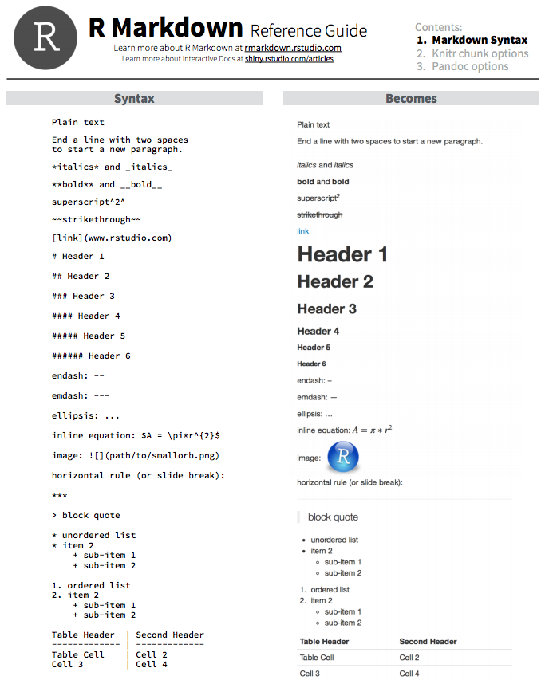
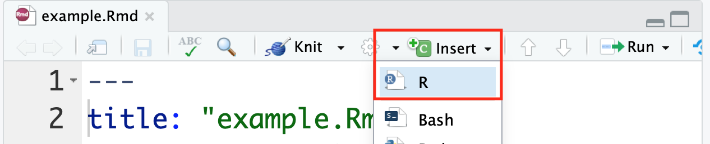
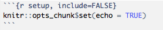
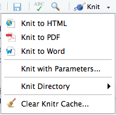

## Learning Objectives

* What is RMarkdown?
* What are the uses of RMarkdown 
* Creating html reports using knitr

# Generating research analysis reports with RMarkdown
 
For any experimental analysis, it is critical to keep detailed notes for the future reproduction of the experiment and for the interpretation of results. For laboratory work, lab notebooks allow us to organize our methods, results, and conclusions to allow for future retrieval and reproduction. Computational analysis requires the same diligence, but it is often easy to forget to completely document the analysis and/or interpret the results in a transparent fashion. 
 
For analyses within R, RStudio helps facilitate reproducible research with the use of R scripts, which can be used to save all code used to perform a particular analysis. However, we often don't save the version of the tools we use in a script, nor do we include or interpret the results of the analyses within the script.

Wouldn't it be nice to be able to save/share the code with collaborators along with tables, figures, and text describing the interpretation in a single, cleaned up report file? 

The [knitr](https://yihui.name/knitr/) package, developed by [Yihui Xie](https://yihui.name), is designed to generate reports within RStudio. It enables dynamic generation of multiple file formats from an [RMarkdown](http://rmarkdown.rstudio.com/) file, including HTML and PDF documents. Knit report generation is now integrated into RStudio, and can be accessed using the GUI or console.

In this workshop we will become familiar with both `knitr` and the RMarkdown language. We will then use them to generate a short HTML report that can be viewed in a web browser. 

Before we start, let's take a look at a "knitted" HTML report and the RMarkdown file used to generate it. 
* [Final report of differential expression analysis](https://www.dropbox.com/s/vlqstxylwjry3cb/workshop-example.html?dl=1) 
* [RMarkdown file that was used to create the above report](https://www.dropbox.com/s/irwv6v9dd5fywrz/workshop-example.Rmd?dl=1)

## RMarkdown basics

The [Markdown language](https://en.wikipedia.org/wiki/Markdown) for formatting plain text format has been adopted by many different coding groups, and some have added their own "flavours". RStudio implements something called **"R-flavoured markdown" or "RMarkdown"** which has really nice features for text and code formatting as described below.

As RMarkdown grows as an acceptable [reproducible manuscript](https://elifesciences.org/labs/cad57bcf/composing-reproducible-manuscripts-using-r-markdown) format, using `knitr` to generate a report summary is becoming common practice. 

### Text

The syntax to format the text portion of the report is relatively easy. You can easily get text that is **bolded**, *italicized*, ***bolded & italicized***. You can create "headers" and "sub-headers" by placing an "#" or "##" and so on in front of a line of text, generate numbered and bulleted lists, add hyperlinks to words or phrases, and so on.

Let's take a look at the syntax of how to do this in RMarkdown before we move on to formatting and adding code chunks:



You can also get more information about text formatting [here](http://rmarkdown.rstudio.com/lesson-1.html) and [here](http://rmarkdown.rstudio.com/authoring_basics.html).

### Code chunks

The basic idea is that you can write your analysis workflow in plain text and intersperse chunks of R code delimited with a special marker (\`\`\`). Backticks (\`) commonly indicate code and are also used for formatting on [GitHub](https://github.com). 

Each individual code chunk should be given a **unique** name. [knitr](https://yihui.name/knitr/) isn't very picky how you name the code chunks, but we recommend using `snake_case` for the names whenever possible. 


There is a handy `Insert` button within RStudio that allows for the insertion of an empty R chunk if desired.



Additionally, you can write inline R code enclosed by single backticks (\`) containing a lowercase `r` (like \`\`\` code chunks). This allows for variable returns outside of code chunks, and is extremely useful for making report text more dynamic. For example, you can print the current date inline within the report with this syntax: `` `r Sys.Date()` `` (no spaces).

### Options for code chunks

The knitr package provides a lot of customization options for code chunks, which are written in the form of `tag=value`.


There is a [comprehensive list](https://yihui.org/knitr/options/) of all the options available, however when starting out this can be overwhelming. Here, we provide a short list of some options commonly use in chunks:

* `echo = TRUE`: whether to include R source code in the final document. If echo = FALSE, R source code will not be written into the final document. But the code is still evaluated and its output will be included in the final document
* `eval = TRUE`: whether to evaluate/execute the code 
* `include = TRUE`: whether to include R source code and its output in the final document. If include = FALSE, nothing (R source code and its output) will be written into the final document. But the code is still evaluated and plot files are generated if there are any plots in the chunk
* `warning = TRUE`: whether to preserve warnings in the output like we run R code in a terminal (if FALSE, all warnings will be printed in the console instead of the output document)
* `message = TRUE`: whether to preserve messages emitted by message() (similar to warning)
* `results = "asis"`: output as-is, i.e., write raw results from R into the output document instead of LaTeX-formatted output. Another useful option for this option is "hide", which will hide the results, or all normal R output

### The setup chunk

The `setup` chunk is a special knitr chunk that should be placed at the start of the document. We recommend storing all `library()` loads required for the script and other `load()` requests for external files here. In our RMarkdown templates, such as the bcbioRnaseq [differential expression template](DE_template.Rmd), we store all the user-defined parameters in the `setup` chunk that are required for successful knitting.



### Global options

knitr allows for global options to be set on all chunks in an RMarkdown file. These are options that should be placed inside your `setup` chunk at the top of your RMarkdown document. These will be the default options used for all the code chunks in the document, however they can be modified for each code chunk.

```r
opts_chunk$set(
    autodep = TRUE,
    cache = TRUE,
    cache.lazy = TRUE,
    dev = c("png", "pdf", "svg"),
    error = TRUE,
    fig.height = 6,
    fig.retina = 2,
    fig.width = 6,
    highlight = TRUE,
    message = FALSE,
    prompt = TRUE,
    tidy = TRUE,
    warning = FALSE)
```

An additional cool trick is that you can save `opts_chunk$set` settings in `~/.Rprofile` and these knitr options will apply to all of your RMarkdown documents, and not just the one.

### Figures

A neat feature of knitr is how much simpler it makes generating figures. You can simply return a plot in a chunk, and knitr will automatically write the files to disk, in an organized subfolder. By specifying options in the `setup` chunk, you can have R automatically save your plots in multiple file formats at once, including PNG, PDF, and SVG. A single chunk can support multiple plots, and they will be arranged in squares below the chunk in RStudio.

There are also a few options commonly used for plots to easily resize the figures in the final report. You can specify the height and width of the figure when setting up the code chunk.


### Tables

knitr includes a simple but powerful function for generating stylish tables in a knit report named `kable()`. Here's an example using R's built-in `mtcars` dataset:

```r
help("kable", "knitr")
mtcars %>%
    head %>%
    kable
```

|                   |   mpg|  cyl|  disp|   hp|  drat|     wt|   qsec|   vs|   am|  gear|  carb|
|-------------------|-----:|----:|-----:|----:|-----:|------:|------:|----:|----:|-----:|-----:|
| Mazda RX4         |  21.0|    6|   160|  110|  3.90|  2.620|  16.46|    0|    1|     4|     4|
| Mazda RX4 Wag     |  21.0|    6|   160|  110|  3.90|  2.875|  17.02|    0|    1|     4|     4|
| Datsun 710        |  22.8|    4|   108|   93|  3.85|  2.320|  18.61|    1|    1|     4|     1|
| Hornet 4 Drive    |  21.4|    6|   258|  110|  3.08|  3.215|  19.44|    1|    0|     3|     1|
| Hornet Sportabout |  18.7|    8|   360|  175|  3.15|  3.440|  17.02|    0|    0|     3|     2|
| Valiant           |  18.1|    6|   225|  105|  2.76|  3.460|  20.22|    1|    0|     3|     1|

There are some other functions that allow for more powerful customization of tables, including `pander::pander()` and `xtable::xtable()`, but the simplicity and cross-platform reliability of `knitr::kable()` makes it an easy pick.


### Generating the report

As the final chunk in the analysis, it is recommended to run the `sessionInfo()` function. This function will output the R version and the versions of all libraries loaded in the R environment. The versions of the tools used is important information for reproduction of your analysis in the future.

Once we've finished creating an RMarkdown file containing code chunks, we finally need to knit the report. You can knit it by using the `knit()` function, or by just clicking on "knit" in the panel above the script.

When executing `knit()` on a document, by default this will generate an HTML report. If you would prefer a different document format, this can be specified in the YAML header with the `output:` parameter. You can also click on the button in the panel above the script and click on "Knit" to get the various options as shown below:



> **Note**: *PDF rendering is sometimes problematic, especially when running R remotely, like on the cluster (Odyssey or O2). If you run into problems, it's likely an issue related to [pandoc](http://pandoc.org).*

The [RStudio cheatsheet for Rmarkdown](https://github.com/rstudio/cheatsheets/blob/master/rmarkdown-2.0.pdf) is quite daunting, but includes more advanced Rmarkdown options that may be helpful as you become familiar with report generation, including options for adding interactive plots RShiny.

## Generating an RMarkdown knit report!

#### Activity 1

1. **Create a new project** in a new directory called `rmd_workshop`
2. **Download [this RMarkdown file](https://raw.githubusercontent.com/hbctraining/Training-modules/master/Rmarkdown/data/workshop-example.Rmd)** and save within the `rmd_workshop` project directory
3. **Download and uncompress [this data folder](data/data.zip?raw=true)** within the project directory
4. **Open the .rmd file** in RStudio
5. **knit the markdown** 

___

#### Activity 2

1. Only some of the code chunks have names; go through and **add names to the unnamed code chunks**.
2. For the code chunk named `data-ordering` do the following:
    - First, **add a new line of code** that displays a small part of the newly created `data_ordered` data frame using `head()`
    - Next, **modify the options (`{r data-ordering}`)** such that the output from the new line of code shows up in the report, but not the code
3. Without removing the last code chunk (for boxplot) from the Rmd file, **modify its options** such that neither the code nor its output appear in the report
4. **knit the markdown** 

___

#### Activity 3

1. **Add a new section header** in the same size as the "Project details" header at the end
2. Next, **add a new code chunk** below it to display the output of `sessionInfo()`
3. **Modify the `Author` and `Title`** parameters at the top of the script
4. **knit the markdown** 

___

#### Activity 4

1. **Download the linked [R script](https://github.com/hbctraining/Training-modules/raw/master/Rmarkdown/Rscript.R)**
2. **Download the linked [RData object](https://github.com/hbctraining/Training-modules/raw/master/Rmarkdown/data/Rmarkdown_data.Rdata)** by right-clicking and save to `data` folder.
3. **Transform the R script into a new RMarkdown file** with the following specifications:
    - Create an R chunk for all code underneath each `#` comment in the original R script
    - Comment on the plots (you may have to run the code from the R script to see the plots first)
    - Add a floating table of contents
4. **knit the markdown** 

***

> **Note1: output formats**
> 
> RStudio supports a [number of formats](http://rmarkdown.rstudio.com/formats.html), each with their own customization options. Consult their website for more details.
> 
> The `knit()` command works great if you only need to generate a single document format. RMarkdown also supports a more advanced function named `rmarkdown::render()`, allows for output of multiple document formats. To accomplish this, we recommend saving a special file named `_output.yaml` in your project root. Here's an example from our [bcbioRnaseq](https://github.com/hbc/bcbioRnaseq) package:
>
> ```r
> rmarkdown::html_document:
>         code_folding: hide
>         df_print: kable
>         highlight: pygments
>         number_sections: false
>         toc: true
> rmarkdown::pdf_document:
>         number_sections: false
>         toc: true
>         toc_depth: 1
> ```

***

> **Note2: working directory behavior**
> 
> knitr redefines the working directory of an RMarkdown file in a manner that can be confusing. If you're working in RStudio with an RMarkdown file that is not at the same location as the current R working directory (`getwd()`), you can run into problems with broken file paths. Make sure that any paths to files specified in the RMarkdown document is relative to its location, and not your current working directory.
> 
> A simple way to make sure that the paths are not an issue is by creating an R project for the analysis, and saving all RMarkdown files at the top level and referring to the data and output files within the project directory. This will prevent unexpected problems related to this behavior.

***

**Additional resources**
================

-   [knitr in a knutshell](http://kbroman.org/knitr_knutshell/)
-   [knitr book](https://www.amazon.com/gp/product/1498716962)
-   [knitr examples](https://yihui.name/knitr/demos)
-   [knitr vignettes](https://github.com/yihui/knitr/tree/master/vignettes)

***

*This lesson has been developed by members of the teaching team and Michael J. Steinbaugh at the [Harvard Chan Bioinformatics Core (HBC)](http://bioinformatics.sph.harvard.edu/). These are open access materials distributed under the terms of the [Creative Commons Attribution license](https://creativecommons.org/licenses/by/4.0/) (CC BY 4.0), which permits unrestricted use, distribution, and reproduction in any medium, provided the original author and source are credited.*
