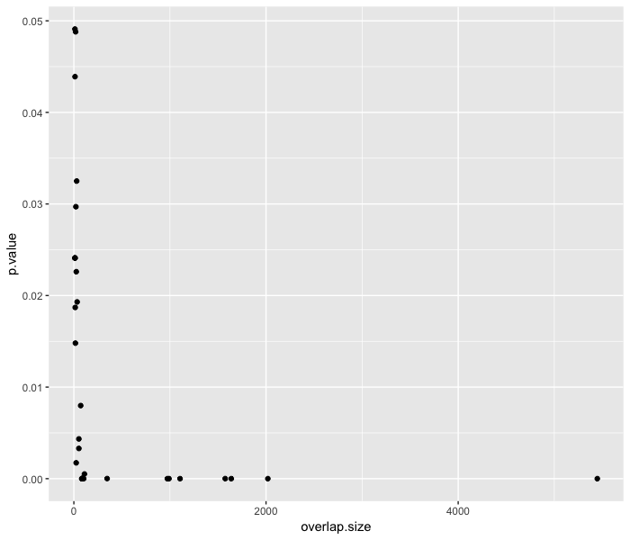
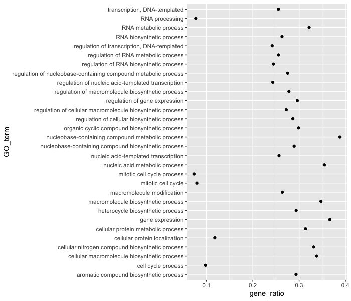
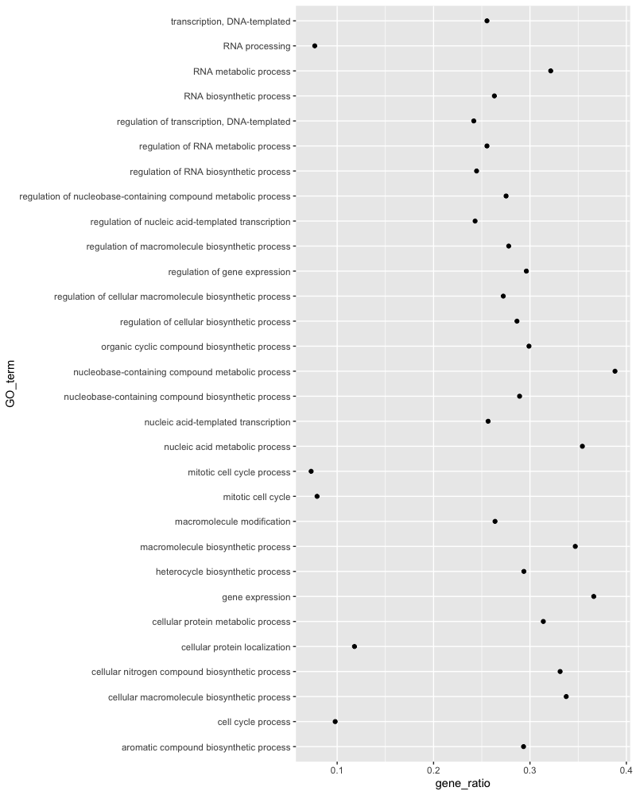
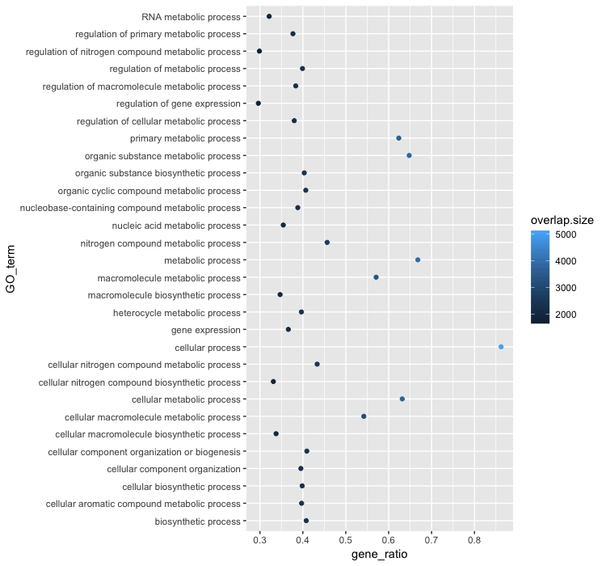
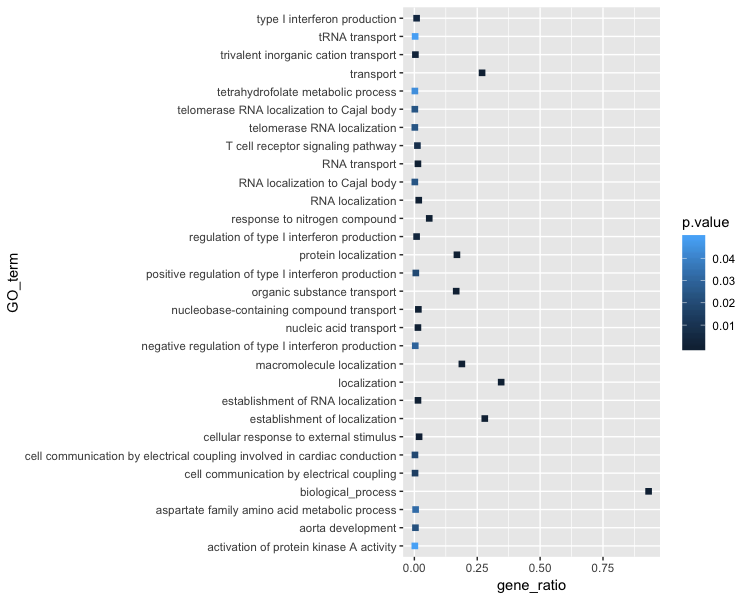
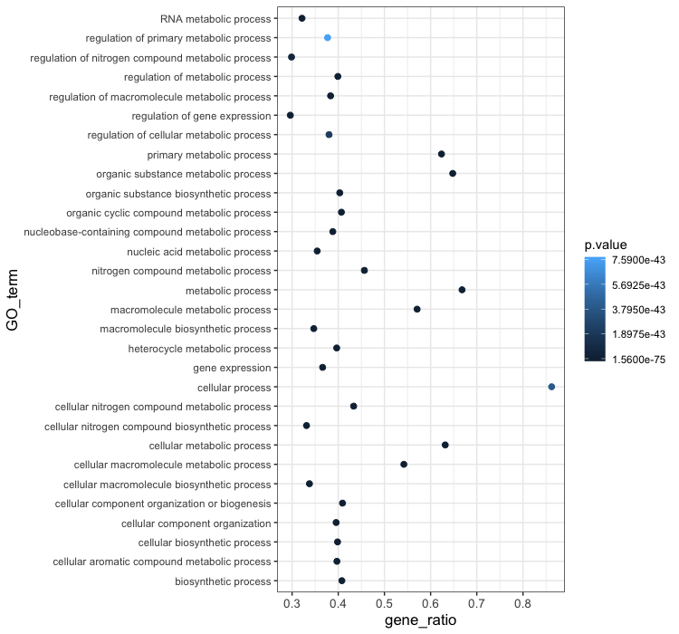
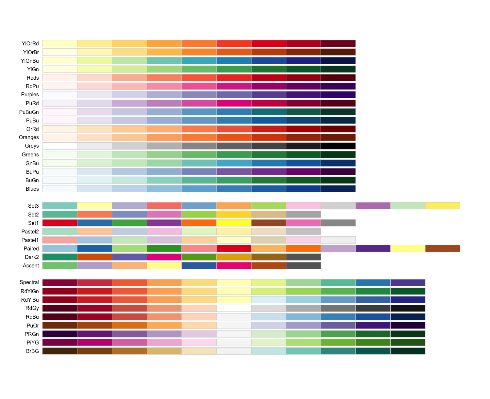
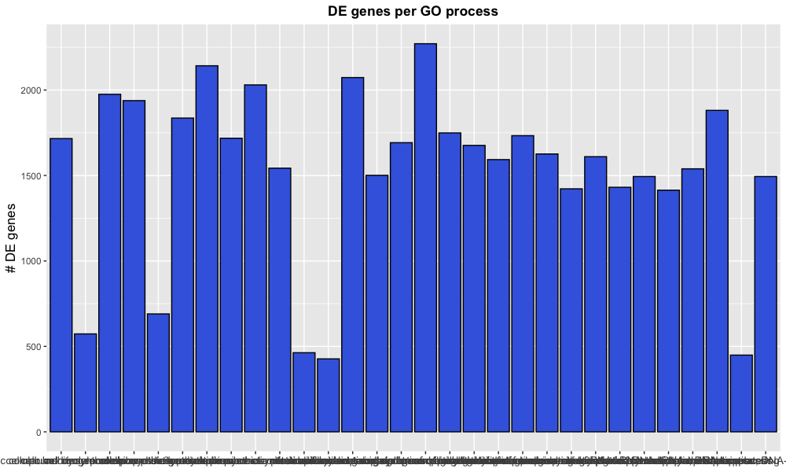
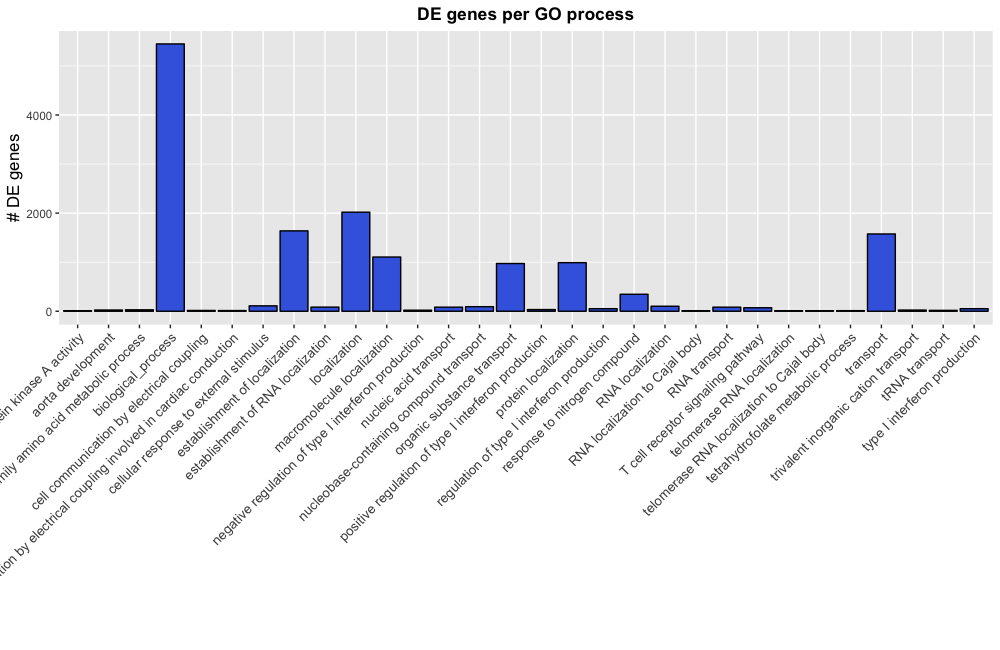
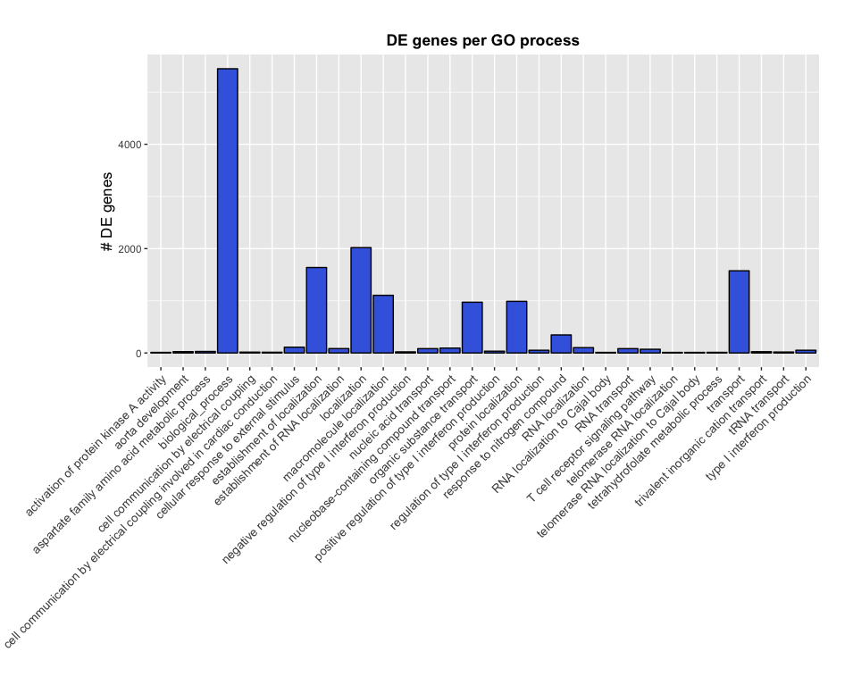

Approximate time: 90 minutes

## Learning Objectives 

* Explain the grammar of graphics syntax used by ggplot2
* Determine how to plot different types of graphs with ggplot2 depending on the number and type of variables
* Export plots for use outside of the R environment.

## Data Visualization with `ggplot2`

When we are working with large sets of numbers it can be useful to display that information graphically to gain more insight. Visualization deserves an entire course of its own (there is that much to know!). In this lesson we will be plotting with the popular package [`ggplot2`](http://docs.ggplot2.org/).

More recently, R users have moved away from base graphic options towards `ggplot2` since it offers a lot more functionality as compared to the base R plotting functions. The `ggplot2` syntax takes some getting used to, but once you get it, you will find it's extremely powerful and flexible. We will start with drawing a simple x-y scatterplot of `gene_ratio` versus `GO_term` from the `bp_oe` tibble. `ggplot2` expects that the information being plotted is contained in a data frame or tibble (data frame-like).

We would typically start by loading the `ggplot2` library, but it is a part of the `tidyverse` suite, so it was loaded in the last lesson.

**ggplot2 syntax:** To **initialize the basic graph structure** with this package we have to use the `ggplot()`, then we add "layers" to it using the `+` operator. The idea is that you create a basic plot first, then additional functions are added on to build the final plot.

Let's start by first subsetting the `bp_oe` dataframe to only contain the top 30 most significant GO terms: 

```r
## Visualizing data with ggplot2

# Subset data frame
bp_plot <- bp_oe[1:30, ]

ggplot(bp_plot) # what happens? 
```

You get a blank plot, because you need to **specify layers** using the `+` operator.

One type of layer is **geometric objects**. This is a mandatory layer and it specifies what type of plot you are interested in making. Examples include:

* points (`geom_point()`, `geom_jitter()` for scatter plots, dot plots, etc)
* lines (`geom_line()`, for time series, trend lines, etc)
* boxplot (`geom_boxplot()`, for, well, boxplots!)

For a more exhaustive list on all possible geometric objects and when to use them check out [Hadley Wickham's RPubs](http://rpubs.com/hadley/ggplot2-layers) or the [RStudio cheatsheet](https://www.rstudio.com/wp-content/uploads/2016/11/ggplot2-cheatsheet-2.1.pdf). 

A plot **must have at least one `geom`**, and there can be multiple complementary `geom`s; there is no upper limit. 

Let's add a `geom` to make a scatter plot, i.e. the `geom_point()` function

```r
ggplot(bp_plot) +
  geom_point() 
```

You will find that even though we have added a layer by specifying `geom_point`, we get an error. This is because each type of geom usually has a required set of **aesthetics**. Aesthetic mappings are set with the `aes()` function which can be nested within the `geom` function and can be set inside `geom_point()` to be specifically applied to that layer. If we supplied aesthetics within `ggplot()`, they will be used as defaults for every layer. Below are some examples of what is categorized as aesthetics in the ggplot2 context:

* position (i.e., on the x and y axes)
* color ("outside" color)
* fill ("inside" color) 
* shape (of points)
* linetype
* size

To start, we will specify the columns for the x- and y-axis since `geom_point()` requires the most basic information about a scatterplot, i.e. what you want to plot on the x and y axes.

Typically, a scatterplot is used to illustrate the relationship between two numeric variables. The x-axis represents the independent variable and the y-axis represents the dependent variable. We can test this out using two numeric columns from our `bp_plot` tibble:

```r
ggplot(bp_plot) +
  geom_point(aes(x = overlap.size, y = p.value))
```

 

However, instead of a scatterplot with numeric values on both axes, we would like to create a dotplot for visualizing the top 30 functional categories in our dataset, and how prevalent they are. Basically, we want a dotplot for visualizing functional analysis data, which plots the gene ratio values on the x-axis and the GO terms on the y-axis.

Let's see what happens when we add a non-numeric value to the y-axis and change the x-axis to the "gene_ratio" column:

```r
ggplot(bp_plot) +
  geom_point(aes(x = gene_ratio, y = GO_term))
```



Now that we have the required aesthetics, let's add some extras like color to the plot. Let's say we wanted *to quickly visualize significance of the GO terms* in the plot, we can **`color` the points on the plot based on p-values**, by specifying the column header.

```r
ggplot(bp_plot) +
  geom_point(aes(x = gene_ratio, y = GO_term, color = p.value))
```

 

You will notice that there are a default set of colors that will be used so we do not have to specify which colors to use. Also, the **legend has been conveniently plotted for us!**

Alternatively, we could color number of DE genes associated with each term (`overlap.size`). 

```r
ggplot(bp_plot) +
  geom_point(aes(x = gene_ratio, y = GO_term, color = overlap.size))
```

 

Moving forward, we are going to stick with coloring the dots based on the p.value column. Let's explore some of the other arguments that can be specified in the `geom` layer.

To modify the **size of the data points** we can use the `size` argument. 
* If we add `size` inside `aes()` we could assign a numeric column to it and the size of the data points would change according to that column. 
* However, if we add `size` inside the `geom_point()` but outside `aes()` we can't assign a column to it, instead we have to give it a numeric value. This use of `size` will uniformly change the size of all the data points.

> **Note:** This is true for several arguments, including `color`, `shape` etc. E.g. we can change all shapes to square by adding this argument to be outside the `aes()` function; if we put the argument inside the `aes()` function we could change the shape according to a (categorical) variable in our data frame or tibble.

We have decided that we want to change the size of all the data point to a uniform size instead of typing it to a numeric column in the input tibble. Add in the `size` argument by specifying a number for the size of the data point:

```
ggplot(bp_plot) +
  geom_point(aes(x = gene_ratio, y = GO_term, , color = p.value), 
             size = 2)
```

> **Note:** The size of the points is personal preference, and you may need to play around with the parameter to decide which size is best. That seems a bit too small, so we can try out a slightly larger size. 

As we do that, let's see how we can change the shape of the data point. Different shapes are available, as detailed in the [RStudio ggplot2 cheatsheet](https://www.rstudio.com/wp-content/uploads/2015/03/ggplot2-cheatsheet.pdf). Let's explore this parameter by changing all of the points to squares:

```r
ggplot(bp_plot) +
  geom_point(aes(x = gene_ratio, y = GO_term, , color = p.value), 
             size = 2, 
             shape = "square")
```

 

Now we can start updating the plot to suit our preferences for how we want the data displayed. The labels on the x- and y-axis are also quite small and not very descriptive. To change their size and labeling, we need to add additional **theme layers**. The ggplot2 `theme()` system handles modification of non-data plot elements such as:

* Axis label aesthetics
* Plot background
* Facet label backround
* Legend appearance

There are built-in themes that we can use (i.e. `theme_bw()`) that mostly change the background/foreground colours, by adding it as additional layer. Alternatively, we can adjust specific elements of the current default theme by adding a `theme()` layer and passing in arguments for the things we wish to change. Or we can use both, a built-in theme layer and a custom theme layer!

Let's add a built-in theme layer `theme_bw()` first. 

```r
ggplot(bp_plot) +
  geom_point(aes(x = gene_ratio, y = GO_term, , color = p.value), 
             size = 2) +
  theme_bw()
```
***Do the axis labels or the tick labels get any larger by changing themes?***

Not in this case. But we can add arguments using `theme()` to change it ourselves. Since we are adding this layer on top (i.e later in sequence), any features we change will override what is set in the `theme_bw()`. Here we'll **increase the size of the axes labels to be 1.15 times the default size and the x-axis tick labels to be 1.15 times the default.** 

```r
ggplot(bp_plot) +
  geom_point(aes(x = gene_ratio, y = GO_term, color = p.value), 
             size = 2) +
  theme_bw() +
  theme(axis.text.x = element_text(size=rel(1.15)),
        axis.title = element_text(size=rel(1.15)))
```


 
> **Note #1:** When modifying the size of text we often use the `rel()` function to specify the size we want relative to the default. We can also provide a numeric value as we did with the data point size, but it can be cumbersome if you don't know what the default font size is to begin with. 
>
> **Note #2:** You can use the `example("geom_point")` function here to explore a multitude of different aesthetics and layers that can be added to your plot. As you scroll through the different plots, take note of how the code is modified. You can use this with any of the different `geom` layers available in `ggplot2` to learn how you can easily modify your plots! 
> 
> **Note #3:** RStudio provides this very [useful cheatsheet](https://www.rstudio.com/wp-content/uploads/2016/11/ggplot2-cheatsheet-2.1.pdf) for plotting using `ggplot2`. Different example plots are provided and the associated code (i.e which `geom` or `theme` to use in the appropriate situation.)
> 

***

**Exercises**

1. The current axis label text defaults to what we gave as input to `geom_point` (i.e the column headers). We can change this by **adding additional layers** called `xlab()` and `ylab()` for the x- and y-axis, respectively. Add these layers to the current plot such that:
	- **x-axis label:** "Gene ratios"
	- **y-axis label:** "Top 30 significant GO terms"
2. Add a `ggtitle()` layer to add a title to your plot. 

*NOTE: Useful code to center your title over your plot can be done using `theme(plot.title=element_text(hjust=0.5, face = "bold"))`.*


***

### Customizing data point colors

The plot is looking better, but it is hard to distinguish differences in significance based on the colors used. There are cheatsheets available for specifying the base R colors by [name](https://greggilbertlab.sites.ucsc.edu/teaching/rtransition/) or [hexadecimal](http://www.r-graph-gallery.com/41-value-of-the-col-function/) code. We could specify other colors available or use pre-created color palettes from an external R package. 

To make additional color palettes available for plotting, we can load the RColorBrewer library, which contains color palettes designed specifically for the different types of data being compared.

```r
# Load the RColorBrewer library
library(RColorBrewer)

# Check the available color palettes
display.brewer.all()
```



The output is separated into three sections based on the suggested palettes for sequential, qualitative, and diverging data. 

- **Sequential palettes (top):** For sequential data, with lighter colors for low values and darker colors for high values.
- **Qualitative palettes (middle):** For categorical data, where the color does not denote differences in magnitude or value.
- **Diverging palettes (bottom):** For data with emphasis on mid-range values and extremes.

Since our adjusted p-values are sequential, we will choose from these palettes. Let's go with the "Yellow, orange, red" palette. We can choose how many colors from the palette to include, which may take some trial and error. We can test the colors included in a palette by using the `display.brewer.pal()` function, and changing if desired:

```r
# Testing the palette with six colors
display.brewer.pal(6, "YlOrRd")
```

The yellow might be a bit too light, and we might not need so many different colors. Let's test with three different colors:

```r
# Testing the palette with three colors
display.brewer.pal(3, "YlOrRd")

# Define a palette
mypalette <- brewer.pal(3, "YlOrRd")

# how are the colors represented in the mypalette vector?
mypalette
```

Those colors look okay, so let's test them in our plot. We can add a color scale layer, and most often one of the following two scales will work:

- **`scale_color_manual()`:** for categorical data or quantiles
- **`scale_color_gradient()` family:** for continuous data. 

By default, `scale_color_gradient()` creates a two color gradient from low to high. Since we plan to use more colors, we will use the more flexible `scale_color_gradientn()` function. To make the legend a bit cleaner, we will also perform a -log10 transform on the p-values (higher values means more significant).

```r
ggplot(bp_plot) +
  geom_point(aes(x = gene_ratio, y = GO_term, color = -log10(p.value)), 
             size = 2) +
  theme_bw() +
  theme(axis.text.x = element_text(size=rel(1.15)),
        axis.title = element_text(size=rel(1.15))) +
  xlab("Gene ratios") +
  ylab("Top 30 significant GO terms") +
  ggtitle("Dotplot of top 30 significant GO terms") +
  theme(plot.title = element_text(hjust=0.5, 
  	face = "bold")) +
  scale_color_gradientn(colors = mypalette)
			 
```

This looks good, but we want to add better name for the legend and we want to make sure the legend title is centered and bold. To do this, we can add a `name` argument to `scale_color_gradientn()` and a new theme layer for the legend title.

```r
ggplot(bp_plot) +
  geom_point(aes(x = gene_ratio, y = GO_term, color = -log10(p.value)), 
             size = 2) +
  theme_bw() +
  theme(axis.text.x = element_text(size=rel(1.15)),
        axis.title = element_text(size=rel(1.15))) +
  xlab("Gene ratios") +
  ylab("Top 30 significant GO terms") +
  ggtitle("Dotplot of top 30 significant GO terms") +
  theme(plot.title = element_text(hjust=0.5, 
  	face = "bold")) +
  scale_color_gradientn(name = "Significance \n (-log10(padj))", colors = mypalette) +
  theme(legend.title = element_text(size=rel(1.15),
	hjust=0.5, 
	face="bold"))
			 
```


***
**Exercises**

1. Arrange `bp_oe` by `term_percent` in descending order.
2. Create a dotplot with the top 30 GO terms with highest `term_percent`, with `term_percent` as x-axis and `GO_term` as the y-axis.
3. [Optional] Color the plot using the palette of your choice.

***

So far we have explored many layers that can be added to any plot with the ggplot2 package. However, we haven't explored the different `geom`s available. The type of data you are plotting will determine the type of `geom` needed, but a nice summary of the main `geom`s is available on the [RStudio ggplot2 cheatsheet](https://www.rstudio.com/wp-content/uploads/2016/11/ggplot2-cheatsheet-2.1.pdf).

Let's explore different `geom`s by creating a couple of different plots. We'll start with a bar plot of the number of genes per category. We can start with the most basic plot by specifying the dataframe, geom, and aesthetics. 

```r
ggplot(bp_plot) +
  geom_col(aes(x = GO_term, y = overlap.size))
```


This is a good base to start from, now let's start to customize. To add color to the bars, we can use the `fill` argument, and if we would like to add an outline color to the bars, we can use the `color` argument.

```r
ggplot(bp_plot) +
  geom_col(aes(x = GO_term, y = overlap.size),
           fill = "royalblue",
           color = "black")
```

Then we can provide our theme preferences, give the plot a title, and label our axes:

```r
ggplot(bp_plot) +
  geom_col(aes(x = GO_term, y = overlap.size),
           fill = "royalblue",
           color = "black") +
  theme(axis.text.x = element_text(size=rel(1.15)),
        axis.title = element_text(size=rel(1.15))) +
  theme(plot.title = element_text(hjust=0.5, 
                                  face = "bold")) +
  labs(title = "DE genes per GO process", x = NULL, y =  "# DE genes")
```



Note that instead of using the functions `xlab()`, `ylab()`, and `ggtitle()`, we can provide all as arguments to the `labs()` function.

Now we might be fairly happy with our plot, but the x-axis labelling needs some help. Within the `theme()` layer, we can change the orientiation of the x-axis labels with the `angle` argument and align the labels to the x-axis with the `hjust` argument.

```r
ggplot(bp_plot) +
  geom_col(aes(x = GO_term, y = overlap.size),
           fill = "royalblue",
           color = "black") +
  theme(axis.text.x = element_text(size=rel(1.15)),
        axis.title = element_text(size=rel(1.15))) +
  theme(plot.title = element_text(hjust=0.5, 
                                  face = "bold")) +
  labs(title = "DE genes per GO process", x = NULL, y =  "# DE genes") +
  theme(axis.text.x = element_text(angle = 45, hjust = 1))
```



This is almost what we were looking for, but the labels are getting cut-off because the plotting area is too small. The `plot.margin` argument of the theme's `element_text()` function can be used to alter the plotting dimensions to make room for our labels.

```r
ggplot(bp_plot) +
  geom_col(aes(x = GO_term, y = overlap.size),
           fill = "royalblue",
           color = "black") +
  theme(axis.text.x = element_text(size=rel(1.15)),
        axis.title = element_text(size=rel(1.15))) +
  theme(plot.title = element_text(hjust=0.5, 
                                  face = "bold")) +
  labs(title = "DE genes per GO process", x = NULL, y =  "# DE genes") +
  theme(axis.text.x = element_text(angle = 45, 
                                   hjust = 1)) + 
  theme(plot.margin = unit(c(1,1,1,3), "cm"))
```



>**NOTE:** If we wanted to remove the space between the x-axis and the labels, we could add an additional layer for `scale_y_continuous(expand = c(0, 0))`, which would not expand the y-axis past the plotting limits.
  
### Exporting figures to file

There are two ways in which figures and plots can be output to a file (rather than simply displaying on screen). The first (and easiest) is to export directly from the RStudio 'Plots' panel, by clicking on `Export` when the image is plotted. This will give you the option of `png` or `pdf` and selecting the directory to which you wish to save it to. It will also give you options to dictate the size and resolution of the output image.

The second option is to use R functions and have the write to file hard-coded in to your script. This would allow you to run the script from start to finish and automate the process (not requiring human point-and-click actions to save).


### Consistent formatting using custom functions

When publishing, it is helpful to ensure all plots have similar formatting. To do this we can create a custom function with our preferences for the theme. 

```r
## DO NOT RUN ##
name_of_function <- function(arguments) {
    statements or code that does something
}
```

Now, let's suppose we always wanted our theme to include the following:

```r
## DO NOT RUN ##
theme_bw() +
    theme(axis.text.x = element_text(size=rel(1.15)),
        axis.title = element_text(size=rel(1.15)),
        legend.title = element_text(size=10, 
                                    face="bold"),
          plot.title=element_text(hjust=0.5, 
                                face = "bold"))
```

If there is nothing that we want to change when we run this, then we do not need to specify any arguments. Creating the function is simple; we can just put the code inside the `{}`:

```r
personal_theme <- function(){
  theme_bw() +
    theme(axis.text.x = element_text(size=rel(1.15)),
        axis.title = element_text(size=rel(1.15)),
        legend.title = element_text(size=10, 
                                    face="bold"),
          plot.title=element_text(hjust=0.5, 
                                face = "bold"))
}
```

Now to run our personal theme with any plot, we can use this function in place of all of the `theme()` layers:

```r
ggplot(bp_plot) +
  geom_point(aes(x = gene_ratio, y = GO_term, color = p.value), 
             size = 2) +
  personal_theme() +
  xlab("Gene ratios") +
  ylab("Top 30 significant GO terms") +
  ggtitle("Dotplot of top 30 significant GO terms")
```

***
**Exercises**

Based on the number of genes associated with each GO term ("term.size" column) we can categorize them into "small", "large" or "medium" categories. Once we have done that, we want to determine what the spread of p-values is for each category; we can do this by drawing a boxplot.

1. Use the following code to create a new column in `bp_oe` tibble for the new categories.
	```r
	x <- bp_oe$term.size
	sizes <- rep(NA, length(x) )
	
	sizes[which(x > 3000)] <- "large"
	sizes[which(x <= 3000 & x > 500 )] <- "medium"
	sizes[which(x < 500)] <- "small"
	bp_oe$term_cat <- factor(sizes, levels = c("small","medium","large"))
	```

2. Create a boxplot with the new column (`term.cat`) on the x-axis and the -log10 of the p.value on the y-axis.

3. Fill color into each boxplot based on that new column

4. Add appropriate labels and `theme()` layers to your liking.

***

## Resources

Helpful packages to add additional functionality to ggplot2:
* [cowplot](https://cran.r-project.org/web/packages/cowplot/vignettes/introduction.html)
* [ggpubr](https://rpkgs.datanovia.com/ggpubr/index.html)
* [bbplot](https://medium.com/bbc-visual-and-data-journalism/how-the-bbc-visual-and-data-journalism-team-works-with-graphics-in-r-ed0b35693535)
* [ggrepel](https://cran.r-project.org/web/packages/ggrepel/vignettes/ggrepel.html)
* [Fundamentals of Data Visualization](https://serialmentor.com/dataviz/) by [Claus 0. Wilke](https://github.com/clauswilke)

---
*This lesson has been developed by members of the teaching team at the [Harvard Chan Bioinformatics Core (HBC)](http://bioinformatics.sph.harvard.edu/). These are open access materials distributed under the terms of the [Creative Commons Attribution license](https://creativecommons.org/licenses/by/4.0/) (CC BY 4.0), which permits unrestricted use, distribution, and reproduction in any medium, provided the original author and source are credited.*
