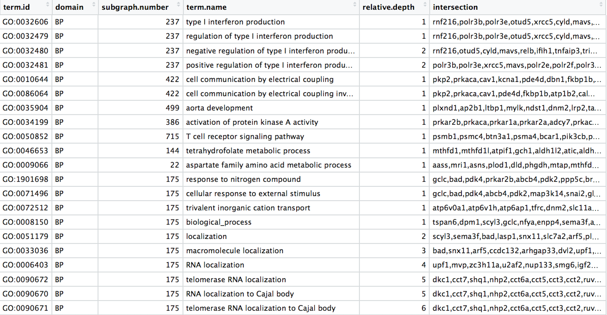
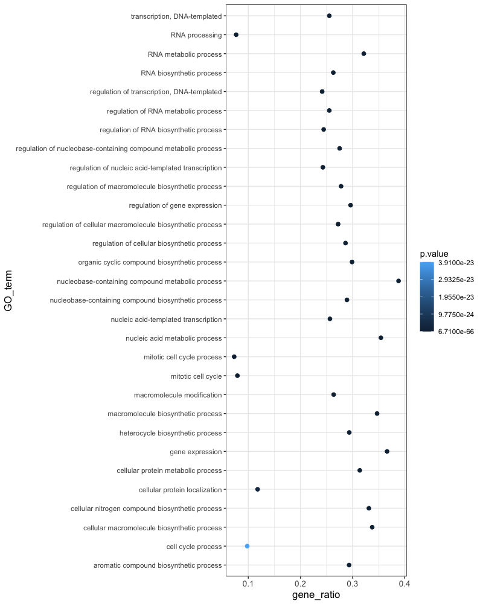
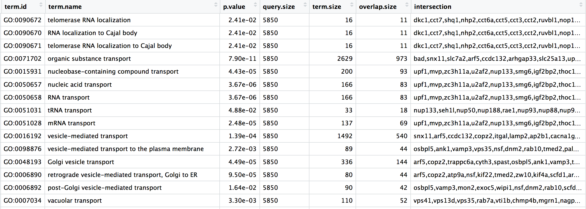

Approximate time: 75 minutes

# Data Wrangling with Tidyverse

The [Tidyverse suite of integrated packages](https://www.tidyverse.org/packages/) are designed to work together to make common data science operations more user friendly. The packages have functions for data wrangling, tidying, reading/writing, parsing, and visualizing, among others. There is a freely available book, [R for Data Science](http://r4ds.had.co.nz/index.html), with detailed descriptions and practical examples of the tools available and how they work together. We will explore the basic syntax for working with these packages, as well as, specific functions for data wrangling with the 'dplyr' package and data visualization with the 'ggplot2' package.


## Tidyverse basics

The Tidyverse suite of packages introduces users to a set of data structures, functions and operators to make working with data more intuitive, but is slightly different from the way we do things in base R. **Two important new concepts we will focus on are pipes and tibbles**.

Before we get started with pipes or tibbles, let's load the library:

	library(tidyverse)
	
### Pipes

Stringing together commands in R can be quite daunting. Also, trying to understand code that has many nested functions can be confusing. 

To make R code more human readable, the Tidyverse tools use the pipe, `%>%`, which was acquired from the `magrittr` package and is now part of the `dplyr` package that is installed automatically with Tidyverse. **The pipe allows the output of a previous command to be used as input to another command instead of using nested functions.**

>**NOTE:** Shortcut to write the pipe is <kbd>shift</kbd> + <kbd>command</kbd> + <kbd>M</kbd>

An example of using the pipe to run multiple commands:

```r
## A single command
sqrt(83)

## Base R method of running more than one command
round(sqrt(83), digit = 2)

## Running more than one command with piping
sqrt(83) %>% round(digit = 2)
```

The pipe represents a much easier way of writing and deciphering R code, and so we will be taking advantage of it, when possible, as we work through the remaining lesson.

***
**Exercises**

1. Extract the `replicate` column from the `metadata` data frame (use the `$` notation) and save the values to a vector named `rep_number`.

2. Use the pipe (`%>%`) to perform two steps in a single line:
	
	1. Turn `rep_number` into a factor.
	2. Use the `head()` function to return the first six values of the `rep_number` factor.

***

### Tibbles

A core component of the [tidyverse](http://tidyverse.org/) is the [tibble](http://tibble.tidyverse.org/). **Tibbles are a modern rework of the standard `data.frame`, with some internal improvements** to make code more reliable.  They are data frames, but do not follow all of the same rules. For example, tibbles can have numbers/symbols for column names, which is not normally allowed in base R. 

**Important: [tidyverse](http://tidyverse.org/) is very opininated about row names**. These packages insist that all column data (e.g. `data.frame`) be treated equally, and that special designation of a column as `rownames` should be deprecated. [Tibble](http://tibble.tidyverse.org/) provides simple utility functions to handle rownames: `rownames_to_column()` and `column_to_rownames()`. 

Tibbles can be created directly using the `tibble()` function or data frames can be converted into tibbles using `as_tibble(name_of_df)`. 

>**NOTE:** The function `as_tibble()` will ignore row names, so if a column representing the row names is needed, then the function `rownames_to_column(name_of_df)` should be run prior to turning the data.frame into a tibble. Also, `as_tibble()` will not coerce character vectors to factors by default.

## Experimental data

We're going to explore the Tidyverse suite of tools to wrangle our data to prepare it for visualization. 

**The dataset:**

- Represents the **functional analysis results**, including the biological processes, functions, pathways, or conditions that are over-represented in a given list of genes.
- Our gene list was generated by **differential gene expression analysis** and the genes represent differences between **control mice** and **mice over-expressing a gene involved in RNA splicing**. 

The functional analysis that we will focus on involves **gene ontology (GO) terms**, which:

- describe the roles of genes and gene products
- organized into three controlled vocabularies/ontologies (domains):
	- biological processes (BP)
	- cellular components (CC)
	- molecular functions (MF)



**Download the dataset (if you haven't already):**

- Right-click [here](https://github.com/hbctraining/Training-modules/blob/master/Tidyverse_ggplot2/data/gprofiler_results_Mov10oe.csv?raw=true) and choose to `Save link as` or `Download link as`.
- Save the file to the `data` folder.

## Analysis goal and workflow

**Goal:** *Visually compare the most significant biological processes (BP) based on the number of associated differentially expressed genes (gene ratios) and significance values by creating the following plot:*



To wrangle our data in preparation for the plotting, we are going to use the Tidyverse suite of tools to wrangle and visualize our data through several steps:

1. Read in the functional analysis results
2. Extract only the GO biological processes (BP) of interest
3. Select only the columns needed for visualization
4. Order by significance (p-adjusted values)
5. Rename columns to be more intuitive
6. Create additional metrics for plotting (e.g. gene ratios)
7. Plot results

## Tidyverse tools

While all of the tools in the Tidyverse suite are deserving of being explored in more depth, we are going to investigate more deeply the reading (`readr`), wrangling (`dplyr`), and plotting (`ggplot2`) tools.

## 1. Read in the functional analysis results

While the base R packages have perfectly fine methods for reading in data, the `readr` and `readxl` Tidyverse packages offer additional methods for reading in data. Let's read in our tab-delimited functional analysis results using `read_delim()`:

```r
# Read in the functional analysis results
functional_GO_results <- read_delim(file = "data/gprofiler_results_Mov10oe.csv", delim = "\t" )

# Take a look at the results
functional_GO_results
```

Notice that the results were automatically read in as a tibble and the output gives the number of rows, columns and the data type for each of the columns.

> **NOTE**: A large number of tidyverse functions will work with both tibbles and dataframes, and the data structure of the output will be identical to the input. However, there are some functions that will return a tibble (without row names), whether or not a tibble or dataframe is provided.


## 2. Extract only the GO biological processes (BP) of interest

Now that we have our data, we will need to wrangle it into a format ready for plotting. For all of our data wrangling steps we will be using tools from the [dplyr](http://dplyr.tidyverse.org/) package, which is a swiss-army knife for data wrangling of data frames. 

To extract the biological processes of interest, we only want those rows where the `domain` is equal to `BP`, which we can do using the `filter()` function. 

To filter rows of a data frame/tibble based on values in different columns, we give a logical expression as input to the `filter()` function to return those rows for which the expression is TRUE.

Now let's return only those rows that have a `domain` of `BP`:

```r
# Return only GO biological processes
bp_oe <- functional_GO_results %>%
  filter(domain == "BP")
  
View(bp_oe)
```

Now we have returned only those rows with a `domain` of `BP`. **How have the dimensions of our results changed?**

***
**Exercise:**

We would like to perform an additional round of filtering to only keep the most specific GO terms. 

1. For `bp_oe`, use the `filter()` function to only keep those rows where the `relative.depth` is greater than 4.
2. Save output to overwrite our `bp_oe` variable.

***


## 3. Select only the columns needed for visualization

For visualization purposes, we are only interested in the columns related to the GO terms, the significance of the terms, and information about the number of genes associated with the terms. 

To extract columns from a data frame/tibble we can use the `select()` function. In contrast to base R, we do not need to put the column names in quotes for selection.

```r
# Selecting columns to keep
bp_oe <- bp_oe %>%
  select(term.id, term.name, p.value, query.size, term.size, overlap.size, intersection)
```

The `select()` function also allows for negative selection. So we could have alternately removed columns with negative selection. Note that we need to put the column names inside of the combine (`c()`) function with a `-` preceding it for this functionality.

``` r
# DO NOT RUN
# Selecting columns to remove
bp_oe <- bp_oe %>%
    select(-c(query.number, significant, recall, precision, subgraph.number, relative.depth))
```




## 4. Order GO processes by significance (adjusted p-values)

Now that we have only the rows and columns of interest, let's arrange these by significance, which is denoted by the adjusted p-value.

Let's sort the rows by adjusted p-value with the `arrange()` function.

``` r
# Order by adjusted p-value ascending
bp_oe <- bp_oe %>%
  arrange(p.value)
```

> **NOTE:** If you wanted to arrange in descending order, then you could have run the following instead:
> ```r
> # DO NOT RUN
> # Order by adjusted p-value descending
> bp_oe <- bp_oe %>%
>   arrange(desc(p.value))
> ```

## 5. Rename columns to be more intuitive

While not necessary for our visualization, renaming columns more intuitively can help with our understanding of the data using the `rename()` function. The syntax is `new_name` = `old_name`.


Let's rename the `term.id` and `term.name` columns.

```r
# Provide better names for columns
bp_oe <- bp_oe %>% 
  dplyr::rename(GO_id = term.id, 
                GO_term = term.name)
```

> **NOTE:**  In the case of two packages with identical function names, you can use `::` with the package name before and the function name after (e.g `stats::filter()`) to ensure that the correct function is implemented. The `::` can also be used to bring in a function from a library without loading it first.
> 
> In the example above, we wanted to use the `rename()` function specifically from the `dplyr` package, and not any of the other packages (or base R) which may have the `rename()` function.

***
**Exercise**

Rename the `intersection` column to `genes` to reflect the fact that these are the DE genes associated with the GO process.

***

## 6. Create additional metrics for plotting (e.g. gene ratios)

Finally, before we plot our data, we need to create a couple of additional metrics. The `mutate()` function enables you to create a new column from an existing column. 

Let's generate gene ratios to reflect the number of DE genes associated with each GO process relative to the total number of DE genes.

``` r
# Create gene ratio column based on other columns in dataset
bp_oe <- bp_oe %>%
  mutate(gene_ratio = overlap.size / query.size)

```

***
**Exercise**

Create a column in `bp_oe` called `term_percent` to determine the percent of DE genes associated with the GO term relative to the total number of genes associated with the GO term (`overlap.size` / `term.size`)

***

Our final data for plotting should look like the table below:


## 7. Plot results

Now that we have our results ready for plotting, we can use the [ggplot2](https://ggplot2.tidyverse.org) package to plot our results.

The [ggplot2](https://ggplot2.tidyverse.org) package uses a syntax for plotting based on [The Grammar for Graphics](http://amzn.to/2ef1eWp), and [this lesson](https://hbctraining.github.io/Training-modules/Tidyverse_ggplot2/lessons/ggplot2.html) will dive into how to use the special graphics syntax to create our detailed custom plots.

### Additional resources

-   [R for Data Science](http://r4ds.had.co.nz)
-   [teach the tidyverse](http://varianceexplained.org/r/teach-tidyverse/)
-   [tidy style guide](http://style.tidyverse.org/)


---
*This lesson has been developed by members of the teaching team at the [Harvard Chan Bioinformatics Core (HBC)](http://bioinformatics.sph.harvard.edu/). These are open access materials distributed under the terms of the [Creative Commons Attribution license](https://creativecommons.org/licenses/by/4.0/) (CC BY 4.0), which permits unrestricted use, distribution, and reproduction in any medium, provided the original author and source are credited.*
