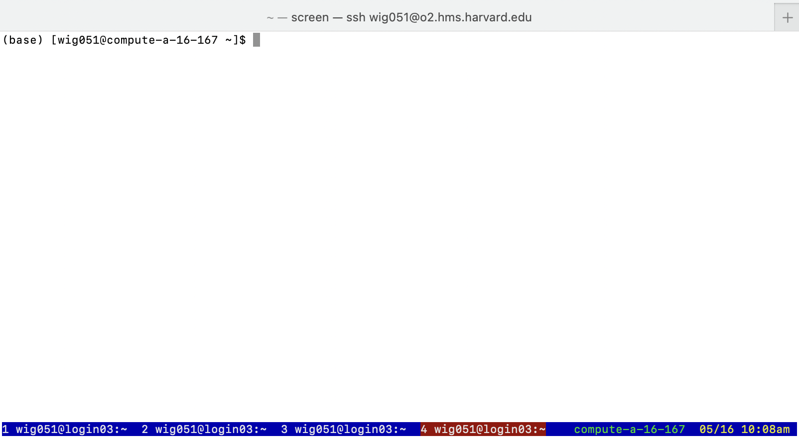

## Learning Objectives

- Discuss the advantages of utilizing job dependencies
- Implement a job dependency
- Cancel a job that is running on the cluster
- Monitor submitted jobs

## Overview

* [Job dependencies](#jobdep)
* [Job arrays](#jobarray)
* [Checking on your jobs in queue](#jobinfo)
* [Getting additional information about your jobs with `sacct` and `O2_jobs_report`](#saccto2)
* [Canceling your job(s) with `scancel`](#scancel)
* [Keeping track of time](#time)
* [Running jobs in the background with `&` and `bg`/`fg`](#bgfg)
* [O2 Portal](#portal)

  
## Managing jobs on the cluster

Most, if not all, high performance compute clusters (HPCs) utilize a job scheduler. As we have previously discussed, O2 uses one of the most popular ones, SLURM. These job schedulers aim to allow for fair use of limited computational resources in a shared network. The purpose of this lesson is to introduce you to **various ways of effectively setting up and managing your jobs on an HPC environment**.

## Job dependencies on SLURM <a name="jobdep"></a> 

Before we get to more basic commands on how to monitor our running jobs, we will introduce a few concepts that are helpful for scenarios that go beyond the simple job submission script.

Let's begin with the idea that perhaps one of your jobs is dependent on the completion of another job. Do you sit there for 48 hours (or however long it takes to run to completion) before you set up the next job to run? Do you add all the commands for you workflow into a single script to run serially, even though each step requires different resources?

**The answer to each of the questions above, is no.** 

The solution is to have your jobs queue in such a way that once one job finishes, it automatically queues the next job.

Job dependencies are very useful:
- When you have consecutive jobs you want to run
- When you don't want to/have the time to manage the submission of consecutive jobs

> NOTE: Job dependencies are not unique to SLURM, many other job schedulers, like PBS, also have a feature similar to this!

The **syntax for using job dependencies** in SLURM is implemented as an SBATCH directive/option called `--dependency`.

This option has several arguments that it can accept, but the most commonly used one is `afterok`. 

```bash
sbatch --dependency=afterok:<job_ID_number> job_2.sbatch
```

Using `afterok` means that after the following job ends without an error, then it will remove the hold on the dependent job. After the `afterok` part you can separate one or more jobs with colons to signify which jobs are dependent.

Multiple jobs can be dependent on a single job. Conversely, we can have a single job dependent on multiple jobs. Both of these examples (and their associated commands) are shown in the figure below.

<p align="center">

</p>

### Example of job dependencies

Let's go to our `scratch` space to test this out!

```bash
cd_scratch
```

Move in to the `sleep_scripts` directory that we downloaded earlier:

```bash
cd sleep_scripts
```

We can inspect these two scripts by using the `cat` command:

```bash
cat job_1.sbatch
cat job_2.sbatch 
```

They are very basic scripts that contain the `sleep` command. Each script simply pauses for 180 second and 30 second, in job 1 and 2 respectively. Before we run these scripts, use `vim` to modify both of these scripts to have your e-mail address in the line shown below. In this way, you will receive the email notification on the status of these jobs.

```bash
#SBATCH --mail-user=Enter_your_email_here
```

Next, go ahead and submit `job_1.sbatch` to the cluster:

```bash
sbatch job_1.sbatch
```

At the command prompt you should observe the following text:

```bash
Submitted batch job <job_ID_number>
```

Use the job_ID_number which was returned from the first script as a dependency when submitting your second script `job_2.sbatch`. Make sure to use the `afterok` option as we show below:

```bash
sbatch --dependency=afterok:<job_ID_number> job_2.sbatch
```

Now, the **second job will only begin after the completion of the first**. If you want to take a quick look at your jobs with `squeue`:

```bash
squeue -u $USER
```

You will notice that `job_1` is hopefully running, while `job_2` has a "PENDING" state and the "NODELIST(REASON)" states that it is due to a "(Dependency)". 

> NOTE: While the behavior can change between implementations of SLURM, on O2, when a job exits with an error, it removes all `afterok` dependent jobs from the queue. Some other implementations of SLURM will not remove these jobs from the queue, but the provided reason when you check will be `DependencyNeverSatified`. In this case, you will need to manually cancel these jobs.


## Job arrays <a name="jobarray"></a>

If your work consists of a **large number of tasks which differ only in some parameter**, you can conveniently **submit** many tasks at **once using a job array**. There are two important components to note:

* The **individual tasks in the array are distinguished by an environment variable, `$SLURM_ARRAY_TASK_ID`**, which Slurm sets to a different value for each task.
* You **set the range of values** with the `--array` parameter.


Let's look at a very simple example adapted from the technical [documentation wiki](https://docs.alliancecan.ca/wiki/Job_arrays) of the Digital Research Alliance of Canada:


```bash

## DO NOT RUN - EXAMPLE ONLY

#!/bin/bash
#SBATCH --array=1-10
#SBATCH --time=3:00:00

<command 1>
<command 2> ...
```

This job will be scheduled as *ten independent tasks*. 
* Each task has a separate time limit of 3 hours.
* Each task may start at a different time on a different node.

**What is stored in the $SLURM_ARRAY_TASK_ID variable?**

This variable takes on the numbers 1 through 10 (from `--array=1-10`) and is used to **assign the individual tasks a job ID**. In the commands that follow, we can use the $SLURM_ARRAY_TASK_ID value stored as the distinguishing factor between the 10 tasks.

For example, we can use the values 1-10 to identify **10 different samples** that we want to run the software on:

```bash
software_program_x  mydataset_sample_${SLURM_ARRAY_TASK_ID}
```

Alternatively, we might want to run the the software on the **same sample but with each task changing a specific parameter value**:

```bash
program_y $SLURM_ARRAY_TASK_ID some_argument another_arg
```

There are also various ways in which we can use the $SLURM_ARRAY_TASK_ID numbers to access a text file which contains the values we need for each task. Using a job array instead of a large number of separate serial jobs has advantages for you and other users! It increases efficiency and you spend less time waiting, but the scheduler does not have to analyze job requirements for each task in the array separately, so it can run more efficiently too.

> **NOTE:** You should not use a job array to submit tasks with very short run times, e.g. much less than an hour. These tasks are better off run using a shell loop inside a job.


## Monitoring your jobs 

As your jobs are running, there are various commands you can use to check in on them and see how things are going. If things are not okay, there is also opportunity for you to intervene if necessary. 

### Checking jobs in the queue using `squeue`  <a name="jobinfo"></a>

Earlier we had used the `squeue` command to check on our jobs. This command is used to view **information about jobs located in the SLURM scheduling queue**. We had demonstrated that we could provide the `-u $USER` argument to print only $USER's jobs. A shortuct to getting the same output would be:

```bash
squeue --me
```

Alternatively, HMSRC has RC created a simplified command which returns the results of `squeue --me` with some addtional columns of information related to resources as shown below:

```bash
 O2squeue


JOBID     PARTITION     STATE       TIME_LIMIT     TIME           NODELIST(REASON)         ELIGIBLE_TIME         START_TIME            TRES_ALLOC
21801263  interactive   RUNNING     12:00:00       2:09:52        compute-a-16-160         2020-11-09T11:35:49   2020-11-09T11:36:19   cpu=1,mem=2G,node=1,billing=1
```

### Checking on all submitted jobs using `sacct` or `O2_jobs_report`  <a name="saccto2"></a>

The `sacct` command displays information on jobs, job steps, status, and exitcodes by default (this is jobs completed in addition to those in the queue):

```bash
sacct
```

Your output might look something like:

```
JobID           JobName  Partition    Account  AllocCPUS      State ExitCode 
------------ ---------- ---------- ---------- ---------- ---------- -------- 
38003155           bash interacti+      bcbio          1 CANCELLED+      0:0 
38003155.ex+     extern                 bcbio          1  COMPLETED      0:0 
38003155.0         bash                 bcbio          1  CANCELLED      0:9 
38003191          job_1      short      bcbio          1 CANCELLED+      0:0 
38003191.ba+      batch                 bcbio          1  CANCELLED     0:15 
38003191.ex+     extern                 bcbio          1  COMPLETED      0:0 
38003285          job_1      short      bcbio          1 CANCELLED+      0:0 
38003285.ba+      batch                 bcbio          1  CANCELLED     0:15 
38003285.ex+     extern                 bcbio          1  COMPLETED      0:0 
38003385           bash interacti+      bcbio          1 CANCELLED+      0:0 
38003385.ex+     extern                 bcbio          1  COMPLETED      0:0 
38003385.0         bash                 bcbio          1  CANCELLED     0:15 
38003495           bash interacti+      bcbio          1    RUNNING      0:0 
38003495.ex+     extern                 bcbio          1    RUNNING      0:0 
38003495.0         bash                 bcbio          1    RUNNING      0:0 
```

This can give you a nice **overview of your recently completed jobs**. It gives you information about the **jobs that are running or pending**. However, there is a jobs report that was developed by the folks at HMS-RC that is more informative and the command is  called `O2_jobs_report`. Let's take a look at it:

 ```bash
O2_jobs_report
```

The output will look something like:

```bash
JOBID        USER       ACCOUNT          PARTITION       STATE           STARTTIME       WALLTIME(hr)   RUNTIME(hr)    nCPU,RAM(GB),nGPU    PENDINGTIME(hr)    CPU_EFF(%)   RAM_EFF(%)   WALLTIME_EFF(%)
-----------------------------------------------------------------------------------------------------------------------------------------------------------------------------------------
37960930     <user>     bcbio            interactive     COMPLETED       2024-05-09      9.0            1.6            1,1.0,0              0.01               0.1          1.2          17.9      
37962316     <user>     bcbio            priority        COMPLETED       2024-05-09      2.0            0.0            1,8.0,0              0.0                93.8         49.6         1.3       
37976042     <user>     bcbio            interactive     FAILED          2024-05-09      12.0           1.9            1,4.0,0              0.01               0.0          0.1          15.5      
38003155     <user>     bcbio            interactive     CANCELLED       2024-05-10      12.0           0.0            1,4.0,0              0.01               2.2          0.1          0.3       
38003191     <user>     bcbio            short           CANCELLED       2024-05-10      0.1            0.0            1,0.0,0              0.02               0.0          0.0          14.7      
38003285     <user>     bcbio            short           CANCELLED       2024-05-10      0.1            0.0            1,0.0,0              0.03               0.0          0.0          12.0  
```

This is an excellent way to not only get the same information that `sacct` provides, but also it **gives the user better context about the CPU, memory and time efficiency of their requested jobs**. This can very helpful for users to know how they can more responsibly use requested resources in their future jobs. 


### Using `scontrol` for detailed information

When you use `squeue`, sometimes you don't get all of the information that you might like. The `scontrol` command can help give you a more **detailed picture of the job submission**. The syntax for using `scontrol` is:

```bash
scontrol show jobid <job_ID_number>
```
It will return an output that looks like:

```bash
JobId=Job_ID JobName=job_name.sbatch
   UserId=$USER(XXXXXXX) GroupId=$USER(XXXXXXX) MCS_label=N/A
   Priority=369878 Nice=0 Account=Account_name QOS=normal
   JobState=RUNNING Reason=None Dependency=(null)
   Requeue=0 Restarts=0 BatchFlag=1 Reboot=0 ExitCode=0:0
   RunTime=00:40:53 TimeLimit=1-00:00:00 TimeMin=N/A
   SubmitTime=2024-05-06T22:38:07 EligibleTime=2024-05-06T22:38:07
   AccrueTime=2024-05-06T22:38:07
   StartTime=2024-05-06T22:38:31 EndTime=2024-05-07T22:38:31 Deadline=N/A
   SuspendTime=None SecsPreSuspend=0 LastSchedEval=2024-05-06T22:38:31 Scheduler=Backfill
   Partition=medium AllocNode:Sid=compute-e-16-230:17259
   ReqNodeList=(null) ExcNodeList=(null)
   NodeList=compute-a-16-163
   BatchHost=compute-a-16-163
   NumNodes=1 NumCPUs=1 NumTasks=1 CPUs/Task=1 ReqB:S:C:T=0:0:*:*
   ReqTRES=cpu=1,mem=64G,node=1,billing=5
   AllocTRES=cpu=1,mem=64G,node=1,billing=5
   Socks/Node=* NtasksPerN:B:S:C=0:0:*:* CoreSpec=*
   MinCPUsNode=1 MinMemoryNode=64G MinTmpDiskNode=0
   Features=(null) DelayBoot=00:00:00
   OverSubscribe=OK Contiguous=0 Licenses=(null) Network=(null)
   Command=/Path/to/submission/script/job_name.sbatch
   WorkDir=/Path/where/script/was/submitted/from
   StdErr=/Path/where/script/was/submitted/from/Job_ID.err
   StdIn=/dev/null
   StdOut=/Path/where/script/was/submitted/from/Job_ID.out
   Power=
```

As you can see, there is a lot of information about the job reported back to you. It tells you the job's state, when it started, when the job will end if it doesn't finish early, the compute node that it is on, partition used, any job dependencies it has, the resources requested, where the standard error and standard output is written to. Almost any question you might have about a job can be answered within here.

### Canceling your job(s) with `scancel` <a name="scancel"></a>

There might be a time that you want to cancel a job that you've started. The command that you can use to cancel a job is `scancel` and the syntax looks like:

```bash
# DO NOT RUN
scancel <job_id>
```

The `job_id` is the `job_id` that you get when you submit a job or you can find it out by looking at your submitted jobs with using `O2squeue` or `squeue --me`.

If you have many jobs that you need to be cancelled, there is a useful shortcut for **running `scancel` across all of your jobs**:

```bash
# DO NOT RUN
scancel --me
```

This will cancel all of your jobs, including any interactive jobs you might be running. We can test this out by submitting our `job_1.sh` to the cluster twice:

```bash
sbatch job_1.sbatch
sbatch job_1.sbatch
```

We should be able to see that we know have two `job_1.sbatch` scripts submitted when we use our `O2squeue`:

```bash
O2squeue
```

Now let's cancel them both:

```bash
scancel --me
```

Now we should see that we have no jobs running when we check `O2squeue`:

```bash
O2squeue
```

## Keeping Track of Time <a name="time"></a>

There are times when you want to keep track of what is going on. If you are able to see how long a task takes to run - you can easily plan for your requested resources on a future run. 

### `watch`

Sometimes one may want to see the ouptut of a command that continuously changes. The `watch` command is particularly useful for this. Add `watch` before your command and your command line will take you to an output page that will continually up your command. Common uses for `watch` include:

1) Viewing as files as they created:

```bash
watch ls -lh <directory>
```

2) Monitoring jobs on the cluster:

```bash
watch squeue -u $USER
```

The default interval for update is two seconds, but that can be altered with the `-n` option. Importantly, the **options used with `watch` command need to be placed before*** the command that you are watching or else the interpreter will evaluate the option as part of the watched command's options. An example of this is below:


```bash
# Update the watch every 4 seconds
watch -n 4 squeue -u $USER
```

### `time`

Sometimes you are interested in knowing how long a task takes to complete. Similar to the `watch` command you can place `time` in front of a command and it will tell you how long the command takes to run. This can be particularly useful if you have downsampled a dataset and you are trying to estimate how long the full dataset will take to run. An example can be found below:

```bash
time ls -lh
```

The output will have three lines:

```
real	0m0.013s
user	0m0.002s
sys	0m0.007s
```

* **`real`** is most likely the time you are interested in since it displays the time it takes to run a given command.
* **`user`** and **`sys`** represent CPU time used for various aspects of the computing and can be impacted by multithreading. 

## Running jobs in the background <a name="bgfg"></a>

Sometimes you may start a command that will take a few minutes and you want to have your command prompt back to do other tasks while you wait for the initial command to finish. There are various ways to do this. 

1. One way is to **add the `&` argument to the end of your command when you first type it**.
  
2. If you've started your job already but forgot to include the `&` argument, is to **use `bg`**.  To use `bg`, you will need to know the following:

    * Pause the command with <kbd>Ctrl</kbd> + <kbd>Z</kbd>.
    * Send the command to the ***b***ack***g***round with the command `bg`. When you do this the command will continue from where it was paused.
  * If you want to bring the task back to the ***f***ore***g***round, you can use the command `fg`.

In order to test these methods, we will briefly re-introduce the `sleep` command. `sleep` just has the command line do nothing for a period of time denoted in seconds by the integer following the `sleep` command. This is useful if you want a brief pause within a loop, such as between submitting a bunch of jobs to the cluster. The syntax is:

```bash
# DO NOT RUN
sleep [integer for time in seconds]
```

So if you wanted there to be a five second pause, you could use:

```bash
sleep 5
```

Now that we have re-introduced the `sleep` command let's go ahead and run it for 180 seconds to simulate a task that is running that might take a few minutes to run.

If we know in advance we want to do other things while we're running our command, we can simply add the `&` argument:

```bash
sleep 180 &
```

You'll notice you can type other commands freely even though `sleep` is running in the background. For now, let's cancel this command by typing `Ctrl` + `X` + `C`. 

**Now, what if we started `sleep` and didn't add `&` to our command?**

```bash
sleep 180
```

Type `Ctrl` + `Z` and this will pause that command. Then move that task to be running in the background with:

```bash
bg
```

The `sleep` command is now running in the background and you have reclaimed your command-line prompt to use while the `sleep` command runs. You'll also notice that it added the `&` to your sleep command in the terminal output. 

If you want to **bring the `sleep` command back to the foreground**, type:

```bash
fg
```

> `fg` will also work for commands which used the `&`.

These commands are useful whenever you are running commands/scripts that take a few minutes to run but don't have super large processing requirements. Some examples include:

- Indexing a FASTA file
- Executing a long command with many pipes
- Testing a command interactively

Typically, lengthy tasks should be submitted as jobs to the cluster. However, you will find it is not uncommon to be running an interactive session and wanting to concurrently have access to the command prompt to do other things. 

### `screen`

An alternative to using `&` and `bg`, is to use `screen`, which allows the user to have multiple command-line interfaces open simultaneously while on the cluster. So instead of running something in the background or on a different terminal window, the user can just place it in a different screen and it is easy to navigate between screens. Let's start by copying a screens template configuration file that HMS-RC provides over to our home directory:

```bash
cp /n/shared_db/misc/rcbio/data/screenrc.template.txt ~/.screenrc
```

And we can look to see what this template using `less`:

```bash
less ~/.screenrc
```

And the contents are:

```bash
hardstatus alwayslastline
hardstatus string "%{.bW}%-w%{.rW}%n %t%{-}%+w %=%{..G} %H %{..Y} %m/%d %C%a "

# Default screens  
screen -t test1            1     
screen -t test2            2  
screen -t run1            3 
screen -t run2            4
#screen -t other           5

# replace Crtl+a by Ctrl + x
#escape ^Xx
```

Within this configuration file, you can see the number of default windows are 4, but this can be modified with the addition or removal of `screen -t` lines. Once you have the `screen` configuration file copied to your `home` directory, you won't need to do it again and to use `screen`, you simply need to type:

```bash
screen
```

Your terminal window should now look like:

<p align="center">

</p>

In order to navigate between your screens you can type <kbd>Ctrl</kbd> + <kbd>a</kbd> + `insert_screen_number`. For example, if we wanted to jump to the second screen, we can type <kbd>Ctrl</kbd> + <kbd>a</kbd> + <kbd>2</kbd>. Let's go ahead and get a sleep command running:

```bash
sleep 60
```

And now let's hop to the first screen while we wait on it to run with <kbd>Ctrl</kbd> + <kbd>a</kbd> + <kbd>1</kbd>.

Now, you might be thinking if I am using <kbd>Ctrl</kbd> + <kbd>a</kbd> + `insert_screen_number` to jump between screens, what happens to the <kbd>Ctrl</kbd> + <kbd>a</kbd> that we use to jump to the beginning of our command-line? We can use <kbd>Ctrl</kbd> + <kbd>a</kbd> + <kbd>a</kbd> to jump to the beginning of the command-line when inside of screens, however <kbd>Ctrl</kbd> + <kbd>e</kbd> remains for jumping to the end of the line.

We can exit `screen` by using <kbd>Ctrl</kbd> + <kbd>d</kbd>. A few useful keyboard shortcuts for `screen` are listed in the table below:

|Description| Shortcut|
|----------------------|----------------------| 
| Jump to screen | <kbd>Ctrl</kbd> + <kbd>a</kbd> + `insert_screen_number` |
| Return to last screen | <kbd>Ctrl</kbd> + <kbd>a</kbd> + <kbd>Ctrl</kbd> + <kbd>a</kbd> |
| Create new screen | <kbd>Ctrl</kbd> + <kbd>a</kbd> + <kbd>c</kbd> |
| Jump to the beginning of line| <kbd>Ctrl</kbd> + <kbd>a</kbd> + <kbd>a</kbd> |
| Jump to the end of line | <kbd>Ctrl</kbd> + <kbd>e</kbd> |
| Quit `screen` | <kbd>Ctrl</kbd> + <kbd>d</kbd>  |

## Using the O2 Portal <a name="portal"></a>

When working with big datasets, it can beneficial to have access to an IDE (intergated development environment) while writing your code. IDE's provide a graphical user interface (GUI) such as RStudio or MatLab allowing you to view your environment and plots all within the same space. 

<p align="center">

</p>

O2 has a service called the [O2 Portal](https://o2portal.rc.hms.harvard.edu) which **allows for users to utilize a GUI on O2**. This allows you to work more conveniently on the cluster where your data is stored and access increased computational power. In order to **use the O2 Portal, you need to submit a job request** like you would on the command-line via the `sbatch` command and you will provide it SLURM directives like numbers of CPUs, memory, partition and time. Once you are queued it will generate a session for you to use your application in. More information on the O2 Portal can be found [HMS-RC's resource page](https://harvardmed.atlassian.net/wiki/spaces/O2/pages/2230583317/O2Portal) and a tutorial on how to use R Studio on the O2 Portal can be found [here](https://hbctraining.github.io/Intro-to-Unix-QMB/lessons/R_studio_on_02.html).


***

[Back to Schedule](../README.md)

***

*This lesson has been developed by members of the teaching team at the [Harvard Chan Bioinformatics Core (HBC)](http://bioinformatics.sph.harvard.edu/). These are open access materials distributed under the terms of the [Creative Commons Attribution license](https://creativecommons.org/licenses/by/4.0/) (CC BY 4.0), which permits unrestricted use, distribution, and reproduction in any medium, provided the original author and source are credited.*
