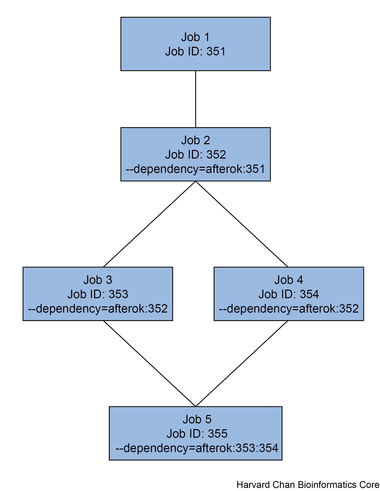

# Job Management

## Learning Objectives

In this lesson we will:
- Discuss the advantages of utilizing job dependencies
- Implement a job dependency
- 
- 

## Job Dependency

Most, if not all, high performance computer clusters (HPCCs) utilize a job scheduler. As we have previously discussed, O2 uses one of the most popular ones, SLURM. These job schedulers aim to allow for fair use of limited computational resources in a shared network. In order to most limit one's use of limited resources, it is oftentimes best practice to place programs that require different computational resources in different job submissions. For example, perhaps program A needs 12 CPUs, 36GB of memory and 6 hours, but the output of program A is used in program B and it requires 1 CPU, 4GB of memory and 8 hours. In this case one *could* request 12 CPUs, 36 GB and 14 hours of compute time, but when program B is running you would be wasting 11 CPUs and 32GB of memory. As a result this type of behavior is *strongly discouraged*.

However, you may be interested in having your jobs queue is such a way that once one job finishes, it automatically queues the next job and job dependencies allow you to queue jobs to be dependent on other jobs.

Job dependencies are very useful:
- When you have consecutive jobs you want to run
- When you don't want to/have to time manage the submission of consecutive jobs

> NOTE: Job dependencies are not unique to SLURM, many other job schedulers, like PBS, also have a feature similar to this!

## Job dependencies on SLURM

The syntax for using job dependencies in SLURM can be done in two ways:
1) It can be part of a SBATCH directive in your job submission script
2) It can be an option in your `sbatch` command

We will be doing the latter, but either way will use the `--dependency` option. This option has several arguments that it can accept, but the most useful one for the overwhleming number of circumstances is `afterok`. Using `afterok` means that after the following job ends without an error, then it will remove the hold on the dependent job. After the `afterok` part you can separate one or more jobs with colons to signify which jobs are dependent.

Let's go to out `scratch` space to test this out:

```bash
cd_scratch
```

Travel to the `sleep_scripts` directory that we downloaded earlier

```bash
cd sleep_scripts
```

We can inspect these two scripts:

```bash
cat job_1.sbatch
cat job_2.sbatch 
```
They are very basic scripts that can be submitted to the cluster and pause for 180 second and 30 second, respectively, before being complete. Using `vim` go ahead and modify both of these scripts to have your e-mail address in the line:

```bash
#SBATCH --mail-user=Enter_your_email_here
```

Next, go ahead and submit `job_1.sbatch` to the cluster:

```bash
sbatch job_1.sbatch
```

It should return:

```bash
Submitted batch job <job_ID_number>
```

Use the job_ID_number returned from the first script as a dependency for the second script, `job_2.sbatch`:

```bash
sbatch --dependency=afterok:<job_ID_number> job_2.sbatch
```

Now, if you run check on your jobs with:

```bash
squeue -u $USER
```

You will notice that `job_1` is hopefully running, while `job_2` has a "PENDING" state and the "NODELIST(REASON)" states that it is due to a "(Dependency)". Once, `job_1` finishes, `job_2` will be queued and ran. 

Let's consider the case where we have two jobs, `job_3` and `job_4`, that are depenedent on `job_2`. Additionally, we have a single job, `job_5` dependent on `job_3` and `job_4` finishing. We can visualize a sample workflow below:

<p align="center">

</p>

Multiple jobs can be dependent on a single job. Conversely, we can have a single job dependent on multiple jobs. If this is the case, then we just separate each job ID with colons like:

```bash
# DO NOT RUN
sbatch --dependency=afterok:353:354 Job_5.sbatch
```

> NOTE: While the behavior can change between implementations of SLURM, on O2, when a job exits with an error, it removes all `afterok` dependent jobs from the queue. Some other implementations of SLURM will not remove these jobs from the queue, but the provided reason when you check will be `DependencyNeverSatified`. In this case, you will need to manually cancel these jobs.

As you can hopefully, see is that you can potentially set-up an entire pipeline for analysis and then comeback in a few days after it has all ran and you don't need to be constantly monitoring your jobs.

## scontrol

When you use `squeue -u $USER`, sometimes you don't get all of the information that you might like. The `scontrol` command can help give you a more detailed picture of the job submission. The syntax for using `scontrol` is:

```bash
scontrol show jobid <job_ID_number>
```
It will return an output that looks like:

```bash
JobId=Job_ID JobName=job_name.sbatch
   UserId=$USER(XXXXXXX) GroupId=$USER(XXXXXXX) MCS_label=N/A
   Priority=369878 Nice=0 Account=Account_name QOS=normal
   JobState=RUNNING Reason=None Dependency=(null)
   Requeue=0 Restarts=0 BatchFlag=1 Reboot=0 ExitCode=0:0
   RunTime=00:40:53 TimeLimit=1-00:00:00 TimeMin=N/A
   SubmitTime=2024-05-06T22:38:07 EligibleTime=2024-05-06T22:38:07
   AccrueTime=2024-05-06T22:38:07
   StartTime=2024-05-06T22:38:31 EndTime=2024-05-07T22:38:31 Deadline=N/A
   SuspendTime=None SecsPreSuspend=0 LastSchedEval=2024-05-06T22:38:31 Scheduler=Backfill
   Partition=medium AllocNode:Sid=compute-e-16-230:17259
   ReqNodeList=(null) ExcNodeList=(null)
   NodeList=compute-a-16-163
   BatchHost=compute-a-16-163
   NumNodes=1 NumCPUs=1 NumTasks=1 CPUs/Task=1 ReqB:S:C:T=0:0:*:*
   ReqTRES=cpu=1,mem=64G,node=1,billing=5
   AllocTRES=cpu=1,mem=64G,node=1,billing=5
   Socks/Node=* NtasksPerN:B:S:C=0:0:*:* CoreSpec=*
   MinCPUsNode=1 MinMemoryNode=64G MinTmpDiskNode=0
   Features=(null) DelayBoot=00:00:00
   OverSubscribe=OK Contiguous=0 Licenses=(null) Network=(null)
   Command=/Path/to/submission/script/job_name.sbatch
   WorkDir=/Path/where/script/was/submitted/from
   StdErr=/Path/where/script/was/submitted/from/Job_ID.err
   StdIn=/dev/null
   StdOut=/Path/where/script/was/submitted/from/Job_ID.out
   Power=
```

This can tell you lots of information about the job. It tells you the job's state, when it started, when the job will end if it doesn't finish early, the compute node that it is on, partition used, any job dependencies it has, the resources requested, where the standard error and standard output is written to. Almost any question you might have about a job can be answered within here.

## scancel

There might be a time that you want to cancel a job that you've started. The command that you can use to cancel a job is `scancel` and the syntax looks like:

```bash
# DO NOT RUN
scancel <job_id>
```

The `job_id` is the `job_id` that you get when you submit a job or you can find it out by looking at your submitted jobs with using `O2squeue` or `squeue --me`.

If you have many jobs that you need to be cancelled, there is a useful shortcut for running `scancel` across all of your jobs:

```bash
# DO NOT RUN
squeue --me
```

This will cancel all of your jobs, including any interactive jobs you might be running. We can test this out by submitting our `job_1.sh` to the cluster twice:

```bash
sbatch job_1.sbatch
sbatch job_1.sbatch
```

We should be able to see that we know have two `job_1.sbatch` scripts submitted when we use our `O2squeue`:

```bash
O2squeue
```

Now let's cancel them both:

```bash
scancel --me
```

Now we should see that we have no jobs running when we check `O2squeue`:

```bash
O2squeue
```

## O2_jobs_report

Sometimes you might be interested in checking on the jobs that you have submitted. SLURM has a feature to help you do this called `sacct`. Let's see what this looks like:

```bash
sacct
```

You output might look something like:

```
JobID           JobName  Partition    Account  AllocCPUS      State ExitCode 
------------ ---------- ---------- ---------- ---------- ---------- -------- 
38003155           bash interacti+      bcbio          1 CANCELLED+      0:0 
38003155.ex+     extern                 bcbio          1  COMPLETED      0:0 
38003155.0         bash                 bcbio          1  CANCELLED      0:9 
38003191          job_1      short      bcbio          1 CANCELLED+      0:0 
38003191.ba+      batch                 bcbio          1  CANCELLED     0:15 
38003191.ex+     extern                 bcbio          1  COMPLETED      0:0 
38003285          job_1      short      bcbio          1 CANCELLED+      0:0 
38003285.ba+      batch                 bcbio          1  CANCELLED     0:15 
38003285.ex+     extern                 bcbio          1  COMPLETED      0:0 
38003385           bash interacti+      bcbio          1 CANCELLED+      0:0 
38003385.ex+     extern                 bcbio          1  COMPLETED      0:0 
38003385.0         bash                 bcbio          1  CANCELLED     0:15 
38003495           bash interacti+      bcbio          1    RUNNING      0:0 
38003495.ex+     extern                 bcbio          1    RUNNING      0:0 
38003495.0         bash                 bcbio          1    RUNNING      0:0 
```

This can give you a nice overview of your recently completed jobs. It gives you information about the jobs that ran, are running or pending. However, there is an jobs report that was developed by the folks at HMS-RC that is more informative and the command is  called `O2_jobs_report`. Let's take a look at it:

 ```bash
O2_jobs_report
```

The output will look something like:

```bash
JOBID        USER       ACCOUNT          PARTITION       STATE           STARTTIME       WALLTIME(hr)   RUNTIME(hr)    nCPU,RAM(GB),nGPU    PENDINGTIME(hr)    CPU_EFF(%)   RAM_EFF(%)   WALLTIME_EFF(%)
-----------------------------------------------------------------------------------------------------------------------------------------------------------------------------------------
37960930     <user>     bcbio            interactive     COMPLETED       2024-05-09      9.0            1.6            1,1.0,0              0.01               0.1          1.2          17.9      
37962316     <user>     bcbio            priority        COMPLETED       2024-05-09      2.0            0.0            1,8.0,0              0.0                93.8         49.6         1.3       
37976042     <user>     bcbio            interactive     FAILED          2024-05-09      12.0           1.9            1,4.0,0              0.01               0.0          0.1          15.5      
38003155     <user>     bcbio            interactive     CANCELLED       2024-05-10      12.0           0.0            1,4.0,0              0.01               2.2          0.1          0.3       
38003191     <user>     bcbio            short           CANCELLED       2024-05-10      0.1            0.0            1,0.0,0              0.02               0.0          0.0          14.7      
38003285     <user>     bcbio            short           CANCELLED       2024-05-10      0.1            0.0            1,0.0,0              0.03               0.0          0.0          12.0  
```

This is an excellent way to not only get the same information that `sacct` provides, but also it gives the user better context about the CPU, memory and time efficiency of their requested jobs. This can very helpful for users to know how they can more responsibly use requested resources in their future jobs. 

## Keeping Track of Time

We don't always just submit a command and come back later. There are times when you want to keep track of what is going on, see how long a task takes for future use, or run a command in the background while you continue to use the command line.

### watch

Sometimes one may want to see the ouptut of a command that continuously changes. The `watch` command is particularly useful for this. Add `watch` before your command and your command line will take you to an output page that will continually up your command. Common uses for `watch` could be:

1) Viewing as files get created

```bash
watch ls -lh <directory>
```

2) Monitoring jobs on the cluster

```bash
watch squeue -u $USER
```

The default interval for update is two seconds, but that can be altered with the `-n` option. Importantly, the options used with `watch` command need to be placed ***before*** the command that you are watching or else the interpreter will evaluate the option as part of the watched command's options. An example of this is below:

Update every 4 seconds

```bash
watch -n 4 squeue -u $USER
```

## time

Sometimes you are interested to know how long a task takes to complete. Similarly, to the `watch` command you can place `time` infront of a command and it will tell you how long the command takes to run. This can be particularly useful if you have downsampled a dataset and you are trying to estimate how long the full set will take to run. An example can be found below:

```bash
time ls -lh
```

The output will have three lines:

```
real	0m0.013s
user	0m0.002s
sys	0m0.007s
```

**real** is most likely the time you are interested in since it displays the time it takes to run a given command. **user** and **sys** represent CPU time used for various aspects of the computing and can be impacted by multithreading. 

### bg

Sometimes you may start a command that will take a few minutes and you want to have your command prompt back to do other tasks while you wait for the initial command to finish. To do this, you will need to do two things:

1) Pause the command with <kbd>Ctrl</kbd> + <kbd>Z</kbd>. 
2) Send the command to the ***b***ack***g***round with the command `bg`. When you do this the command will continue from where it was paused.
3) If you want to bring the task back to the ***f***ore***g***round, you can use the command `fg`.

In order to test this, we will briefly re-introduce the `sleep` command. `sleep` just has the command line do nothing for a period of time denoted in seconds by the integer following the `sleep` command. This is sometimes useful if you want a brief pause within a loop, such as between submitting a bunch of jobs to the cluster. The syntax is:

```bash
# DO NOT RUN
sleep [integer for time in seconds]
```

So if you wanted there to be a five second pause, you could use:

```bash
sleep 5
```

Now that we have re-introduced the `sleep` command let's go ahead and pause the command like for 180 seconds to simulate a task that is running that might take a few minutes to run.

```bash
sleep 180
```

Now type `Ctrl` + `Z` and this will pause that command. This will be followed by the command to move that task to running in the background with:

```bash
bg
```

The `sleep` command is now running in the background and you have re-claimed your command-line prompt to use while the `sleep` command runs. If you want to bring the `sleep` command back to the foreground, type:

```bash
fg
```

And if it is still running it will be brought to the foreground.

The place that this can be really useful is whenever you are running commands/scripts that take a few minutes to run that don't have large procesing requirements. Examples could be:

- Indexing a FASTA file
- Executing a long command with many pipes
- You are running something in the command line and need to check something

Oftentimes, it is best just to submit these types of jobs to the cluster, but sometimes you don't mind running the task on your requested compute node, but is taking a bit longer than you anticipated or something came up. 

## What is a job array?

Atlassian says this about job arrays on O2: "Job arrays can be leveraged to quickly submit a number of similar jobs. For example, you can use job arrays to start multiple instances of the same program on different input files, or with different input parameters. A job array is technically one job, but with multiple tasks." [link](https://harvardmed.atlassian.net/wiki/spaces/O2/pages/1586793632/Using+Slurm+Basic#Job-Arrays).

Array jobs run simultaneously rather than one at a time which means they are very fast! Additionally, running a job array is very simple!  

```bash
sbatch --array=1-10 my_script.sh
```

This will run my_script.sh 10 times with the job IDs 1,2,3,4,5,6,7,8,9,10

We can also put this directly into the bash script itself (although we will continue with the command line version here).
```bash
$SBATCH --array=1-10
```

We can specify any job IDs we want.

```bash
sbatch --array=1,7,12 my_script.sh
```
This will run my_script.sh 3 times with the job IDs 1,7,12

Of course we don't want to run the same job on the same input files over and over, that would be pointless. We can use the job IDs within our script to specify different input or output files. In bash the job id is given a special variable `${SLURM_ARRAY_TASK_ID}`


## How can I use ${SLURM_ARRAY_TASK_ID}?

The value of `${SLURM_ARRAY_TASK_ID}` is simply job ID. If I run 

```bash
sbatch --array=1,7 my_script.sh
```
This will start two jobs, one where `${SLURM_ARRAY_TASK_ID}` is 1 and one where it is 7

There are several ways we can use this. If we plan ahead and name our files with these numbers (e.g., sample_1.fastq, sample_2.fastq) we can directly refer to these files in our script: `sample_${SLURM_ARRAY_TASK_ID}.fastq` However, using the ID for input files is often not a great idea as it means you need to strip away most of the information that you might put in these names.

Instead we can keep our sample names in a separate file and use [awk](awk.md) to pull the file names. 

here is our complete list of long sample names which is found in our file `samples.txt`:

```
DMSO_control_day1_rep1
DMSO_control_day1_rep2
DMSO_control_day2_rep1
DMSO_control_day2_rep2
DMSO_KO_day1_rep1
DMSO_KO_day1_rep2
DMSO_KO_day2_rep1
DMSO_KO_day2_rep2
Drug_control_day1_rep1
Drug_control_day1_rep2
Drug_control_day2_rep1
Drug_control_day2_rep2
Drug_KO_day1_rep1
Drug_KO_day1_rep2
Drug_KO_day2_rep1
Drug_KO_day2_rep2
```

If we renamed all of these to 1-16 we would lose a lot of information that may be helpful to have on hand. If these are all sam files and we want to convert them to bam files our script could look like this

```bash

file=$(awk -v  awkvar="${SLURM_ARRAY_TASK_ID}" 'NR==awkvar' samples.txt)

samtools view -S -b ${file}.sam > ${file}.bam

```

Since we have sixteen samples we would run this as 

```bash
sbatch --array=1-16 my_script.sh
```

So what is this script doing? `file=$(awk -v  awkvar="${SLURM_ARRAY_TASK_ID}" 'NR==awkvar' samples.txt)` pulls the line of `samples.txt` that matched the job ID. Then we assign that to a variable called `${file}` and use that to run our command.

Job IDs can also be helpful for output files or folders. We saw above how we used the job ID to help name our output bam file. But creating and naming folders is helpful in some instances as well. 

```bash

file=$(awk -v  awkvar="${SLURM_ARRAY_TASK_ID}" 'NR==awkvar' samples.txt)

PREFIX="Folder_${SLURM_ARRAY_TASK_ID}"
     mkdir $PREFIX
        cd $PREFIX

samtools view -S -b ../${file}.sam > ${file}.bam

```    

This script differs from our previous one in that it makes a folder with the job ID (Folder_1 for job ID 1) then moves inside of it to execute the command. Instead of getting all 16 of our bam files output in a single folder each of them will be in its own folder labled Folder_1 to Folder_16. 

**NOTE** That we define `${file}` BEFORE we move into our new folder as samples.txt is only present in the main directory. 

***

[Back to Schedule](../README.md)

***

*This lesson has been developed by members of the teaching team at the [Harvard Chan Bioinformatics Core (HBC)](http://bioinformatics.sph.harvard.edu/). These are open access materials distributed under the terms of the [Creative Commons Attribution license](https://creativecommons.org/licenses/by/4.0/) (CC BY 4.0), which permits unrestricted use, distribution, and reproduction in any medium, provided the original author and source are credited.*
