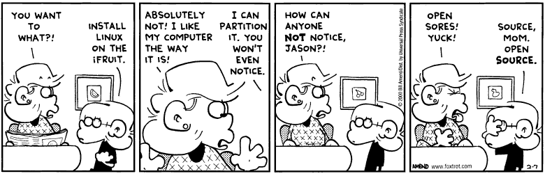

## Learning Objectives
- Understand what the shell is
- Install and locate the software/tools necessary for accessing the command line


## What even is shell?

You have likely heard the words **bash**, **shell**, **unix**, and **linux** before but may not know what they mean or how they relate. Before we even access the shell let's try to understand these terms.

* **Unix** is simply an operating system much like Windows or macOS. **Unix** and its "flavors" are the operating systems you find on high perfomance computing clusters (HPCs). 
* **Linux** can be thought of as a clone or "flavor" of **unix**. The main difference between **unix** and **linux** is that **unix** is proprietary (i.e. requires a license) while **linux** is open source.
* **Shell** is a general term for a command line interpreter, a program that lets users control their operating system with text commands. **Shell** has been described as user-facing “**shell** around the computer’s whirring innards” ([Louis Pouzin](https://en.wikipedia.org/wiki/Louis_Pouzin))
* Since **shell** is a general term, there are many different **shells**. The most prevalent is **bash** which is short for "Bourne-Again SHell" which replaced the original Bourne shell that was NOT developed by [Jason Bourne](https://en.wikipedia.org/wiki/Jason_Bourne) but by [Stephen Bourne](https://en.wikipedia.org/wiki/Stephen_R._Bourne) a programmer at Bell labs.

  

  *Foxtrot by Bill Amend*

## Starting with the shell
Depending on your operating system, there are different ways to access the shell:

> **With Macs**
>
> Macs have a utility application called "**Terminal**" for performing tasks on the command line (shell). We can open this utility to access the shell. This is generally found in `/Applications/Utilities/Terminal`
>
> **With Windows**
>
> By default, there is no terminal for the bash shell available in the Windows OS, so you have to use a downloaded program. We recommend "**Git BASH**" a shell (bash) emulator that is a part of the [Git for Windows](https://git-for-windows.github.io/) download.

#### Command prompt

Once you have opened the shell, you should see the command prompt ending with `$`. It will have some characters before the `$`, something like `[MacBook-Pro-5:~]`, this is telling you what the name of the computer you are working on is. 

```bash
[MacBook-Pro-5:~]$ 
```


### Downloading data

We will be exploring the capabilities of the shell by working with some RNA-Seq data. We need to **download the data to our current folder** using the link below. To do so, follow the step-by-step instructions below.

**1. Find out what folder we are currently inside**. To do this, we can use the 'print working directory' command:

```bash
$ pwd
```

> On a **Mac** your current folder should be something starting with `/Users/`, like `/Users/marypiper/`.
> 
> On a **Windows** machine your current folder should be something starting with `C:/Users/marypiper`. To find this in your File explorer try clicking on PC and navigating to that path.

_Once you have identified which folder you are in, this is where we will be downloading your data._

**2. Right click on the link below, and be sure to "Save link as..."**. You will be prompted to choose a folder within a Finder/File Explorer window. Navigate to the directory that was listed when running `pwd`.

* Download data by [right-clicking here](https://github.com/hbctraining/Training-modules/blob/master/Intro_shell/data/unix_lesson.zip?raw=true) and choose **Save link as**.

**3.** Once you have downloaded the file to the correct location, go back to your **terminal window and type the 'list' command**:

```bash
$ ls
```

> `ls` stands for 'list' and it lists the contents of a directory.

_You should see `unix_lesson.zip` as part of the output to the screen._

**4.** Finally, to **decompress the folder**, we can use the `unzip` command:

```bash
$ unzip unix_lesson.zip 
```

_You should see output stating the contents of the folder are being decompressed or inflated; this is good._ 

**5.** Now when you **run the `ls` command** again you should see a folder called `unix_lesson`.

```bash
$ ls
```


*This lesson has been developed by members of the teaching team at the [Harvard Chan Bioinformatics Core (HBC)](http://bioinformatics.sph.harvard.edu/). These are open access materials distributed under the terms of the [Creative Commons Attribution license](https://creativecommons.org/licenses/by/4.0/) (CC BY 4.0), which permits unrestricted use, distribution, and reproduction in any medium, provided the original author and source are credited.*

* *The materials used in this lesson were derived from work that is Copyright © Data Carpentry (http://datacarpentry.org/). 
All Data Carpentry instructional material is made available under the [Creative Commons Attribution license](https://creativecommons.org/licenses/by/4.0/) (CC BY 4.0).*
* *Adapted from the lesson by Tracy Teal. Original contributors: Paul Wilson, Milad Fatenejad, Sasha Wood and Radhika Khetani for Software Carpentry (http://software-carpentry.org/)*
