## Learning Objectives:

* Understanding the quality values in a FASTQ file
* Understanding metrics output in FASTQC quality report

## Quality Control of FASTQ files

The first step in the RNA-Seq workflow is to take the FASTQ files received from the sequencing facility and assess the quality of the sequence reads. 

<p align="center">
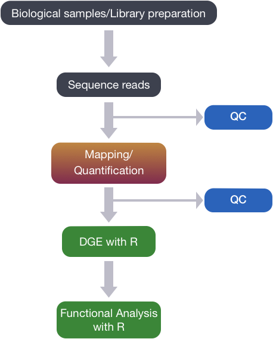
</p>

### Unmapped read data (FASTQ)

The [FASTQ](https://en.wikipedia.org/wiki/FASTQ_format) file format is the defacto file format for sequence reads generated from next-generation sequencing technologies. This file format evolved from FASTA in that it contains sequence data, but also contains quality information. Similar to FASTA, the FASTQ file begins with a header line. The difference is that the FASTQ header is denoted by a `@` character. For a single record (sequence read) there are four lines, each of which are described below:

|Line|Description|
|----|-----------|
|1|Always begins with '@' and then information about the read|
|2|The actual DNA sequence|
|3|Always begins with a '+' and sometimes the same info in line 1|
|4|Has a string of characters which represent the quality scores; must have same number of characters as line 2|

Let's use the following read as an example:

```
@HWI-ST330:304:H045HADXX:1:1101:1111:61397
CACTTGTAAGGGCAGGCCCCCTTCACCCTCCCGCTCCTGGGGGANNNNNNNNNNANNNCGAGGCCCTGGGGTAGAGGGNNNNNNNNNNNNNNGATCTTGG
+
@?@DDDDDDHHH?GH:?FCBGGB@C?DBEGIIIIAEF;FCGGI#########################################################
```

The line 4 has characters encoding the quality of each nucleotide in the read. The legend below provides the mapping of quality scores (Phred-33) to the quality encoding characters. *Different quality encoding scales exist (differing by offset in the ASCII table), but note the most commonly used one is fastqsanger, which is the scale output by Illumina since mid-2011.* 
 ```
 Quality encoding: !"#$%&'()*+,-./0123456789:;<=>?@ABCDEFGHI
                   |         |         |         |         |
    Quality score: 0........10........20........30........40                                
```
 
Using the quality encoding character legend, the first nucelotide in the read (C) is called with a quality score of 31 and our Ns are called with a score of 2. **As you can tell by now, this is a bad read.** 

Each quality score represents the probability that the corresponding nucleotide call is incorrect. This quality score is logarithmically based and is calculated as:

	Q = -10 x log10(P), where P is the probability that a base call is erroneous

These probabaility values are the results from the base calling algorithm and dependent on how much signal was captured for the base incorporation. The score values can be interpreted as follows:

|Phred Quality Score |Probability of incorrect base call |Base call accuracy|
|:-------------------|:---------------------------------:|-----------------:|
|10	|1 in 10 |	90%|
|20	|1 in 100|	99%|
|30	|1 in 1000|	99.9%|
|40	|1 in 10,000|	99.99%|

Therefore, for the first nucleotide in the read (C), there is less than a 1 in 1000 chance that the base was called incorrectly. Whereas, for the the end of the read there is greater than 50% probabaility that the base is called incorrectly.

## Assessing quality with FastQC

Now we understand what information is stored in a FASTQ file, the next step is to examine quality metrics for our data.

[FastQC](http://www.bioinformatics.babraham.ac.uk/projects/fastqc/) provides a simple way to do some quality control checks on raw sequence data coming from high throughput sequencing pipelines. It provides a modular set of analyses which you can use to give a quick impression of whether your data has any problems of which you should be aware before doing any further analysis.

The main functions of FastQC are:

* Import of data from FASTQ files (also accepts BAM and SAM alignment files)
* Quick overview of any likely sequencing problems
* Summary graphs and tables to quickly assess your data
* Export of results as an HTML-based report

FastQC has a really well documented [manual page](http://www.bioinformatics.babraham.ac.uk/projects/fastqc/) with [detailed explanations](http://www.bioinformatics.babraham.ac.uk/projects/fastqc/Help/) about every plot in the report. 

Within our report, a summary of all of the modules is given on the left-hand side of the report. Don't take the **yellow "WARNING"s** and **red "FAIL"s** too seriously; they should be interpreted as flags for modules to check out. 

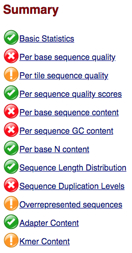

The first module gives the basic statistics for the sample. Generally it is a good idea to keep track of the total number of reads sequenced for each sample and to make sure the read length and %GC content is as expected.

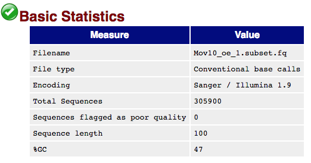

One of the most important analysis modules is the **"Per base sequence quality"** plot. This plot provides the distribution of quality scores at each position in the read across all reads. This plot can alert us to whether there were any problems occuring during sequencing and whether we might need to contact the sequencing facility.


The y-axis gives the quality scores, while the x-axis represents the position in the read. The color coding of the plot denotes what are considered high, medium and low quality scores. 

For example, the box plot at nucleotide 1 shows the distribution of quality scores for **the first nucleotide of all reads** in the `Mov10_oe_1` sample. The yellow box represents the 25th and 75th percentiles, with the red line as the median. The whiskers are the 10th and 90th percentiles. The blue line represents the average quality score for the nucleotide. Based on these metrics, the quality scores for the first nucleotide are quite high, with nearly all reads having scores above 28.

The quality scores appear to drop going from the beginning toward the end of the reads. For reads generated by Illumina sequencing, this is not unexpected, and there are known causes for this drop in quality. To better interpret this plot it is helpful to understand the different sequencing error profiles.

### Sequencing error profiles

For Illumina sequencing, the quality of the nucleotide base calls are related to the **signal intensity and purity of the fluorescent signal**. Low intensity fluorescence or the presence of multiple different fluorescent signals can lead to a drop in the quality score assigned to the nucleotide. Due to the nature of sequencing-by-synthesis there are some drops in quality that can be expected, but other quality issues can be indicative of a problem at the sequencing facility.

We will now explore different quality issues arising from the sequencing-by-synthesis used by Illumina, both expected and unexpected.

#### Expected

As sequencing progresses from the first cycle to the last cycle we often anticipate a drop in the quality of the base calls. This is often due to signal decay and phasing as the sequencing run progresses. 

- **Signal decay:** As sequencing proceeds, the fluorescent signal intensity decays with each cycle, yielding decreasing quality scores at the **3' end** of the read. This is due to:
   1. Degrading fluorophores
   2. A proportion of the strands in the cluster not being elongated
   
   Therefore, the proportion of signal being emitted continues to decrease with each cycle.

   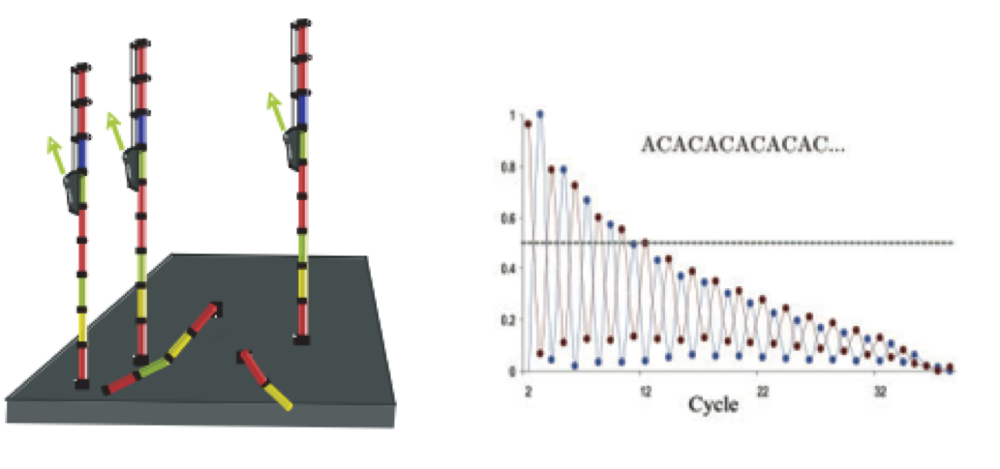
   
- **Phasing:** As the number of cycles increases, the signal starts to blur as the cluster loses synchronicity, also yielding a decrease in quality scores at the **3' end** of the read. As the cycles progress, some strands get random failure of nucleotides to incorporate due to:
   1. Incomplete removal of the 3' terminators and fluorophores
   2. Incorporation of nucleotides without effective 3' terminators

   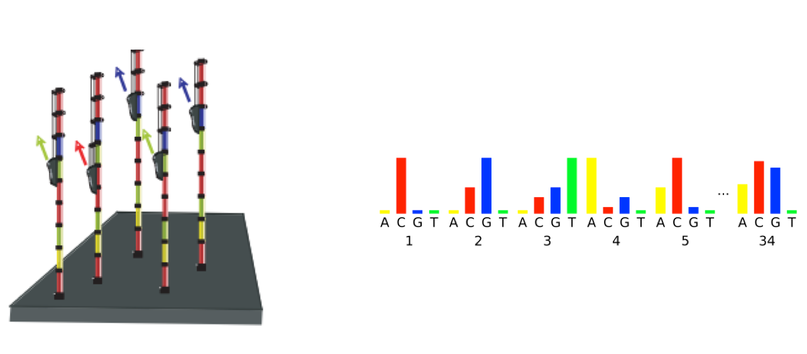
   
#### Worrisome

- **Overclustering:** Sequencing facilities can overcluster the flow cells, which results in small distances between clusters and an overlap in the signals. The two clusters can be interpreted as a single cluster with mixed fluorescent signals being detected, decreasing signal purity, generating lower quality scores across the **entire read**.

   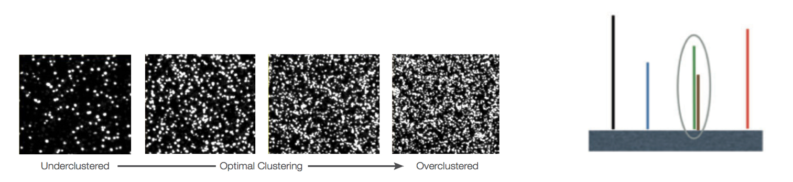
   
- **Instrumentation breakdown:** Sequencing facilities can occasionally have issues with the sequencing instruments during a run. **Any sudden drop in quality or a large percentage of low quality reads across the read could indicate a problem at the facility.** Examples of such issues are shown below, including a manifold burst, cycles lost, and read 2 failure. For such data, the sequencing facility should be contacted for resolution, if possible.

   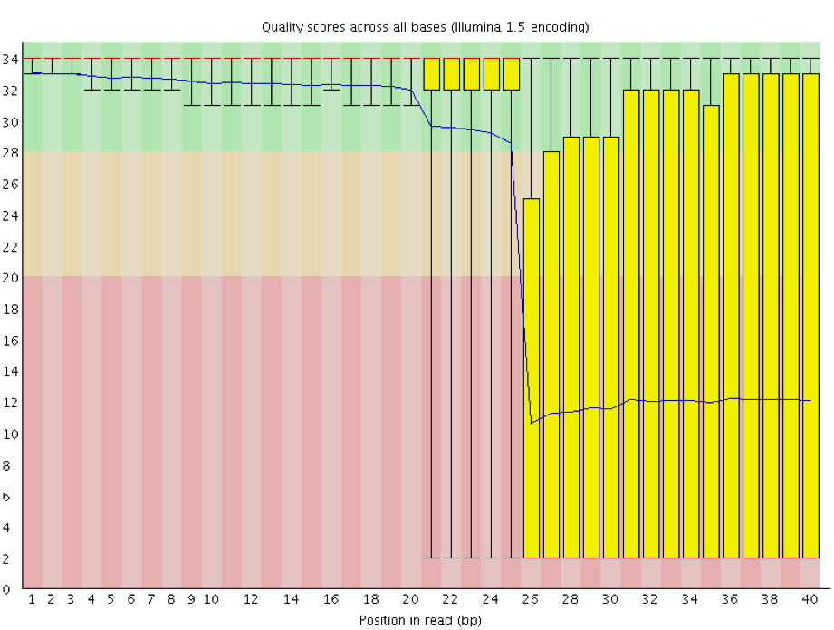
   
   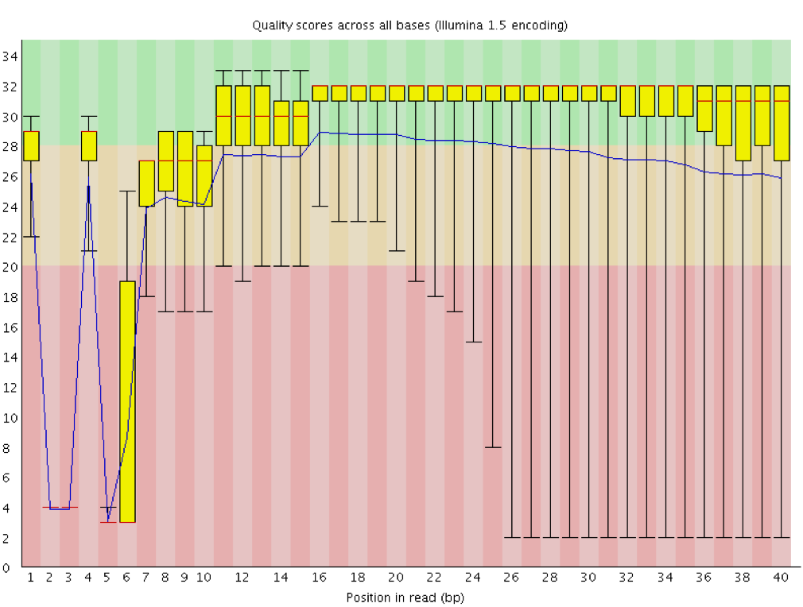
   
   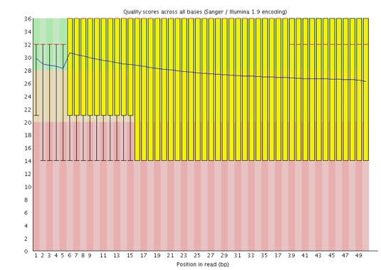

### Quality assessment

Now if we return back to our plot, we can see a drop in quality towards the ends of the reads, which could be explained by signal decay or phasing. No other worrisome signs are present, so the sequencing data from the facility is of good quality. 


The other modules in the FastQC report can also help interpret the quality of the data. 

The **"Per sequence quality scores"** plot gives you the average quality score on the x-axis and the number of sequences with that average on the y-axis. We hope the majority of our reads have a high average quality score with no large bumps at the lower quality values.

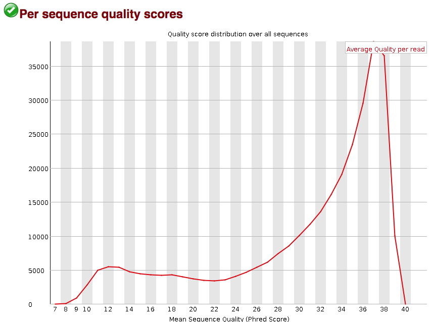
  
This data has a small bump at a mean quality of 12. Since it doesn't represent a large proportion of the data, it isn't extremely worrisome, but it might be worth a quick check of the reads resulting in the poor quality scores.

The next plot gives the **"Per base sequence content"**, which always gives a FAIL for RNA-seq data. This is because the first 10-12 bases result from the 'random' hexamer priming that occurs during RNA-seq library preparation. This priming is not as random as we might hope giving an enrichment in particular bases for these intial nucleotides. 

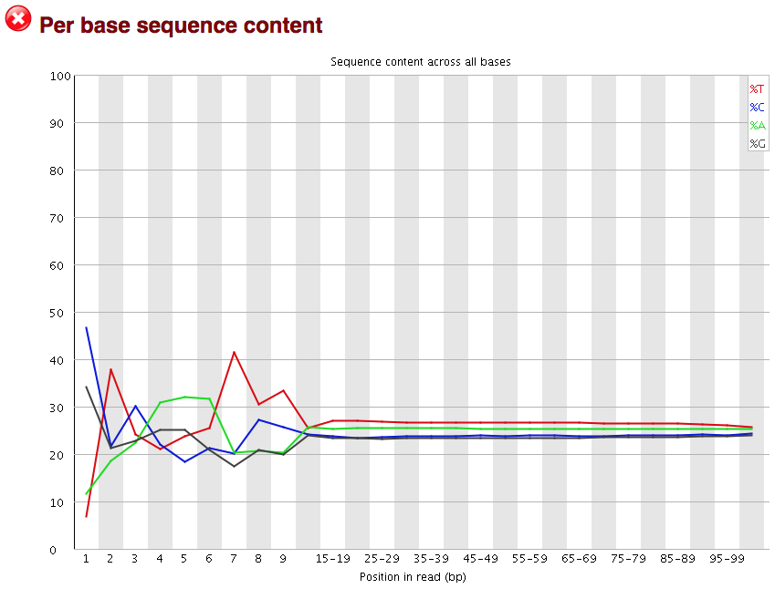

The **"Per sequence GC content"** plot gives the GC distribution over all sequences. Generally is a good idea to note whether the GC content of the central peak corresponds to the [expected % GC for the organism](https://www.ncbi.nlm.nih.gov/pmc/articles/PMC2909565/). Also, the distribution should be normal unless over-represented sequences (sharp peaks on a normal distribution) or contamination with another organism (broad peak).

This plot would indicate some type of over-represented sequence with the sharp peaks, indicating either contamination or a highly over-expressed gene.

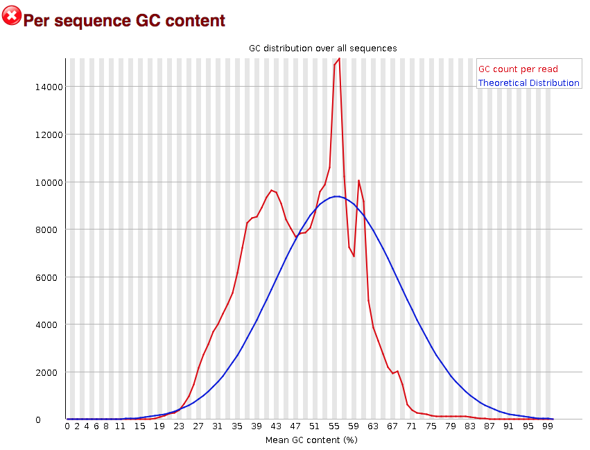

The next module explores numbers of duplicated sequences in the library. This plot can help identify a low complexity library, which could result from too many cycles of PCR amplification or too little starting material. For RNA-seq we don't normally do anything to address this in the analysis, but if this were a pilot experiment, we might adjust the number of PCR cycles, amount of input, or amount of sequencing for future libraries. In this analysis we seem to have a large number of duplicated sequences, but this is expected due to the subset of data we are working with containing the over-expression of MOV10.

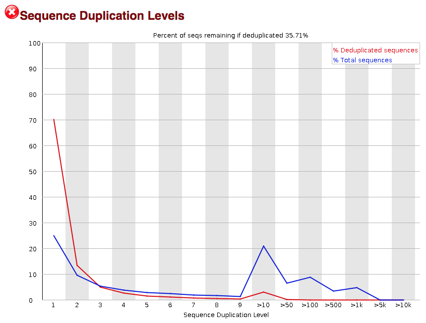

The **"Over-represented sequences"** table is another important module as it displays the sequences (at least 20 bp) that occur in more than 0.1% of the total number of sequences. This table aids in identifying contamination, such as vector or adapter sequences. If the %GC content was off in the above module, this table can help identify the source. If not listed as a known adapter or vector, it can help to BLAST the sequence to determine the identity.

Since our data is just a subset of the original data and it contains the over-expressed MOV10 gene, if we BLAST the sequences we will find they belong to MOV10. For this experiment, these over-represented sequences are not concerning.


As our report only represents a subset of reads (chromosome 1) for `Mov10_oe_1.subset.fq`, which can skew the QC results. We encourage you to look at the [full set of reads](../fastqc/Mov10oe_1-fastqc_report.html) and note how the QC results differ when using the entire dataset.

After exploring the quality of the data, we determine from which gene or transcript the reads originated from using mapping tools. The quality of the data is important when determining where it aligns to on the genome or transcriptome; however most mapping tools are able to account for adapter contamination, vector contamination and low-quality bases at the ends of reads. Therefore, after noting any QC issues, we can use our raw reads for the alignment or mapping to the reference genome or transcriptome.

---
*This lesson has been developed by members of the teaching team at the [Harvard Chan Bioinformatics Core (HBC)](http://bioinformatics.sph.harvard.edu/). These are open access materials distributed under the terms of the [Creative Commons Attribution license](https://creativecommons.org/licenses/by/4.0/) (CC BY 4.0), which permits unrestricted use, distribution, and reproduction in any medium, provided the original author and source are credited.*
