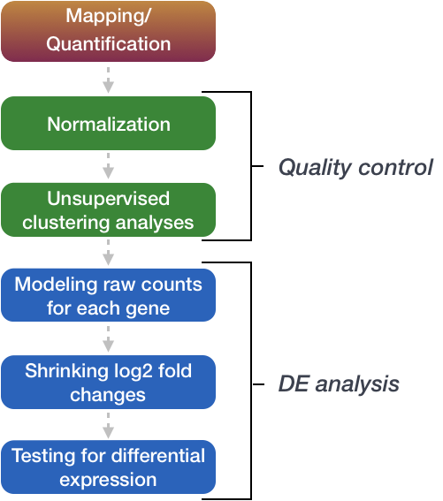
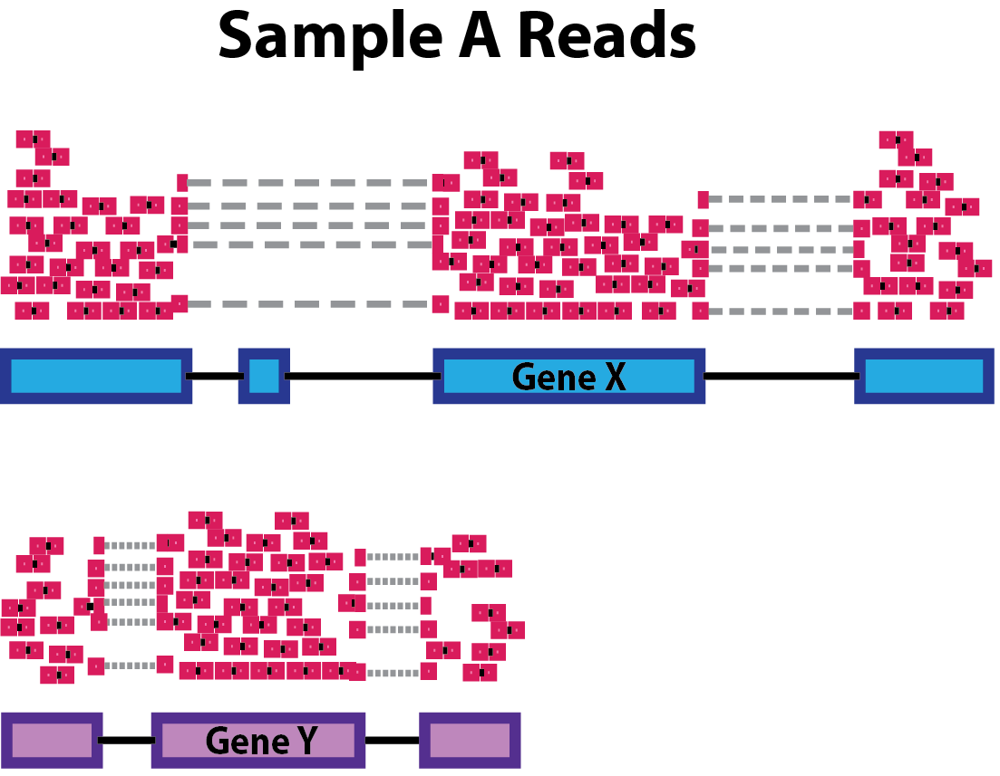
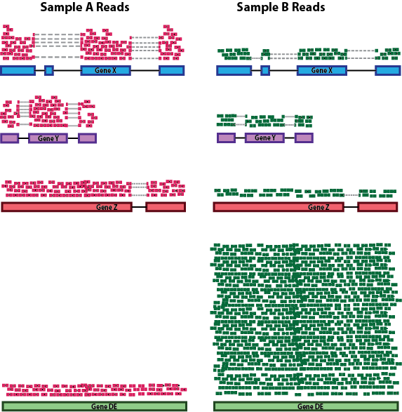
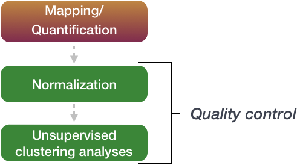

## Differential gene expression (DGE) analysis

The next step in the RNA-seq workflow is the differential expression analysis. The goal of differential expression testing is to determine which genes are expressed at different levels between conditions. These genes can offer biological insight into the processes affected by the condition(s) of interest. 

The steps outlined in the gray box below we have already discussed, and we will now continue to describe the steps in an **end-to-end gene-level RNA-seq differential expression workflow**. 

So what does the count data actually represent? The count data used for differential expression analysis represents the number of sequence reads that originated from a particular gene. The higher the number of counts, the more reads associated with that gene, and the assumption that there was a higher level of expression of that gene in the sample. 

**We will be using [DESeq2](https://genomebiology.biomedcentral.com/articles/10.1186/s13059-014-0550-8) for the DE analysis, and the analysis steps with DESeq2 are shown in the flowchart below in green**. DESeq2 first normalizes the count data to account for differences in library sizes and RNA composition between samples. Then, we will use the normalized counts to make some plots for QC at the gene and sample level. The final step is to use the appropriate functions from the DESeq2 package to perform the differential expression analysis. For more in-depth detail into each of these steps, please see the [DESeq2 vignette](http://bioconductor.org/packages/devel/bioc/vignettes/DESeq2/inst/doc/DESeq2.html).

## Normalization

The first step in the DE analysis workflow is count normalization, which is necessary to make accurate comparisons of gene expression between samples.

The counts of mapped reads for each gene is proportional to the expression of RNA ("interesting") in addition to many other factors ("uninteresting"). Normalization is the process of scaling raw count values to account for the "uninteresting" factors. In this way the expression levels are more comparable between and within samples.

The main factors often considered during normalization are:
 
 - **Sequencing depth:** Accounting for sequencing depth is necessary for comparison of gene expression between samples. In the example below, each gene appears to have doubled in expression in *Sample A* relative to *Sample B*, however this is a consequence of *Sample A* having double the sequencing depth. 

    
  
	>***NOTE:** In the figure above, each pink and green rectangle represents a read aligned to a gene. Reads connected by dashed lines connect a read spanning an intron.*
 
 - **Gene length:** Accounting for gene length is necessary for comparing expression between different genes within the same sample. In the example, *Gene X* and *Gene Y* have similar levels of expression, but the number of reads mapped to *Gene X* would be many more than the number mapped to *Gene Y* because *Gene X* is longer.
 
    
 
 - **RNA composition:** A few highly differentially expressed genes between samples, differences in the number of genes expressed between samples, or presence of contamination can skew some types of normalization methods. Accounting for RNA composition is recommended for accurate comparison of expression between samples, and is particularly important when performing differential expression analyses [[1](https://genomebiology.biomedcentral.com/articles/10.1186/gb-2010-11-10-r106)]. 
 
	In the example, if we were to divide each sample by the total number of counts to normalize, the counts would be greatly skewed by the DE gene, which takes up most of the counts for *Sample A*, but not *Sample B*. Most other genes for *Sample A* would be divided by the larger number of total counts and appear to be less expressed than those same genes in *Sample B*.  
	
    
    
***While normalization is essential for differential expression analyses, it is also necessary for exploratory data analysis, visualization of data, and whenever you are exploring or comparing counts between or within samples.***
 
### Common normalization methods

Several common normalization methods exist to account for these differences:
	
| Normalization method | Description | Accounted factors | Recommendations for use |
| ---- | ---- | ---- | ---- |
| **CPM** (counts per million) | counts scaled by total number of reads | sequencing depth | gene count comparisons between replicates of the same samplegroup; **NOT for within sample comparisons or DE analysis**  |
| **TPM** (transcripts per kilobase million) | counts per length of transcript (kb) per million reads mapped | sequencing depth and gene length | gene count comparisons within a sample or between samples of the same sample group; **NOT for DE analysis** |
| **RPKM/FPKM** (reads/fragments per kilobase of exon per million reads/fragments mapped) | similar to TPM | sequencing depth and gene length | gene count comparisons between genes within a sample; **NOT for between sample comparisons or DE analysis** |
| DESeq2's **median of ratios** [[1](https://genomebiology.biomedcentral.com/articles/10.1186/gb-2010-11-10-r106)] | counts divided by sample-specific size factors determined by median ratio of gene counts relative to geometric mean per gene | sequencing depth and RNA composition | gene count comparisons between samples and for **DE analysis**; **NOT for within sample comparisons** |
| EdgeR's **trimmed mean of M values (TMM)** [[2](https://genomebiology.biomedcentral.com/articles/10.1186/gb-2010-11-3-r25)] | uses a weighted trimmed mean of the log expression ratios between samples | sequencing depth, RNA composition | gene count comparisons between and for **DE analysis**; **NOT for within sample comparisons** |
	
	
 ### RPKM/FPKM (not recommended for between sample comparisons)
 
While TPM and RPKM/FPKM normalization methods both account for sequencing depth and gene length, RPKM/FPKM are not recommended. **The reason  is that the normalized count values output by the RPKM/FPKM method are not comparable between samples.** 

Using RPKM/FPKM normalization, the total number of RPKM/FPKM normalized counts for each sample will be different. Therefore, you cannot compare the normalized counts for each gene equally between samples. 

**RPKM-normalized counts table**

| gene | sampleA | sampleB |
| ----- |:-----:|:-----:|
| XCR1 | 5.5 | 5.5 |
| WASHC1 | 73.4 | 21.8 |
| ... | ... | ... |
|Total RPKM-normalized counts | 1,000,000 | 1,500,000 |

For example, in the table above, SampleA has a greater proportion of counts associated with XCR1 (5.5/1,000,000) than does sampleB (5.5/1,500,000) even though the RPKM count values are the same. Therefore, we cannot directly compare the counts for XCR1 (or any other gene) between sampleA and sampleB because the total number of normalized counts are different between samples. 

> *NOTE:* [This video by StatQuest](http://www.rna-seqblog.com/rpkm-fpkm-and-tpm-clearly-explained/) shows in more detail why TPM should be used in place of RPKM/FPKM if needing to normalize for sequencing depth and gene length.

# Quality Control

The next step in the differential expression workflow is QC, which includes sample-level and gene-level steps to perform QC checks on the count data to help us ensure that the samples/replicates look good. 

## Sample-level QC

A useful initial step in an RNA-seq analysis is often to assess overall similarity between samples: 

- Which samples are similar to each other, which are different? 
- Does this fit to the expectation from the experiment’s design? 
- What are the major sources of variation in the dataset?

Log2-transformed normalized counts are used to assess similarity between samples using Principal Component Analysis (PCA) and hierarchical clustering. Using log2 transformation, tools aim to moderate the variance across the mean, thereby improving the distances/clustering for these visualization methods.

Sample-level QC allows us to see how well our replicates cluster together, as well as, observe whether our experimental condition represents the major source of variation in the data. Performing sample-level QC can also identify any sample outliers, which may need to be explored to determine whether they need to be removed prior to DE analysis. 

### [Principal Component Analysis (PCA)](https://hbctraining.github.io/DGE_workshop/lessons/principal_component_analysis.html)

Principal Component Analysis (PCA) is a technique used to **emphasize variation** and bring out strong patterns in a dataset. To explore the variation in the data, we could **plot the expression values of each gene for each of our *n* samples against each other** in *n*-dimensional spaces. In the figure below we can see this if we had only two samples, but once we have more than 3 samples in 3-dimensional space, it becomes difficult to visualize.

PCA provides a dimensionality reduction technique that finds the greatest amounts of variation in a dataset and assigns it to principal components.

The principal component (PC) explaining the greatest amount of variation in the dataset is PC1, while the PC explaining the second greatest amount is PC2, and so on and so forth until PC*n*.

PCA plots two PCs against each other, generally focusing on PC1 and PC2, which explain the largest amounts of variation in the data. **If two samples have similar levels of expression for the genes that contribute significantly to the variation represented by PC1, they will be plotted close together on the PC1 axis.** Therefore, we would expect that biological replicates to have similar scores (since the same genes are changing in the same directions) and cluster together on PC1 and/or PC2, and the samples from different treatment groups to have different scores and cluster apart. **This is easiest to understand by visualizing example PCA plots.**

#### Example PCA1

In the PCA plot below we can see our samplegroups, *EN* (pink) and *ENR* (blue), separate on PC1, this is generally what we hope for. PC1 explains 89% of the variation in the data, so it's likely that this variation is due to differences in gene expression between our samplegroups.

We can use other variables **present in our metadata** to explore other causes of the variation in our data, such as coloring by `individual` in this paired-design experiment:

We can determine that the 5% of variation in the data represented by PC2 is due to variation between individuals.

#### Example PCA2

In this next example, the metadata for the experiment is displayed below. The main condition of interest is `treatment`.

When visualizing on PC1 and PC2, we don't see the samples separate by `treatment`, so we decide to explore other sources of variation present in the data. We hope that we have included all possible known sources of variation in our metadata table, and we can use these factors to color the PCA plot. 

We start with the factor `cage`, but the `cage` factor does not seem to explain the variation on PC1 or PC2.

Then, we color by the `sex` factor, which appears to separate samples on PC2. This is good information to take note of, as we can use it downstream to account for the variation due to sex in the model and regress it out.

Next we explore the `strain` factor and find that it explains the variation on PC1. 

It's great that we have been able to identify the sources of variation for both PC1 and PC2. By accounting for it in our model, we should be able to detect more genes differentially expressed due to `treatment`.

Worrisome about this plot is that we see two samples that do not cluster with the correct strain. This would indicate a likely **sample swap** and should be investigated to determine whether these samples are indeed the labeled strains. If we found there was a switch, we could swap the samples in the metadata. However, if we think they are labeled correctly or are unsure, we could just remove the samples from the dataset.

Still we haven't found if `treatment` is a major source of variation after `strain` and `sex`. So, we explore PC3 and PC4 to see if `treatment` is driving the variation represented by either of these PCs.

We find that the samples separate by `treatment` on PC3, and are optimistic about our DE analysis since our condition of interest, `treatment`, is separating on PC3 and we can regress out the variation driving PC1 and PC2.

Even if your samples do not separate by PC1 or PC2 or you can't identify the sources of variation, you may still get biologically relevant results from the DE analysis, just don't be surprised if you do not get a large number of DE genes. To give more power to the tool for detecting DE genes, it is **best to account for major, known sources of variation** in your model if you can identify them; this includes **batch effects**. 

For details regarding the calculations performed for PCA, we encourage you to explore [StatQuest's video](https://www.youtube.com/watch?v=_UVHneBUBW0). 

***
**Exercise**

The figure below was generated from a time course experiment with sample groups, *Ctrl* and *Sci* and the following timepoints: *0h*, *2h*, *8h*, and *16h*. 

- Determine the sources explaining the variation represented by PC1 and PC2.
- Do the sample groups separate well?
- Do the replicates cluster together for each sample group?
- Are there any outliers in the data?
- Should we have any other concerns regarding the samples in the dataset?

***

### Hierarchical Clustering Heatmap

Similar to PCA, hierarchical clustering is another, complementary method for identifying strong patterns in a dataset and potential outliers. The heatmap displays **the correlation of gene expression for all pairwise combinations of samples** in the dataset. Since the majority of genes are not differentially expressed, samples generally have high correlations with each other (values higher than 0.80). Samples below 0.80 may indicate an outlier in your data and/or sample contamination.  

The hierarchical tree can indicate which samples are more similar to each other based on the normalized gene expression values. The color blocks indicate substructure in the data, and you would expect to see your replicates cluster together as a block for each sample group. Additionally, we expect to see samples clustered similar to the groupings observed in a PCA plot. 

In the plot below, we would be a bit concerned about 'Wt_3' and 'KO_3' samples not clustering with the other replicates. We would want to explore the PCA to see if we see the same clustering of samples.

***
**Exercise**

The figure below was generated from an experiment with sample groups 'Mov10_oe', 'Irrel_kd' and 'Mov10_kd'. 

- Do the sample groups separate well?
- Do the replicates cluster together for each sample group?
- Are there any outliers in the data?
- Should we have any other concerns regarding the samples in the dataset?

***

## Gene-level QC

In addition to examining how well the samples/replicates cluster together, there are a few more QC steps. Prior to differential expression analysis it is beneficial to omit genes that have little or no chance of being detected as differentially expressed. This will increase the power to detect differentially expressed genes. The genes omitted fall into three categories:

- Genes with zero counts in all samples
- Genes with an extreme count outlier
- Genes with a low mean normalized counts

**DESeq2 will perform this filtering by default; however other DE tools, such as EdgeR will not.**  Filtering is a necessary step, even if you are using limma-voom and/or edgeR's quasi-likelihood methods. Be sure to follow pre-filtering steps when using these tools, as outlined in their user guides found on Bioconductor as they generally perform much better. 
