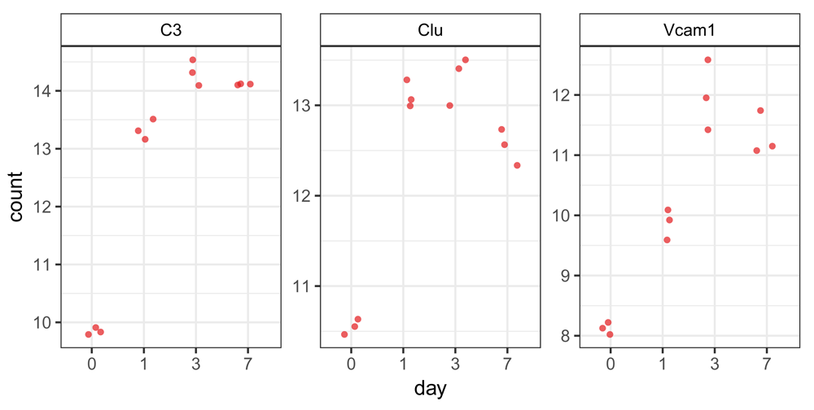
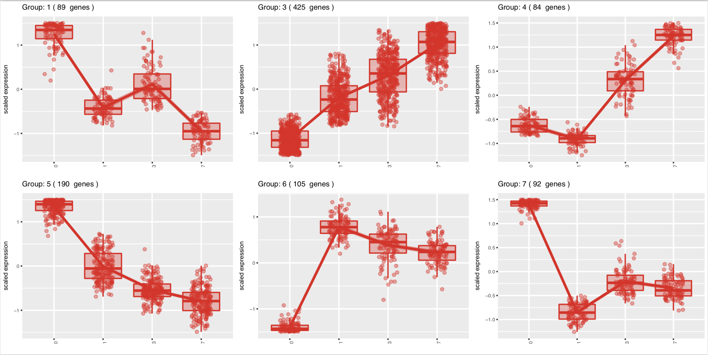

## Learning Objectives 

* Describe common plots for visualizing results of a DGE analysis

## Visualizing the results of a DGE experiment

### Plotting signicantly differentially expressed genes

One way to visualize results would be to simply plot the expression data for a handful of genes across the various sample groups. 

This can be implemented in R (usually) for **multiple genes** of interest or a **single gene** using functions associated with 
* the package used to perform the statistical analysis (e.g. DESeq2's `plotCounts()` function) or 
* an external package created for this purpose (e.g. pheatmap, [DEGreport](https://bioconductor.org/packages/release/bioc/html/DEGreport.html)) or
* using the `ggplot2` package.

#### Plotting expression of a single gene across sample groups:

#### Plotting expression of multiple genes across sample groups :

One way to visualize results would be to simply plot the expression data for a handful of genes across the various sample groups. 

The plot below displays the top 20 significantly differentially expressed genes. Please note that the normalized counts on the Y axis are logged (log10) to ensure that the any large differences in expression are plotted without compromising the quality of the visualization.

### Heatmap

In addition to plotting subsets, we could also extract the normalized values of *all* the significant genes and plot a heatmap of their expression using `pheatmap()`.
         
      

In this heatmap Z-scores are calculated for each row (each gene) and these are plotted instead of the normalized expression values; this ensures that the expression patterns/trends that we want to visualize are not overwhelmed by the expression values.

> *Z-scores are computed on a gene-by-gene basis by subtracting the mean and then dividing by the standard deviation. The Z-scores are computed **after the clustering**, so that it only affects the graphical aesthetics and the color visualization is improved.*

### Volcano plot

The above plot would be great to look at the expression levels of a good number of genes, but for more of a global view there are other plots. A commonly used one is a volcano plot; in which you have the log transformed adjusted p-values are plotted on the y-axis and log2 fold change values on the x-axis. 

 

## DEGreport

If you do use the DESeq2 package for differential expression analysis, the package 'DEGreport' has a lot of great functions to draw a lot of the above plots in addition to several others. Some examples are available in [this vignette](https://bioconductor.org/packages/release/bioc/vignettes/DEGreport/inst/doc/DEGreport.html), and some of them are shown below.

**Plot 1:** An easy and clean way to visualize expression of genes of interest.

**Plot 2:** When performing DE analysis on several groups, e.g. a time course experiment, grouping together genes that have similar patterns of expression and visualizing these patterns can be very helpful. The `degPatterns()` function in the DEGreport package performs the analysis and creates a display with this information.

*Images adapted from doi: [10.12688/f1000research.12093.2](https://f1000research.com/articles/6-1976/v2).*

> In addition to displaying the patterns, `degPatterns()` outputs a list to enable the user to extract the genes in each grouping.

***

*This lesson has been developed by members of the teaching team at the [Harvard Chan Bioinformatics Core (HBC)](http://bioinformatics.sph.harvard.edu/). These are open access materials distributed under the terms of the [Creative Commons Attribution license](https://creativecommons.org/licenses/by/4.0/) (CC BY 4.0), which permits unrestricted use, distribution, and reproduction in any medium, provided the original author and source are credited.*

* *Materials and hands-on activities were adapted from [RNA-seq workflow](http://www.bioconductor.org/help/workflows/rnaseqGene/#de) on the Bioconductor website*
