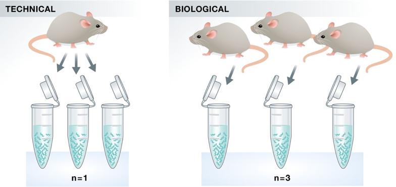
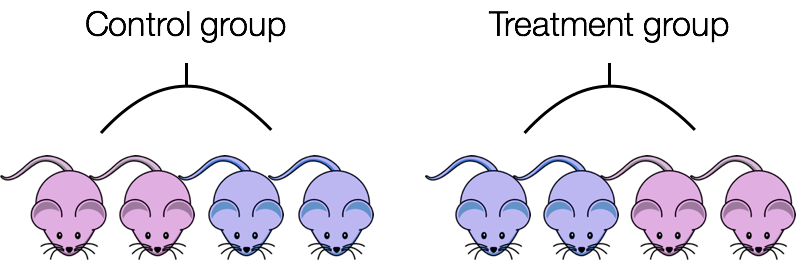

# Experimental planning considerations

Understanding the steps in the experimental process of RNA extraction and preparation of RNA-Seq libraries is helpful for designing an RNA-Seq experiment, but there are special considerations that should be highlighted that can greatly affect the quality of a differential expression analysis. 

These important considerations include:

1. Number and type of **replicates**
2. Avoiding **confounding**
3. Addressing **batch effects**

We will go over each of these considerations in detail, discussing best practice and optimal design.

## Replicates

Experimental replicates can be performed as **technical replicates** or **biological replicates**. 

*Image credit: [Klaus B., EMBO J (2015) **34**: 2727-2730](https://dx.doi.org/10.15252%2Fembj.201592958)*

- **Technical replicates:** use the same biological sample to repeat the technical or experimental steps in order to accurately measure technical variation and remove it during analysis. 

- **Biological replicates** use different biological samples of the same condition to measure the biological variation between samples. 

In the days of microarrays, technical replicates were considered a necessity; however, with the current RNA-Seq technologies, technical variation is much lower than biological variation and **technical replicates are unneccessary**.

In contrast, **biological replicates are absolutely essential**. For differential expression analysis, the more biological replicates, the better the estimates of biological variation and the more precise our estimates of the mean expression levels. This leads to more accurate modeling of our data and identification of more differentially expressed genes.

*Image credit: [Liu, Y., et al., Bioinformatics (2014) **30**(3): 301–304](https://doi.org/10.1093/bioinformatics/btt688)*

As the figure above illustrates, **biological replicates are of greater importance than sequencing depth**. The figure shows the relationship between sequencing depth and number of replicates on the number of differentially expressed genes identified [[1](https://academic.oup.com/bioinformatics/article/30/3/301/228651/RNA-seq-differential-expression-studies-more)]. Note that an **increase in the number of replicates tends to return more DE genes than increasing the sequencing depth**. Therefore, generally more replicates are better than higher sequencing depth, with the caveat that higher depth is required for detection of lowly expressed DE genes and for performing isoform-level differential expression. 

Replicates are almost always preferred to greater sequencing depth for bulk RNA-Seq. However, guidelines depend on the experiment performed and the desired analysis. Below we list some general guidelines for replicates and sequencing depth to help with experimental planning:

- **General gene-level differential expression:**

  - ENCODE guidelines suggest 30 million SE reads per sample (stranded).
  
  - 15 million reads per sample is often sufficient, if there are a good number of replicates (>3). 

  - Spend money on more biological replicates, if possible.

- **Gene-level differential expression with detection of lowly-expressed genes:**
  
  - Similarly benefits from replicates more than sequencing depth.

  - Sequence deeper with at least 30-60 million reads depending on level of expression (start with 30 million with a good number of replicates). 
  
- **Isoform-level differential expression:**

  - Of known isoforms, suggested to have a depth of at least 30 million reads per sample and paired-end reads.

  - OF novel isoforms should have more depth (> 60 million reads per sample).

  - Choose biological replicates over paired/deeper sequencing.

  - Perform careful QC of RNA quality. Be careful to use high quality preparation methods and restrict analysis to high quality RIN # samples.  
  
- **Other types of RNA analyses (intron retention, small RNA-Seq, etc.):** 
  
  - Different recommendations depending on the analysis.
  
  - Almost always more biological replicates are better!
  
## Confounding
  
A confounded RNA-Seq experiment is one where you **cannot distinguish the separate effects of two different sources of variation** in the data. 

For example, we know that sex has large effects on gene expression, and if all of our *control* mice were female and all of the *treatment* mice were male, then our treatment effect would be confounded by sex. **We could not differentiate the effect of treatment from the effect of sex.**

  

**To AVOID confounding:**

- Ensure animals in each condition are all the **same sex, age, litter, and batch**, if possible.

- If not possible, then ensure to split the animals equally between conditions

  

## Batch effects

Batch effects are a significant issue for RNA-Seq analyses, since you can see significant differences in expression due solely to the batch effect.

*Image credit: [Hicks SC, et al., bioRxiv (2015)](https://www.biorxiv.org/content/early/2015/08/25/025528)*

### How to know whether you have batches?

- Were all RNA isolations performed on the same day?

- Were all library preparations performed on the same day?

- Did the same person perform the RNA isolation/library preparation for all samples?

- Did you use the same reagents for all samples?

- Did you perform the RNA isolation/library preparation in the same location?

If *any* of the answers is **‘No’**, then you have batches.

### Best practices regarding batches:

- Design the experiment in a way to **avoid batches**, if possible.

- If unable to avoid batches:

  - **Do NOT confound** your experiment by batch:

    
    
    *Image credit: [Hicks SC, et al., bioRxiv (2015)](https://www.biorxiv.org/content/early/2015/08/25/025528)*
  
  - **DO** split replicates of the different sample groups across batches. The more replicates the better (definitely more than 2).
  
    

    *Image credit: [Hicks SC, et al., bioRxiv (2015)](https://www.biorxiv.org/content/early/2015/08/25/025528)*
    
  - **DO** include batch information in your **experimental metadata**. During the analysis, we can regress out the variation due to batch so it doesn’t affect our results if we have that information.

    
    
 ***
 **Exercise**
 
Your experiment has three different treatment groups, A, B, and C. Due to the lengthy process of tissue extraction, you can only isolate the RNA from two samples at the same time. You plan to have 4 replicates per group.

1. Fill in the `RNA isolation` column of the metadata table. Since we can only prepare 2 samples at a time and we have 12 samples total, you will need to isolate RNA in 6 batches. In the `RNA isolation` column, enter one of the following values for each sample: `group1`, `group2`, `group3`, `group4`, `group5`, `group6`. Make sure to fill in the table so as to avoid confounding by batch of `RNA isolation`. 

2. **BONUS:** To perform the RNA isolations more quickly, you devote two researchers to perform the RNA isolations. Fill in their initials to the `researcher` column for the samples they will prepare: use initials `AB` or `CD`.

  | sample | treatment | sex | replicate | RNA isolation |
  | --- | --- | --- | --- | --- |
  | sample1 | A | F | 1 | 
  | sample2 | A | F | 2 |
  | sample3 | A | M | 3 |
  | sample4 | A | M | 4 |
  | sample5 | B | F | 1 |
  | sample6 | B | F | 2 |
  | sample7 | B | M | 3 |
  | sample8 | B | M | 4 |
  | sample9 | C | F | 1 |
  | sample10 | C | F | 2 |
  | sample11 | C | M | 3 |
  | sample12 | C | M | 4 |

***    
