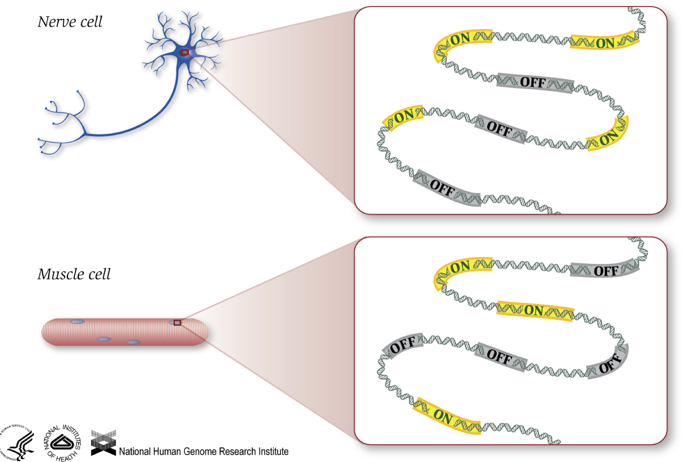
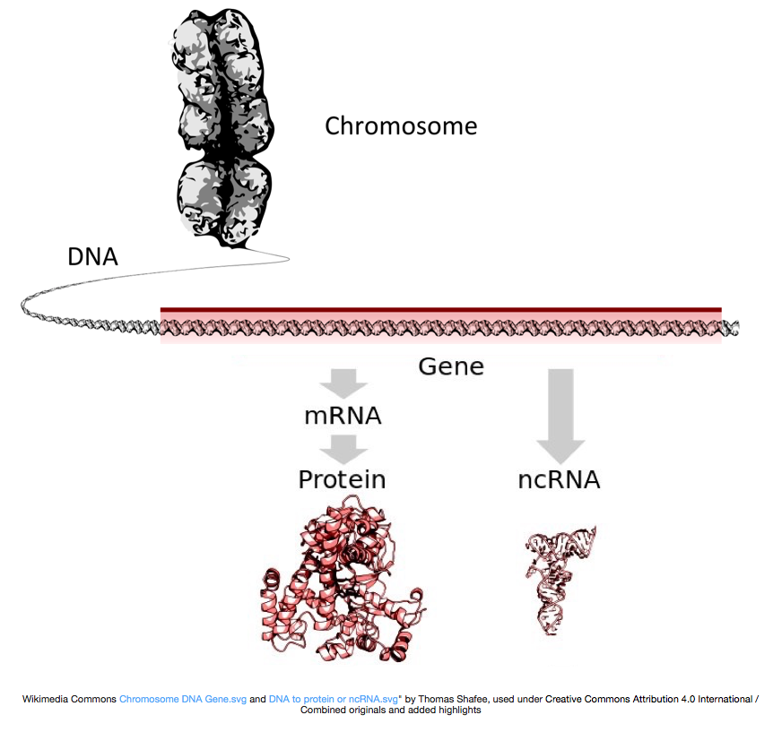
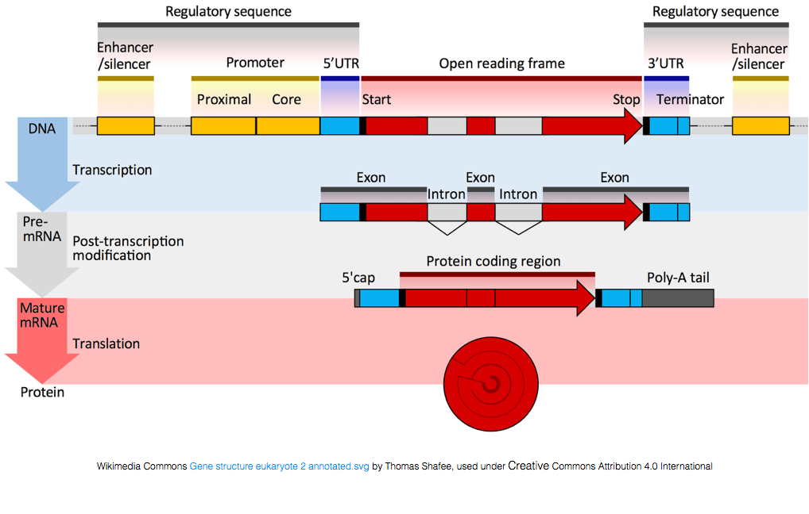

Approximate time: 15 minutes

## Learning Objectives:

* Describe the theory of RNA-seq and methods utilizing RNA-seq data

## Introduction to RNA-seq

RNA-seq is an exciting experimental technique that is utilized to explore and/or quantify gene expression within or between conditions. 

As we know, genes provide instructions to make proteins, which perform some function within the cell. Although **all cells contain the same DNA sequence**, muscle cells are different from nerve cells and other types of cells because of the **different genes that are turned on in these cells and the different RNAs and proteins produced**. 

Different biological processes, as well as mutations, can affect which genes are turned on and which are turned off, in addition to, *how much* specific genes are turned on/off.

To make proteins, the DNA is transcribed into messenger RNA, or mRNA, which is translated by the ribosome into protein. However, some genes encode RNA that does not get translated into protein; these RNAs are called non-coding RNAs, or ncRNAs. Often these RNAs have a function in and of themselves and include rRNAs, tRNAs, and siRNAs, among others. All RNAs transcribed from genes are called transcripts.

To be translated into proteins, the RNA must undergo processing to generate the mRNA. In the figure below, the top strand in the image represents a gene in the DNA, comprised of the untranslated regions (UTRs) and the open read frame. Genes are transcribed into pre-mRNA, which still contains the intronic sequences.  After post-transciptional processing, a 5' cap and polyA tail are added and the introns are spliced out to yield mature mRNA transcripts, which can be translated into proteins.

**While mRNA transcripts have a polyA tail, many of the non-coding RNA transcripts do not as the post-transcriptional processing is different for these transcripts.**

### Transcriptomics

The transcriptome is defined as a collection of all the transcript readouts present in a cell. RNA-seq data can be used to explore and/or quantify the transcriptome of an organism, which can be utilized for the following types of experiments:

- **Differential Gene Expression**: *quantitative* evaluation and comparison of transcript levels between conditions
- **Transcriptome assembly**: building the profile of transcribed regions of the genome, a *qualitative* evaluation
- **Refinement of gene models**: building better gene models and verifying them using transcriptome assembly
- **Metatranscriptomics**: community transcriptome analysis

#### Differential gene expression

We will be focused on the application of differential gene expression analysis for this workshop. Differential gene expression analysis allows us to explore the gene expression changes that occur in disease or between different conditions, by measuring the quantity of RNA expressed by all genes in each of the different conditions. Using this analysis we can answer questions such as:

- What genes are differentially expressed between conditions?

- Are there any trends in gene expression over time or across conditions?

- Which groups of genes change similarly over time or across conditions?

- What processes or pathways are important for my condition of interest?
